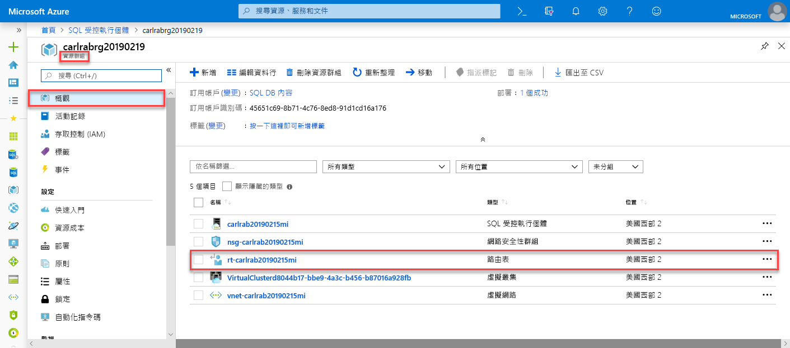
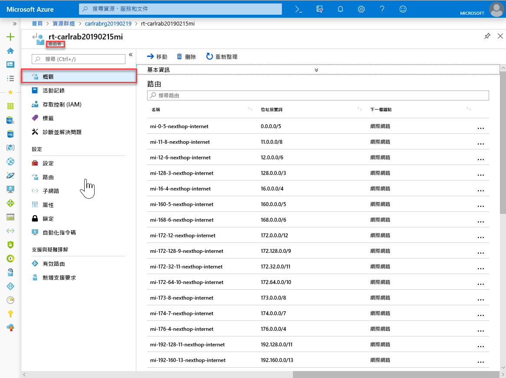
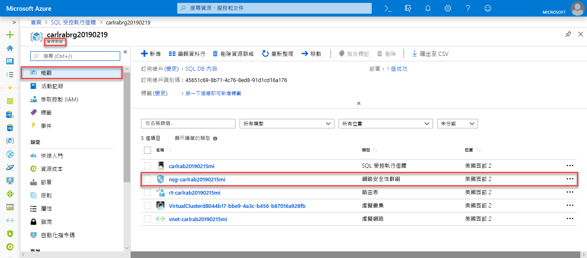
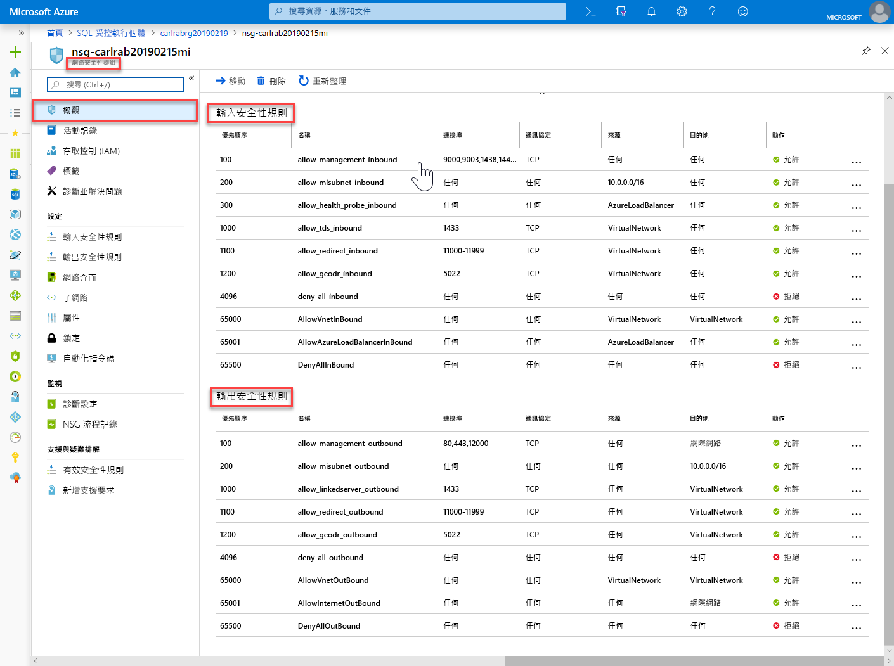
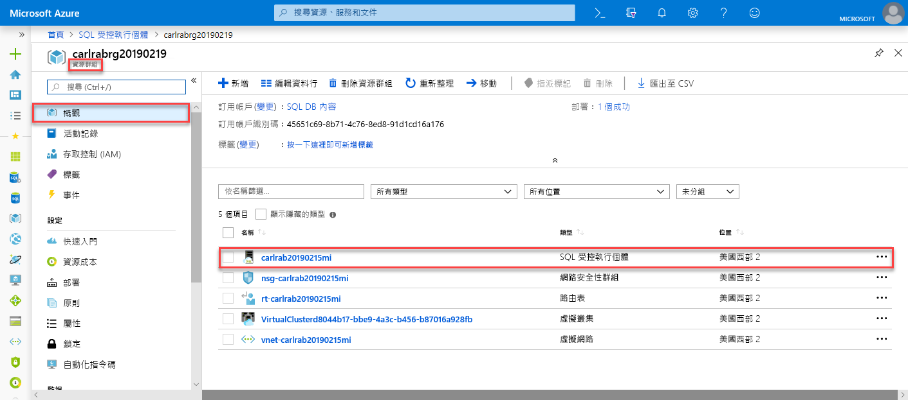

# 快速入門：建立 Azure SQL Database 受控執行個體

本快速入門逐步解說如何在 Azure 入口網站中建立 Azure SQL Database [受控執行個體](sql-database-managed-instance.md)。

> [!IMPORTANT]
> 如需了解限制，請參閱[支援的區域](sql-database-managed-instance-resource-limits.md#supported-regions)和[支援的訂用帳戶類型](sql-database-managed-instance-resource-limits.md#supported-subscription-types)。

## 登入 Azure 入口網站

如果您沒有 Azure 訂用帳戶，請[建立免費帳戶](https://azure.microsoft.com/free/)。

登入 [Azure 入口網站](https://portal.azure.com/)。

## 建立受控執行個體

下列步驟說明如何建立受控執行個體。

1. 選取 Azure 入口網站中左上角的 [建立資源]  。
2. 找出 [受控執行個體]  ，然後選取 [Azure SQL 受控執行個體]  。
3. 選取 [建立]  。

   

4. 使用下表中的資訊，填妥 **SQL 受控執行個體**表單中所要求的資訊。

   | 設定| 建議的值 | 說明 |
   | ------ | --------------- | ----------- |
   | **訂用帳戶** | 您的訂用帳戶。 | 讓您有權建立新資源的訂用帳戶。 |
   |**受控執行個體名稱**|任何有效名稱。|如需有效的名稱，請參閱[命名規則和限制](https://docs.microsoft.com/azure/architecture/best-practices/naming-conventions)。|
   |**受控執行個體系統管理員登入**|任何有效的使用者名稱。|如需有效的名稱，請參閱[命名規則和限制](https://docs.microsoft.com/azure/architecture/best-practices/naming-conventions)。 請勿使用 "serveradmin"，因為這是保留的伺服器層級角色。|
   |**密碼**|任何有效密碼。|密碼長度至少必須有 16 個字元，而且符合[定義的複雜度需求](../virtual-machines/windows/faq.md#what-are-the-password-requirements-when-creating-a-vm)。|
   |**時區**|您的受控執行個體所要觀察的時區。|如需詳細資訊，請參閱[時區](sql-database-managed-instance-timezone.md)。|
   |**定序**|您要用於受控執行個體的定序。|如果您從 SQL Server 遷移資料庫，請使用 `SELECT SERVERPROPERTY(N'Collation')` 來檢查來源定序並使用該值。 如需定序的相關資訊，請參閱[設定或變更伺服器定序](https://docs.microsoft.com/sql/relational-databases/collations/set-or-change-the-server-collation)。|
   |**位置**|要在其中建立受控執行個體的位置。|如需有關區域的資訊，請參閱 [Azure 區域](https://azure.microsoft.com/regions/)。|
   |**虛擬網路**|選取 [建立新的虛擬網路]  或有效的虛擬網路與子網路。| 如果網路或子網路無法使用，您必須先[修改成符合網路需求](sql-database-managed-instance-configure-vnet-subnet.md)後，才能選取它作為新的受控執行個體目標。 如需關於設定受控執行個體網路環境的需求資訊，請參閱[設定受控執行個體的虛擬網路](sql-database-managed-instance-connectivity-architecture.md)。 |
   |**啟用公用端點**   |核取此選項以啟用公用端點   |若要讓受控執行個體可透過公用資料端點來存取，您必須核取 [啟用公用端點]  。| 
   |**允許從此存取**   |選取其中一個選項： <ul> <li>**Azure 服務**</li> <li>**Internet**</li> <li>**無存取權**</li></ul>   |入口網站體驗可讓您對公用端點設定安全性群組。     根據您的案例，選取下列其中一個選項：   <ul> <li>Azure 服務 - 從 Power BI 或其他多租用戶服務連線時，建議使用此選項。 </li> <li> 網際網路 - 可在您想要快速啟動受控執行個體時用於測試目的。 不建議用於生產環境。 </li> <li> 無存取權 - 此選項會建立拒絕安全性規則。 您必須修改這項規則，以便讓受控執行個體可透過公用端點來存取。 </li> </ul>   如需公用端點安全性的詳細資訊，請參閱[搭配公用端點來安全地使用 Azure SQL Database 受控執行個體](sql-database-managed-instance-public-endpoint-securely.md)。|
   |**連線類型**|在 Proxy 和重新導向連線類型之間做選擇。|如需有關連線類型的詳細資訊，請參閱 [Azure SQL Database 連線原則](sql-database-connectivity-architecture.md#connection-policy)。|
   |**資源群組**|新的或現有的資源群組。|如需有效的資源群組名稱，請參閱[命名規則和限制](https://docs.microsoft.com/azure/architecture/best-practices/naming-conventions)。|

   

5. 若要以受控執行個體作為次要執行個體容錯移轉群組，請選取 [簽出]，然後指定 DnsAzurePartner 受控執行個體。 這是預覽版功能，不會顯示在下列螢幕擷取畫面中。
6. 選取 [定價層]  來調整計算和儲存體資源的大小，以及檢閱定價層選項。 預設值為一般用途定價層，其具也 32 GB 記憶體和 16 個虛擬核心。
7. 使用滑桿或文字方塊來指定儲存體數量和虛擬核心數目。
8. 當您完成時，選取 [套用]  來儲存您的選擇。 
9. 選取 [建立]  以部署受控執行個體。
10. 選取 [通知]  圖示以檢視部署的狀態。

    

11. 選取 [部署正在進行中]  來開啟受控執行個體視窗，以進一步監視部署進度。 

> [!IMPORTANT]
> 如果是子網路中的第一個執行個體，部署時間通常遠超過後續執行個體的部署時間。 請勿取消部署作業，因為它持續的時間超過您的預期。

## 檢閱資源並擷取完整伺服器名稱

部署成功後，請檢閱所建立的資源，並擷取完整伺服器名稱以供稍後的快速入門使用。

1. 開啟受控執行個體的資源群組。 檢視其在[建立受控執行個體](#create-a-managed-instance)快速入門中為您所建立的資源。

   

2. 選取路由表以檢閱為您建立的使用者定義路由 (UDR) 表。

   

3. 在路由表中，檢閱要從受控執行個體虛擬網路路由傳送流量的項目。 如果您要手動建立或設定路由表，您必須在路由表中建立這些項目。

   

4. 回到資源群組，然後選取網路安全性群組以檢閱安全性規則。

   

5. 檢閱輸入和輸出安全性規則。 如果您已為受控執行個體設定公用端點，請參閱[設定公用端點](sql-database-managed-instance-public-endpoint-configure.md#allow-public-endpoint-traffic-on-the-network-security-group)一文以取得詳細資訊。

   

6. 回到資源群組，然後選取您的受控執行個體。

   

7. 在 [概觀]  索引標籤上，找出 [主機]  屬性。 複製受控執行個體的完整主機位址，以便在下一個快速入門中使用。

   

   此名稱類似於 **your_machine_name.a1b2c3d4e5f6.database.windows.net**。

## 後續步驟

- 若要了解如何連線至受控執行個體：
  - 如需有關應用程式連線選項的概觀，請參閱[將您的應用程式連線至受控執行個體](sql-database-managed-instance-connect-app.md)。
  - 如需說明如何從 Azure 虛擬機器連線至受控執行個體的快速入門，請參閱[設定 Azure 虛擬機器連線](sql-database-managed-instance-configure-vm.md)。
  - 如需說明如何使用點對站連線從內部部署用戶端電腦連線至受控執行個體的快速入門，請參閱[設定點對站連線](sql-database-managed-instance-configure-p2s.md)。
- 若要將現有 SQL Server 資料庫從內部部署環境還原至受控執行個體： 
    - 使用[用於移轉的 Azure 資料庫移轉服務 (DMS)](../dms/tutorial-sql-server-to-managed-instance.md) 來從資料庫備份檔案還原。 
    - 使用 [T-SQL RESTORE 命令](sql-database-managed-instance-get-started-restore.md)來從資料庫備份檔案還原。
- 若要使用內建的疑難排解智慧對受控執行個體的資料庫效能進行進階監視，請參閱[使用 Azure SQL 分析監視 Azure SQL Database](../azure-monitor/insights/azure-sql.md)。
