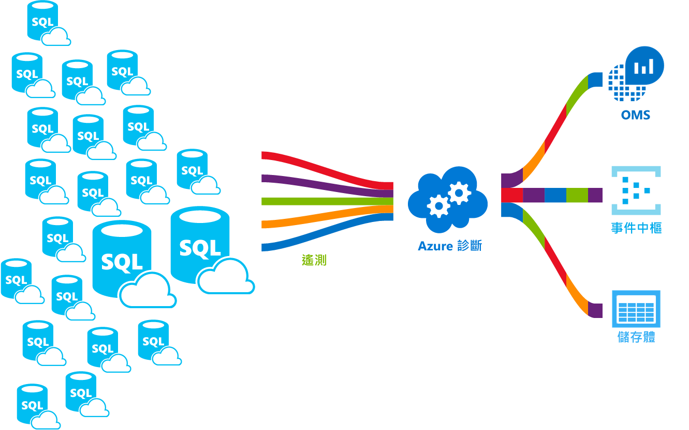

# <a name="azure-sql-database-metrics-and-diagnostics-logging"></a>Azure SQL Database 計量和診斷記錄 

Azure SQL Database 和受控執行個體資料庫可以發出計量和診斷記錄，讓您以較輕鬆的方式監視效能。 您可以將資料庫設定為將資源使用量、背景工作角色與工作階段及連線串流到下列其中一項 Azure 資源：

* **Azure SQL 分析**：用來作為整合的 Azure 資料庫智慧型效能監控解決方案，其中具備報告、警示及緩解功能。
* **Azure 事件中樞**：用於整合 SQL Database 遙測與自訂監視解決方案或管線。
* **Azure 儲存體**：用於封存大量遙測資料，價格低廉。

    

## <a name="enable-logging-for-a-database"></a>啟用資料庫的記錄功能

在 SQL Database 或受控執行個體資料庫上，並未預設啟用計量和診斷記錄的功能。 您可以使用下列其中一種方法來啟用及管理資料庫上的計量和診斷遙測記錄︰

- Azure 入口網站
- PowerShell
- Azure CLI
- Azure 監視器 REST API 
- Azure Resource Manager 範本

當您啟用計量和診斷記錄功能時，您必須指定要收集所選資料的 Azure 資源。 可用的選項包括︰

- SQL Analytics
- 事件中樞
- 儲存體 

您可以佈建新的 Azure 資源，或選取現有的資源。 選取資源之後，使用 [診斷設定] 選項時，您需要指定要收集的資料。 可用選項及對 Azure SQL Database 和受控執行個體資料庫的支援如下所示：

| 監視遙測 | 支援 Azure SQL Database | 支援受控執行個體中的資料庫 |
| :------------------- | ------------------- | ------------------- |
| [所有計量](sql-database-metrics-diag-logging.md#all-metrics)：包含 DTU/CPU 百分比、DTU/CPU 限制、實體資料讀取百分比、記錄寫入百分比、成功/失敗/防火牆封鎖的連線、工作階段百分比、背景工作角色百分比、儲存體、儲存體百分比和 XTP 儲存體百分比。 | 是 | 否 |
| [QueryStoreRuntimeStatistics](sql-database-metrics-diag-logging.md#query-store-runtime-statistics)：包含關於查詢執行階段統計資料的資訊，例如 CPU 使用率和查詢持續時間統計資料。 | 是 | 是 |
| [QueryStoreWaitStatistics](sql-database-metrics-diag-logging.md#query-store-wait-statistics)：包含關於查詢所等候內容的查詢等候統計資料的資訊，例如 CPU、LOG 和 LOCKING。 | 是 | 是 |
| [錯誤](sql-database-metrics-diag-logging.md#errors-dataset)：包含關於此資料庫上所發生 SQL 錯誤的資訊。 | 是 | 否 |
| [DatabaseWaitStatistics](sql-database-metrics-diag-logging.md#database-wait-statistics-dataset)：包含和資料庫花費在不同等候類型的等候時間長度有關的資訊。 | 是 | 否 |
| [逾時](sql-database-metrics-diag-logging.md#time-outs-dataset)：包含與資料庫上發生的逾時有關的資訊。 | 是 | 否 |
| [封鎖](sql-database-metrics-diag-logging.md#blockings-dataset)：包含與資料庫上發生的封鎖事件有關的資訊。 | 是 | 否 |
| [SQLInsights](sql-database-metrics-diag-logging.md#intelligent-insights-dataset)：將 Intelligent Insights 納入效能。 [深入了解 Intelligent Insights](sql-database-intelligent-insights.md)。 | 是 | 是 |

**請注意**：雖然這些選項可在資料庫的診斷設定中使用，但若要使用稽核和 SQLSecurityAuditEvents 記錄，這些記錄應只能透過 **SQL 稽核**解決方案來啟用，才能對 Log Analytics、事件中樞或儲存體設定串流遙測。

如果您選取事件中樞或儲存體帳戶，您可以指定保留原則。 此原則會刪除早於選取時間期間的資料。 如果您指定 Log Analytics，則保留原則取決於所選的定價層。 如需詳細資訊，請參閱 [Log Analytics 定價](https://azure.microsoft.com/pricing/details/log-analytics/)。 

## <a name="enable-logging-for-elastic-pools-or-managed-instance"></a>啟用彈性集區或受控執行個體的記錄功能

在彈性集區或受控執行個體上，並未預設啟用計量和診斷記錄的功能。 您可以啟用和管理彈性集區或受控執行個體的計量和診斷遙測記錄。 下列資料可供收集：

| 監視遙測 | 支援彈性集區 | 支援受控執行個體 |
| :------------------- | ------------------- | ------------------- |
| [所有計量](sql-database-metrics-diag-logging.md#all-metrics) (彈性集區)：包含 eDTU/CPU 百分比、eDTU/CPU 限制、實體資料讀取百分比、記錄寫入百分比、工作階段百分比、背景工作角色百分比、儲存體、儲存體百分比、儲存體限制、XTP 儲存體百分比。 | 是 | N/A |
| [ResourceUsageStats](sql-database-metrics-diag-logging.md#resource-usage-stats) (受控執行個體)：包含虛擬核心計數、平均 CPU 百分比、IO 要求數目、讀取/寫入的位元組、保留的儲存空間、使用的儲存空間。 | N/A | 是 |

若要了解各種 Azure 服務支援的計量和記錄類別，我們建議您先閱讀：

* [Microsoft Azure 中的計量概觀](../monitoring-and-diagnostics/monitoring-overview-metrics.md)
* [Azure 診斷記錄的概觀](../monitoring-and-diagnostics/monitoring-overview-of-diagnostic-logs.md) 

### <a name="azure-portal"></a>Azure 入口網站

- 若要啟用 SQL Database 或受控執行個體資料庫的計量和診斷記錄收集功能，請移至您的資料庫，然後選取 [診斷設定]。 選取 [+ 新增診斷設定] 來進行新的設定，或選取 [編輯設定] 來編輯現有的設定。

   

- 針對 **Azure SQL Database**，選取目標和遙測資料來建立新的或編輯現有的診斷設定。

   

- 針對**受控執行個體資料庫**，選取目標和遙測資料來建立新的或編輯現有的診斷設定。

   

### <a name="powershell"></a>PowerShell

若要使用 Powershell 啟用計量和診斷記錄功能，請使用下列 Cmdlet：

- 若要啟用儲存體帳戶中診斷記錄的儲存體，請使用下列命令：

   ```powershell
   Set-AzureRmDiagnosticSetting -ResourceId [your resource id] -StorageAccountId [your storage account id] -Enabled $true
   ```

   儲存體帳戶識別碼是您要傳送記錄之目標儲存體帳戶的資源識別碼。

- 若要將診斷記錄串流至事件中樞，請使用下列命令：

   ```powershell
   Set-AzureRmDiagnosticSetting -ResourceId [your resource id] -ServiceBusRuleId [your service bus rule id] -Enabled $true
   ```

   Azure 服務匯流排規則識別碼是此格式的字串︰

   ```powershell
   {service bus resource ID}/authorizationrules/{key name}
   ``` 

- 若要將診斷記錄傳送到 Log Analytics 工作區，請使用下列命令：

   ```powershell
   Set-AzureRmDiagnosticSetting -ResourceId [your resource id] -WorkspaceId [resource id of the log analytics workspace] -Enabled $true
   ```

- 您可以使用下列命令取得 Log Analytics 工作區的資源識別碼：

   ```powershell
   (Get-AzureRmOperationalInsightsWorkspace).ResourceId
   ```

您可以結合這些參數讓多個輸出選項。

### <a name="to-configure-multiple-azure-resources"></a>若要設定多個 Azure 資源

若要支援多個訂用帳戶，從[使用 PowerShell 啟用 Azure 資源計量記錄](https://blogs.technet.microsoft.com/msoms/2017/01/17/enable-azure-resource-metrics-logging-using-powershell/)使用 PowerShell 指令碼。

當執行指令碼 (Enable-AzureRMDiagnostics.ps1) 以將診斷資料從多個資源傳送至工作區時，提供工作區資源識別碼 &lt;$WSID&gt; 作為參數。 若要取得您想要傳送診斷資料至其中的工作區識別碼 &lt;$WSID&gt;，請在下列指令碼中將 &lt;subID&gt; 取代為訂用帳戶識別碼、將 &lt;RG_NAME&gt; 取代為資源群組名稱，以及將 &lt;WS_NAME&gt; 取代為工作區名稱。

- 若要設定多個 Azure 資源，請使用下列命令：

    ```powershell
    PS C:\> $WSID = "/subscriptions/<subID>/resourcegroups/<RG_NAME>/providers/microsoft.operationalinsights/workspaces/<WS_NAME>"
    PS C:\> .\Enable-AzureRMDiagnostics.ps1 -WSID $WSID
    ```

### <a name="azure-cli"></a>Azure CLI

若要使用 Azure CLI 啟用計量和診斷記錄功能，請使用下列 Cmdlet：

- 若要啟用儲存體帳戶中診斷記錄的儲存體，請使用下列命令：

   ```azurecli-interactive
   azure insights diagnostic set --resourceId <resourceId> --storageId <storageAccountId> --enabled true
   ```

   儲存體帳戶識別碼是您要傳送記錄之目標儲存體帳戶的資源識別碼。

- 若要將診斷記錄串流至事件中樞，請使用下列命令：

   ```azurecli-interactive
   azure insights diagnostic set --resourceId <resourceId> --serviceBusRuleId <serviceBusRuleId> --enabled true
   ```

   服務匯流排規則識別碼是此格式的字串︰

   ```azurecli-interactive
   {service bus resource ID}/authorizationrules/{key name}
   ```

- 若要將診斷記錄傳送到 Log Analytics 工作區，請使用下列命令：

   ```azurecli-interactive
   azure insights diagnostic set --resourceId <resourceId> --workspaceId <resource id of the log analytics workspace> --enabled true
   ```

您可以結合這些參數讓多個輸出選項。

### <a name="rest-api"></a>REST API

了解如何[使用 Azure 監視器 REST API 變更診斷設定](https://docs.microsoft.com/rest/api/monitor/diagnosticsettings)。 

### <a name="resource-manager-template"></a>Resource Manager 範本

了解如何[使用 Resource Manager 範本在建立資源時啟用診斷設定](../monitoring-and-diagnostics/monitoring-enable-diagnostic-logs-using-template.md)。 

## <a name="stream-into-log-analytics"></a>串流到 Log Analytics 中 
SQL Database 計量和診斷記錄可以串流到 Log Analytics，方法是使用入口網站中內建的 [傳送至 Log Analytics] 選項。 您也可以透過 PowerShell Cmdlet、Azure CLI 或 Azure 監視器 REST API 使用診斷設定來啟用 Log Analytics。

### <a name="installation-overview"></a>安裝概觀

透過 Log Analytics 可以輕易監視 SQL Database Fleet。 需要三個步驟：

1. 建立 Log Analytics 資源。

2. 將資料庫設定為將計量和診斷記錄記錄到您建立的 Log Analytics 資源中。

3. 從 Azure Marketplace 安裝 **Azure SQL 分析**解決方案。

### <a name="create-a-log-analytics-resource"></a>建立 Log Analytics 資源

1. 在左側功能表中選取 [建立資源]。

2. 選取 [監視 + 管理]。

3. 選取 [Log Analytics]。

4. 在 Log Analytics 表單中填入所需的其他資訊：工作區名稱、訂用帳戶、資源群組、位置及定價層。

   

### <a name="configure-databases-to-record-metrics-and-diagnostics-logs"></a>將資料庫設定為記錄計量和診斷記錄

若要設定資料庫記錄其計量的位置，最簡單的方法就是透過 Azure 入口網站。 在入口網站中，移至您的 SQL Database 資源並選取 [診斷設定]。 

### <a name="install-the-sql-analytics-solution-from-the-gallery"></a>從資源庫安裝 SQL 分析解決方案

1. 建立 Log Analytics 資源之後，您的資料會流入其中，請安裝 SQL 分析解決方案。 在首頁的側邊功能表上，選取 [解決方案資源庫]。 在資源庫中，選取 [Azure SQL 分析] 解決方案，然後選取 [新增]。

   

2. 在您的首頁上，會出現 [Azure SQL 分析] 圖格。 選取此圖格以開啟 SQL 分析儀表板。

### <a name="use-the-sql-analytics-solution"></a>使用 SQL 分析解決方案

SQL 分析是一個階層式儀表板，可讓您在 SQL Database 資源階層之間移動。 若要深入了解如何使用 SQL 分析解決方案，請參閱[使用 SQL 分析解決方案監視 SQL Database](../log-analytics/log-analytics-azure-sql.md)。

## <a name="stream-into-event-hubs"></a>串流至事件中樞

SQL Database 計量和診斷記錄可以串流到事件中樞，方法是使用入口網站中內建的 [串流至事件中樞] 選項。 您也可以透過 PowerShell Cmdlet、Azure CLI 或 Azure 監視器 REST API 使用診斷設定來啟用服務匯流排規則識別碼。 

### <a name="what-to-do-with-metrics-and-diagnostics-logs-in-event-hubs"></a>如何在事件中樞處理計量和診斷記錄
所選的資料串流到事件中樞之後，您很快就能啟用進階監視案例。 事件中樞是作為事件管線的大門。 資料收集到事件中樞之後，這些資料可以透過任何即時分析提供者或批次/儲存體配接器來轉換和儲存。 事件中樞會讓事件串流的產生從這些事件的取用分離。 如此一來，事件消費者可以在自己的排程存取事件。 如需事件中樞的詳細資訊，請參閱：

- [Azure 事件中樞是什麼？](../event-hubs/event-hubs-what-is-event-hubs.md)
- [開始使用事件中心](../event-hubs/event-hubs-csharp-ephcs-getstarted.md)


這裡有一些您可以使用串流功能的方法：

* **透過將最忙碌路徑串流至 PowerBI 以檢視服務健康情況**。 您可以使用事件中樞、串流分析和 PowerBI，輕鬆快速地將計量和診斷資料轉換為 Azure 服務上的深入解析。 如需如何設定事件中樞、使用串流分析處理資料，以及使用 PowerBI 作為輸出的概觀，請參閱[串流分析和 Power BI](../stream-analytics/stream-analytics-power-bi-dashboard.md)。

* **將記錄串流至第三方記錄和遙測資料流**。 使用事件中樞串流，您可以將計量和診斷記錄放入不同的第三方監視和記錄分析解決方案中。 

* **建置自訂遙測及記錄平台**。 如果您已有自建遙測平台或正好在考慮建置一個，事件中樞所具備的高度可調整的發佈訂閱特質可讓您靈活擷取診斷記錄。 請參閱 [Dan Rosanova 指南，以在全球級別的遙測平台中使用事件中樞](https://azure.microsoft.com/documentation/videos/build-2015-designing-and-sizing-a-global-scale-telemetry-platform-on-azure-event-Hubs/)。

## <a name="stream-into-storage"></a>串流到儲存體

SQL Database 計量和診斷記錄可以儲存在儲存體，方法是使用入口網站中內建的 [封存至儲存體帳戶] 選項。 您也可以透過 PowerShell Cmdlet、Azure CLI 或 Azure 監視器 REST API 使用診斷設定來啟用儲存體。

### <a name="schema-of-metrics-and-diagnostics-logs-in-the-storage-account"></a>儲存體帳戶中的計量和診斷記錄結構描述

設定計量和診斷記錄集合之後，當第一批資料列可用時，系統會在您選取的儲存體帳戶中建立儲存體容器。 這些 blob 的結構為：

```powershell
insights-{metrics|logs}-{category name}/resourceId=/SUBSCRIPTIONS/{subscription ID}/ RESOURCEGROUPS/{resource group name}/PROVIDERS/Microsoft.SQL/servers/{resource_server}/ databases/{database_name}/y={four-digit numeric year}/m={two-digit numeric month}/d={two-digit numeric day}/h={two-digit 24-hour clock hour}/m=00/PT1H.json
```
    
或者，形式更簡單：

```powershell
insights-{metrics|logs}-{category name}/resourceId=/{resource Id}/y={four-digit numeric year}/m={two-digit numeric month}/d={two-digit numeric day}/h={two-digit 24-hour clock hour}/m=00/PT1H.json
```

例如，所有計量的 blob 名稱可能是︰

```powershell
insights-metrics-minute/resourceId=/SUBSCRIPTIONS/s1id1234-5679-0123-4567-890123456789/RESOURCEGROUPS/TESTRESOURCEGROUP/PROVIDERS/MICROSOFT.SQL/ servers/Server1/databases/database1/y=2016/m=08/d=22/h=18/m=00/PT1H.json
```

如果您想要記錄彈性集區中的資料，blob 名稱會有點不同：

```powershell
insights-{metrics|logs}-{category name}/resourceId=/SUBSCRIPTIONS/{subscription ID}/ RESOURCEGROUPS/{resource group name}/PROVIDERS/Microsoft.SQL/servers/{resource_server}/ elasticPools/{elastic_pool_name}/y={four-digit numeric year}/m={two-digit numeric month}/d={two-digit numeric day}/h={two-digit 24-hour clock hour}/m=00/PT1H.json
```

### <a name="download-metrics-and-logs-from-storage"></a>從儲存體下載計量和記錄

了解如何[從儲存體下載計量和診斷記錄](../storage/blobs/storage-quickstart-blobs-dotnet.md#download-the-sample-application)。

## <a name="metrics-and-logs-available"></a>可用的計量和記錄檔

請針對 Azure SQL Database、彈性集區、受控執行個體和受控執行個體中的資料庫，尋找可用計量和記錄的詳細監視遙測內容。

## <a name="all-metrics"></a>所有計量

### <a name="all-metrics-for-elastic-pools"></a>彈性集區的所有計量

|**Resource**|**計量**|
|---|---|
|彈性集區|eDTU 百分比、使用的 eDTU、eDTU 限制、CPU 百分比、實體資料讀取百分比、記錄寫入百分比、工作階段百分比、背景工作百分比、儲存體、儲存體百分比、儲存體限制、XTP 儲存體百分比 |

### <a name="all-metrics-for-azure-sql-database"></a>Azure SQL Database 的所有計量

|**Resource**|**計量**|
|---|---|
|連接字串|DTU 百分比、使用的 DTU、DTU 限制、CPU 百分比、實體資料讀取百分比、記錄寫入百分比、成功/失敗/防火牆封鎖的連線、工作階段百分比、背景工作百分比、儲存體、儲存體百分比、XTP 儲存體百分比和死結 |

## <a name="logs"></a>記錄檔

### <a name="logs-for-managed-instance"></a>受控執行個體的記錄

### <a name="resource-usage-stats"></a>資源使用統計資料

|屬性|說明|
|---|---|
|TenantId|您的租用戶識別碼。|
|SourceSystem|一律：Azure|
|TimeGenerated [UTC]|記錄檔記錄時的時間戳記。|
|類型|一律：AzureDiagnostics|
|ResourceProvider|資源提供者名稱。 一律：MICROSOFT.SQL|
|類別|類別名稱。 一律：ResourceUsageStats|
|資源|資源名稱。|
|ResourceType|資源類型名稱。 一律：MANAGEDINSTANCES|
|SubscriptionId|資料庫所屬的訂用帳戶 GUID。|
|ResourceGroup|資料庫所屬的資源群組名稱。|
|LogicalServerName_s|受控執行個體的名稱。|
|ResourceId|資源 URI。|
|SKU_s|受控執行個體產品 SKU|
|virtual_core_count_s|可用的虛擬核心數目|
|avg_cpu_percent_s|CPU 百分比平均|
|reserved_storage_mb_s|受控執行個體上的保留儲存體容量|
|storage_space_used_mb_s|受控執行個體上已使用儲存體|
|io_requests_s|IOPS 計數|
|io_bytes_read_s|讀取的 IOPS 位元組|
|io_bytes_written_s|寫入的 IOPS 位元組|

### <a name="logs-for-azure-sql-database-and-managed-instance-database"></a>Azure SQL Database 和受控執行個體資料庫的記錄

### <a name="query-store-runtime-statistics"></a>查詢存放區執行階段統計資料

|屬性|說明|
|---|---|
|TenantId|您的租用戶識別碼。|
|SourceSystem|一律：Azure|
|TimeGenerated [UTC]|記錄檔記錄時的時間戳記。|
|類型|一律：AzureDiagnostics|
|ResourceProvider|資源提供者名稱。 一律：MICROSOFT.SQL|
|類別|類別名稱。 一律：QueryStoreRuntimeStatistics|
|OperationName|作業名稱。 一律：QueryStoreRuntimeStatisticsEvent|
|資源|資源名稱。|
|ResourceType|資源類型名稱。 一律：SERVERS/DATABASES|
|SubscriptionId|資料庫所屬的訂用帳戶 GUID。|
|ResourceGroup|資料庫所屬的資源群組名稱。|
|LogicalServerName_s|資料庫所屬的伺服器名稱。|
|ElasticPoolName_s|資料庫所屬的彈性集區名稱 (如果有的話)。|
|DatabaseName_s|資料庫名稱。|
|ResourceId|資源 URI。|
|query_hash_s|查詢雜湊。|
|query_plan_hash_s|查詢計劃雜湊。|
|statement_sql_handle_s|陳述式 SQL 控制代碼。|
|interval_start_time_d|間隔的開始 datetimeoffset 刻度數目從 1900-1-1 起。|
|interval_end_time_d|間隔的結束 datetimeoffset 刻度數目從 1900-1-1 起。|
|logical_io_writes_d|邏輯 IO 寫入總數。|
|max_logical_io_writes_d|每次執行的邏輯 IO 寫入次數上限。|
|physical_io_reads_d|實體 IO 讀取總數。|
|max_physical_io_reads_d|每次執行的邏輯 IO 讀取次數上限。|
|logical_io_reads_d|邏輯 IO 讀取總數。|
|max_logical_io_reads_d|每次執行的邏輯 IO 讀取次數上限。|
|execution_type_d|執行類型。|
|count_executions_d|查詢的執行次數。|
|cpu_time_d|查詢所耗用的總 CPU 時間 (毫秒)。|
|max_cpu_time_d|單次執行可耗用的 CPU 時間上限 (毫秒)。|
|dop_d|平行處理原則的程度總和。|
|max_dop_d|單次執行所用之平行處理原則的最大程度。|
|rowcount_d|傳回的資料列總數。|
|max_rowcount_d|單次執行傳回的資料列數目上限。|
|query_max_used_memory_d|使用的記憶體總量 (KB)。|
|max_query_max_used_memory_d|單次執行所使用的記憶體數量上限 (KB)。|
|duration_d|總執行時間 (毫秒)。|
|max_duration_d|單次執行的執行時間上限。|
|num_physical_io_reads_d|實體讀取總數。|
|max_num_physical_io_reads_d|每次執行的實體讀取次數上限。|
|log_bytes_used_d|使用的記錄檔位元組總數。|
|max_log_bytes_used_d|每次執行所使用的記錄檔位元組數量上限。|
|query_id_d|查詢存放區中查詢的識別碼。|
|plan_id_d|查詢存放區中計劃的識別碼。|

深入了解[查詢存放區執行階段統計資料](https://docs.microsoft.com/sql/relational-databases/system-catalog-views/sys-query-store-runtime-stats-transact-sql)。

### <a name="query-store-wait-statistics"></a>查詢存放區等候統計資料

|屬性|說明|
|---|---|
|TenantId|您的租用戶識別碼。|
|SourceSystem|一律：Azure|
|TimeGenerated [UTC]|記錄檔記錄時的時間戳記。|
|類型|一律：AzureDiagnostics|
|ResourceProvider|資源提供者名稱。 一律：MICROSOFT.SQL|
|類別|類別名稱。 一律：QueryStoreWaitStatistics|
|OperationName|作業名稱。 一律：QueryStoreWaitStatisticsEvent|
|資源|資源名稱|
|ResourceType|資源類型名稱。 一律：SERVERS/DATABASES|
|SubscriptionId|資料庫所屬的訂用帳戶 GUID。|
|ResourceGroup|資料庫所屬的資源群組名稱。|
|LogicalServerName_s|資料庫所屬的伺服器名稱。|
|ElasticPoolName_s|資料庫所屬的彈性集區名稱 (如果有的話)。|
|DatabaseName_s|資料庫名稱。|
|ResourceId|資源 URI。|
|wait_category_s|等候的類別。|
|is_parameterizable_s|查詢是否可參數化。|
|statement_type_s|陳述式類型。|
|statement_key_hash_s|陳述式索引鍵雜湊。|
|exec_type_d|執行類型。|
|total_query_wait_time_ms_d|特定等候類別的查詢等候總時間。|
|max_query_wait_time_ms_d|特定等候類別個別執行時的查詢等候時間上限。|
|query_param_type_d|0|
|query_hash_s|查詢存放區中的查詢雜湊。|
|query_plan_hash_s|查詢存放區中的查詢計劃。|
|statement_sql_handle_s|查詢存放區中的陳述式控制代碼。|
|interval_start_time_d|間隔的開始 datetimeoffset 刻度數目從 1900-1-1 起。|
|interval_end_time_d|間隔的結束 datetimeoffset 刻度數目從 1900-1-1 起。|
|count_executions_d|查詢的執行計數。|
|query_id_d|查詢存放區中查詢的識別碼。|
|plan_id_d|查詢存放區中計劃的識別碼。|

深入了解[查詢存放區等候統計資料](https://docs.microsoft.com/sql/relational-databases/system-catalog-views/sys-query-store-wait-stats-transact-sql)。

### <a name="errors-dataset"></a>錯誤資料集

|屬性|說明|
|---|---|
|TenantId|您的租用戶識別碼。|
|SourceSystem|一律：Azure|
|TimeGenerated [UTC]|記錄檔記錄時的時間戳記。|
|類型|一律：AzureDiagnostics|
|ResourceProvider|資源提供者名稱。 一律：MICROSOFT.SQL|
|類別|類別名稱。 一律：Errors|
|OperationName|作業名稱。 一律：ErrorEvent|
|資源|資源名稱|
|ResourceType|資源類型名稱。 一律：SERVERS/DATABASES|
|SubscriptionId|資料庫所屬的訂用帳戶 GUID。|
|ResourceGroup|資料庫所屬的資源群組名稱。|
|LogicalServerName_s|資料庫所屬的伺服器名稱。|
|ElasticPoolName_s|資料庫所屬的彈性集區名稱 (如果有的話)。|
|DatabaseName_s|資料庫名稱。|
|ResourceId|資源 URI。|
|訊息|純文字的錯誤訊息。|
|user_defined_b|錯誤是否為使用者定義的位元。|
|error_number_d|錯誤碼。|
|嚴重性|錯誤的嚴重性。|
|state_d|錯誤的狀態。|
|query_hash_s|失敗查詢的查詢雜湊 (如果有的話)。|
|query_plan_hash_s|失敗查詢的查詢計劃雜湊 (如果有的話)。|

深入了解 [SQL Server 錯誤訊息](https://msdn.microsoft.com/library/cc645603.aspx)。

### <a name="database-wait-statistics-dataset"></a>資料庫等候統計資料資料集

|屬性|說明|
|---|---|
|TenantId|您的租用戶識別碼。|
|SourceSystem|一律：Azure|
|TimeGenerated [UTC]|記錄檔記錄時的時間戳記。|
|類型|一律：AzureDiagnostics|
|ResourceProvider|資源提供者名稱。 一律：MICROSOFT.SQL|
|類別|類別名稱。 一律：DatabaseWaitStatistics|
|OperationName|作業名稱。 一律：DatabaseWaitStatisticsEvent|
|資源|資源名稱|
|ResourceType|資源類型名稱。 一律：SERVERS/DATABASES|
|SubscriptionId|資料庫所屬的訂用帳戶 GUID。|
|ResourceGroup|資料庫所屬的資源群組名稱。|
|LogicalServerName_s|資料庫所屬的伺服器名稱。|
|ElasticPoolName_s|資料庫所屬的彈性集區名稱 (如果有的話)。|
|DatabaseName_s|資料庫名稱。|
|ResourceId|資源 URI。|
|wait_type_s|等候類型的名稱。|
|start_utc_date_t [UTC]|測量的時段開始時間。|
|end_utc_date_t [UTC]|測量的時段結束時間。|
|delta_max_wait_time_ms_d|每次執行的等候時間上限|
|delta_signal_wait_time_ms_d|訊號總等候時間。|
|delta_wait_time_ms_d|期間內的總等候時間。|
|delta_waiting_tasks_count_d|等候工作數目。|

深入了解[資料庫等候統計資料](https://docs.microsoft.com/sql/relational-databases/system-dynamic-management-views/sys-dm-os-wait-stats-transact-sql)。

### <a name="time-outs-dataset"></a>逾時資料集

|屬性|說明|
|---|---|
|TenantId|您的租用戶識別碼。|
|SourceSystem|一律：Azure|
|TimeGenerated [UTC]|記錄檔記錄時的時間戳記。|
|類型|一律：AzureDiagnostics|
|ResourceProvider|資源提供者名稱。 一律：MICROSOFT.SQL|
|類別|類別名稱。 一律：Timeouts|
|OperationName|作業名稱。 一律：TimeoutEvent|
|資源|資源名稱|
|ResourceType|資源類型名稱。 一律：SERVERS/DATABASES|
|SubscriptionId|資料庫所屬的訂用帳戶 GUID。|
|ResourceGroup|資料庫所屬的資源群組名稱。|
|LogicalServerName_s|資料庫所屬的伺服器名稱。|
|ElasticPoolName_s|資料庫所屬的彈性集區名稱 (如果有的話)。|
|DatabaseName_s|資料庫名稱。|
|ResourceId|資源 URI。|
|error_state_d|錯誤狀態碼。|
|query_hash_s|查詢雜湊 (如果有的話)。|
|query_plan_hash_s|查詢計劃雜湊 (如果有的話)。|

### <a name="blockings-dataset"></a>封鎖資料集

|屬性|說明|
|---|---|
|TenantId|您的租用戶識別碼。|
|SourceSystem|一律：Azure|
|TimeGenerated [UTC]|記錄檔記錄時的時間戳記。|
|類型|一律：AzureDiagnostics|
|ResourceProvider|資源提供者名稱。 一律：MICROSOFT.SQL|
|類別|類別名稱。 一律：Blocks|
|OperationName|作業名稱。 一律：BlockEvent|
|資源|資源名稱|
|ResourceType|資源類型名稱。 一律：SERVERS/DATABASES|
|SubscriptionId|資料庫所屬的訂用帳戶 GUID。|
|ResourceGroup|資料庫所屬的資源群組名稱。|
|LogicalServerName_s|資料庫所屬的伺服器名稱。|
|ElasticPoolName_s|資料庫所屬的彈性集區名稱 (如果有的話)。|
|DatabaseName_s|資料庫名稱。|
|ResourceId|資源 URI。|
|lock_mode_s|查詢所使用的鎖定模式。|
|resource_owner_type_s|鎖定擁有者。|
|blocked_process_filtered_s|已封鎖的處理序報告 XML。|
|duration_d|鎖定的持續時間 (微秒)。|

### <a name="deadlocks-dataset"></a>死結 (Deadlock) 資料集

|屬性|說明|
|---|---|
|TenantId|您的租用戶識別碼。|
|SourceSystem|一律：Azure|
|TimeGenerated [UTC] |記錄檔記錄時的時間戳記。|
|類型|一律：AzureDiagnostics|
|ResourceProvider|資源提供者名稱。 一律：MICROSOFT.SQL|
|類別|類別名稱。 一律：Deadlocks|
|OperationName|作業名稱。 一律：DeadlockEvent|
|資源|資源名稱。|
|ResourceType|資源類型名稱。 一律：SERVERS/DATABASES|
|SubscriptionId|資料庫所屬的訂用帳戶 GUID。|
|ResourceGroup|資料庫所屬的資源群組名稱。|
|LogicalServerName_s|資料庫所屬的伺服器名稱。|
|ElasticPoolName_s|資料庫所屬的彈性集區名稱 (如果有的話)。|
|DatabaseName_s|資料庫名稱。 |
|ResourceId|資源 URI。|
|deadlock_xml_s|死結報表 XML。|

### <a name="automatic-tuning-dataset"></a>自動調整資料集

|屬性|說明|
|---|---|
|TenantId|您的租用戶識別碼。|
|SourceSystem|一律：Azure|
|TimeGenerated [UTC]|記錄檔記錄時的時間戳記。|
|類型|一律：AzureDiagnostics|
|ResourceProvider|資源提供者名稱。 一律：MICROSOFT.SQL|
|類別|類別名稱。 一律：AutomaticTuning|
|資源|資源名稱。|
|ResourceType|資源類型名稱。 一律：SERVERS/DATABASES|
|SubscriptionId|資料庫所屬的訂用帳戶 GUID。|
|ResourceGroup|資料庫所屬的資源群組名稱。|
|LogicalServerName_s|資料庫所屬的伺服器名稱。|
|LogicalDatabaseName_s|資料庫名稱。|
|ElasticPoolName_s|資料庫所屬的彈性集區名稱 (如果有的話)。|
|DatabaseName_s|資料庫名稱。|
|ResourceId|資源 URI。|
|RecommendationHash_s|自動調整建議的唯一雜湊。|
|OptionName_s|自動調整作業。|
|Schema_s|資料庫結構描述。|
|Table_s|受影響的資料表。|
|IndexName_s|索引名稱。|
|IndexColumns_s|資料行名稱。|
|IncludedColumns_s|包含的資料行。|
|EstimatedImpact_s|自動調整建議 JSON 的預估影響。|
|Event_s|自動調整事件的類型。|
|Timestamp_t|上一次更新的時間戳記。|

### <a name="intelligent-insights-dataset"></a>Intelligent Insights 資料集
深入了解 [Intelligent Insights 記錄格式](sql-database-intelligent-insights-use-diagnostics-log.md)。

## <a name="next-steps"></a>後續步驟

若要了解如何啟用記錄，並了解各種 Azure 服務支援的計量和記錄類別，請閱讀：

 * [Microsoft Azure 中的計量概觀](../monitoring-and-diagnostics/monitoring-overview-metrics.md)
 * [Azure 診斷記錄的概觀](../monitoring-and-diagnostics/monitoring-overview-of-diagnostic-logs.md)

若要了解事件中樞，請閱讀：

* [Azure 事件中樞是什麼？](../event-hubs/event-hubs-what-is-event-hubs.md)
* [開始使用事件中心](../event-hubs/event-hubs-csharp-ephcs-getstarted.md)

若要深入了解儲存體，請參閱如何[從儲存體下載計量和診斷記錄](../storage/blobs/storage-quickstart-blobs-dotnet.md#download-the-sample-application)。
