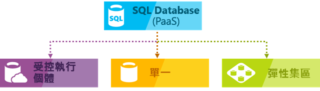

# 選擇雲端 SQL Server 選項：Azure SQL (PaaS) Database 或 Azure VM 上的 SQL Server (IaaS)

在 Azure 中，您可以讓 SQL Server 工作負載在託管基礎結構 (IaaS) 中執行或以託管服務 ([PaaS](https://azure.microsoft.com/overview/what-is-paas/)) 形式執行：

- [Azure SQL Database](https://azure.microsoft.com/services/sql-database/)：以 SQL Server 企業版為基礎的 SQL 資料庫引擎已針對新式應用程式開發最佳化。 Azure SQL Database 提供數個部署選項：
  - 您可以將單一資料庫部署到[邏輯伺服器](sql-database-logical-servers.md)。
  - 您可以部署到[邏輯伺服器](sql-database-logical-servers.md)上的[彈性集區](sql-database-elastic-pool.md)以共用資源並降低成本。 
  - 您可以部署至 [Azure SQL Database 受控執行個體](sql-database-managed-instance.md)。 
      
   下圖顯示這些部署選項：

      

     > [!NOTE]
     > 透過所有這三個版本，Azure SQL Database 可新增 SQL Server 中無法使用的額外功能，例如內建智慧和管理功能。 含有單一和集區資料庫的邏輯伺服器可提供 SQL Server 大多數的資料庫範圍功能。 Azure SQL Database 可透過 Azure SQL Database 受控執行個體，提供資料庫的共用資源以及其他執行個體範圍功能。 Azure SQL Database 受控執行個體支援資料庫移轉，幾乎無需進行任何資料庫變更。 

- [Azure 虛擬機器上的 SQL Server](https://azure.microsoft.com/services/virtual-machines/sql-server/)：SQL Server 會安裝並託管於雲端或 Azure 上執行的 Windows Server 或 Linux 虛擬機器 (VM)，也稱為基礎結構即服務 (IaaS)。 Azure 虛擬機器上的 SQL Server 是移轉內部部署 SQL Server 資料庫和應用程式的理想選項，無需進行任何資料庫變更。 所有近期的 SQL Server 版本均可安裝在 IaaS 虛擬機器中。 SQL Server VM 與 SQL Database 的最明顯差異就是允許完全控制資料庫引擎。 您可以選擇開始進行維護/修補的時間，將復原模式變更為簡單或大量記錄以便更快速載入少量記錄，視需要暫停或啟動引擎，而且可以完全自訂 SQL Server 資料庫引擎。 此額外控制項伴隨著管理虛擬機器的附加責任。

了解每個部署選項如何搭配 Microsoft 資料平台一起運作，並在比對適合您的商業需求的選項時獲得協助。 無論您是以節省成本為優先考量，或將精簡管理視為首要條件，本文可依據您最重視的商務需求進行比較，以協助您決定要提供的方法。

## Microsoft 的 SQL 資料平台

在 Azure 與內部部署 SQL Server 資料庫的任何討論中，您要了解的第一件事情是您可以兩者都用。 Microsoft 資料平台會利用 SQL Server 技術，使其可在跨內部部署實體機器、私人雲端環境、協力廠商代管的私人雲端環境，和公用雲端中使用。 Azure 虛擬機器上的 SQL Server 可讓您透過結合內部部署和雲端代管部署來滿足獨特的多樣化業務需求，並同時在這些環境中使用相同的伺服器產品、開發工具和專業知識組合。

   

如圖所示，每個供應項目可依您在基礎結構 (在 X 軸) 中所擁有的管理層級，並依資料庫層級彙總和自動化 (在 Y 軸) 所達到的成本效益程度等特性加以分類。

設計應用程式時，有四個基本選項可用來主控屬於應用程式一部分的 SQL Server：

* 非虛擬化實體機器上的 SQL Server
* 內部部署虛擬機器中的 SQL Server (私人雲端)
* Azure 虛擬機器中的 SQL Server (Microsoft 公用雲端)
* Azure SQL Database (Microsoft 公用雲端)

在下列章節中，您會了解 Microsoft 公用雲端中的 SQL Server：Azure SQL Database 和 Azure VM 上的 SQL Server。 此外，還會探討常見的商業動機，以判斷哪一個選項最符合應用程式需求。

## 仔細看看 Azure SQL Database 和 Azure VM 上的 SQL Server

**Azure SQL Database** 是裝載在 Azure 雲端的關聯式資料庫即服務 (DBaaS)，其產業類別屬於「軟體即服務 (SaaS)」。 [SQL Database](sql-database-technical-overview.md) 會建立在 Microsoft 所擁有、代管及維護的標準化硬體和軟體上。 透過 SQL Database，您可以使用需要在 SQL Server 中進行大量設定的內建功能。 使用 SQL Database 時，您可以隨用隨付，並使用相應增加或相應放大選項以取得不需中斷的更強大功能。 Azure SQL Database 是在雲端開發新應用程式的理想環境。 而且，使用 [Azure SQL Database 受控執行個體](sql-database-managed-instance.md)，也可以自備授權。 此外，此選項還會提供 Azure SQL Database 的所有 PaaS 優勢，但會新增先前只在 SQL VM 中提供的功能。 這包括原生虛擬網路 (VNet) 以及與內部部署 SQL Server 接近 100% 的相容性。 [受控執行個體](sql-database-managed-instance.md)非常適合在需要最少變更，用於將內部部署資料庫移轉至 Azure。 

**Azure 虛擬機器 (VM) 中的 SQL Server** 屬於 *基礎結構即服務 (IaaS)* 產業類別，可讓您在雲端的虛擬機器中執行 SQL Server。 [SQL Server 虛擬機器](../virtual-machines/windows/sql/virtual-machines-windows-sql-server-iaas-overview.md)也會在 Microsoft 所擁有、主控及維護的標準化硬體上執行。 在 VM 上使用 SQL Server 時，您可以隨收隨付以取得已經包含在 SQL Server 映像中的 SQL Server 授權或者輕鬆使用現有的授權。 您也可以視需要停止或繼續執行 VM。

一般而言，這兩個 SQL 選項適合用於不同的用途：

* **Azure SQL Database** 已經過最佳化，可將佈建和管理許多資料庫的整體管理成本降到最低。 由於您無需管理任何虛擬機器、作業系統或資料庫軟體，它會將進行中的系統管理成本降到最低。 您不需要管理升級、高可用性或 [備份](sql-database-automated-backups.md)。 一般而言，Azure SQL Database 可能會大幅增加由單一 IT 或開發資源管理的資料庫數目。 [彈性集區](sql-database-elastic-pool.md)也支援 SaaS 多租用戶應用程式架構，其中包括租用戶隔離和調整等功能，可藉由跨資料庫共用資源來降低成本。 [Azure SQL Database 受控執行個體](sql-database-managed-instance.md)可提供執行個體範圍功能的支援，以便輕鬆地移轉現有的應用程式，以及在資料庫之間共用資源。
* **在 Azure VM 上執行的 SQL Server** 已最佳化，適合將現有的應用程式移轉到 Azure 或者在混合式部署中將現有的內部部署應用程式擴充到雲端。 此外，您可以使用虛擬機器中的 SQL Server 開發和測試傳統的 SQL Server 應用程式。 有了 Azure VM 上的 SQL server，您即擁有專用 SQL Server 執行個體和雲端架構 VM 的完整系統管理權限。 當組織擁有可用來維護虛擬機器的 IT 資源時，此選項會是最佳選擇。 這些功能可讓您建立高度自訂的系統，以解決應用程式的特定效能和可用性需求。

下表摘要說明 SQL Database 和 Azure VM 上的 SQL Server 的主要特性：

| | 連接字串 邏輯伺服器、彈性集區和單一資料庫 | 連接字串 受控執行個體 |Azure 虛擬機器 SQL Server |
| --- | --- | --- |---|
| **最適合：** |想要使用最新穩定 SQL Server 功能，而且開發與行銷階段有時間限制的新雲端式設計應用程式。 | 想要在最少變更的情況下使用最新穩定 SQL Server 功能，而且會移轉到雲端的新應用程式或現有內部部署應用程式。  | 需要幾乎無需進行任何變更即可快速移轉至雲端的現有應用程式。 當您不想購買內部部署 SQL Server 非生產硬體時的快速開發和測試案例。 |
|  | 需要內建高可用性、災害復原及資料庫升級的團隊。 | 與 SQL Database 相同。 | 可以設定、微調、自訂及管理高可用性、災害復原及修補 SQL Server 的團隊。 某些所提供的自動化功能大幅簡化了這部分。 | |
|  | 不想要管理基礎作業系統和組態設定的團隊。 | 與 SQL Database 相同。 | 您需要包含完整系統管理權限的自訂環境。 | |
|  | 最多 100 TB 的資料庫。 | 與 SQL Database 相同。 | 具有高達 64 TB 儲存空間的 SQL Server 執行個體。 執行個體可以支援所需數量的資料庫。 |
| **相容性** | 支援大多數的內部部署資料庫層級功能。 | 支援幾乎所有的內部部署執行個體層級和資料庫層級功能。 | 支援所有內部部署功能。 |
| **資源：** | 您不想要運用 IT 資源來設定和管理基礎結構，但想要專注於應用程式層級。 | 與 SQL Database 相同。 | 您有一些設定和管理的 IT 資源。 某些所提供的自動化功能大幅簡化了這部分。 |
| **擁有權的總成本：** | 排除硬體成本，並降低管理成本。 | 與 SQL Database 相同。 | 排除硬體成本。 |
| **業務持續性︰** |除了[內建的容錯基礎結構功能](sql-database-high-availability.md)、以外，Azure SQL Database 還提供可增加業務持續性的功能，例如[自動備份](sql-database-automated-backups.md)、[時間點還原](sql-database-recovery-using-backups.md#point-in-time-restore)、[異地還原](sql-database-recovery-using-backups.md#geo-restore)和[容錯移轉群組和主動式異地複寫](sql-database-geo-replication-overview.md)。 如需詳細資訊，請參閱 [SQL Database 業務持續性概觀](sql-database-business-continuity.md)。 | 與 SQL Database 相同，加上可以使用使用者起始、僅限複製的備份。 | Azure VM 上的 SQL Server 可讓您設定高可用性和災害復原解決方案，以滿足您資料庫的特定需求。 因此，您可以有已針對您的應用程式進行高度最佳化的系統。 您可以視需要自我測試並執行容錯移轉。 如需詳細資訊，請參閱 [Azure 虛擬機器中的 SQL Server 高可用性和災害復原](../virtual-machines/windows/sql/virtual-machines-windows-sql-high-availability-dr.md)。 |
| **混合式雲端：** |您的內部部署應用程式可以存取 Azure SQL Database 中的資料。 | [實作原生虛擬網路](https://docs.microsoft.com/azure/sql-database/sql-database-managed-instance-vnet-configuration)和使用 Azure Express Route 或 VPN 閘道與內部部署環境連線。 | 有了 Azure VN 上的 SQL Server，您的應用程式可以部分在雲端中執行和部分在內部部署中執行。 例如，您可以透過 [ [Azure 虛擬網路](../virtual-network/virtual-networks-overview.md)] 將內部部署網路和 Active Directory 網域延伸到雲端。 此外，您可以使用 [Azure 中的 SQL Server 資料檔案](http://msdn.microsoft.com/library/dn385720.aspx)，將內部部署資料檔案儲存在 Azure 儲存體中。 如需詳細資訊，請參閱 [SQL Server 2014 混合式雲端簡介](http://msdn.microsoft.com/library/dn606154.aspx)。 |
|  | 支援 [SQL Server 交易式複寫](https://msdn.microsoft.com/library/mt589530.aspx) 為訂閱者以複寫資料。 | Azure SQL Database 受控執行個體不支援複寫。 | 完全支援 [SQL Server 交易式複寫](https://msdn.microsoft.com/library/mt589530.aspx)、[Always On 可用性群組](../virtual-machines/windows/sql/virtual-machines-windows-sql-high-availability-dr.md)、整合服務和記錄傳送以複寫資料。 此外也完全支援傳統的 SQL Server 備份 | |
|  | | |

## 選擇 Azure VM 上的 Azure SQL Database 或 SQL Server 時的商業動機
### 成本
無論您是現金不足的新公司，或是在預算有限的情況下運作的已成立公司內部小組，有限資金經常會是決定主控資料庫方式的主要關鍵。 在本節，您會了解 Azure 中與下列這兩個關聯式資料庫選項相關的計費和授權基本概念：SQL Database 和 Azure VM 上的 SQL Server。 您也會了解應用程式總成本的計算。

#### 計費和授權基本概念

目前，我們在數個服務層中以服務形式銷售和提供 **SQL Database** (各項資源的價格不同)，並根據您所選擇的服務層和計算大小，以固定費率計算每小時的費用。 使用 SQL Database 受控執行個體，您也可以自備授權。 如需採用自己的授權的詳細資訊，請參閱 [Azure 上透過軟體保證的授權機動性](https://azure.microsoft.com/pricing/license-mobility/)。 此外，傳出的網際網路流量也會以一般 [資料傳輸費率](https://azure.microsoft.com/pricing/details/data-transfers/)計費。 您可以動態調整服務層和計算大小，以滿足應用程式的不同輸送量需求。 如需目前支援服務層的最新資訊，請參閱 [DTU 形式的購買模型](sql-database-service-tiers-dtu.md)和[虛擬核心形式的購買模型](sql-database-service-tiers-vcore.md)。 您也可以建立[彈性集區](sql-database-elastic-pool.md)以在資料庫執行個體間共用資源，進而降低成本及因應使用尖峰。

有了 **SQL Database**，Microsoft 便會自動設定、修補和升級資料庫軟體，以降低您的系統管理成本。 此外，它 [內建的備份](sql-database-automated-backups.md) 功能可協助您達到有效節省成本，尤其是當您擁有為數眾多的資料庫時效果更為顯著。 

透過 **Azure VM 上的 SQL Server**，您可以使用任何平台所提供的 SQL Server 映像 (其中包含授權)，或採用您的 SQL Server 授權。 所有支援的 SQL Server 版本 (2008R2、2012、2014、2016 以及 Developer、Express、Web、Standard、Enterprise) 都可供使用。 此外，自備授權版本 (BYOL) 的映像也可供使用。 使用 Azure 所提供的映像時，營運成本取決於您所選擇的 VM 大小以及 SQL Server 版本。 不論 VM 大小或 SQL Server 版本為何，您須支付 SQL Server 和 Windows 或 Linux Server 的每分鐘授權成本，以及 VM 磁碟的 Azure 儲存體成本。 每分鐘計費選項可讓您隨時使用 SQL Server，而無需購買其他 SQL Server 授權。 如果在 Azure 中採用自己的 SQL Server 授權，您僅需支付伺服器和儲存體成本。 如需採用自己的授權的詳細資訊，請參閱 [Azure 上透過軟體保證的授權機動性](https://azure.microsoft.com/pricing/license-mobility/)。 此外，傳出的網際網路流量也會以一般 [資料傳輸費率](https://azure.microsoft.com/pricing/details/data-transfers/)計費。

#### 計算應用程式總成本
當您開始使用雲端平台時，執行應用程式的成本包括新開發和持續管理成本，以及公用雲端平台的服務成本。

**使用 Azure SQL Database 時：**

- 高度縮減的系統管理成本
- 已移轉應用程式的開發成本有限
- SQL Database 服務成本
- 沒有硬體購買成本

**使用 Azure VM 上的 SQL Server 時：**

- 較高的系統管理成本
- 受限於已移轉的應用程式沒有開發成本
- 虛擬機器服務成本
- SQL Server 授權成本
- 沒有硬體購買成本

如需價格的詳細資訊，請參閱下列資源：

* [SQL Database 定價](https://azure.microsoft.com/pricing/details/sql-database/)
* [SQL](https://azure.microsoft.com/pricing/details/virtual-machines/#sql) 和 [Windows](https://azure.microsoft.com/pricing/details/virtual-machines/#windows) 的[虛擬機器價格](https://azure.microsoft.com/pricing/details/virtual-machines/)
* [Azure 價格計算機](https://azure.microsoft.com/pricing/calculator/)

### 系統管理
對許多企業來說，決定轉換至雲端服務的關鍵主要在於降低系統管理的複雜度。 使用 IaaS 和 PaaS，Microsoft 可以管理基礎硬體、自動複製所有資料以提供災害復原、設定及升級資料庫軟體、管理負載平衡，以及在資料中心發生伺服器故障時進行透明容錯移轉。 

- 使用 **Azure SQL Database**，您可以繼續管理您的資料庫，但不再需要管理資料庫引擎、伺服器作業系統或硬體。  您可以繼續管理的項目範例包括資料庫和登入、索引和查詢微調，以及稽核和安全性。 此外，設定其他資料中心的高可用性時，需要進行最小的設定和系統管理。
- 有了 **Azure VM 上的 SQL Server**，您可以完全掌控作業系統和 SQL Server 執行個體組態。 有了 VM，您可以決定何時更新/升級作業系統與資料庫軟體，以及何時安裝任何其他軟體 (例如防毒)。 提供某些自動化功能以大幅簡化修補、備份及高可用性。 此外，您還可以控制 VM 的大小、磁碟的數目及其儲存體組態。 Azure 可讓您視需要變更 VM 大小。 如需相關資料，請參閱 [Azure 的虛擬機器和雲端服務大小](../virtual-machines/windows/sizes.md)。 

### 服務等級協定 (SLA)
對於許多 IT 部門而言，達到服務等級協定 (SLA) 的正常運作時間義務是首要任務。 在本節中，我們將瞭解 SLA 對每個資料庫主控選項的作用。

對於 **SQL Database**，Microsoft 提供 99.99% 的可用性 SLA。 如需最新資訊，請參閱 [服務等級協定](https://azure.microsoft.com/support/legal/sla/sql-database/)。 

對於 **Azure VM 上執行的 SQL Server**，Microsoft 提供 99.95% 的可用性 SLA (僅涵蓋虛擬機器)。 本 SLA 未涵蓋在 VM 上執行的程序 (例如 SQL Server)，而且您必須裝載一個可用性設定組中的至少兩個 VM 執行個體。 如需最新資訊，請參閱 [VM SLA](https://azure.microsoft.com/support/legal/sla/virtual-machines/)。 如需 VM 內的資料庫高可用性 (HA)，您應在 SQL Server 中設定其中一個支援的高可用性選項，例如 [AlwaysOn 可用性群組](https://docs.microsoft.com/sql/database-engine/availability-groups/windows/always-on-availability-groups-sql-server)。 使用支援的高可用性選項並不提供額外的 SLA，但可讓您達成 >99.99% 的資料庫可用性。

### 移至 Azure 的時間
當新解決方案的開發人員生產力和快速上市時間很重要時，**SQL Database 邏輯伺服器、彈性集區和單一資料庫**是雲端式設計應用程式的理想解決方案。 有了程式設計 DBA 類似功能，此選項非常適合雲端架構設計人員和開發人員，因為它會降低管理基礎作業系統和資料庫的需求。 

**Azure SQL Database 受控執行個體**可大幅簡化將現有應用程式移轉至 Azure SQL Database 的作業，讓您能夠在 Azure 中迅速將已移轉的資料庫應用程式上市。

如果現有或新的應用程式需要大型資料庫，或存取 SQL Server 或 Windows/Linux 中的所有功能，而且您想要避免取得新內部部署硬體的時間和費用，則**在 Azure VM 上執行的 SQL Server** 會是理想選項。 這也很適合於想要依現狀將現有的內部部署應用程式和資料庫移轉至 Azure - 在不適合使用 Azure SQL Database 受控執行個體的情況下。 由於您無需變更簡報、應用程式和資料層，您會在重新架構現有解決方案時節省時間和預算。 相反地，您可以將重點放在將所有解決方案移轉至 Azure，並進行 Azure 平台可能需要的某些效能最佳化作業。 如需詳細資訊，請參閱 [Azure 虛擬機器中 SQL Server 的效能最佳作法](../virtual-machines/windows/sql/virtual-machines-windows-sql-performance.md)。

## 後續步驟

* 若要開始使用 SQL Database，請參閱[您的第一個 Azure SQL Database](sql-database-get-started-portal.md)。
* 請參閱 [SQL Database 價格](https://azure.microsoft.com/pricing/details/sql-database/)。
* 請參閱 [在 Azure 中佈建 SQL Server 虛擬機器](../virtual-machines/windows/sql/virtual-machines-windows-portal-sql-server-provision.md) 以開始使用 Azure VM 上的 SQL Server。
