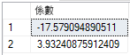

# <a name="create-and-train-a-predictive-model-in-r-with-azure-sql-database-machine-learning-services-preview"></a>使用 Azure SQL Database 機器學習服務 (預覽) 在 R 中建立和定型預測模型

在本快速入門中，您會使用 R 建立和定型預測模型，將模型儲存到 SQL 資料庫中的資料表，然後使用 [Azure SQL Database 中的機器學習服務 (搭配 R)](sql-database-machine-learning-services-overview.md) 公開預覽版，利用模型由新資料來進行值的預測。 

您將在此快速入門中使用的模型是一個簡單的迴歸模型，可根據速度預測汽車的煞停距離。 您將使用 R 隨附的 **cars** 資料集，因為此資料集較小且易於了解。

> [!TIP]
> R 執行階段附有許多資料集，大小不一。 若要取得隨 R 安裝的資料集清單，請從 R 命令提示字元輸入 `library(help="datasets")`。

[!INCLUDE[ml-preview-note](../../includes/sql-database-ml-preview-note.md)]

## <a name="prerequisites"></a>必要條件

- 如果您沒有 Azure 訂用帳戶，請先[建立帳戶](https://azure.microsoft.com/free/)再開始。

- 若要在這些練習中執行範例程式碼，您必須具有已啟用機器學習服務 (搭配 R) 的 Azure SQL 資料庫。 在公開預覽期間，Microsoft 會將您加入，並為您現有的或新的資料庫啟用機器學習服務。 請遵循[註冊預覽版](sql-database-machine-learning-services-overview.md#signup)中的步驟。

- 確定您已安裝最新版的 [SQL Server Management Studio](https://docs.microsoft.com/sql/ssms/sql-server-management-studio-ssms) (SSMS)。 您可以使用其他資料庫管理或查詢工具來執行 R 指令碼，但是在本快速入門中，您將使用 SSMS。

- 本快速入門需要您設定伺服器層級的防火牆規則。 如需如何執行這項操作的相關資訊，請參閱[建立伺服器層級的防火牆規則](sql-database-server-level-firewall-rule.md)。

## <a name="create-and-train-a-predictive-model"></a>建立和定型預測模型

**cars** 資料集中的汽車速度資料包含兩個資料行 (均為數值)：**dist** 和 **speed**。 這項資料包含不同速度下的多個煞停觀察值。 您將從這項資料建立線性迴歸模型，以說明車輛速度與煞停所需距離之間的關聯性。

線性模型的需求很簡單：
- 定義一個公式來說明應變數「速度」  與自變數「距離」  之間的關聯性。
- 提供定型模型時所使用的輸入資料。

> [!TIP]
> 如果您需要複習一下線性模型，請嘗試本教學課程，其中說明了使用 rxLinMod 來配適模型的程序：[配適線性模型](https://docs.microsoft.com/machine-learning-server/r/how-to-revoscaler-linear-model)

在下列步驟中，您會設定定型資料、建立迴歸模型、使用定型資料進行定型，然後將模型儲存到 SQL 資料表。

1. 開啟 **SQL Server Management Studio**，然後連線至 SQL 資料庫。

   如果您需要連線方面的協助，請參閱[快速入門：使用 SQL Server Management Studio 連線和查詢 Azure SQL Database](sql-database-connect-query-ssms.md)。

1. 建立 **CarSpeed** 資料表以儲存定型資料。

    ```sql
    CREATE TABLE dbo.CarSpeed (
        speed INT NOT NULL
        , distance INT NOT NULL
        )
    GO
    
    INSERT INTO dbo.CarSpeed (
        speed
        , distance
        )
    EXECUTE sp_execute_external_script @language = N'R'
        , @script = N'car_speed <- cars;'
        , @input_data_1 = N''
        , @output_data_1_name = N'car_speed'
    GO
    ```

1. 使用 `rxLinMod` 建立迴歸模型。 

   若要建置模型，您必須在 R 程式碼內定義公式，然後傳入定型資料 **CarSpeed** 作為輸入參數。

    ```sql
    DROP PROCEDURE IF EXISTS generate_linear_model;
    GO
    CREATE PROCEDURE generate_linear_model
    AS
    BEGIN
      EXECUTE sp_execute_external_script
      @language = N'R'
      , @script = N'
    lrmodel <- rxLinMod(formula = distance ~ speed, data = CarsData);
    trained_model <- data.frame(payload = as.raw(serialize(lrmodel, connection=NULL)));
    '
      , @input_data_1 = N'SELECT [speed], [distance] FROM CarSpeed'
      , @input_data_1_name = N'CarsData'
      , @output_data_1_name = N'trained_model'
      WITH RESULT SETS ((model VARBINARY(max)));
    END;
    GO
    ```

     rxLinMod 的第一個引數是將距離定義為相依於速度的*公式*參數。 輸入資料儲存在變數 `CarsData` 中，會由 SQL 查詢填入。

1. 建立用來儲存模型的資料表，以便稍後將模型用於預測。 

   建立模型的 R 套件輸出通常是**二進位物件**，所以資料表必須具有 **VARBINARY(max)** 類型的資料行。

    ```sql
    CREATE TABLE dbo.stopping_distance_models (
        model_name VARCHAR(30) NOT NULL DEFAULT('default model') PRIMARY KEY
        , model VARBINARY(max) NOT NULL
        );
    ```

1. 立即呼叫預存程序、產生模型，並將其儲存至資料表。

   ```sql
   INSERT INTO dbo.stopping_distance_models (model)
   EXECUTE generate_linear_model;
   ```

   請注意，如果再次執行此程式碼，將會出現下列錯誤：

   ```text
   Violation of PRIMARY KEY constraint...Cannot insert duplicate key in object bo.stopping_distance_models
   ```

   避免發生此錯誤的選項之一，就是更新每個新模型的名稱。 例如，您可以將名稱變得更具描述性，並加入模型類型、模型的建立日期等。

   ```sql
   UPDATE dbo.stopping_distance_models
   SET model_name = 'rxLinMod ' + FORMAT(GETDATE(), 'yyyy.MM.HH.mm', 'en-gb')
   WHERE model_name = 'default model'
   ```

## <a name="view-the-table-of-coefficients"></a>檢視係數資料表

一般而言，預存程序 [sp_execute_external_script](https://docs.microsoft.com/sql/relational-databases/system-stored-procedures/sp-execute-external-script-transact-sql) 的 R 輸出僅限於單一資料框架。 但除了資料框架以外，您也可以傳回其他類型的輸出，例如純量。

例如，假設您想要定型模型，但要立即檢視模型的係數資料表。 若要這麼做，請將係數資料表建立為主要結果集，並以 SQL 變數的形式輸出定型的模型。 您可以藉由呼叫變數立即重複使用該模型，或將模型儲存至資料表，如下所示。

```sql
DECLARE @model VARBINARY(max)
    , @modelname VARCHAR(30)

EXECUTE sp_execute_external_script @language = N'R'
    , @script = N'
speedmodel <- rxLinMod(distance ~ speed, CarsData)
modelbin <- serialize(speedmodel, NULL)
OutputDataSet <- data.frame(coefficients(speedmodel));
'
    , @input_data_1 = N'SELECT [speed], [distance] FROM CarSpeed'
    , @input_data_1_name = N'CarsData'
    , @params = N'@modelbin varbinary(max) OUTPUT'
    , @modelbin = @model OUTPUT
WITH RESULT SETS(([Coefficient] FLOAT NOT NULL));

-- Save the generated model
INSERT INTO dbo.stopping_distance_models (
    model_name
    , model
    )
VALUES (
    'latest model'
    , @model
    )
```

**結果**



## <a name="score-new-data-using-the-trained-model"></a>使用已定型的模型進行新資料評分

「評分」  一詞在資料科學中用來表示根據送入定型模型中的新資料來產生預測、機率或其他值的動作。 您會使用在上一節建立的模型對新資料進行預測評分。

您是否注意到，原始的定型資料僅止於每小時 25 英哩的速度？ 這是因為原始資料以 1920 年的實驗作為基礎！ 您可能會想知道，如果 1920 年代的汽車能開到每小時 60 英哩甚或 100 英哩的速度，需要多久的時間才能煞停？ 若要解答此問題，您可將一些新的速度值提供給您的模型。

1. 建立具有新速度資料的資料表。

   ```sql
    CREATE TABLE dbo.NewCarSpeed (
        speed INT NOT NULL
        , distance INT NULL
        )
    GO
    
    INSERT dbo.NewCarSpeed (speed)
    VALUES (40)
        , (50)
        , (60)
        , (70)
        , (80)
        , (90)
        , (100)
   ```

2. 從這些新的速度值，預測煞停距離。

   由於您的模型以 **RevoScaleR** 套件隨附的 **rxLinMod** 演算法為基礎，因此您應呼叫 [rxPredict](https://docs.microsoft.com/machine-learning-server/r-reference/revoscaler/rxpredict) 函式，而非泛型 R `predict` 函式。

   此範例指令碼：
   - 使用 SELECT 陳述式從資料表中取得單一模型
   - 將其傳入作為輸入參數
   - 在模型上呼叫 `unserialize` 函式
   - 將 `rxPredict` 函式搭配適當的引數套用至模型
   - 提供新的輸入資料

   > [!TIP]
   > 如需即時評分，請參閱 RevoScaleR 提供的[序列化函式](https://docs.microsoft.com/machine-learning-server/r-reference/revoscaler/rxserializemodel)。

   ```sql
    DECLARE @speedmodel VARBINARY(max) = (
            SELECT model
            FROM dbo.stopping_distance_models
            WHERE model_name = 'latest model'
            );
    
    EXECUTE sp_execute_external_script @language = N'R'
        , @script = N'
    current_model <- unserialize(as.raw(speedmodel));
    new <- data.frame(NewCarData);
    predicted.distance <- rxPredict(current_model, new);
    str(predicted.distance);
    OutputDataSet <- cbind(new, ceiling(predicted.distance));
    '
        , @input_data_1 = N'SELECT speed FROM [dbo].[NewCarSpeed]'
        , @input_data_1_name = N'NewCarData'
        , @params = N'@speedmodel varbinary(max)'
        , @speedmodel = @speedmodel
    WITH RESULT SETS((
                new_speed INT
                , predicted_distance INT
                ));
   ```

   **結果**

   

> [!NOTE]
> 在此範例指令碼中，會在測試階段加入 `str` 函式，以檢查從 R 傳回的資料結構描述。您可於稍後移除陳述式。
>
> R 指令碼中使用的資料行名稱不一定要傳至預存程序輸出。 在此 WITH RESULTS 子句會定義一些新的資料行名稱。

## <a name="next-steps"></a>後續步驟

如需有關「搭配 R 的 Azure SQL Database 機器學習服務 (預覽)」的詳細資訊，請參閱下列文章。

- [搭配 R 的 Azure SQL Database 機器學習服務 (預覽)](sql-database-machine-learning-services-overview.md)
- [在 Azure SQL Database 機器學習服務中建立和執行簡單的 R 指令碼 (預覽)](sql-database-quickstart-r-create-script.md)
- [使用機器學習服務在 Azure SQL Database 中撰寫進階的 R 函式 (預覽)](sql-database-machine-learning-services-functions.md)
- [在 Azure SQL Database 機器學習服務 (預覽) 中使用 R 和 SQL 資料](sql-database-machine-learning-services-data-issues.md)