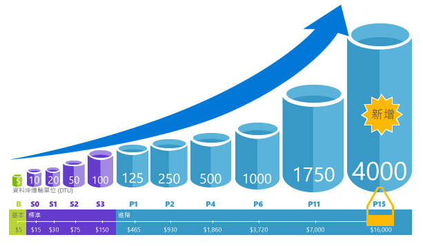

# Azure SQL Database 購買模型和資源 

[Azure SQL Database](sql-database-technical-overview.md) 中的邏輯伺服器針對計算、儲存體和 IO 資源提供了兩種購買模型：DTU 形式的購買模型和虛擬核心形式的購買模型。 

> [!NOTE]
> Azure SQL Database 中的[受控執行個體](sql-database-managed-instance.md)僅提供以虛擬核心為基礎的購買模型。

下列資料表和圖表會比較和對照這兩種購買模型。

> [!IMPORTANT]
> 針對虛擬核心形式的購買模型，請參閱[虛擬核心形式的購買模型](sql-database-service-tiers-vcore.md)

|**購買模型**|**說明**|**適用對象**|
|---|---|---|
|以 DTU 為基礎的模型|此模型是以計算、儲存體和 IO 資源的配套量值為基礎。 單一資料庫的效能層級會以資料庫交易單位 (DTU) 表示，而彈性集區的效能層級則會以彈性資料庫交易單位 (eDTU) 表示。 如需 DTU 和 eDTU 的詳細資訊，請參閱[什麼是 DTU 和 eDTU？](sql-database-service-tiers.md#what-are-database-transaction-units-dtus)|適合想要簡單選項且該選項已預先設定好資源的客戶。| 
|以虛擬核心為基礎的模型|此模型可讓您獨立地調整計算和儲存體資源。 它還可任您使用適用於 SQL Server 的 Azure Hybrid Benefit 來節省成本。|適合重視彈性、控制力和透明度的客戶。|
||||  

## 以虛擬核心為基礎的購買模型 

虛擬核心代表可以選擇使用的邏輯 CPU，可在各硬體世代間進行選擇。 虛擬核心形式的購買模型可讓您以彈性、可控制且透明的方式耗用個別資源，並讓您直接將內部部署工作負載需求平移到雲端。 此模型可讓您根據工作負載需求，進行計算、記憶體和儲存體調整。 在虛擬核心形式的購買模型中，客戶可以就[單一資料庫](sql-database-single-database-scale.md)與[彈性集區](sql-database-elastic-pool.md)選擇一般用途和商務關鍵性服務層。 

虛擬核心形式的採購模型可讓您獨立地調整計算和儲存體資源、符合內部部署效能，並獲得最佳價格。 如果您的資料庫或彈性集區耗用超過 300 DTU，則轉換成虛擬核心或許能降低成本。 您可以使用您所選擇的 API 或使用 Azure 入口網站來進行轉換，而不需停機。 但您不一定要轉換。 如果 DTU 購買模型符合您的效能和商務需求，請繼續使用即可。 如果您決定從 DTU 模型轉換成虛擬核心模型，請使用下列經驗法則選取效能等級：標準層中每 100 DTU 需要一般用途層至少 1 個虛擬核心，而進階層中每 125 DTU 需要商務關鍵性層至少 1 個虛擬核心。

在虛擬核心形式的購買模型中，客戶需支付下列費用：
- 計算 (服務層 + 虛擬核心數目 + 硬體世代)*
- 資料和記錄儲存體的類型和數量 
- IO 數目**
- 備份儲存體 (RA-GRS)** 

\* 在初始公開預覽中，第 4 代邏輯 CPU 是以 Intel E5-2673 v3 (Haswell) 2.4-GHz 處理器為基礎。

\*\* 在預覽期間，備份和 IO 可免費使用 7 天。

> [!IMPORTANT]
> 計算、IO、資料和記錄儲存體則依每個資料庫或彈性集區來收費。 備份儲存體是依每個資料庫來收費。 如需受控執行個體費用的詳細資訊，請參閱 [Azure SQL Database 受控執行個體](sql-database-managed-instance.md)。
> **區域限制：** 下列區域尚未提供虛擬核心形式的購買模型：西歐、法國中部、英國南部、英國西部和澳大利亞東南部。

## 以 DTU 為基礎的購買模型

資料庫交易單位 (DTU) 代表混合了 CPU、記憶體、讀取和寫入的量值。 以 DTU 為基礎的購買模型會提供一組預先設定好的計算資源組合和所包含的儲存體，以期達成不同的應用程式效能等級。 想要簡單一點，使用已預先設定好的組合並每月支付固定費用的客戶，可能會發現以 DTU 為基礎的模型更適合他們的需求。 在以 DTU 為基礎的購買模型中，客戶可以就[單一資料庫](sql-database-single-database-scale.md)與[彈性集區](sql-database-elastic-pool.md)選擇**基本**、**標準**和**進階**服務層。 

### 何謂資料庫交易單位 (DTU)？
針對[服務層](sql-database-single-database-scale.md)中特定效能等級的單一 Azure SQL Database，Microsoft 保證該資料庫具備特定的資源層級 (與 Azure 雲端的其他任何資料庫無關)，並提供可預測的效能等級。 資源數量會計算為資料庫交易單位 (DTU) 數量，且為計算、儲存體和 I/O 資源的配套測量。 這些資源的比率，原本是由專為一般實際 OLTP 工作負載所設計的 [OLTP 基準測試工作負載](sql-database-benchmark-overview.md)來判定。 若您的工作負載超過這些任一資源的數量，系統即會節流處理輸送量，因而導致效能變慢和逾時。 您工作負載使用的資源，不會影響到 Azure 雲端中其他 SQL Database 的可用資源，且其他工作負載所用的資源亦不會影響到您 SQL Database 的可用資源。

DTU 最適合用於了解處於不同效能等級與服務層之各 Azure SQL Database 間的相對量。 例如，藉由提升資料庫的效能等級來使 DTU 加倍，等於讓該資料庫可用的資源集合加倍。 例如，相較於具有 5 個 DTU 的 Basic 資料庫，具有 1750 個 DTU 的 Premium P11 資料庫可提供 350 倍的 DTU 計算能力。  

若要深入探索您工作負載的資源 (DTU) 耗用，請使用 [Azure SQL Database 查詢效能深入解析](sql-database-query-performance.md)執行以下動作：

- 依 CPU/持續時間/執行計數識別排名最前面的查詢，對其進行微調可能有助於改善效能。 例如，IO 密集使用的查詢可能會因使用[記憶體內最佳化技術](sql-database-in-memory.md)獲得助益，可更加妥善地運用處於特定服務層和效能等級的可用記憶體。
- 向下鑽研查詢的詳細資料，以檢視其文字和資源使用量的歷程記錄。
- 存取效能微調建議，其會顯示 [SQL Database Advisor](sql-database-advisor.md) 執行的動作。

您可以在應用程式停機時間最短 (通常平均少於四秒) 的情況下，隨時變更 [DTU 服務層](sql-database-service-tiers-dtu.md)。 對於許多企業和應用程式而言，只要能夠建立資料庫，並依需求調高或調低的效能即可，尤其是當使用模式相當容易預測時更是如此。 但如果您有無法預測的使用模式，則管理成本和商務模式就會變得相當困難。 針對此案例您可使用彈性集區，以在集區中的多個資料庫之間共用特定數量的 eDTU。

### 何謂彈性資料庫交易單位 (eDTU)？
與其針對 SQL Database 提供不一定隨時需要的隨時可用專屬資源集 (DTU)，您可選擇將資料庫置於 SQL Database 上的[彈性集區](sql-database-elastic-pool.md)以在各資料庫之間共用資源集區。 彈性集區中的共用資源，是以彈性資料庫交易單位 (eDTU) 來測量。 彈性集區提供符合成本效益的簡單解決方案，以管理多個不同且具備無法預測的使用模式資料庫的效能目標。 彈性集區可保證集區中的一個資料庫不會耗盡資源，同時可確保集區中的每個資料庫隨時至少有最低必要資源量可以使用。 

集區以固定價格提供固定數目的 eDTU。 在彈性集區內，會給予個別資料庫彈性以在設定的界限內自動調整。 負載量較重的資料庫會取用更多的 eDTU 以滿足需求。 負載量較輕的資料庫會取用較少的 eDTU。 沒有負載的資料庫不會取用 eDTU。 針對整個集區佈建資源，而不是針對每個資料庫佈建資源，可簡化管理工作以提供可預測的集區預算。

其他 eDTU 可以新增至現有集區，而不會造成資料庫停機，且對集區中資料庫沒有影響。 同樣地，如果不再需要額外 eDTU，則隨時可以從現有集區中移除。 您可以增減集區中的資料庫，或限制資料庫在沈重負載下可以使用的 eDTU，以便為其他資料庫保留 eDTU。 如果可預測某個資料庫不會充分使用資源，您可以將它移出集區，並設定為具有可預測所需資源量的單一資料庫。

### 如何判斷我的工作負載所需的 DTU 數目？
如果您希望將現有的內部部署或 SQL Server 虛擬機器工作負載移轉至 Azure SQL Database，您可以使用 [DTU 計算機](http://dtucalculator.azurewebsites.net/) 來估計所需的 DTU 數目。 對於現有的 Azure SQL Database 工作負載，您可以使用 [SQL Database 查詢效能深入解析](sql-database-query-performance.md) 來了解您的資料庫資源耗用量 (DTU)，以深入了解如何將工作負載最佳化。 您也可以使用 [sys.dm_db_ resource_stats](https://msdn.microsoft.com/library/dn800981.aspx) DMV，來檢視最近一小時的資源耗用量。 或者，目錄檢視 [sys.resource_stats](http://msdn.microsoft.com/library/dn269979.aspx) 會顯示最近 14 天的資源耗用量，不過會以五分鐘的平均值來表示，其精確度較低。

### 如何得知我能受益於彈性資源集區？
集區適合於具備特定使用模式的大量資料庫。 針對指定的資料庫，此模式的特徵是低使用量平均與相對不頻繁的使用量高峰。 SQL Database 會自動評估現有 SQL Database 伺服器中資料庫過去的資源使用量，並在 Azure 入口網站中建議適當的集區組態。 如需詳細資訊，請參閱 [何時應該使用彈性集區？](sql-database-elastic-pool.md)

### 當我達到 DTU 上限時會發生什麼狀況？
效能層級會受校正和管理，以提供所需資源來將您的資料庫工作負載執行到您所選服務層/效能層級允許的上限。 如果您的工作負載達到 CPU/資料 IO/記錄 IO 限制其中之一，您會繼續收到允許的最大層級資源，但您也可能會經歷較長的查詢延遲。 這些限制並不會導致任何錯誤，但除非是速度慢到使查詢開始逾時，否則會使工作負載速度變慢。如果您達到允許的並行使用者工作階段/要求 (背景工作執行緒) 數目上限，您會看到明確的錯誤。 如需 CPU、記憶體、資料 IO 和交易記錄 IO 以外的資源限制資訊，請參閱 [Azure SQL Database 資源限制]( sql-database-resource-limits.md#what-happens-when-database-resource-limits-are-reached)。

### 建立基準測試結果與實際案例資料庫效能之間的關聯
請務必了解，所有基準測試都只具備代表性與指標性。 利用基準測試應用程式達成的交易速率與利用其他應用程式可能達成的交易速率不同。 基準測試是由不同的交易類型集合所組成，這些類型是針對包含某個範圍的資料表和資料類型的結構描述來執行。 雖然基準測試會執行所有 OLTP 工作負載常見的相同基本作業，但是它不代表任何特定類別的資料庫或應用程式。 基準測試的目標是提供資料庫相對效能的合理指南，在效能等級之間向上或向下調整時可預期此目標。 實際上，資料庫的大小和複雜度都不一樣，會遭遇到不同的工作負載混合，並以不同的方式回應。 例如，IO 密集的應用程式可能會更快達到 IO 臨界值，或者 CPU 密集應用程式可能會更快達到 CPU 限制。 任何特定的資料庫並不保證能夠在增加負載的情況下使用和基準測試相同的方式調整。

基準測試和其方法會在以下詳細描述。

### 基準測試摘要
ASDB 可測量基本資料庫作業混合的效能，這些作業最常發生在線上交易處理 (OLTP) 工作負載中。 雖然基準測試在設計時考量到雲端運算，但是資料庫結構描述、資料母體和交易的設計都廣泛代表 OLTP 工作負載中最常使用的基本元素。

### 結構描述
結構描述的設計具有足夠的多樣性和複雜性才能支援廣泛的作業。 對包含六個資料表的資料庫執行基準測試。 資料表分成三個類別：固定大小、調整和成長。 有兩個固定大小資料表、三個調整資料表，和一個成長資料表。 固定大小資料表有固定數目的資料列。 調整資料表有與資料庫效能成正比但不會在基準測試期間變更的基數。 成長資料表的大小在初始載入時類似調整資料表，但是在執行基準測試做為資料列的過程中，會插入並刪除基數變更。

結構描述包含資料類型的混合，包括整數、數值、字元和日期/時間。 結構描述包含主要和次要索引鍵，但不含任何外部索引鍵 - 也就是資料表之間沒有參考完整性條件約束。

資料產生程式會產生初始資料庫的資料。 運用各種策略產生整數和數值資料。 在某些情況下，會在某範圍中隨機分佈值。 在其他情況下，會隨機排列一組值以確保維護特定的分佈。 從文字的加權清單產生文字欄位以產生實際的查看資料。

資料庫的大小是根據「縮放比例」來設定。 縮放比例 (簡寫為 SF) 可決定調整和成長資料表的基數。 如以下的＜使用者與步調＞一節所述，資料庫大小、使用者數目和最大效能都會根據彼此的比例進行調整。

### 交易
工作負載包含九種交易類型，如下表所示。 每一筆交易都設計為反白顯示資料庫引擎和系統硬體中特定的一組系統特性，與其他交易呈現高度對比。 此方法可讓您更容易評估不同元件對整體效能的影響。 例如，「頻繁讀取」交易會從磁碟產生大量的讀取作業。

| 交易類型 | 說明 |
| --- | --- |
| 輕度讀取 |SELECT；記憶體中；唯讀 |
| 中度讀取 |SELECT；大部分記憶體中；唯讀 |
| 重度讀取 |SELECT；大部分非記憶體中；唯讀 |
| 輕度更新 |UPDATE；記憶體中；讀寫 |
| 重度更新 |UPDATE；大部分非記憶體中；讀寫 |
| 輕度插入 |INSERT；記憶體中；讀寫 |
| 重度插入 |INSERT；大部分非記憶體中；讀寫 |
| 刪除 |DELETE；記憶體中與非記憶體中的混合；讀寫 |
| 重度 CPU |SELECT；記憶體中；非常重度的 CPU 負載；唯讀 |

### 工作負載混合
利用下列整體混合從加權分佈中隨機選取交易。 整體混合具有大約 2:1 的讀/寫比率。

| 交易類型 | 混合 % |
| --- | --- |
| 輕度讀取 |35 |
| 中度讀取 |20 |
| 重度讀取 |5 |
| 輕度更新 |20 |
| 重度更新 |3 |
| 輕度插入 |3 |
| 重度插入 |2 |
| 刪除 |2 |
| 重度 CPU |10 |

### 使用者與步調
基準測試工作負載是由一個工具觸發，它會跨一組連接提交交易，以模擬許多並行使用者的行為。 雖然所有的連接和交易都是由電腦產生，為了簡單起見，我們將這些連接視為「使用者」。 雖然每一位使用者都獨立於其他所有使用者操作，但是所有使用者都執行相同的步驟循環，如下所示：

1. 建立資料庫連接。
2. 發出結束訊號之前請重複：
   * 隨機選取交易 (從加權分佈中)。
   * 執行選取的交易及測量回應時間。
   * 等候步調延遲。
3. 關閉資料庫連接。
4. [結束]。

步調延遲 (在步驟 2c) 為隨機選取，但其分佈具有 1.0 秒的平均值。 因此每位使用者平均每秒可以產生最多一筆交易。

### 調整規則
使用者數目取決於資料庫大小 (以縮放比例單位表示)。 每五個縮放比例單位有一名使用者。 由於步調延遲，一位使用者平均每秒可以產生最多一筆交易。

例如，縮放比例為 500 (SF = 500) 的資料庫會有 100 位使用者，並可達到最大速率 100 TPS。 若要觸發更高的 TPS 速率，需要更多使用者和更大的資料庫。

下表顯示為每個服務層和效能等級實際持續保留的使用者數目。

| 服務層 (效能等級) | 使用者 | 資料庫大小 |
| --- | --- | --- |
| 基本 |5 |720 MB |
| 標準 (S0) |10 |1 GB |
| 標準 (S1) |20 |2.1 GB |
| 標準 (S2) |50 |7.1 GB |
| 高階 (P1) |100 |14 GB |
| 高階 (P2) |200 |28 GB |
| 高階 (P6) |800 |114 GB |

### 測量持續時間
有效的基準測試執行需要至少一個小時的穩定狀態測量持續時間。

### 度量
基準測試中的關鍵度量是輸送量和回應時間。

* 輸送量是基準測試中的基礎效能測量。 每個單位時間都會在交易中報告輸送量，計算所有交易類型。
* 回應時間是效能可預測性的測量。 回應時間條件約束會隨服務類別而有所不同，較高等級的服務類別有更嚴格的回應時間需求，如下所示。

| 服務類別 | 輸送量測量 | 回應時間需求 |
| --- | --- | --- |
| 進階 |每秒交易 |0.5 秒時第 95 個百分位數 |
| 標準 |每分鐘交易 |1.0 秒時第 90 個百分位數 |
| 基本 |每小時交易 |2.0 秒時第 80 個百分位數 |

## 後續步驟

- 針對虛擬核心形式的購買模型，請參閱[虛擬核心形式的購買模型](sql-database-service-tiers-vcore.md)
- 如需以 DTU 為基礎的購買模型，請參閱[以 DTU 為基礎的購買模型](sql-database-service-tiers-dtu.md)。
