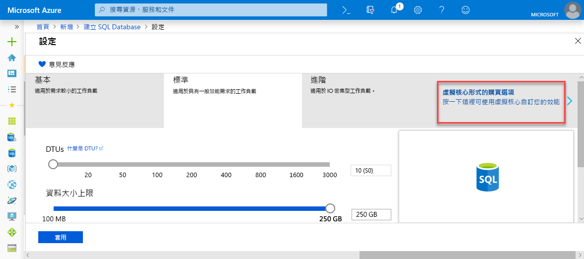

# <a name="quickstart-create-a-single-database-in-azure-sql-database-using-the-azure-portal"></a>快速入門：使用 Azure 入口網站在 Azure SQL Database 中建立單一資料庫

要在 Azure SQL Database 中建立資料庫，建立[單一資料庫](sql-database-single-database.md)是最快速且最簡單的部署選項。 本快速入門說明如何使用 Azure 入口網站建立並查詢單一資料庫。

如果您沒有 Azure 訂用帳戶，請[建立免費帳戶](https://azure.microsoft.com/free/)。

若要進行本快速入門中的所有步驟，請登入 [Azure 入口網站](https://portal.azure.com/)。

## <a name="create-a-single-database"></a>建立單一資料庫

您可以在已佈建的或無伺服器 (預覽) 計算層中建立單一資料庫。

- 已佈建計算層中的單一資料庫具有已定義數量的預先配置計算資源，以及一組使用兩種[購買模型](sql-database-purchase-models.md)之一的記憶體和儲存體資源。
- 無伺服器計算層中的單一資料庫具有多種可自動調整的計算資源，以及指定數量的每一核心記憶體，和指定數量的儲存體資源，且僅適用於[以虛擬核心為基礎的購買模型](sql-database-service-tiers-vcore.md)。

當您建立單一資料庫時，您也會定義 [SQL Database 伺服器](sql-database-servers.md)加以管理，並將其放入指定區域中的 [Azure 資源群組](../azure-resource-manager/resource-group-overview.md)內。

> [!NOTE]
> 本快速入門使用[以虛擬核心為基礎的購買模型](sql-database-service-tiers-vcore.md)和[無伺服器](sql-database-serverless.md)計算層，但[以 DTU 為基礎的購買模型](sql-database-service-tiers-DTU.md)也可供使用。

若要建立包含 AdventureWorksLT 範例資料的單一資料庫：

1. 選取 Azure 入口網站左上角的 [建立資源]  。
2. 選取 [資料庫]  ，然後選取 [SQL Database]  以開啟 [建立 SQL Database]  頁面。

   

3. 在 [基本資料]  索引標籤的 [專案詳細資料]  區段中，輸入或選取下列值：

   - 訂用帳戶  ：下拉並選取正確的訂用帳戶 (若未出現)。
   - **資源群組**：選取 [新建]  ，輸入 `myResourceGroup`，然後選取 [確定]  。

     

4. 在 [資料庫詳細資料]  區段中，輸入或選取下列值：

   - **資料庫名稱**：輸入 `mySampleDatabase` 。
   - **伺服器**：選取 [新建]  並輸入下列值，然後選取 [選取]  。
       - **伺服器名稱**：`mysqlserver`類別；伴隨一些表示唯一性的數字。
       - **伺服器管理員登入**：輸入 `azureuser`。
       - **密碼**：輸入複雜密碼以符合密碼需求。
       - **位置**：從下拉式清單中選擇位置，例如 `West US 2`。

         

      > [!IMPORTANT]
      > 請記得記錄下伺服器管理員登入和密碼，以便在進行這個和其他快速入門時能夠登入伺服器和資料庫。 如果您忘記登入或密碼，您可以在 [SQL Server]  頁面上取得登入名稱或重設密碼。 若要開啟 [SQL Server]  頁面，請在資料庫建立後，選取資料庫 [概觀]  頁面上的伺服器名稱。

        

   - **您要使用 SQL 彈性集區嗎**：選取 [否]  選項。
   - **計算 + 儲存體**：選取 [設定資料庫]  ，然後在本快速入門中，選取 [以虛擬核心為基礎的購買選項] 

     

   - 選取 [無伺服器]  。

     

   - 檢閱 [虛擬核心數上限]  、[虛擬核心數下限]  、[自動暫停延遲]  和 [資料大小上限]  的設定。 視需要變更這些設定。
   - 接受預覽條款，然後按一下 [確定]  。
   - 選取 [套用]  。

5. 選取 [其他設定]  索引標籤。 
6. 在 [資料來源]  區段的 [使用現有資料]  下方，選取 `Sample`。 

   

   > [!IMPORTANT]
   > 請務必選取 [範例 (AdventureWorksLT)]  資料，以便依照本快速入門和使用這項資料的其他 Azure SQL Database 快速入門的指示操作。

7. 將其餘的值保留為預設值，然後在表單底部選取 [檢閱 + 建立]  。
8. 檢閱最終設定，然後選取 [建立]  。

9. 在 [SQL Database]  表單中，選取 [建立]  以部署和佈建資源群組、伺服器和資料庫。

## <a name="query-the-database"></a>查詢資料庫

您現在已建立資料庫，接著請使用 Azure 入口網站內建的查詢工具連線到資料庫，並查詢資料。

1. 在資料庫的 [SQL Database]  頁面上，選取左側功能表中的 [查詢編輯器 (預覽)]  。

   

2. 輸入您的登入資訊，並選取 [確定]  。
3. 在 [查詢編輯器]  窗格中輸入下列查詢。

   ```sql
   SELECT TOP 20 pc.Name as CategoryName, p.name as ProductName
   FROM SalesLT.ProductCategory pc
   JOIN SalesLT.Product p
   ON pc.productcategoryid = p.productcategoryid;
   ```

4. 選取 [執行]  ，然後在 [結果]  窗格中檢閱查詢結果。

   

5. 關閉 [查詢編輯器]  頁面，並在系統提示是否要捨棄未儲存的編輯時選取 [確定]  。

## <a name="clean-up-resources"></a>清除資源

如果您想要繼續進行[後續步驟](#next-steps)，請保留此資源群組、資料庫伺服器和單一資料庫。 後續步驟會示範如何使用不同的方法連接及查詢您的資料庫。

這些資源使用完畢後，您可以依照下列方式加以刪除：

1. 從 Azure 入口網站的左側功能表中，依序選取 [資源群組]  和 [myResourceGroup]  。
2. 在資源群組頁面上，選取 [刪除資源群組]  。
3. 在欄位中輸入 myResourceGroup  ，然後選取 [刪除]  。

## <a name="next-steps"></a>後續步驟

- 建立伺服器層級的防火牆規則，以從內部部署或遠端工具連線到您的單一資料庫。 如需詳細資訊，請參閱[建立伺服器層級防火牆規則](sql-database-server-level-firewall-rule.md)。
- 在建立伺服器層級的防火牆規則後，使用數種不同的工具或語言來[連線及查詢](sql-database-connect-query.md)您的資料庫。
  - [使用 SQL Server Management Studio 進行連線和查詢](sql-database-connect-query-ssms.md)
  - [使用 Azure Data Studio 進行連線及查詢](https://docs.microsoft.com/sql/azure-data-studio/quickstart-sql-database?toc=/azure/sql-database/toc.json)
- 若要使用 Azure CLI 在已佈建的計算層中建立單一資料庫，請參閱 [Azure CLI 範例](sql-database-cli-samples.md)。
- 若要使用 Azure PowerShell 在已佈建的計算層中建立單一資料庫，請參閱 [Azure PowerShell 範例](sql-database-powershell-samples.md)。
- 若要使用 Azure PowerShell 在無伺服器電腦中建立單一資料庫，請參閱[建立無伺服器資料庫](sql-database-serverless.md#create-new-database-in-serverless-compute-tier)。