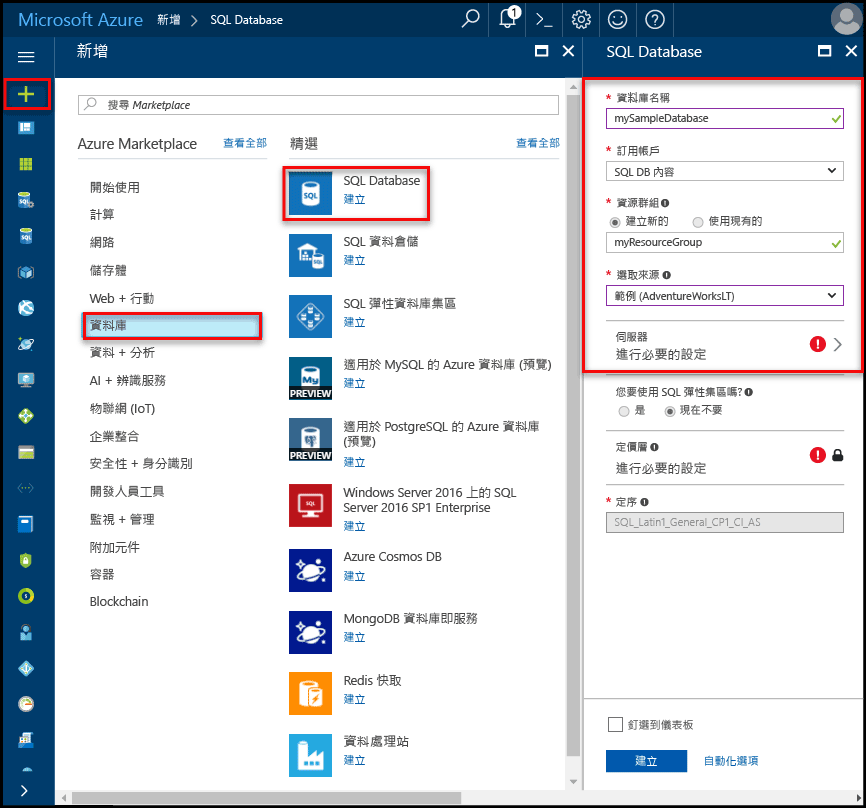
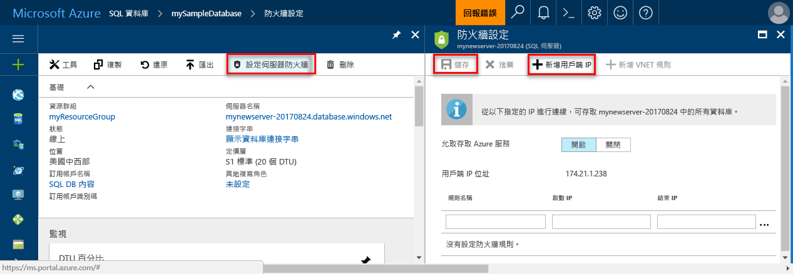

# 在 Azure SQL Database 中建立及管理邏輯伺服器和單一資料庫 

您可以使用 Azure 入口網站、PowerShell、Azure CLI、REST API 和 Transact-SQL，來建立及管理 Azure SQL 資料庫邏輯伺服器與單一資料庫。

## Azure 入口網站：管理邏輯伺服器和資料庫

您可以事先或在建立伺服器本身的同時，建立 Azure SQL Database 的資源群組。 有多種方法可以使用新的 SQL Server 表單，可以透過建立新的 SQL Server，或是在建立新資料庫時一起使用。 

### 建立空白的 SQL Server (邏輯伺服器)

若要使用 [Azure 入口網站](https://portal.azure.com)建立 Azure SQL Database 伺服器 (不含資料庫)，請瀏覽至空白的 SQL Server (邏輯伺服器) 表單。  

### 建立空白或範例 SQL 資料庫

若要使用 [Azure 入口網站](https://portal.azure.com)建立 Azure SQL Database，請瀏覽至空白的 SQL Database 表單，並提供要求的資訊。 您可以事先或在建立資料庫本身的同時，建立 Azure SQL Database 的資源群組和邏輯伺服器。 您可以建立空白資料庫，或建立根據 Adventure Works LT 的範例資料庫。 

  

> [!IMPORTANT]
> 如需選取資料庫定價層的資訊，請參閱 [DTU 形式的購買模型](sql-database-service-tiers-dtu.md)和[虛擬核心形式的購買模型](sql-database-service-tiers-vcore.md)。

若要建立「受控執行個體」，請參閱[建立受控執行個體](sql-database-managed-instance-get-started.md)

### 管理現有的 SQL Server

若要管理現有的伺服器，請使用多種方法 (例如從特定的 SQL 資料庫頁面、[SQL Server] 頁面，或 [所有資源] 頁面)，瀏覽至伺服器。 

若要管理現有的資料庫，請瀏覽至 [SQL 資料庫] 頁面，按一下您想要管理的資料庫。 下列螢幕擷取畫面顯示如何從資料庫的 [概觀] 頁面，開始設定資料庫的伺服器層級防火牆。 

    

> [!IMPORTANT]
> 若要設定資料庫的效能屬性，請參閱 [DTU 形式的購買模型](sql-database-service-tiers-dtu.md)和[虛擬核心形式的購買模型](sql-database-service-tiers-vcore.md)。
>

> [!TIP]
> 如需 Azure 入口網站快速入門，請參閱[在 Azure 入口網站中建立 Azure SQL 資料庫](sql-database-get-started-portal.md)。

## PowerShell：管理邏輯伺服器和資料庫

若要使用 Azure PowerShell 建立和管理 Azure SQL 伺服器、資料庫和防火牆，請使用下列 PowerShell 指令程式。 如果您需要安裝或升級 PowerShell，請參閱[安裝 Azure PowerShell 模組](/powershell/azure/install-azurerm-ps)。 

> [!TIP]
> 如需 PowerShell 快速入門，請參閱[使用 PowerShell 建立單一 Azure SQL 資料庫](sql-database-get-started-portal.md)。 如需 PowerShell 範例指令碼，請參閱[使用 PowerShell 建立單一 Azure SQL Database 並設定防火牆規則](scripts/sql-database-create-and-configure-database-powershell.md)和[使用 PowerShell 監視和調整單一 SQL Database](scripts/sql-database-monitor-and-scale-database-powershell.md)。
>

| Cmdlet | 說明 |
| --- | --- |
|[New-AzureRmSqlDatabase](/powershell/module/azurerm.sql/new-azurermsqldatabase)|建立資料庫 |
|[Get-AzureRmSqlDatabase](/powershell/module/azurerm.sql/get-azurermsqldatabase)|取得一或多個資料庫|
|[Set-AzureRmSqlDatabase](/powershell/module/azurerm.sql/set-azurermsqldatabase)|設定資料庫的屬性，或將現有資料庫移到彈性集區中|
|[Remove-AzureRmSqlDatabase](/powershell/module/azurerm.sql/remove-azurermsqldatabase)|移除資料庫|
|[New-AzureRmResourceGroup](/powershell/module/azurerm.resources/new-azurermresourcegroup)|建立資源群組|
|[New-AzureRmSqlServer](/powershell/module/azurerm.sql/new-azurermsqlserver)|建立伺服器|
|[Get-AzureRmSqlServer](/powershell/module/azurerm.sql/get-azurermsqlserver)|傳回伺服器的相關資訊|
|[Set-AzureRmSqlServer](https://docs.microsoft.com/powershell/module/azurerm.sql/set-azurermsqlserver)|修改伺服器的屬性|
|[Remove-AzureRmSqlServer](/powershell/module/azurerm.sql/remove-azurermsqlserver)|移除伺服器|
|[New-AzureRmSqlServerFirewallRule](/powershell/module/azurerm.sql/new-azurermsqlserverfirewallrule)|建立伺服器層級防火牆規則 |
|[Get-AzureRmSqlServerFirewallRule](/powershell/module/azurerm.sql/get-azurermsqlserverfirewallrule)|取得伺服器的防火牆規則|
|[Set-AzureRmSqlServerFirewallRule](/powershell/module/azurerm.sql/set-azurermsqlserverfirewallrule)|修改伺服器中的防火牆規則|
|[Remove-AzureRmSqlServerFirewallRule](/powershell/module/azurerm.sql/remove-azurermsqlserverfirewallrule)|刪除伺服器的防火牆規則|
| New-AzureRmSqlServerVirtualNetworkRule | 根據同時是虛擬網路服務端點的子網路，建立[*虛擬網路規則*](sql-database-vnet-service-endpoint-rule-overview.md)。 |

## Azure CLI：管理邏輯伺服器和資料庫

若要使用 [Azure CLI](/cli/azure) 建立和管理 Azure SQL 伺服器、資料庫和防火牆，請使用下列 [Azure CLI SQL Database](/cli/azure/sql/db) 命令。 使用 [Cloud Shell](/azure/cloud-shell/overview) 在您的瀏覽器中執行 CLI，或在 macOS、Linux 或 Windows 中[安裝](/cli/azure/install-azure-cli)。 如需建立和管理彈性集區，請參閱[彈性集區](sql-database-elastic-pool.md)。

> [!TIP]
> 如需 Azure CLI 快速入門，請參閱[使用 Azure CLI 建立單一 Azure SQL 資料庫](sql-database-cli-samples.md)。 如需 Azure CLI 範例指令碼，請參閱[使用 CLI 建立單一 Azure SQL Database 並設定防火牆規則](scripts/sql-database-create-and-configure-database-cli.md)和[使用 CLI 監視和調整單一 SQL Database](scripts/sql-database-monitor-and-scale-database-cli.md)。
>

| Cmdlet | 說明 |
| --- | --- |
|[az sql db create](/cli/azure/sql/db#az-sql-db-create) |建立資料庫|
|[az sql db list](/cli/azure/sql/db#az-sql-db-list)|列出伺服器中的所有資料庫和資料倉儲，或彈性集區中的所有資料庫|
|[az sql db list-editions](/cli/azure/sql/db#az-sql-db-list-editions)|列出可用的服務目標與儲存體限制|
|[az sql db list-usages](/cli/azure/sql/db#az-sql-db-list-usages)|傳回資料庫使用方式|
|[az sql db show](/cli/azure/sql/db#az-sql-db-show)|取得資料庫或資料倉儲|
|[az sql db update](/cli/azure/sql/db#az-sql-db-update)|更新資料庫|
|[az sql db delete](/cli/azure/sql/db#az-sql-db-delete)|移除資料庫|
|[az group create](/cli/azure/group#az-group-create)|建立資源群組|
|[az sql server create](/cli/azure/sql/server#az-sql-server-create)|建立伺服器|
|[az sql server list](/cli/azure/sql/server#az-sql-server-list)|列出伺服器|
|[az sql server list-usages](/cli/azure/sql/server#az-sql-server-list-usages)|傳回伺服器使用方式|
|[az sql server show](/cli/azure/sql/server#az-sql-server-show)|取得伺服器|
|[az sql server update](/cli/azure/sql/server#az-sql-server-update)|更新伺服器|
|[az sql server delete](/cli/azure/sql/server#az-sql-server-delete)|刪除伺服器|
|[az sql server firewall-rule create](/cli/azure/sql/server/firewall-rule#az-sql-server-firewall-rule-create)|建立伺服器防火牆規則|
|[az sql server firewall-rule list](/cli/azure/sql/server/firewall-rule#az-sql-server-firewall-rule-list)|列出伺服器上的防火牆規則|
|[az sql server firewall-rule show](/cli/azure/sql/server/firewall-rule#az-sql-server-firewall-rule-show)|顯示防火牆規則的詳細資料|
|[az sql server firewall-rule update](/cli/azure/sql/server/firewall-rule##az-sql-server-firewall-rule-update)|更新防火牆規則|
|[az sql server firewall-rule delete](/cli/azure/sql/server/firewall-rule#az-sql-server-firewall-rule-delete)|刪除防火牆規則|

## Transact-SQL：管理邏輯伺服器和資料庫

若要使用 Transact-SQL 建立和管理 Azure SQL 伺服器、資料庫和防火牆，請使用下列 T-SQL 命令。 您可以使用 Azure 入口網站、[SQL Server Management Studio](/sql/ssms/use-sql-server-management-studio)、[Visual Studio Code](https://code.visualstudio.com/docs)，或任何可連線到 Azure SQL Database 伺服器並傳遞 Transact-SQL 命令的其他程式來發出這些命令。 如需管理彈性集區，請參閱[彈性集區](sql-database-elastic-pool.md)。

> [!TIP]
> 如需在 Microsoft Windows 上使用 SQL Server Management Studio 的快速入門，請參閱 [Azure SQL Database：使用 SQL Server Management Studio 連線及查詢資料](sql-database-connect-query-ssms.md)。 如需在 macOS、Linux 或 Windows 上使用 Visual Studio Code 的快速入門，請參閱 [Azure SQL Database：使用 Visual Studio Code 連線及查詢資料](sql-database-connect-query-vscode.md)。

> [!IMPORTANT]
> 您無法使用 Transact-SQL 建立或刪除伺服器。
>

| 命令 | 說明 |
| --- | --- |
|[CREATE DATABASE (Azure SQL Database)](/sql/t-sql/statements/create-database-azure-sql-database)|建立新的資料庫。 您必須連線到 master 資料庫才能建立新的資料庫。|
| [ALTER DATABASE (Azure SQL Database)](/sql/t-sql/statements/alter-database-azure-sql-database) |修改 Azure SQL Database。 |
|[ALTER DATABASE (Azure SQL Data Warehouse)](/sql/t-sql/statements/alter-database-azure-sql-data-warehouse)|修改 Azure SQL 資料倉儲。|
|[DROP DATABASE (Transact-SQL)](/sql/t-sql/statements/drop-database-transact-sql)|刪除資料庫。|
|[sys.database_service_objectives (Azure SQL Database)](/sql/relational-databases/system-catalog-views/sys-database-service-objectives-azure-sql-database)|傳回 Azure SQL 資料庫或 Azure SQL 資料倉儲的版本 (服務層)、服務目標 (定價層) 和彈性集區名稱 (如果有的話)。 若已登入 Azure SQL Database 伺服器中的 master 資料庫，則傳回所有資料庫的相關資訊。 對於 Azure SQL 資料倉儲，您必須連線到 master 資料庫。|
|[sys.dm_db_resource_stats (Azure SQL Database)](/sql/relational-databases/system-dynamic-management-views/sys-dm-db-resource-stats-azure-sql-database)| 傳回 Azure SQL Database 資料庫的 CPU、IO 和記憶體耗用量。 每 15 秒會有一列，即使資料庫沒有任何活動，也會有一列。|
|[sys.resource_stats (Azure SQL Database)](/sql/relational-databases/system-catalog-views/sys-resource-stats-azure-sql-database)|傳回 Azure SQL Database 的 CPU 使用量和儲存體資料。 每五分鐘會收集和彙總資料一次。|
|[sys.database_connection_stats (Azure SQL Database)](/sql/relational-databases/system-catalog-views/sys-database-connection-stats-azure-sql-database)|包含 SQL Database 資料庫連線事件的統計資料，提供資料庫連接成功和失敗的概觀。 |
|[sys.event_log (Azure SQL Database)](/sql/relational-databases/system-catalog-views/sys-event-log-azure-sql-database)|傳回成功的 Azure SQL Database 資料庫連接、連接失敗和死結。 可以使用這些資訊，對 SQL Database 的資料庫活動進行追蹤或疑難排解。|
|[sp_set_firewall_rule (Azure SQL Database)](/sql/relational-databases/system-stored-procedures/sp-set-firewall-rule-azure-sql-database)|建立或更新 SQL Database 伺服器的伺服器層級防火牆設定。 只有使用伺服器層級主體登入，才能使用 master 資料庫中的這個預存程序。 具有 Azure 層級權限的使用者建立第一個伺服器層級防火牆規則之後，才能使用 Transact-SQL 建立伺服器層級防火牆規則|
|[sys.firewall_rules (Azure SQL Database)](/sql/relational-databases/system-catalog-views/sys-firewall-rules-azure-sql-database)|傳回與您的 Microsoft Azure SQL Database 相關聯之伺服器層級防火牆設定的相關資訊。|
|[sp_delete_firewall_rule (Azure SQL Database)](/sql/relational-databases/system-stored-procedures/sp-delete-firewall-rule-azure-sql-database)|移除 SQL Database 伺服器的伺服器層級防火牆設定。 只有使用伺服器層級主體登入，才能使用 master 資料庫中的這個預存程序。|
|[sp_set_database_firewall_rule (Azure SQL Database)](/sql/relational-databases/system-stored-procedures/sp-set-database-firewall-rule-azure-sql-database)|建立或更新您的 Azure SQL Database 或 SQL 資料倉儲的資料庫層級防火牆規則。 您可以為 master 資料庫，以及 SQL Database 上的使用者資料庫，設定資料庫防火牆規則。 使用自主資料庫使用者時，資料庫防火牆規則很有用。 |
|[sys.database_firewall_rules (Azure SQL Database)](/sql/relational-databases/system-catalog-views/sys-database-firewall-rules-azure-sql-database)|傳回與您的 Microsoft Azure SQL Database 相關聯之資料庫層級防火牆設定的相關資訊。 |
|[sp_delete_database_firewall_rule (Azure SQL Database)](/sql/relational-databases/system-stored-procedures/sp-delete-database-firewall-rule-azure-sql-database)|移除您的 Azure SQL Database 或 SQL 資料倉儲的資料庫層級防火牆設定。 |

## REST API：管理邏輯伺服器和資料庫

若要建立和管理 Azure SQL 伺服器、資料庫和防火牆，請使用 REST API 要求。

| 命令 | 說明 |
| --- | --- |
|[伺服器 - 建立或更新](/rest/api/sql/servers/createorupdate)|建立或更新新的伺服器。|
|[伺服器 - 刪除](/rest/api/sql/servers/delete)|刪除 SQL 伺服器。|
|[伺服器 - 取得](/rest/api/sql/servers/get)|取得伺服器。|
|[伺服器 - 清單](/rest/api/sql/servers/list)|傳回伺服器的清單。|
|[伺服器 - 依資源群組列示](/rest/api/sql/servers/listbyresourcegroup)|傳回資源群組中的伺服器清單。|
|[伺服器 - 更新](/rest/api/sql/servers/update)|更新現有伺服器。|
|[資料庫 - 建立或更新](/rest/api/sql/databases/createorupdate)|建立新的資料庫或更新現有資料庫。|
|[資料庫 - 取得](/rest/api/sql/databases/get)|取得資料庫。|
|[資料庫 - 依彈性集區列出](/rest/api/sql/databases/listbyelasticpool)|傳回將彈性集區中的資料庫列出的清單。|
|[資料庫 - 依伺服器列出](/rest/api/sql/databases/listbyserver)|傳回伺服器中的資料庫清單。|
|[資料庫 - 更新](/rest/api/sql/databases/update)|更新現有的資料庫。|
|[防火牆規則 - 建立或更新](/rest/api/sql/firewallrules/createorupdate)|建立或更新防火牆規則。|
|[防火牆規則 - 刪除](/rest/api/sql/firewallrules/delete)|刪除防火牆規則。|
|[防火牆規則 - 取得](/rest/api/sql/firewallrules/get)|取得防火牆規則。|
|[防火牆規則 - 依伺服器列示](/rest/api/sql/firewallrules/listbyserver)|傳回防火牆規則的清單。|

## 後續步驟

- 若要深入了解如何將 SQL Server 資料庫移轉至 Azure，請參閱[移轉至 Azure SQL Database](sql-database-cloud-migrate.md)。
- 如需支援功能的相關資訊，請參閱「[功能](sql-database-features.md)」。
