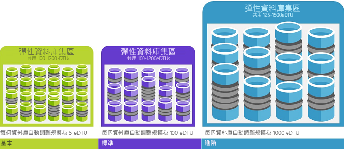

# 什麼是 Azure SQL Database 服務

SQL Database 是 Microsoft Azure 中的一般用途關聯式資料庫受控服務，可支援關聯式資料、JSON、空間和 XML 等結構。 SQL Database 會在兩個不同的購買模型內提供可動態擴充的效能：以虛擬核心為基礎的購買模型和以 DTU 為基礎的購買模型。 SQL Database 還會提供各種選項，例如用於極限分析和報告的[資料行存放區索引](https://docs.microsoft.com/sql/relational-databases/indexes/columnstore-indexes-overview)，以及用來處理極限交易的[記憶體內部 OLTP](sql-database-in-memory.md)。 Microsoft 可順暢地處理 SQL 程式碼基底的所有修補和更新，並抽走基礎結構的所有管理功能。

> [!NOTE]
> 如需 Azure SQL Database 的詞彙解釋，請參閱 [SQL 資料庫術語詞彙](sql-database-glossary-terms.md)

Azure SQL Database 為 Azure SQL Database 提供下列部署選項：

- 以[單一資料庫](sql-database-single-database.md)形式，內含透過 SQL Database 伺服器管理的自有資源集。 單一資料庫類似 SQL Server 中的[自主資料庫](https://docs.microsoft.com/sql/relational-databases/databases/contained-databases)。
- [彈性集區](sql-database-elastic-pool.md)，這是透過 SQL Database 伺服器管理的共用資源集出現在其中的資料庫集合。 單一資料庫可以移入和移出彈性集區。
- [受控執行個體](sql-database-managed-instance.md)，這是有一組共用資源的系統和使用者資料庫集合。 受控執行個體類似於 [Microsoft SQL Server 資料庫引擎](https://docs.microsoft.com/sql/sql-server/sql-server-technical-documentation)的執行個體。

下圖顯示這些部署選項：

SQL Database 與 [Microsoft SQL Server 資料庫引擎](https://docs.microsoft.com/sql/sql-server/sql-server-technical-documentation)共用其程式碼基底。 依據 Microsoft 的雲端優先策略，SQL Server 的最新功能會先在 SQL Database 中發行，然後在 SQL Server 本身發行。 這種方法可為您提供最新的 SQL Server 功能，但沒有修補或升級的額外負荷，而這些新功能已在數百萬個資料庫上進行測試。 當新功能宣佈時，如需其相關資訊，請參閱：

- **[適用於 SQL Database 的 Azure 藍圖](https://azure.microsoft.com/roadmap/?category=databases)**：

  您可以從中得知新登場和即將推出的產品。

- **[Azure SQL Database 部落格](https://azure.microsoft.com/blog/topics/database)**：

  SQL Server 產品小組成員發表 SQL Database 消息和功能的地方。

> [!IMPORTANT]
> 若要了解 SQL Database 和 SQL Server 之間的功能差異，以及不同的 Azure SQL Database 部署選項之間的差異，請參閱 [SQL 功能](sql-database-features.md)。

SQL Database 提供具有多個資源類型、服務層和計算大小的可預測效能，以提供無停機時間的動態延展性、內建智慧最佳化、全域延展性和可用性，以及進階安全性選項，且全都幾乎免管理。 這些功能可讓您專注於快速開發應用程式及加快上市時間，而不是將寶貴的時間和資源耗費在管理虛擬機器和基礎結構上。 SQL Database 服務目前在全球 38 個資料中心提供，還有更多資料中心會定期上線，可讓您在附近的資料中心執行您的資料庫。

## 可擴充的效能和集區

- 對於單一資料庫，每個資料庫都彼此隔離而且可攜，各自也都有保證數量的計算、記憶體和儲存體資源。 SQL Database 會提供不同的計算、記憶體和儲存體資源滿足不同的需求，而且能夠動態[增加和減少單一資料庫資源](sql-database-single-database-scale.md)。 單一資料庫的[超大規模服務層](sql-database-service-tier-hyperscale.md) (預覽) 可供您擴充至 100 TB，而且有快速備份和還原功能。
- 使用彈性集區，您可以建立新的資料庫，也可以將單一資料庫移到資源集區來充分使用資源，並省下金錢，而且能夠動態[增加或減少彈性集區資源](sql-database-elastic-pool-scale.md)。
- 使用受控執行個體，每個執行個體會利用保證的資源與其他執行個體隔離。 在受管理的執行個體中，執行個體資料庫會共用一組資源，而且能夠動態[增加或減少受控執行個體資源](sql-database-managed-instance-resource-limits.md)。

您可以在一般用途服務層每個月依成本於一個小型單一資料庫中建置第一個應用程式，接著隨時在業務關鍵服務層以手動或程式設計方式變更其服務層，以符合您的解決方案需求。 您的應用程式或客戶皆無須停機，即可調整效能。 動態延展性可讓您的資料庫以透明的方式回應快速變化的資源需求，並且讓您只需支付您所需的資源費用。

動態延展性與自動調整規模不同。 自動調整規模是指服務根據準則來自動調整規模，而動態延展性則允許在不停機的狀況下手動調整規模。 單一資料庫支援手動的動態延展性，但不支援自動調整規模。 如需「自動」體驗，請考慮使用彈性集區，以根據個別資料庫的需求讓資料庫共用集區中的資源。 不過，有一些指令碼可協助您對單一資料庫自動調整延展性。 如需範例，請參閱[使用 PowerShell 來監視和調整單一資料庫的規模](scripts/sql-database-monitor-and-scale-database-powershell.md)。

### 購買模型、服務層、計算大小和儲存體數量

SQL Database 提供兩種購買模型：

- [DTU 型購買模型](sql-database-service-tiers-dtu.md)提供在下列三個服務層中混用的計算、記憶體、IO 資源，以支援各種資料庫工作負載 (輕量型到重量型)。 各層內的計算大小分別提供這些資源的不同混用方式，而且您可以為其新增額外的儲存體資源。
- [虛擬核心形式的購買模式](sql-database-service-tiers-vcore.md)可讓您選擇虛擬核心的數目、記憶體數量，以及儲存體的數量和速度。 以虛擬核心為基礎的購買模型也可讓您使用[適用於 SQL Server 的 Azure Hybrid Benefit](https://azure.microsoft.com/pricing/hybrid-benefit/)，以節省成本。 如需 Azure Hybrid Benefit 的詳細資訊，請參閱[常見問題集](#sql-database-frequently-asked-questions-faq)。

  > [!IMPORTANT]
  > 單一資料庫的[超大規模服務層](sql-database-service-tier-hyperscale.md)目前處於公開預覽狀態。 我們還不建議在超大規模資料庫中執行任何生產工作負載。 您無法將超大規模資料庫更新為其他服務層。 如需進行測試，建議您建立目前資料庫的複本，並將該複本更新至超大規模服務層。

### 可將資源使用量最大化的彈性集區

對於許多企業和應用程式而言，只要能夠建立單一資料庫，並依需求調高或調低的效能即可，尤其是當使用模式相當容易預測時更是如此。 但如果您有無法預測的使用模式，則管理成本和商務模式就會變得相當困難。 [彈性集區](sql-database-elastic-pool.md)的設計可解決此問題。 概念很簡單。 您可將效能資源配置到集區，而非個別的資料庫，並支付該集區的集體效能資源，而非單一資料庫效能的費用。

   

使用彈性集區，您就不必隨著資源的需求波動，專注於調高或調低資料庫效能。 集區資料庫會視需要取用彈性集區的效能資源。 集區資料庫會取用集區的資源，但不會超過其限制，因此您的成本可在個別資料庫使用情形無法預測的狀況下維持可預測性。 此外，您還可以 [將資料庫移入/移出集區](sql-database-elastic-pool-manage-portal.md)，並將您的應用程式從數個資料庫擴充至數千個，而且全都在您可掌控的預算之內。 您也可以控制集區中資料庫可用的資源上限和下限，以確保集區中不會有任一資料庫使用所有的集區資源，且每個集區資料庫都有保證的最低資源數量。 若要深入了解使用彈性集區的 SaaS 應用程式的設計模式，請參閱 [採用 SQL Database 的多租用戶 SaaS 應用程式的設計模式](sql-database-design-patterns-multi-tenancy-saas-applications.md)。

指令碼可協助您監視及調整彈性集區的規模。 如需範例，請參閱[使用 PowerShell 在 Azure SQL Database 中監視和調整 SQL 彈性集區的規模](scripts/sql-database-monitor-and-scale-pool-powershell.md)

> [!IMPORTANT]
> 受控執行個體不支援彈性集區。 相反地，受控執行個體是共用受控執行個體資源的執行個體資料庫集合。

### 混合使用單一資料庫與集區資料庫

您可以混合使用單一資料庫與彈性集區，並快速且輕易地變更單一資料庫和彈性集區的服務層來適應您的情況。 透過 Azure 功能強大而無遠弗屆的特性，您可以使用 SQL Database 混合和搭配其他 Azure 服務，滿足您獨特應用程式的設計需求、有效運用成本和資源，並且產生新的商機。

### 廣泛的監視和警示功能

您可以使用[內建的效能監視](sql-database-performance.md)和[警示](sql-database-insights-alerts-portal.md)工具，並搭配使用效能分級。 使用這些工具，您可以根據目前或專案的效能需求快速評估相應增加或減少的影響。 此外，SQL Database 可以[發出計量和診斷記錄](sql-database-metrics-diag-logging.md)以便進行監視。 您可以將 SQL Database 設定為將資源使用量、背景工作與工作階段及連線儲存到下列其中一項 Azure 資源：

- **Azure 儲存體**：用於封存大量遙測，價格實惠
- **Azure 事件中樞**：用於整合 SQL Database 遙測與自訂監視解決方案或經常性管線
- **Azure 監視器記錄**：適用於具有報告、警示及緩和功能的內建監視解決方案。

    

## 可用性功能

在传统的 SQL Server 环境中，通常需要在本地设置（至少）2 台计算机（使用 AlwaysOn 可用性组或故障转移群集实例等功能进行设置），其中包含确切数目的数据副本（以同步方式维护，以便在单个计算机/组件出现故障时提供保护。  这样可以提供高可用性，但在发生损毁数据中心的自然灾难时无法提供保护。

灾难恢复假设灾难性事件在局部地区发生，而远地部署了另一个包含数据副本的计算机/计算机组。  在 SQL Server 中，可以使用以异步模式运行的 Always On 可用性组来获取此功能。  光速问题通常意味着，用户不想要等到远端复制完成后再提交事务，因此，在执行计划外故障转移时可能会丢失数据。

高级和业务关键服务层级中的数据库的某些功能已经与可用性组的同步功能[非常类似](sql-database-high-availability.md#premium-and-business-critical-service-tier-availability)。 较低服务层级中的数据库使用[不同但等效的机制](sql-database-high-availability.md#basic-standard-and-general-purpose-service-tier-availability)通过存储提供冗余。 有相应的逻辑可以防范单个计算机发生故障。  使用活动异地复制功能可以在灾难损毁整个区域时提供保护。

Azure 可用性區域是婧矔菛高可用性問題。  它會嘗試防止建置在單一區域內的單一資料中心中斷。  因此，它想要防止斷電或網路來建置。 在 SQL Azure，這適用於將不同的複本放在不同的可用性區域 (不同的大樓，有效地)，否則使用和以前一樣。

事實上，Azure 的業界領先的 99.99%可用性服務等級協定[(SLA)](https://azure.microsoft.com/support/legal/sla/)，由 Microsoft 管理的資料中心全球網路，可協助確保您的應用程式執行 24/7。 Azure 平台可完全管理每個資料庫，並保證任何資料都不會遺失及高度的資料可用性。 Azure 會自動處理修補、備份、複寫、失敗偵測，基礎潛在硬體、軟體或網路失敗、部署錯誤修正、容錯移轉、資料庫升級和其他維護工作。 隔離計算和儲存圖層可達成標準可用性。 整合單一節點上的計算和儲存以獲取效能，然後另外實作類似 Always On 可用性群組的技術，則可達成進階可用性。 如需 Azure SQL Database 高可用性功能的完整討論，請參閱 [SQL Database 可用性](sql-database-high-availability.md)。 此外，SQL Database 還提供內建[業務持續性和全域延展性](sql-database-business-continuity.md)功能，包括：

- **[自動備份](sql-database-automated-backups.md)**：

  SQL Database 會自動執行 Azure SQL Database 的完整、差異及交易記錄備份，以供您還原至任何時間點。 對於單一資料庫和集區資料庫，您可以設定 SQL 資料庫將完整資料庫備份儲存至 Azure 儲存體，以供長期備份保留。 對於受控執行個體，您也可以對僅複製備份執行長期備份保留。

- **[時間點還原](sql-database-recovery-using-backups.md)**：

  所有 SQL Database 部署選項均支援復原到任何 Azure SQL Database 自動備份保留期間內的任何時間點。
- **[主動式異地複寫](sql-database-active-geo-replication.md)**：

  單一資料庫和集區資料庫可讓您在相同或全域分散的 Azure 資料中心最多設定四個可讀取的次要資料庫。  例如，如果 SaaS 應用程式的目錄資料庫有大量的並行唯讀交易，請使用主動式異地複寫功能來啟用全域讀取範圍，並移除主要資料庫上因為讀取工作負載所造成的瓶頸。 對於受控執行個體，請使用自動容錯移轉群組。
- **[自動容錯移轉群組](sql-database-auto-failover-group.md)**：

  所有 SQL Database 部署選項均可讓您使用容錯移轉群組來全面啟用高可用性和負載平衡，包括大量資料庫、彈性集區和受控執行個體的透明異地複寫和容錯移轉。 容錯移轉群組能夠建立全域分散的 SaaS 應用程式，其管理負擔最小，可讓 SQL Database 處理所有複雜的監視、路由傳送及容錯移轉協調流程。
- **[區域備援資料庫](sql-database-high-availability.md)**：

  SQL Database 可讓您跨多個可用性區域佈建進階或業務關鍵資料庫或彈性集區。 由於這些資料庫和彈性集區有多個備援複本可提供高可用性，所以將這些複本放入多個可用性區域即可提供更高的復原能力，包括能夠從資料中心規模的失敗自動復原，而不會遺失任何資料。

## 內建智慧

採用 SQL Database，您可取得內建智慧來協助您大幅降低執行和管理資料庫的成本，並將應用程式的效能和安全性最大化。 SQL Database 隨時執行數以百萬計的客戶工作負載，並收集和處理大量的遙測資料，同時完全尊重幕後的客戶隱私權。 各種演算法會持續評估遙測資料，讓服務能夠了解您的應用程式並隨之調整。 根據這項分析，服務會提出針對特定工作負載量身訂做的效能改善建議。

### 自動的效能監視和微調

SQL Database 會提供您需要監視之查詢的詳細解析。 SQL Database 會了解您的資料庫模式，並可讓您根據您的工作負載調整資料庫結構描述。 SQL Database 提供[效能微調建議](sql-database-advisor.md)，您可以在其中檢閱微調動作並加以套用。

不過，持續監視資料庫是冗長乏味的艱辛工作，尤其是在處理許多資料庫時。 [智慧型深入解析](sql-database-intelligent-insights.md)會自動地大規模監視 SQL Database 效能來替您代勞，並通知效能降低的問題，還會識別問題的根本原因，然後盡可能提供效能改善建議。

即使使用 SQL Database 和 Azure 入口網站提供的所有可用工具和報告，都可能無法有效率地管理大量資料庫。 除了手動監視和調整資料庫，您也可以考慮使用[自動調整](sql-database-automatic-tuning.md)，將一些監視和微調動作委派給 SQL Database。 SQL Database 會自動套用建議、測試及驗證每個調整動作，以確保持續改善效能。 如此一來，SQL Database 會以受控制且安全的方式自動調整您的工作負載。 自動調整表示在每個調整動作前後，資料庫效能都會受到仔細的監控和比較，而如果效能沒有改善，則會還原調整動作。

現今，在 SQL Database 之上執行 [SaaS 多租用戶應用程式](sql-database-design-patterns-multi-tenancy-saas-applications.md)的許多合作夥伴都依賴自動效能微調，來確保其應用程式始終擁有穩定且可預測的效能。 對他們而言，這項功能可大幅降低夜間發生效能事件的風險。 此外，由於其部分客戶也使用 SQL Server，所以他們會使用 SQL Database 所提供的相同索引建議來協助其 SQL Server 客戶。

[SQL Database 中可用的](sql-database-automatic-tuning.md)自動調整層面有兩個：

- **自動索引管理**：識別應加入您資料庫的索引，以及應移除的索引。
- **自動計劃修正**：識別有問題的計劃並修正 SQL 計劃效能問題 (即將推出，已可在 SQL Server 2017 中取得)。

### 自適性查詢處理

我們也將[自適性查詢處理](/sql/relational-databases/performance/intelligent-query-processing)功能系列新增至 SQL Database，包括交錯執行多陳述式的資料表值函式、批次模式記憶體授與意見反應，以及批次模式自適性聯結。 每個自適性查詢處理功能都會應用類似的「了解並適應」技術，協助進一步解決與過去很棘手的查詢最佳化問題相關的效能問題。

## 進階安全性與合規性

SQL Database 提供了各式各樣的[內建安全性與合規性功能](sql-database-security-overview.md)，協助您的應用程式符合各種安全性與合規性需求。

> [!IMPORTANT]
> Azure SQL 数据库（所有部署选项）已通过了许多合规性标准的认证。 如需詳細資訊，請參閱 < [Microsoft Azure 信任中心](https://gallery.technet.microsoft.com/Overview-of-Azure-c1be3942)您可以在此找到最新的 SQL Database 的合規性認證清單。

### 進階威脅保護

進階資料安全性是進階 SQL 安全性功能的整合套件。 其中包含探索及分類敏感性資料、管理資料庫弱點，以及偵測可能表示對資料庫有威脅之異常活動的功能。 此套件可讓您從單一的進入點位置啟用及管理前述功能。

- [資料探索與分類](sql-database-data-discovery-and-classification.md)：

  這個功能 (目前處於預覽階段) 提供內建於 Azure SQL Database 的功能，可用來探索、分類、標記和保護資料庫中的敏感性資料。 它可用來讓您檢視資料庫分類狀態、追蹤對資料庫內敏感性資料的存取，並具有其他多方面的用途。
- [弱點評量](sql-vulnerability-assessment.md)：

  這個服務可以探索、追蹤並協助您修復潛在的資料庫弱點。 它可讓您檢視安全性狀態，且包含解決安全性問題和增強資料庫防護性的可行步驟。
- [威脅偵測](sql-database-threat-detection.md)：

  這個功能可偵測異常活動，指出有不尋常及可能有害的活動試圖存取或惡意探索您的資料庫。 它會持續監視您的資料庫是否有可疑的活動，並在發現潛在弱點、SQL 插入式攻擊和異常資料庫存取模式時提供即時安全性警示。 威脅偵測警示會提供可疑活動的詳細資料，以及如何調查與降低威脅的建議。

### 合規性和安全性稽核

[稽核](sql-database-auditing.md)會追蹤資料庫事件，並將它們寫入至您 Azure 儲存體帳戶中的稽核記錄。 稽核可協助您保持法規遵循、了解資料庫活動，以及深入了解可指出商務考量或疑似安全違規的不一致和異常。

### 資料加密

SQL Database 會使用[傳輸層安全性](https://support.microsoft.com/kb/3135244)為移動中的資料提供加密、使用[透明資料加密](https://docs.microsoft.com/sql/relational-databases/security/encryption/transparent-data-encryption-azure-sql)為待用資料提供加密，以及使用[一律加密](https://docs.microsoft.com/sql/relational-databases/security/encryption/always-encrypted-database-engine)為使用中的資料提供加密，來保護您的資料安全。

### Azure Active Directory 整合和多重要素驗證

SQL Database 可讓您透過 [Azure Active Directory 整合](sql-database-aad-authentication.md)，集中管理資料庫使用者和其他 Microsoft 服務的身分識別。 這項功能簡化了權限管理並增強安全性。 Azure Active Directory 支援[多重要素驗證](sql-database-ssms-mfa-authentication.md) (MFA)，以提高資料和應用程式安全性，同時支援單一登入程序。

### 合規性認證

SQL Database 會參與定期稽核，並已經過數個合規性標準的認證。 如需詳細資訊，請參閱 < [Microsoft Azure 信任中心](https://gallery.technet.microsoft.com/Overview-of-Azure-c1be3942)您可以在此找到最新的 SQL Database 的合規性認證清單。

## 容易使用

SQL Database 讓應用程式的建置及維護更簡易也更有生產力。 SQL Database 讓您將精力集中於拿手項目：建置絕佳的應用程式。 您可以使用已經擁有的工具和技巧，在 SQL Database 中進行管理和開發。

- **[Azure 入口網站](https://portal.azure.com/)**：

  網頁型應用程式，可用於管理所有 Azure 服務
- **[SQL Server Management Studio](https://docs.microsoft.com/sql/ssms/download-sql-server-management-studio-ssms)**：

  可下載的免費用戶端應用程式，可用於管理任何 SQL 基礎結構 (從 SQL Server 到 SQL Database)
- **[Visual Studio 中的 SQL Server Data Tools](https://docs.microsoft.com/sql/ssdt/download-sql-server-data-tools-ssdt)**：

  可下載的免費用戶端應用程式，可用於開發 SQL Server 關聯式資料庫、Azure SQL 資料庫、Integration Services 套件、Analysis Services 資料模型及 Reporting Services 報告。
- **[Visual Studio Code](https://code.visualstudio.com/docs)**：

  免費、可下載、開放原始碼的程式碼編輯器，適用於支援擴充功能的 Windows、macOS 和 Linux，包括可供查詢 Microsoft SQL Server、Azure SQL Database 和 SQL 資料倉儲的 [mssql 擴充功能](https://aka.ms/mssql-marketplace)。

SQL Database 支援在 MacOS、Linux 和 Windows 上使用 Python、Java、Node.js、PHP、Ruby 和 .NET 建置應用程式。 SQL Database 支援與 SQL Server 相同的[連線庫](sql-database-libraries.md)。

## SQL Database 常見問題集 (FAQ)

### 最新的 SQL Database 版本為何

最新的 SQL Database 版本是 V12。 版本 V11 已被淘汰。

### 我能否控制修補停機時間何時發生

沒有。 如果您在應用程式中[採用重試邏輯](sql-database-develop-overview.md#resiliency)，修補的影響通常不明顯。 如需關於如何對 Azure SQL 資料庫上的計劃性維護事件進行準備的詳細資訊，請參閱[規劃 Azure SQL Database 的 Azure 維護事件](sql-database-planned-maintenance.md)。

### Azure Hybrid Benefit 問題

#### 適用於 SQL Server 的 Azure Hybrid Benefit 是否有雙重使用權

對於此授權，您具有 180 天的雙重使用權，以確保移轉能順暢地執行。 180 天的期間結束後，SQL Server 授權就只能用於雲端的 SQL Database 中，且在內部部署和雲端中都沒有雙重使用權。

#### 適用於 SQL Server 的 Azure Hybrid Benefit 與授權行動性有何不同

我們現在為 SQL Server 客戶提供的軟體保證授權行動性權益，允許客戶將其授權重新指派給第三方共用伺服器。 此權益可用於 Azure IaaS 和 AWS EC2。
適用於 SQL Server 的 Azure Hybrid Benefit 主要在以下兩方面與授權行動性有所差異：

- 它提供將高度虛擬化工作負載移轉至 Azure 的經濟效益。 在一般目的 SKU 中，SQL EE 客戶在內部部署所擁有的每個核心，將可使其在 Azure 中獲得 4 個核心，以用於高度虛擬化應用程式。 授權行動性並不允許將虛擬化工作負載移轉至雲端的任何特殊成本優勢。
- 它是針對 Azure 上與內部部署 SQL Server 高度相容的 PaaS 目的地 (SQL Database 受控執行個體) 而提供的。

#### 適用於 SQL Server 的 Azure Hybrid Benefit 有哪些明確的權利

SQL Database 客戶將會有下列與適用於 SQL Server 的 Azure Hybrid Benefit 相關聯的權利：

|授權情形|適用於 SQL Server 的 Azure Hybrid Benefit 對您而言有何功能？|
|---|---|
|具有 SA 的 SQL Server Enterprise Edition 核心客戶|<li>使用一般目的或業務關鍵 SKU 時可支付基本費率</li> <li>1 個內部部署核心 = 一般目的 SKU 中的 4 個核心</li> <li>1 個內部部署核心 = 業務關鍵 SKU 中的 1 個核心</li>|
|具有 SA 的 SQL Server Standard Edition 核心客戶|<li>只有使用一般目的 SKU 時才可支付基本費率</li> <li>1 個內部部署核心 = 一般目的 SKU 中的 1 個核心</li>|
|||

## 洽詢 SQL Server 工程團隊

- [DBA Stack Exchange](https://dba.stackexchange.com/questions/tagged/sql-server) \(英文\)：詢問資料庫管理的問題
- [Stack Overflow](https://stackoverflow.com/questions/tagged/sql-server) \(英文\)：詢問開發的問題
- [MSDN 論壇](https://social.msdn.microsoft.com/Forums/home?category=sqlserver)：詢問技術的問題
- [意見反應](https://aka.ms/sqlfeedback)：報告錯誤及要求功能
- [Reddit](https://www.reddit.com/r/SQLServer/)：討論 SQL Server

## 後續步驟

- 如需單一資料庫及彈性資料庫的成本比較和計算機，請參閱[價格頁面](https://azure.microsoft.com/pricing/details/sql-database/)。
- 請參閱下列快速入門，以便開始使用產品：

  - [在 Azure 入口網站中建立 SQL Database](sql-database-single-database-get-started.md)  
  - [使用 Azure CLI 建立 SQL Database](sql-database-get-started-cli.md)
  - [使用 PowerShell 建立 SQL Database](sql-database-get-started-powershell.md)

- 如需一組 Azure CLI 和 PowerShell 範例，請參閱︰
  - [SQL Database 的 Azure CLI 範例](sql-database-cli-samples.md)
  - [SQL Database 的 Azure PowerShell 範例](sql-database-powershell-samples.md)
