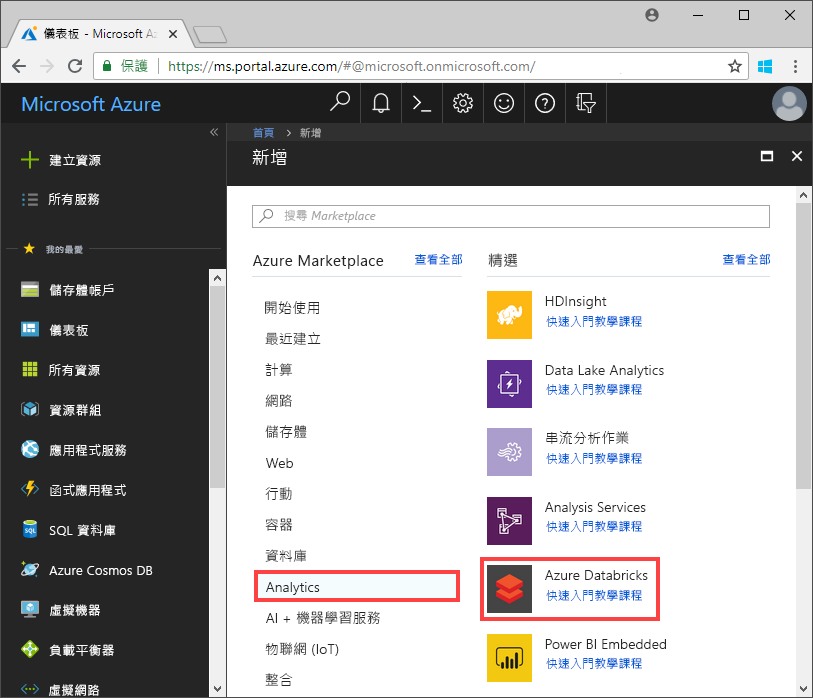
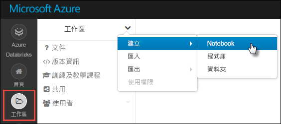

# <a name="tutorial-implement-the-data-lake-capture-pattern-to-update-a-databricks-delta-table"></a>教學課程：實作資料湖擷取模式以更新 Databricks 差異資料表

本教學課程說明如何在具有階層命名空間的儲存體帳戶中處理事件。

您將建置一個小型解決方案，讓使用者藉由上傳說明銷售訂單的逗號分隔值 (csv) 檔案，來填入 Databricks Delta 資料表。 您將在 Azure Databricks 中將事件方格訂用帳戶、Azure 函式和[作業](https://docs.azuredatabricks.net/user-guide/jobs.html)連結在一起，以建置此解決方案。

在本教學課程中，您將：

> [!div class="checklist"]
> * 建立會呼叫 Azure 函式的事件方格訂用帳戶。
> * 建立 Azure 函式，以接收來自事件的通知，然後在 Azure Databricks 中執行作業。
> * 建立 Databricks 作業，以將客戶訂單插入至位於儲存體帳戶中的 Databricks Delta 資料表。

我們會以反向順序建置此解決方案，從 Azure Databricks 工作區開始。

## <a name="prerequisites"></a>必要條件

* 如果您沒有 Azure 訂用帳戶，請在開始前建立[免費帳戶](https://azure.microsoft.com/free/?WT.mc_id=A261C142F) 。

* 建立具有階層命名空間的儲存體帳戶 (Azure Data Lake Storage Gen2)。 本教學課程使用名為 `contosoorders` 的儲存體帳戶。 確定您已對使用者帳戶指派[儲存體 Blob 資料參與者角色](https://docs.microsoft.com/azure/storage/common/storage-auth-aad-rbac)。

  請參閱[建立 Azure Data Lake Storage Gen2 帳戶](data-lake-storage-quickstart-create-account.md)。

* 建立服務主體。 請參閱[如何：使用入口網站來建立可存取資源的 Azure AD 應用程式和服務主體](https://docs.microsoft.com/azure/active-directory/develop/howto-create-service-principal-portal)。

  在執行該文章中的步驟時，您必須執行幾個特定動作。

  :heavy_check_mark:在執行該文章的[將應用程式指派給角色](https://docs.microsoft.com/azure/active-directory/develop/howto-create-service-principal-portal#assign-the-application-to-a-role)一節中的步驟時，請確實將 [儲存體 Blob 資料參與者]  角色指派給服務主體。

  > [!IMPORTANT]
  > 請務必在 Data Lake Storage Gen2 儲存體帳戶的範圍中指派該角色。 您可以將角色指派給父資源群組或訂用帳戶，但在這些角色指派傳播至儲存體帳戶之前，您將會收到與權限有關的錯誤。

  :heavy_check_mark:在執行該文章的[取得值以便登入](https://docs.microsoft.com/azure/active-directory/develop/howto-create-service-principal-portal#get-values-for-signing-in)一節中的步驟時，請將租用戶識別碼、應用程式識別碼和密碼值貼到文字檔中。 您稍後將會用到這些值。

## <a name="create-a-sales-order"></a>建立銷售訂單

首先，建立說明銷售訂單的 csv 檔案，然後將該檔案上傳至儲存體帳戶。 稍後您將使用此檔案中的資料來填入 Databricks Delta 資料表中的第一個資料列。

1. 開啟 [Azure 儲存體總管]。 然後，瀏覽至您的儲存體帳戶，並在 [Blob 容器]  區段中建立名為 **data** 的新容器。

   

   如需關於如何使用儲存體總管的詳細資訊，請參閱[使用 Azure 儲存體總管來管理 Azure Data Lake Storage Gen2 帳戶中的資料](data-lake-storage-explorer.md)。

2. 在 **data** 容器中，建立名為 **input** 的資料夾。

3. 將下列文字貼到文字編輯器中。

   ```
   InvoiceNo,StockCode,Description,Quantity,InvoiceDate,UnitPrice,CustomerID,Country
   536365,85123A,WHITE HANGING HEART T-LIGHT HOLDER,6,12/1/2010 8:26,2.55,17850,United Kingdom
   ```

4. 將此檔案儲存到您的本機電腦，並將其命名為 **data.csv**。

5. 在儲存體總管中，將此檔案上傳至 **input** 資料夾。  

## <a name="create-a-job-in-azure-databricks"></a>在 Azure Databricks 中建立作業

本節中，您將執行下列工作：

* 建立 Azure Databricks 工作區。
* 建立 Notebook。
* 建立並填入 Databricks Delta 資料表。
* 新增將資料列插入 Databricks Delta 資料表中的程式碼。
* 建立作業。

### <a name="create-an-azure-databricks-workspace"></a>建立 Azure Databricks 工作區

在本節中，您會使用 Azure 入口網站建立 Azure Databricks 工作區。

1. 在 Azure 入口網站中，選取 [建立資源]   > [分析]   > [Azure Databricks]  。

    

2. 在 [Azure Databricks 服務]  底下，提供值以建立 Databricks 工作區。

    

    工作區建立需要幾分鐘的時間。 若要監視作業狀態，請檢視頂端的進度列。

### <a name="create-a-spark-cluster-in-databricks"></a>在 Databricks 中建立 Spark 叢集

1. 在 [Azure 入口網站](https://portal.azure.com)中，移至您所建立的 Databricks 工作區，然後選取 [啟動工作區]  。

2. 系統會將您重新導向至 Azure Databricks 入口網站。 在入口網站中，選取 [新增]   > [叢集]  。

    

3. 在 [新增叢集]  頁面上，提供值以建立叢集。

    

    接受下列值以外的所有其他預設值：

    * 輸入叢集的名稱。
    * 務必要選取 [在停止活動 120 分鐘後終止]  核取方塊。 請提供用來終止叢集的叢集未使用持續時間 (以分鐘為單位)。

4. 選取 [建立叢集]  。 叢集在執行後，您就可以將 Notebook 連結至叢集，並執行 Spark 作業。

如需如何建立叢集的詳細資訊，請參閱[在 Azure Databricks 建立 Spark 叢集](https://docs.azuredatabricks.net/user-guide/clusters/create.html)。

### <a name="create-a-notebook"></a>建立 Notebook

1. 在左側窗格中，選取 [工作區]  。 從 [工作區]  下拉式清單選取 [建立]   > [Notebook]  。

    

2. 在 [建立 Notebook]  對話方塊中，輸入 Notebook 的名稱。 選取 [Python]  作為語言，然後選取您先前建立的 Spark 叢集。

    

    選取 [建立]  。

### <a name="create-and-populate-a-databricks-delta-table"></a>建立並填入 Databricks Delta 資料表

1. 在您建立的 Notebook 中，將下列程式碼區塊複製並貼到第一個資料格中，但先不要執行此程式碼。  

   請將此程式碼區塊中的 `appId`、`password` 和 `tenant` 預留位置值取代為您在執行本教學課程的必要條件時所收集到的值。

    ```Python
    dbutils.widgets.text('source_file', "", "Source File")

    spark.conf.set("fs.azure.account.auth.type", "OAuth")
    spark.conf.set("fs.azure.account.oauth.provider.type", "org.apache.hadoop.fs.azurebfs.oauth2.ClientCredsTokenProvider")
    spark.conf.set("fs.azure.account.oauth2.client.id", "<appId>")
    spark.conf.set("fs.azure.account.oauth2.client.secret", "<password>")
    spark.conf.set("fs.azure.account.oauth2.client.endpoint", "https://login.microsoftonline.com/<tenant>/oauth2/token")

    adlsPath = 'abfss://data@contosoorders.dfs.core.windows.net/'
    inputPath = adlsPath + dbutils.widgets.get('source_file')
    customerTablePath = adlsPath + 'delta-tables/customers'
    ```

    此程式碼會建立名為 **source_file** 的小工具。 稍後您將建立一個 Azure 函式，以呼叫此程式碼並將檔案路徑傳至該小工具。  此程式碼也會向儲存體帳戶驗證您的服務主體，並建立一些您將在其他資料格中使用的變數。

    > [!NOTE]
    > 在生產環境設定中，請考慮將驗證金鑰儲存在 Azure Databricks 中。 然後，將查閱索引鍵新增至程式碼區塊，而不是驗證金鑰。 <br><br>例如，您可以使用此程式碼：`spark.conf.set("fs.azure.account.oauth2.client.secret", dbutils.secrets.get(scope = "<scope-name>", key = "<key-name-for-service-credential>"))`，而不是使用下列程式碼：`spark.conf.set("fs.azure.account.oauth2.client.secret", "<password>")`。 <br><br>完成此教學課程之後，請參閱 Azure Databricks 網站上的 [Azure Data Lake Storage Gen2](https://docs.azuredatabricks.net/spark/latest/data-sources/azure/azure-datalake-gen2.html) 一文，以檢視此方法的範例。

2. 按 **SHIFT + ENTER** 鍵以執行此區塊中的程式碼。

3. 將下列程式碼區塊複製並貼到不同的資料格中，然後按 **SHIFT + ENTER** 鍵以執行此區塊中的程式碼。

   ```Python
   from pyspark.sql.types import StructType, StructField, DoubleType, IntegerType, StringType


   inputSchema = StructType([
   StructField("InvoiceNo", IntegerType(), True),
   StructField("StockCode", StringType(), True),
   StructField("Description", StringType(), True),
   StructField("Quantity", IntegerType(), True),
   StructField("InvoiceDate", StringType(), True),
   StructField("UnitPrice", DoubleType(), True),
   StructField("CustomerID", IntegerType(), True),
   StructField("Country", StringType(), True)
   ])

   rawDataDF = (spark.read
    .option("header", "true")
    .schema(inputSchema)
    .csv(adlsPath + 'input')
   )

   (rawDataDF.write
     .mode("overwrite")
     .format("delta")
     .saveAsTable("customer_data", path=customerTablePath))
   ```

   此程式碼會在您的儲存體帳戶中建立 Databricks Delta 資料表，然後從您先前上傳的 csv 檔案載入一些初始資料。

4. 成功執行此程式碼區塊之後，請從您的 Notebook 中移除此程式碼區塊。

### <a name="add-code-that-inserts-rows-into-the-databricks-delta-table"></a>新增將資料列插入 Databricks Delta 資料表中的程式碼

1. 將下列程式碼區塊複製並貼到不同的資料格中，但不要執行此資料格。

   ```Python
   upsertDataDF = (spark
     .read
     .option("header", "true")
     .csv(inputPath)
   )
   upsertDataDF.createOrReplaceTempView("customer_data_to_upsert")
   ```

   此程式碼會使用 csv 檔案中的資料，將資料插入暫存資料表檢視中。 該 csv 檔案的路徑來自於您在先前的步驟中建立的輸入小工具。

2. 新增下列程式碼，以合併暫存資料表檢視與 Databricks Delta 資料表的內容。

   ```
   %sql
   MERGE INTO customer_data cd
   USING customer_data_to_upsert cu
   ON cd.CustomerID = cu.CustomerID
   WHEN MATCHED THEN
     UPDATE SET
       cd.StockCode = cu.StockCode,
       cd.Description = cu.Description,
       cd.InvoiceNo = cu.InvoiceNo,
       cd.Quantity = cu.Quantity,
       cd.InvoiceDate = cu.InvoiceDate,
       cd.UnitPrice = cu.UnitPrice,
       cd.Country = cu.Country
   WHEN NOT MATCHED
     THEN INSERT (InvoiceNo, StockCode, Description, Quantity, InvoiceDate, UnitPrice, CustomerID, Country)
     VALUES (
       cu.InvoiceNo,
       cu.StockCode,
       cu.Description,
       cu.Quantity,
       cu.InvoiceDate,
       cu.UnitPrice,
       cu.CustomerID,
       cu.Country)
   ```

### <a name="create-a-job"></a>建立作業

建立作業以執行您先前建立的 Notebook。 稍後您將建立會在事件引發時執行此作業的 Azure 函式。

1. 按一下 [作業]  。

2. 在 [作業]  頁面上，按一下 [建立作業]  。

3. 為作業指定名稱，然後選擇 `upsert-order-data` 活頁簿。

   

## <a name="create-an-azure-function"></a>建立 Azure 函式

建立執行作業的 Azure 函式。

1. 在 [Databricks] 工作區的右上角選擇 [人員] 圖示，然後選擇 [使用者設定]  。

   

2. 按一下 [產生新的權杖] 按鈕  ，然後按一下[產生]  按鈕。

   請確實將權杖複製到安全的位置。 您的 Azure 函式需要以此權杖向 Databricks 進行驗證，才能執行作業。
  
3. 選取 Azure 入口網站左上角的 [建立資源]  按鈕，然後選取 [計算] > [函式應用程式]  。

   

4. 在函式應用程式的 [建立]  頁面中，請確實選取 [.NET Core]  作為執行階段堆疊，且務必設定 Application Insights 執行階段。

   

5. 在函式應用程式的 [概觀]  頁面中，按一下 [組態]  。

   

6. 在 [應用程式設定]  頁面中，選擇 [新增應用程式設定]  按鈕以新增每項設定。

   

   新增下列設定：

   |設定名稱 | 值 |
   |----|----|
   |**DBX_INSTANCE**| Databricks 工作區的區域。 例如：`westus2.azuredatabricks.net`|
   |**DBX_PAT**| 您先前產生的個人存取權杖。 |
   |**DBX_JOB_ID**|執行中作業的識別碼。 在此案例中，此值為 `1`。|
7. 在函式應用程式的 [概觀] 頁面中，按一下 [新增函式]  按鈕。

   

8. 選擇 [Azure 事件方格觸發程序]  。

   如果系統提示您安裝 **Microsoft.Azure.WebJobs.Extensions.EventGrid** 延伸模組，請加以安裝。 如果需要安裝，您必須再次選擇 [Azure 事件方格觸發程序]  來建立函式。

   [新增函式]  窗格隨即出現。

9. 在 [新增函式]  窗格中，將函式命名為 **UpsertOrder**，然後按一下 [建立]  按鈕。

10. 將程式碼檔案的內容取代為此程式碼，然後按一下 [儲存]  按鈕：

    ```cs
    using "Microsoft.Azure.EventGrid"
    using "Newtonsoft.Json"
    using Microsoft.Azure.EventGrid.Models;
    using Newtonsoft.Json;
    using Newtonsoft.Json.Linq;

    private static HttpClient httpClient = new HttpClient();

    public static async Task Run(EventGridEvent eventGridEvent, ILogger log)
    {
        log.LogInformation("Event Subject: " + eventGridEvent.Subject);
        log.LogInformation("Event Topic: " + eventGridEvent.Topic);
        log.LogInformation("Event Type: " + eventGridEvent.EventType);
        log.LogInformation(eventGridEvent.Data.ToString());

        if (eventGridEvent.EventType == "Microsoft.Storage.BlobCreated" | | eventGridEvent.EventType == "Microsoft.Storage.FileRenamed") {
            var fileData = ((JObject)(eventGridEvent.Data)).ToObject<StorageBlobCreatedEventData>();
            if (fileData.Api == "FlushWithClose") {
                log.LogInformation("Triggering Databricks Job for file: " + fileData.Url);
                var fileUrl = new Uri(fileData.Url);
                var httpRequestMessage = new HttpRequestMessage {
                    Method = HttpMethod.Post,
                    RequestUri = new Uri(String.Format("https://{0}/api/2.0/jobs/run-now", System.Environment.GetEnvironmentVariable("DBX_INSTANCE", EnvironmentVariableTarget.Process))),
                    Headers = {
                        { System.Net.HttpRequestHeader.Authorization.ToString(), "Bearer " +  System.Environment.GetEnvironmentVariable ("DBX_PAT", EnvironmentVariableTarget.Process)},
                        { System.Net.HttpRequestHeader.ContentType.ToString (), "application/json" }
                    },
                    Content = new StringContent(JsonConvert.SerializeObject(new {
                        job_id = System.Environment.GetEnvironmentVariable ("DBX_JOB_ID", EnvironmentVariableTarget.Process) ,
                        notebook_params = new {
                            source_file = String.Join("", fileUrl.Segments.Skip(2))
                        }
                    }))
                 };
                var response = await httpClient.SendAsync(httpRequestMessage);
                response.EnsureSuccessStatusCode();
            }
        }
    }
    ```

   此程式碼會剖析所引發之儲存體事件的相關資訊，然後使用觸發事件之檔案的 URL 來建立要求訊息。 函式會將訊息中的值傳至您先前建立的 **source_file** 小工具。 函式程式碼會將訊息傳送至 Databricks 作業，並使用您先前取得的權杖作為驗證。

## <a name="create-an-event-grid-subscription"></a>建立事件格線訂用帳戶

在本節中，您將建立事件方格訂用帳戶，以在檔案上傳至儲存體帳戶時呼叫 Azure 函式。

1. 在 [函式程式碼] 頁面上，按一下 [新增事件方格訂用帳戶]  按鈕。

   

2. 在 [建立事件訂用帳戶]  頁面中為訂用帳戶命名，然後使用頁面中的欄位選取您的儲存體帳戶。

   

3. 在 [篩選至事件類型]  下拉式清單中，選取 [已建立的 Blob]  和 [已刪除的 Blob]  事件，然後按一下 [建立]  按鈕。

## <a name="test-the-event-grid-subscription"></a>測試事件方格訂用帳戶

1. 建立名為 `customer-order.csv` 的檔案，將下列資訊貼到該檔案中，並將檔案儲存到您的本機電腦。

   ```
   InvoiceNo,StockCode,Description,Quantity,InvoiceDate,UnitPrice,CustomerID,Country
   536371,99999,EverGlow Single,228,1/1/2018 9:01,33.85,20993,Sierra Leone
   ```

2. 在儲存體總管中，將此檔案上傳至儲存體帳戶的 **input** 資料夾。

   上傳檔案會引發 **Microsoft.Storage.BlobCreated** 事件。 事件方格會通知所有訂閱者有該事件。 在此案例中，Azure 函式是唯一的訂閱者。 Azure 函式會剖析事件參數，以判斷發生的事件。 然後，它會將檔案的 URL 傳至 Databricks 作業。 Databricks 作業會讀取檔案，並將資料列新增至位於您儲存體帳戶的 Databricks Delta 資料表。

3. 若要檢查作業是否成功，請開啟您的 Databricks 工作區，按一下 [作業]  按鈕，然後開啟您的作業。

4. 選取作業以開啟 [作業] 頁面。

   

   當作業完成時，您會看到完成狀態。

   

5. 在新的活頁簿資料格中，在資料格中執行此查詢，以查看更新的差異資料表。

   ```
   %sql select * from customer_data
   ```

   傳回的資料表會顯示最新的記錄。

   

6. 若要更新此記錄，請建立名為 `customer-order-update.csv` 的檔案，將下列資訊貼到該檔案中，並將檔案儲存到您的本機電腦。

   ```
   InvoiceNo,StockCode,Description,Quantity,InvoiceDate,UnitPrice,CustomerID,Country
   536371,99999,EverGlow Single,22,1/1/2018 9:01,33.85,20993,Sierra Leone
   ```

   此 csv 檔案與前一個檔案幾乎完全相同，但訂單的數量已從 `228` 變更為 `22`。

7. 在儲存體總管中，將此檔案上傳至儲存體帳戶的 **input** 資料夾。

8. 再次執行 `select` 查詢，以查看更新的差異資料表。

   ```
   %sql select * from customer_data
   ```

   傳回的資料表會顯示更新的記錄。

   

## <a name="clean-up-resources"></a>清除資源

當已不再需要資源時，請刪除資源群組及所有相關資源。 若要這麼做，請選取儲存體帳戶的資源群組，然後選取 [刪除]  。

## <a name="next-steps"></a>後續步驟

> [!div class="nextstepaction"]
> [回應 Blob 儲存體事件](storage-blob-event-overview.md)
