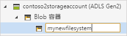

# 快速入門：使用 Azure 儲存體總管來管理 Azure Data Lake Storage Gen2 帳戶中的資料

在本快速入門中，您將了解如何使用 [Azure 儲存體總管](https://azure.microsoft.com/features/storage-explorer/)建立目錄和 Blob。 接下來您會了解如何將 Blob 下載到本機電腦，以及如何檢視目錄中的所有 Blob。 您也將了解如何建立 Blob 的快照集、管理目錄存取原則，以及建立共用的存取簽章。

## 必要條件

[!INCLUDE [storage-quickstart-prereq-include](../../../includes/storage-quickstart-prereq-include.md)]

本快速入門會要求您安裝 Azure 儲存體總管。 若要安裝適用於 Windows、Macintosh 或 Linux 的 Azure 儲存體總管，請參閱 [Azure 儲存體總管](https://azure.microsoft.com/features/storage-explorer/)。

## 登入儲存體總管

第一次啟動時，會顯示 [Microsoft Azure 儲存體總管 - 連線] 視窗。 雖然儲存體總管提供數種方式可連線到儲存體帳戶，但目前只有一種方式支援管理 ACL。

|Task|目的|
|---|---|
|新增 Azure 帳戶 | 將您重新導向至貴組織的登入頁面，向 Azure 進行驗證。 如果想要管理及設定 ACL，這是目前唯一支援的驗證方法。 |

選取 [新增 Azure 帳戶]，然後按一下 [登入]。遵循螢幕上的提示來登入 Azure 帳戶。

![[Microsoft Azure 儲存體總管 - 連線] 視窗](media/storage-quickstart-blobs-storage-explorer/connect.png)

完成連線時，會載入 Azure 儲存體總管，並顯示 [總管] 索引標籤。 這個檢視可讓您深入了解您所有的 Azure 儲存體帳戶，以及透過 [Azure 儲存體模擬器](../common/storage-use-emulator.md?toc=%2fazure%2fstorage%2fblobs%2ftoc.json)、[Cosmos DB](../../cosmos-db/storage-explorer.md?toc=%2fazure%2fstorage%2fblobs%2ftoc.json) 帳戶或 [Azure Stack](/azure-stack/user/azure-stack-storage-connect-se?toc=%2fazure%2fstorage%2fblobs%2ftoc.json) 環境設定的本機儲存體。

![[Microsoft Azure 儲存體總管 - 連線] 視窗](media/storage-quickstart-blobs-storage-explorer/mainpage.png)

## 建立檔案系統

Blob 一律會上傳到目錄中。 這可讓您組織 Blob 群組，就像在電腦的資料夾中組織檔案一樣。

若要建立目錄，請展開您在後續步驟中建立的儲存體帳戶。 選取 [Blob 容器]，然後以滑鼠右鍵按一下並選取 [建立 Blob 容器]。 輸入檔案系統的名稱。 完成時，按 **Enter** 即可建立檔案系統。 一旦成功建立 blob 目錄後，它就會顯示在所選儲存體帳戶的 [Blob 容器] 資料夾底下。

## 將 Blob 上傳到目錄

Blob 儲存體支援區塊 Blob、附加 Blob 和分頁 Blob。 用來備份 IaaS VM 的 VHD 檔案是分頁 Blob。 附加 Blob 用於記錄，例如當您想要寫入檔案，並繼續新增更多資訊時。 儲存在 Blob 儲存體中的大部分檔案都是區塊 Blob。

在目錄功能區中，選取 [上傳]。 這項作業可讓您選擇上傳資料夾或檔案。

選擇要上傳的檔案或資料夾。 選取 [blob 類型]。 可接受的選項為 [附加]、[頁面] 或 [區塊] blob。

如果要上傳 .vhd 或 .vhdx 檔案，請選擇 [上傳 .vhd/.vhdx 檔案作為分頁 Blob (建議選項)]。

在 [上傳到資料夾 (選擇性)] 欄位中，儲存檔案的資料夾名稱，或是目錄下資料夾中的資料夾。 如果未選擇任何資料夾，會直接將檔案上傳至目錄底下。

當您選取 [確定] 時，所選取的檔案會排入要上傳的佇列中，每個檔案都會上傳。 上傳完成時，結果會顯示在 [活動] 視窗。

## 檢視目錄中的 Blob

在 [Azure 儲存體總管] 應用程式中，選取儲存體帳戶底下的目錄。 主窗格會顯示所選目錄中的 blob 清單。

## 下載 Blob

若要使用 **Azure 儲存體總管**下載 blob，並選取 blob，請從功能區中選取 [下載]。 檔案對話方塊隨即開啟，讓您可以輸入檔案名稱。 選取 [儲存] 可開始將 blob 下載到本機位置。

## 後續步驟

在本快速入門中，您已了解如何使用 **Azure 儲存體總管**在本機磁碟和 Azure Blob 儲存體之間傳輸檔案。 若要深入了解如何在您的檔案和目錄上設定 ACL，請繼續參閱和此主題有關的操作說明。

> [!div class="nextstepaction"]
> [如何在檔案和目錄上設定 ACL](data-lake-storage-how-to-set-permissions-storage-explorer.md)
