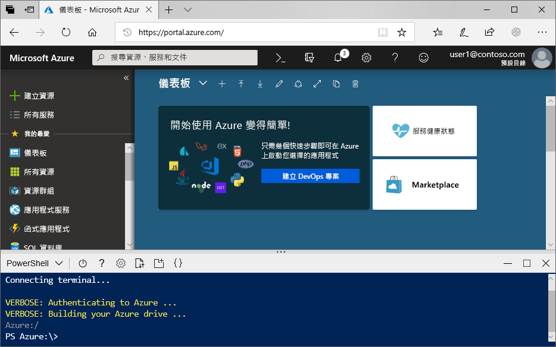

# <a name="create-an-azure-data-lake-storage-gen2-storage-account"></a>建立 Azure Data Lake Storage Gen2 儲存體帳戶

Azure Data Lake Storage Gen2 [支援階層命名空間](data-lake-storage-introduction.md)，其提供專門打造的原生目錄型容器，可與 Hadoop 分散式檔案系統 (HDFS) 搭配運作。 透過 [ABFS 驅動程式](data-lake-storage-abfs-driver.md)即可從 HDFS 存取 Data Lake Storage Gen2 資料。

This article demonstrates how to create an account using the Azure portal, Azure PowerShell, or via the Azure CLI.

## <a name="prerequisites"></a>必要條件

如果您沒有 Azure 訂用帳戶，請在開始前建立[免費帳戶](https://azure.microsoft.com/free/)。 

|           | 先決條件 |
|-----------|--------------|
|入口網站     | None         |
|PowerShell | This article requires the PowerShell module Az.Storage version **0.7** or later. 請執行 `Get-Module -ListAvailable Az.Storage` 命令來了解您目前使用的版本。 如果您執行此命令之後，沒有顯示任何結果，或如果顯示 **0.7** 以下的其他版本，表示您的 powershell 模組必須升級。 請參閱本指南[升級您的 powershell 模組](#upgrade-your-powershell-module)一節。
|CLI        | 您可以登入 Azure，並且以下列兩種方式之一執行 Azure CLI 命令： <ul><li>您可以從 Azure 入口網站，在 Azure Cloud Shell 中執行 CLI 命令 </li><li>您可以安裝 CLI，並在本機執行 CLI 命令</li></ul>|

在命令列上工作時，您可以選擇執行 Azure Cloud Shell 或在本機安裝 CLI。

### <a name="use-azure-cloud-shell"></a>使用 Azure Cloud Shell

Azure Cloud Shell 是免費的 Bash Shell，您可以直接在 Azure 入口網站內執行。 它具有預先安裝和設定的 Azure CLI，可與您的帳戶搭配使用。 按一下 Azure 入口網站右上方功能表上的 [Cloud Shell] 按鈕：

[](https://portal.azure.com)

The button launches an interactive shell that you can use to run the steps in this article:

[](https://portal.azure.com)

### <a name="install-the-cli-locally"></a>在本機安裝 CLI

您也可以在本機安裝及使用 Azure CLI。 This article requires that you are running the Azure CLI version 2.0.38 or later. 執行 `az --version` 找出版本。 如果您需要安裝或升級，請參閱[安裝 Azure CLI](/cli/azure/install-azure-cli)。

## <a name="create-a-storage-account-with-azure-data-lake-storage-gen2-enabled"></a>建立啟用 Azure Data Lake Storage Gen2 的儲存體帳戶

Azure 儲存體帳戶包含您所有的 Azure 儲存體資料物件：Blob、檔案、佇列、資料表和磁碟。 The storage account provides a unique namespace for your Azure Storage data that is accessible from anywhere in the world over HTTP or HTTPS. Data in your Azure storage account is durable and highly available, secure, and massively scalable.

> [!NOTE]
> 您必須建立 **StorageV2 (general-purpose V2)** 類型的新儲存體帳戶，才能利用 Data Lake Storage Gen2 功能。  

如需儲存體帳戶的詳細資訊，請參閱 [Azure 儲存體帳戶概觀](../common/storage-account-overview.md)。

## <a name="create-an-account-using-the-azure-portal"></a>使用 Azure 入口網站建立帳戶

登入 [Azure 入口網站](https://portal.azure.com)。

### <a name="create-a-storage-account"></a>建立儲存體帳戶

每個儲存體帳戶都必須屬於 Azure 資源群組。 資源群組是用來群組 Azure 服務的邏輯容器。 當您建立儲存體帳戶時，可以選擇建立新的資源群組，或使用現有的資源群組。 This article shows how to create a new resource group.

若要在 Azure 入口網站中建立一般用途 v2 儲存體帳戶，請遵循下列步驟：

> [!NOTE]
> 階層命名空間目前可在所有公用區域中使用。

1. 選擇您要在其中建立儲存體帳戶的訂用帳戶。
2. In the Azure portal, choose the **Create a resource** button, then choose **Storage account**.
3. 在 [資源群組] 欄位下方，選取 [新建]。 為新的資源群組輸入名稱。
   
   資源群組是用來群組 Azure 服務的邏輯容器。 當您建立儲存體帳戶時，可以選擇建立新的資源群組，或使用現有的資源群組。

4. 接下來，輸入儲存體帳戶的名稱。 您所選擇的名稱在整個 Azure 中必須是唯一的。 名稱的長度必須介於 3 到 24 個字元之間，且只能包含數字和小寫字母。
5. 選擇位置。
6. Make sure that **StorageV2 (general purpose v2)** appears as selected in the **Account kind** drop-down list.
7. Optionally change the values in each of these fields: **Performance**, **Replication**, **Access tier**. To learn more about these options, see [Introduction to Azure Storage](https://docs.microsoft.com/azure/storage/common/storage-introduction#azure-storage-services).
8. Choose the **Advanced** tab.
10. 在 [Data Lake Storage Gen2] 區段中，將 [階層式命名空間] 設定為 [啟用]。
11. 按一下 [檢閱及建立] 建立儲存體帳戶。

系統現在會透過入口網站建立儲存體帳戶。

### <a name="clean-up-resources"></a>清除資源

若要使用 Azure 入口網站刪除資源群組：

1. 在 Azure 入口網站中，展開左側功能表以開啟服務的功能表，然後選擇 [資源群組] 以顯示資源群組的清單。
2. 找出要刪除的資源群組，以滑鼠右鍵按一下清單右側的 [更多] 按鈕 ( **...** )。
3. 選取 [刪除資源群組] 並且確認。

## <a name="create-an-account-using-powershell"></a>使用 PowerShell 建立帳戶

安裝最新版的 [PowerShellGet](/powershell/scripting/gallery/installing-psget) 模組。

然後升級您的 powershell 模組、登入您的 Azure 訂用帳戶、建立資源群組，然後建立儲存體帳戶。

### <a name="upgrade-your-powershell-module"></a>升級 PowerShell 模組

[!INCLUDE [updated-for-az](../../../includes/updated-for-az.md)]

若要使用 PowerShell 和 Data Lake Storage Gen2 互動，需要安裝模組 Az.Storage **0.7** 版或更新版本。

從以提高的權限開啟 PowerShell 工作階段作為開始。

安裝 Az.Storage 模組

```powershell
Install-Module Az.Storage -Repository PSGallery -AllowClobber -Force
```

### <a name="sign-in-to-your-azure-subscription"></a>登入您的 Azure 訂用帳戶

請使用 `Login-AzAccount` 命令並遵循畫面上的指示進行驗證。

```powershell
Login-AzAccount
```

### <a name="create-a-resource-group"></a>建立資源群組

若要使用 PowerShell 建立新的資源群組，請使用 [New-AzResourceGroup](/powershell/module/az.resources/new-azresourcegroup) 命令： 

> [!NOTE]
> 階層命名空間目前可在所有公用區域中使用。

```powershell
# put resource group in a variable so you can use the same group name going forward,
# without hardcoding it repeatedly
$resourceGroup = "storage-quickstart-resource-group"
$location = "westus2"
New-AzResourceGroup -Name $resourceGroup -Location $location
```

### <a name="create-a-general-purpose-v2-storage-account"></a>建立一般用途的 v2 儲存體帳戶

若要從 PowerShell 建立具有本地備援儲存體 (LRS) 的一般用途 v2 儲存體帳戶，請使用 [New-AzStorageAccount](/powershell/module/az.storage/New-azStorageAccount) 命令：

```powershell
$location = "westus2"

New-AzStorageAccount -ResourceGroupName $resourceGroup `
  -Name "storagequickstart" `
  -Location $location `
  -SkuName Standard_LRS `
  -Kind StorageV2 `
  -EnableHierarchicalNamespace $True
```

### <a name="clean-up-resources"></a>清除資源

若要移除資源群組及其相關聯的資源，包括新的儲存體帳戶，請使用 [Remove-AzResourceGroup](/powershell/module/az.resources/remove-azresourcegroup) 命令： 

```powershell
Remove-AzResourceGroup -Name $resourceGroup
```

## <a name="create-an-account-using-azure-cli"></a>使用 Azure CLI 建立帳戶

若要啟動 Azure Cloud Shell，請登入 [Azure 入口網站](https://portal.azure.com)。

若想要登入您的本機安裝 CLI，請執行登入命令：

```cli
az login
```

### <a name="add-the-cli-extension-for-azure-data-lake-gen-2"></a>新增 Azure Data Lake Gen 2 的 CLI 擴充功能

若要透過 CLI 與 Data Lake Storage Gen2 互動，必須在殼層中新增擴充功能。

若要這樣做，請使用 Cloud Shell 或本機殼層輸入以下命令：`az extension add --name storage-preview`

### <a name="create-a-resource-group"></a>建立資源群組

若要使用 Azure CLI 建立新的資源群組，請使用 [az group create](/cli/azure/group) 命令。

```azurecli-interactive
az group create `
    --name storage-quickstart-resource-group `
    --location westus2
```

> [!NOTE]
> > 階層命名空間目前可在所有公用區域中使用。

### <a name="create-a-general-purpose-v2-storage-account"></a>建立一般用途的 v2 儲存體帳戶

若要從 Azure CLI 建立具有本地備援儲存體的一般用途 v2 儲存體帳戶，請使用 [az storage account create](/cli/azure/storage/account) 命令。

```azurecli-interactive
az storage account create `
    --name storagequickstart `
    --resource-group storage-quickstart-resource-group `
    --location westus2 `
    --sku Standard_LRS `
    --kind StorageV2 `
    --hierarchical-namespace true
```

### <a name="clean-up-resources"></a>清除資源

若要移除資源群組及其相關聯的資源，包括新的儲存體帳戶，請使用 [az group delete](/cli/azure/group) 命令。

```azurecli-interactive
az group delete --name myResourceGroup
```

## <a name="next-steps"></a>後續步驟

In this article, you've created a storage account with Data Lake Storage Gen2 capabilities. 若要了解如何在您的儲存體帳戶中上傳和下載 Blob，請參閱以下主題。

* [AzCopy V10](https://docs.microsoft.com/azure/storage/common/storage-use-azcopy-v10?toc=%2fazure%2fstorage%2fblobs%2ftoc.json)
