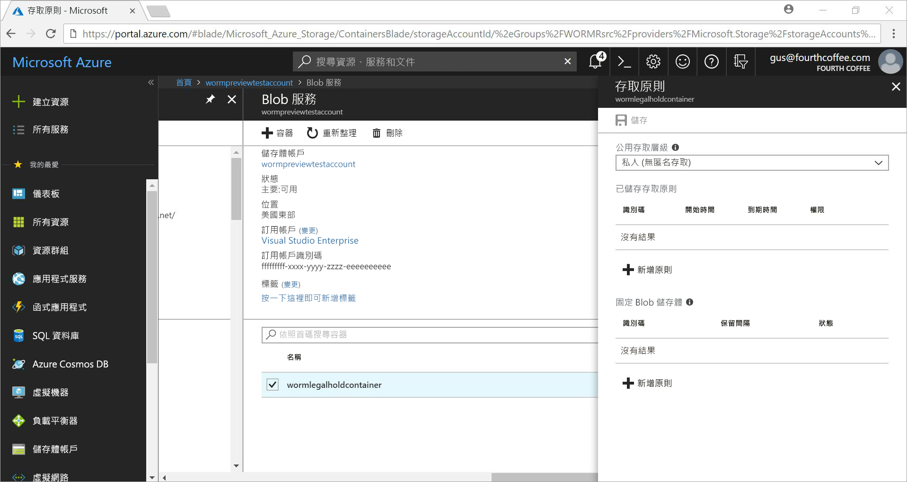

# <a name="store-business-critical-data-in-azure-blob-storage"></a>在 Azure Blob 儲存體中儲存業務關鍵資料

Azure Blob (物件) 的固定儲存體可讓使用者以 WORM (一次寫入，多次讀取) 狀態儲存業務關鍵資料。 此狀態讓資料在使用者指定的間隔內不可清除，也不可修改。 在保留間隔的持續期間內，可以建立和讀取 Blob，但無法加以修改或刪除。

## <a name="overview"></a>概觀

固定儲存體可協助金融機構及相關產業 - 特別是經紀自營組織 - 安全地儲存資料。 它也可以運用在任何案例中，以保護重要資料不被刪除。  

典型應用包括：

- **法規遵循**：Azure Blob 儲存體的固定儲存體可協助組織處理 SEC 17a-4(f)、CFTC 1.31(d)、FINRA 和其他法規。

- **安全文件保留**：Blob 儲存體服務會確保任何使用者都無法修改或刪除資料，包括具有系統管理權限的帳戶。

- **合法保存**：Azure Blob 儲存體的固定儲存體可讓使用者在所需的持續期間內，以防篡改的狀態儲存對訴訟或刑事偵察很重要的敏感性資訊。

固定儲存體能夠：

- **以時間為基礎的保留原則支援：** 使用者會設定一些原則，以在指定的間隔內儲存資料。

- **合法保存原則支援：** 若不知道保留間隔，使用者可以設定合法保存來永久儲存資料，直到清除合法保存為止。  設定合法保存後，可以建立和讀取 Blob，但無法加以修改或刪除。 每項合法保存都會與作為辨識字串 (例如案例識別碼) 的使用者定義英數字元標記相關聯。

- **所有 Blob 層都支援：** WORM 原則與 Azure Blob 儲存層無關，而且會套用至所有層：經常性存取層、非經常性存取層和封存存取層。 使用者可以將資料轉換到其工作負載的成本最佳化層中，同時維護資料不變性。

- **容器層級組態**：使用者可以在容器層級設定以時間為基礎的保留原則和合法保存標記。 使用簡單的容器層級設定，使用者可以建立及鎖定以時間為基礎的保留原則、延長保留間隔、設定和清除法務保存措施等。 這些原則會套用到現有和新容器中的所有 Blob。

- **稽核記錄支援**：每個容器都包含一個稽核記錄。 其針對以時間為基礎的鎖定保留原則，最多顯示五個以時間為基礎的保留命令，而保留間隔延長最多三個記錄。 針對以時間為基礎的保留，此記錄包含使用者 ID、命令類型、時間戳記及保留間隔。 針對合法保存，此記錄包含使用者識別碼、命令類型、時間戳記及合法保存標記。 依據 SEC 17a-4(f) 法規指導方針，在容器的存留時間內會保留此記錄。 [Azure 活動記錄](https://docs.microsoft.com/azure/monitoring-and-diagnostics/monitoring-overview-activity-logs)會顯示所有控制平面活動的更詳盡記錄。 基於法規需求或其他目的，使用者有責任持續不斷地儲存那些記錄。

固定儲存體已在所有 Azure 公用區域中啟用。

## <a name="how-it-works"></a>運作方式

Azure Blob 儲存體的固定儲存體支援兩種 WORM 或固定原則：以時間為基礎的保留和合法保存。 如需如何建立這些固定原則的詳細資訊，請參閱[使用者入門](#Getting-started)一節。

當容器套用以時間為基礎的保留原則或合法保存時，所有現有的 Blob 都會移至固定 (防寫和防刪保護) 狀態。 所有上傳到容器的新 Blob 也會移至固定狀態。

> [!IMPORTANT]
> 對於即將處於固定 (防寫和防刪保護) 狀態的 Blob 而言，以時間為基礎的保留原則必須「鎖定」，才能符合 SEC 17a-4(f) 和其他法規。 建議您在合理的時間 (通常為 24 小時) 內鎖定原則。 我們不建議對短期功能試用以外的其他任何用途，使用「未鎖定」狀態。

若在容器上套用以時間為基礎的保留原則，在「有效」保留期限內，容器中的所有 Blob 都會保持固定狀態。 現有 Blob 的有效保留期限等於 Blob 建立時間與使用者指定保留間隔之間的差異。

若為新的 Blob，有效保留期限等於使用者指定的保留間隔。 因為使用者可以延長保留間隔，所以固定儲存體會使用使用者所指定保留間隔的最新值，計算有效的保留期限。

> [!TIP]
> 範例：
>
> 使用者建立以時間為基礎的保留原則，其保留間隔為五年。
>
> 該容器中現有的 Blob (testblob1) 建立於一年前。 testblob1 的有效保留期限為 4 年。
>
> 新的 Blob (testblob2) 現在已上傳到容器。 這個新 Blob 的有效保留期限為 5 年。

### <a name="legal-holds"></a>合法保存

當您設定合法保存時，所有現有和新的 Blob 都會保持固狀態，直到清除合法保存為止。 如需有關如何設定和清除合法保存的詳細資訊，請參閱[使用者入門](#Getting-started)。

一個容器可以同時具有合法保存和以時間為基礎的保留原則。 該容器中的所有 Blob 都會保持固定狀態，直到所有合法保存都遭到清除為止 (即使其有效保留期限已過期)。 相反地，Blob 會保持固定狀態，直到有效保留週期到期為止 (即使已清除所有合法保存)。

下表顯示會針對不同固定案例停用的 Blob 作業類型。 如需詳細資訊，請參閱 [Azure Blob 服務 API](https://docs.microsoft.com/rest/api/storageservices/blob-service-rest-api)文件。

|案例  |Blob 狀態  |不允許 Blob 作業  |
|---------|---------|---------|
|Blob 上的有效保留間隔尚未過期及/或已設定合法保存     |固定：防刪與防寫保護         |刪除容器、刪除 Blob、放置 Blob<sup>1</sup>、放置區塊<sup>1</sup>、放置區塊清單<sup>1</sup>、設定 Blob 中繼資料、放置分頁、設定 Blob 屬性、快照集 Blob、累加複製 Blob、附加區塊         |
|Blob 上的有效保留間隔已過期     |僅限防寫保護 (允許刪除作業)         |放置 Blob<sup>1</sup>、放置區塊<sup>1</sup>、放置區塊清單<sup>1</sup>、設定 Blob 中繼資料、放置分頁、設定 Blob 屬性、快照集 Blob、累加複製 Blob、附加區塊         |
|所有合法保存都已清除，且容器上未設定任何以時間為基礎的保留原則     |可變動         |None         |
|未建立任何 WORM 原則 (以時間為基礎的保留或合法保存)     |可變動         |None         |

<sup>1</sup> 應用程式可能會呼叫此作業來建立 Blob 一次。 不允許 Blob 上所有後續的作業。

> [!NOTE]
>
> 固定儲存體只適用於一般用途 V2 和 Blob 儲存體帳戶。 該帳戶必須透過 [Azure Resource Manager](https://docs.microsoft.com/azure/azure-resource-manager/resource-group-overview) 建立。

## <a name="pricing"></a>定價

使用此功能不需額外付費。 固定資料的定價方式與一般可變動的資料相同。 如需 Azure Blob 儲存體定價的詳細資料，請參閱 [Azure 儲存體定價頁面](https://azure.microsoft.com/pricing/details/storage/blobs/)。


## <a name="getting-started"></a>開始使用

最新版的 [Azure 入口網站](http://portal.azure.com)、[Azure CLI](https://docs.microsoft.com/cli/azure/install-azure-cli?view=azure-cli-latest) 與 [Azure PowerShell](https://github.com/Azure/azure-powershell/releases/tag/Azure.Storage.v4.4.0-preview-May2018) 預覽版都支援 Azure Blob 儲存體的固定儲存體。

### <a name="azure-portal"></a>Azure 入口網站

1. 建立新的容器或選取現有容器，以儲存必須保持固定狀態的 Blob。
 容器必須位於 GPv2 或 Blob 儲存體帳戶中。
2. 在容器設定中選取 [存取原則]。 然後選取 [固定 blob 儲存體] 之下的 [+ 新增原則]。

    

3. 若要啟用以時間為基礎的保留，請從下拉式功能表中選取 [以時間為基礎的保留]。

    ![在 [原則類型] 下選取的 [以時間為基礎的保留]](media/storage-blob-immutable-storage/portal-image-2.png)

4. 輸入保留間隔天數 (最小值為一天)。

    ![[更新保留期限] 方塊](media/storage-blob-immutable-storage/portal-image-5-retention-interval.png)

    如您在螢幕擷取畫面中所見，原則的初始狀態為未鎖定。 您可以較小的保留間隔測試此功能，並且在鎖定原則之前進行變更。 若要符合 SEC 17a-4 等法規，鎖定是不可或缺的。

5. 鎖定原則。 以滑鼠右鍵按一下省略符號 (**...**)，下列功能表隨即出現：

    ![功能表上的 [鎖定原則]](media/storage-blob-immutable-storage/portal-image-4-lock-policy.png)

    選取 [鎖定原則]，原則狀態現在會顯示為鎖定。 鎖定原則之後，便無法加以刪除，只允許延長保留間隔。

6. 若要啟用合法保存，請選取 [+ 新增原則]。 從下拉式功能表中選取 [合法保存]。

    ![在功能表上 [原則類型] 之下的 [合法保存]](media/storage-blob-immutable-storage/portal-image-legal-hold-selection-7.png)

7. 建立具有一或多個標記的合法保存。

    ![原則類型之下的 [標記名稱] 方塊](media/storage-blob-immutable-storage/portal-image-set-legal-hold-tags.png)

8. 若要清除法務保存措施，只需移除標記即可。

### <a name="azure-cli"></a>Azure CLI

此功能包含在下列命令群組中：`az storage container immutability-policy` 和 `az storage container legal-hold`。 在其上執行 `-h` 來查看命令。

### <a name="powershell"></a>PowerShell

[PowerShell 版本 4.4.0-preview](https://github.com/Azure/azure-powershell/releases/tag/Azure.Storage.v4.4.0-preview-May20180) 支援固定儲存體。
若要啟用此功能，請依照下列步驟執行：

1. 確定您已安裝最新版的 PowerShellGet：`Install-Module PowerShellGet –Repository PSGallery –Force`。
2. 移除任何先前安裝的 Azure PowerShell。
3. 安裝 AzureRM：`Install-Module AzureRM –Repository PSGallery –AllowClobber`。 同樣可以從這個存放庫安裝 Azure。
4. 安裝預覽版本的儲存體管理平面 Cmdlet：`Install-Module -Name AzureRM.Storage -AllowPrerelease -Repository PSGallery -AllowClobber`。

本文後面的 [PowerShell 範例程式碼](#sample-powershell-code)一節會說明功能使用情況。

## <a name="client-libraries"></a>用戶端程式庫

下列用戶端程式庫支援適用於 Azure Blob 儲存體的固定儲存體：

- [.NET 用戶端程式庫版本 7.2.0-preview 和更新版本](https://www.nuget.org/packages/Microsoft.Azure.Management.Storage/7.2.0-preview)
- [Node.js 用戶端程式庫 4.0.0 版和更新版本](https://www.npmjs.com/package/azure-arm-storage)
- [Python 用戶端程式庫 2.0.0 候選版 2 和更新版本](https://pypi.org/project/azure-mgmt-storage/2.0.0rc2/)
- [Java 用戶端程式庫](https://github.com/Azure/azure-rest-api-specs/tree/master/specification/storage/resource-manager/Microsoft.Storage/preview/2018-03-01-preview)

## <a name="supported-values"></a>支援的值

- 最小保留間隔是一天。 最大值為 400 年。
- 若為儲存體帳戶，已鎖定固定原則的容器數目上限為 1,000。
- 若為儲存體帳戶，具有合法保存設定的容器數目上限為 1,000。
- 若為容器，合法保存標記數目上限為 10。
- 合法保存標記的最大長度為 23 個英數字元。 最小長度為三個字元。
- 若為容器，鎖定固定原則的允許保留間隔延長的數目上限為 3。
- 若為具有鎖定固定原則的容器，容器的持續期間內最多保留五個以時間為基礎的保留原則記錄和最多 10 個合法保存原則記錄。

## <a name="faq"></a>常見問題集

**此功能只適用於區塊 Blob，或者也適用於分頁和附加 Blob？**

固定儲存體可以與任何 Blob 類型一起使用，但我們建議您大部分將其用於區塊 Blob。 不同於區塊 Blob，分頁 Blob 和附加 Blob 必須在 WORM 容器外部建立，然後再複製到其中。 將這些 blob 複製到 WORM 容器後，便無法進一步對附加 Blob 進行「附加」或變更分頁 Blob。

**一定要建立新的儲存體帳戶才能使用此功能嗎？**

您可以將固定儲存體與任何現有或新建立的一般用途 V2 或 Blob 儲存體帳戶一起使用。 此功能只適用於 Blob 儲存體。

**如果我嘗試刪除的容器具有以時間為基礎的「鎖定」保留原則或合法保存，則會發生什麼事？**

如果有至少一個 Blob 具有鎖定的時間型保留原則或法務保存措施，則「刪除容器」作業會失敗。 只有在沒有任何 Blob 具有有效的保留間隔，而且沒有法務保存措施時，「刪除容器」作業才會成功。 您必須先刪除 Blob，才可以刪除容器。

**如果我嘗試刪除的儲存體帳戶具有 WORM 帳戶，且該帳戶具有以時間為基礎的「鎖定」保留原則或合法保存，則會發生什麼事？**

如果有至少一個 WORM 容器具有合法保存或有一個 Blob 具有有效保留間隔，則儲存體帳戶刪除作業會失敗。  您必須先刪除所有 WORM 容器，才能刪除儲存體帳戶。 如需有關容器刪除的資訊，請參閱前面的問題。

**當 Blob 處於固定狀態時，我可以跨越不同 Blob 層 (經常性存取層、非經常性存取層、冷門存取層) 移動資料嗎？**

是，您可以使用設定 Blob 層命令跨越 Blob 層移動資料，同時讓資料保持固定狀態。 Blob 經常性存取層、非經常性存取層和封存存取層都支援固定儲存體。

**如果我付款失敗，而保留間隔尚未過期，則會發生什麼事？**

如果未付款，則會依照您與 Microsoft 簽訂的合約條款與條件規定，套用一般資料保留原則。

**您是否提供試用此功能的試用版或寬限期？**

是。 第一次建立以時間為基礎的保留原則時，它會處於「未鎖定」狀態。 在此狀態中，您可以對保留間隔進行任何所需的變更，例如增加或減少保留間隔，甚至刪除原則。 鎖定原則之後，就會永遠保持「鎖定」狀態而無法刪除。 此外，鎖定原則後，便無法再縮短保留間隔。 我們強烈建議僅將「未鎖定」狀態使用於試用目的，並且在 24 小時期間內鎖定原則。 這些做法可協助您符合 SEC 17a-4(f) 和其他法規。

**此功能是否適用於國家雲和政府雲？**

固定儲存體目前僅適用於 Azure 公用區域。 如果您對特定國家雲有興趣，請寄送電子郵件：azurestoragefeedback@microsoft.com。

## <a name="sample-powershell-code"></a>PowerShell 範例程式碼

以下 PowerShell 範例指令碼僅供參考。 此指令碼會建立新的儲存體帳戶和容器。 然後，示範如何設定及清除合法保存、建立及鎖定以時間為基礎的保留原則 (也稱為固定原則)，以及延長保留間隔。

設定及測試 Azure 儲存體帳戶：

```powershell
$ResourceGroup = "<Enter your resource group>”
$StorageAccount = "<Enter your storage account name>"
$container = "<Enter your container name>"
$container2 = "<Enter another container name>”
$location = "<Enter the storage account location>"

# Log in to the Azure Resource Manager account
Login-AzureRMAccount
Register-AzureRmResourceProvider -ProviderNamespace "Microsoft.Storage"

# Create your Azure resource group
New-AzureRmResourceGroup -Name $ResourceGroup -Location $location

# Create your Azure storage account
New-AzureRmStorageAccount -ResourceGroupName $ResourceGroup -StorageAccountName `
    $StorageAccount -SkuName Standard_LRS -Location $location -Kind Storage

# Create a new container
New-AzureRmStorageContainer -ResourceGroupName $ResourceGroup `
    -StorageAccountName $StorageAccount -Name $container

# Create Container 2 with a storage account object
$accountObject = Get-AzureRmStorageAccount -ResourceGroupName $ResourceGroup `
    -StorageAccountName $StorageAccount
New-AzureRmStorageContainer -StorageAccount $accountObject -Name $container2

# Get a container
Get-AzureRmStorageContainer -ResourceGroupName $ResourceGroup `
    -StorageAccountName $StorageAccount -Name $container

# Get a container with an account object
$containerObject = Get-AzureRmStorageContainer -StorageAccount $accountObject -Name $container

# List containers
Get-AzureRmStorageContainer -ResourceGroupName $ResourceGroup `
    -StorageAccountName $StorageAccount

# Remove a container (add -Force to dismiss the prompt)
Remove-AzureRmStorageContainer -ResourceGroupName $ResourceGroup `
    -StorageAccountName $StorageAccount -Name $container2

# Remove a container with an account object
Remove-AzureRmStorageContainer -StorageAccount $accountObject -Name $container2

# Remove a container with a container object
$containerObject2 = Get-AzureRmStorageContainer -StorageAccount $accountObject -Name $container2
Remove-AzureRmStorageContainer -InputObject $containerObject2
```

設定及清除法務保存措施：

```powershell
# Set a legal hold
Add-AzureRmStorageContainerLegalHold -ResourceGroupName $ResourceGroup `
    -StorageAccountName $StorageAccount -Name $container -Tag <tag1>,<tag2>,...

# with an account object
Add-AzureRmStorageContainerLegalHold -StorageAccount $accountObject -Name $container -Tag <tag3>

# with a container object
Add-AzureRmStorageContainerLegalHold -Container $containerObject -Tag <tag4>,<tag5>,...

# Clear a legal hold
Remove-AzureRmStorageContainerLegalHold -ResourceGroupName $ResourceGroup `
    -StorageAccountName $StorageAccount -Name $container -Tag <tag2>

# with an account object
Remove-AzureRmStorageContainerLegalHold -StorageAccount $accountObject -Name $container -Tag <tag3>,<tag5>

# with a container object
Remove-AzureRmStorageContainerLegalHold -Container $containerObject -Tag <tag4>
```

建立或更新不變性原則：
```powershell
# with an account name or container name
Set-AzureRmStorageContainerImmutabilityPolicy -ResourceGroupName $ResourceGroup `
    -StorageAccountName $StorageAccount -ContainerName $container -ImmutabilityPeriod 10

# with an account object
Set-AzureRmStorageContainerImmutabilityPolicy -StorageAccount $accountObject `
    -ContainerName $container -ImmutabilityPeriod 1 -Etag $policy.Etag

# with a container object
$policy = Set-AzureRmStorageContainerImmutabilityPolicy -Container `
    $containerObject -ImmutabilityPeriod 7

# with an immutability policy object
Set-AzureRmStorageContainerImmutabilityPolicy -ImmutabilityPolicy $policy -ImmutabilityPeriod 5
```

擷取不變性原則：
```powershell
# Get an immutability policy
Get-AzureRmStorageContainerImmutabilityPolicy -ResourceGroupName $ResourceGroup `
    -StorageAccountName $StorageAccount -ContainerName $container

# with an account object
Get-AzureRmStorageContainerImmutabilityPolicy -StorageAccount $accountObject `
    -ContainerName $container

# with a container object
Get-AzureRmStorageContainerImmutabilityPolicy -Container $containerObject
```

鎖定不變性原則 (加入 -Force 即可關閉提示)：
```powershell
# with an immutability policy object
$policy = Get-AzureRmStorageContainerImmutabilityPolicy -ResourceGroupName `
    $ResourceGroup -StorageAccountName $StorageAccount -ContainerName $container
$policy = Lock-AzureRmStorageContainerImmutabilityPolicy -ImmutabilityPolicy $policy -force

# with an account name or container name
$policy = Lock-AzureRmStorageContainerImmutabilityPolicy -ResourceGroupName `
    $ResourceGroup -StorageAccountName $StorageAccount -ContainerName $container `
    -Etag $policy.Etag

# with an account object
$policy = Lock-AzureRmStorageContainerImmutabilityPolicy -StorageAccount `
    $accountObject -ContainerName $container -Etag $policy.Etag

# with a container object
$policy = Lock-AzureRmStorageContainerImmutabilityPolicy -Container `
    $containerObject -Etag $policy.Etag -force
```

擴充不變性原則：
```powershell

# with an immutability policy object
$policy = Get-AzureRmStorageContainerImmutabilityPolicy -ResourceGroupName `
    $ResourceGroup -StorageAccountName $StorageAccount -ContainerName $container

$policy = Set-AzureRmStorageContainerImmutabilityPolicy -ImmutabilityPolicy `
    $policy -ImmutabilityPeriod 11 -ExtendPolicy

# with an account name or container name
$policy = Set-AzureRmStorageContainerImmutabilityPolicy -ResourceGroupName `
    $ResourceGroup -StorageAccountName $StorageAccount -ContainerName $container `
    -ImmutabilityPeriod 11 -Etag $policy.Etag -ExtendPolicy

# with an account object
$policy = Set-AzureRmStorageContainerImmutabilityPolicy -StorageAccount `
    $accountObject -ContainerName $container -ImmutabilityPeriod 12 -Etag `
    $policy.Etag -ExtendPolicy

# with a container object
$policy = Set-AzureRmStorageContainerImmutabilityPolicy -Container `
    $containerObject -ImmutabilityPeriod 13 -Etag $policy.Etag -ExtendPolicy
```

移除不變性原則 (加入 -Force 即可關閉提示)：
```powershell
# with an immutability policy object
$policy = Get-AzureRmStorageContainerImmutabilityPolicy -ResourceGroupName `
    $ResourceGroup -StorageAccountName $StorageAccount -ContainerName $container
Remove-AzureRmStorageContainerImmutabilityPolicy -ImmutabilityPolicy $policy

# with an account name or container name
Remove-AzureRmStorageContainerImmutabilityPolicy -ResourceGroupName `
    $ResourceGroup -StorageAccountName $StorageAccount -ContainerName $container `
    -Etag $policy.Etag

# with an account object
Remove-AzureRmStorageContainerImmutabilityPolicy -StorageAccount $accountObject `
    -ContainerName $container -Etag $policy.Etag

# with a container object
Remove-AzureRmStorageContainerImmutabilityPolicy -Container $containerObject `
    -Etag $policy.Etag

```
