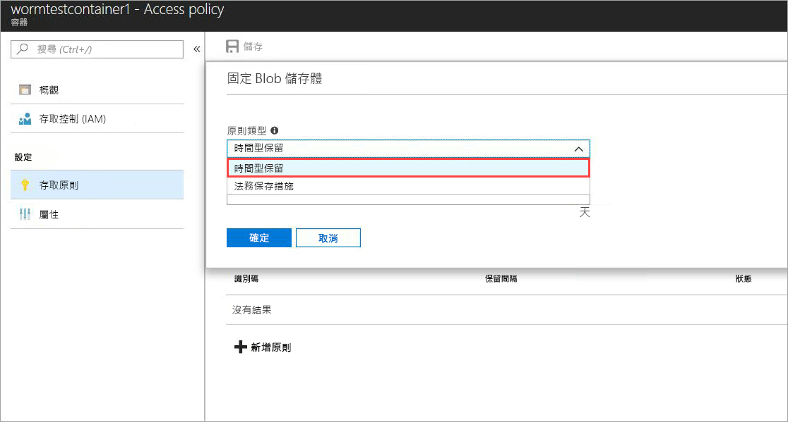
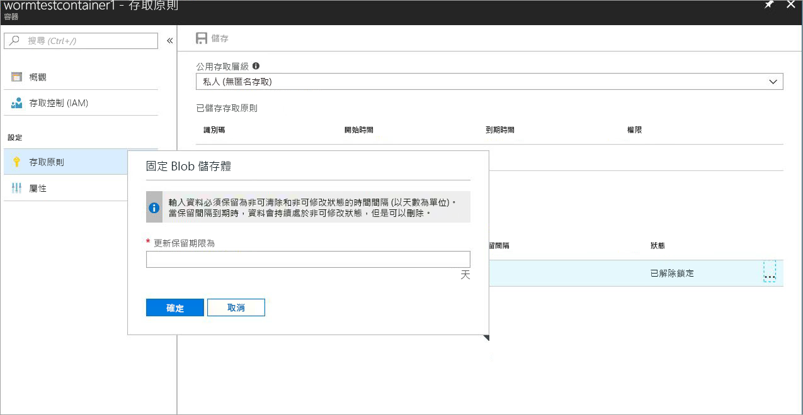
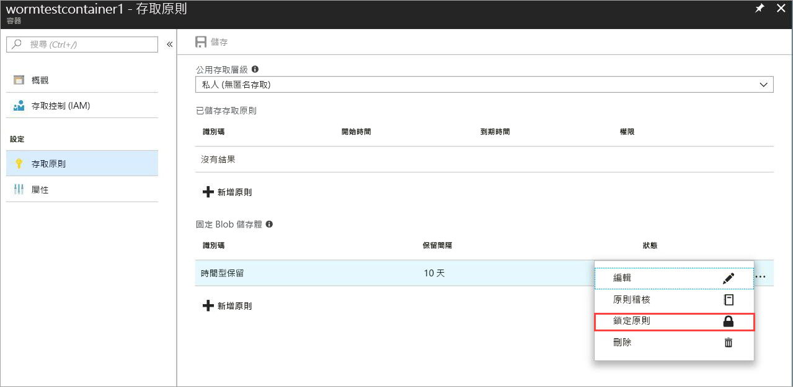
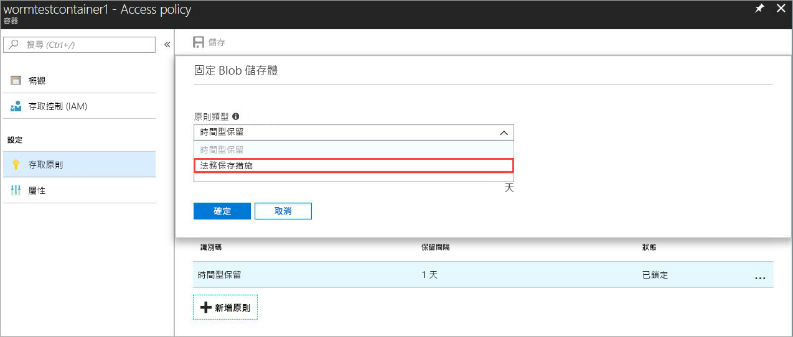
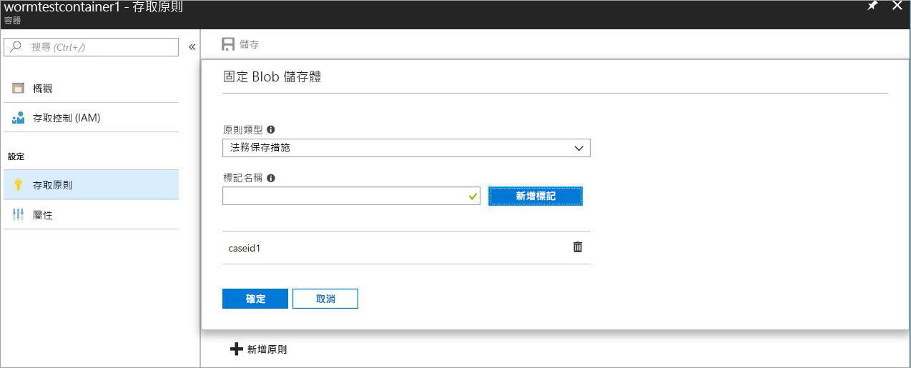

# <a name="immutable-storage-feature-of-azure-blob-storage-preview"></a>Azure Blob 儲存體的固定儲存體功能 (預覽)

適用於 Azure Blob 的固定儲存體功能可讓使用者將業務關鍵資料儲存以 WORM (一次寫入，多次讀取) 狀態在 Azure Blob 儲存體中。 此狀態讓資料在使用者指定的時間間隔內不可清除，也不可修改。 在保留間隔的持續期間內，可以建立和讀取 Blob，但無法加以修改或刪除。

## <a name="overview"></a>概觀

固定儲存體功能可讓許多管制產業的組織 (特別是經紀-經銷商組織) 以符合 SEC 17a-4(f) 和其他法規的方式儲存資料。

典型應用包括：

- **法規合規性**：適用於 Azure Blob 的固定儲存體功能設計用來協助金融機構和相關產業因應 SEC 17a-4(f)、CFTC 1.31©-(d)、FINRA 等等。

- **安全文件保留**：使用者可獲得最大資料保護，因為 Blob 儲存體服務會確保任何使用者都無法修改或刪除資料 (包括具有系統管理權限的帳戶)。

- **合法保存**：適用於 Azure Blob 的固定儲存體可讓使用者在所需的持續期間內，以防篡改的狀態儲存對訴訟或刑事偵察等很重要的敏感性資訊。

固定儲存體功能能夠：

- **以時間為基礎的保留原則支援：** 使用者會設定一些原則，以在指定的時間間隔內儲存資料。

- **合法保存原則支援：** 若不知道保留間隔，使用者可以設定合法保存來永久儲存資料，直到清除合法保存為止。  設定合法保存後，可以建立和讀取 Blob，但無法加以修改或刪除。 每項合法保存都會與作為辨識字串 (例如案例識別碼) 的使用者定義英數字元標記相關聯。

- **所有 Blob 層都支援：** WORM 原則與 Azure Blob 儲存層無關，將會套用至所有層 (經常性存取層、非經常性存取層和封存存取層)。 這可讓客戶在其工作負載的成本最佳化層中儲存資料，同時維護資料的不變性

- **容器層級組態：** 固定儲存體功能可讓使用者在容器層級設定以時間為基礎的保留原則和合法保存標記。  使用者可以透過簡單的容器層級設定，建立及鎖定以時間為基礎的保留原則、延長保留間隔、集合和清除合法保存等。  這些原則會套用到現有和新容器中的所有 Blob。

- **稽核記錄支援：** 每個容器都包含一個稽核記錄，其針對以時間為基礎的鎖定保留原則，最多顯示五個以時間為基礎的保留命令，而保留間隔延長最多三個記錄。  針對以時間為基礎的保留，此記錄包含使用者 ID、命令類型、時間戳記及保留間隔。 針對合法保存，此記錄包含使用者識別碼、命令類型、時間戳記及合法保存標記。 依據 SEC 17a-4(f) 法規指導方針，在容器的存留時間內會保留此記錄。 在 [Azure 活動記錄](https://docs.microsoft.com/en-us/azure/monitoring-and-diagnostics/monitoring-overview-activity-logs)中可找到所有控制平面活動的更詳盡記錄。 基於法規需求或其他目的，使用者有責任持續不斷地儲存這些記錄。

 此功能已在所有 Azure 公用區域中啟用。

## <a name="how-it-works"></a>運作方式

適用於 Azure Blob 的固定儲存體支援兩種 WORM 或固定原則：以時間為基礎的保留和合法保存。 如需如何建立這些固定原則的詳細資料，請參閱[使用者入門](#Getting-started)一節。
當容器套用以時間為基礎的保留原則或合法保存時，所有現有的 Blob 都會移至固定 (防寫和防刪保護) 狀態。 所有上傳到容器的新 Blob 也會移至固定狀態。

> [!IMPORTANT]
> 對於即將處於固定 (防寫和防刪保護) 狀態的 Blob 而言，以時間為基礎的保留原則必須「鎖定」，才能符合 SEC 17a-4(f) 和其他法規。 建議在合理的時間 (通常是 24 小時) 內鎖定原則。 我們不建議對短期功能試用以外的其他任何用途，使用「未鎖定」狀態。

 若在容器上套用以時間為基礎的保留原則，在「有效」保留期限內，容器中的所有 Blob 都會保持固定狀態。 現有 Blob 的有效保留期限等於 Blob 建立時間與使用者指定保留間隔之間的差異。 若為新的 Blob，有效保留期限等於使用者指定的保留間隔。 因為使用者可以變更保留間隔，所以使用者指定保留間隔的最新值將用於計算有效的保留期限。

> [!TIP]
> 範例：使用者建立以時間為基礎的保留原則，其保留間隔為五年。
> 該容器中有一個一年前建立的現有 Blob (testblob1)。 testblob1 的有效保留期限會是 4 年。
> 新的 Blob (testblob2) 現在已上傳到容器。 這個新 Blob 的有效保留期限會是 5 年。

### <a name="legal-holds"></a>合法保存

如果發生合法保存，則所有現有和新的 Blob 都會保持固狀態，直到清除合法保存為止。
如需有關如何設定和清除合法保存的詳細資訊，請參閱[使用者入門](#Getting-started)一節中的詳細資料。

一個容器可以同時具有合法保存和以時間為基礎的保留原則。 該容器中的所有 Blob 會都保持固定狀態，直到所有合法保存都遭到清除為止 (即使其有效保留期限已過期)。 相反地，Blob 會保持固定狀態，直到有效保留週期到期為止 (即使已清除所有合法保存)。
下表顯示會針對不同固定案例停用的 Blob 作業類型。
如需 Blob REST API 詳細資料，請參閱 [Azure Blob 服務 API](https://docs.microsoft.com/en-us/rest/api/storageservices/blob-service-rest-api) 文件。

|案例  |Blob 狀態  |不允許 Blob 作業  |
|---------|---------|---------|
|Blob 上的有效保留間隔尚未過期及/或已設定合法保存     |固定：防刪與防寫保護         |刪除容器、刪除 Blob、放置 Blob1、放置區塊、放置區塊清單、設定 Blob 中繼資料、放置分頁、設定 Blob 屬性、快照集 Blob、累加複製 Blob、附加區塊         |
|Blob 上的有效保留間隔已過期     |僅限防寫保護 (允許刪除作業)         |放置 Blob、放置區塊、放置區塊清單、設定 Blob 中繼資料、放置分頁、設定 Blob 屬性、快照集 Blob、累加複製 Blob、附加區塊         |
|所有合法保存都已清除，且容器上未設定任何以時間為基礎的保留原則     |可變動         |None         |
|未建立任何 WORM 原則 (以時間為基礎的保留或合法保存)     |可變動         |None         |

> [!NOTE]
> 上表的前兩個案例允許第一個放置 Blob，以及建立 Blob 所需的放置區塊清單和放置區塊作業，但不允許所有後續的作業。
> 固定儲存體功能僅適用於 GPv2 和 Blob 儲存體帳戶，且必須透過 [Azure Resource Manager](https://docs.microsoft.com/en-us/azure/azure-resource-manager/resource-group-overview) 建立。

## <a name="pricing"></a>價格

使用這項功能不另外收費用，固定資料的定價方式與一般可變動的資料相同。 如需相關定價詳細資料，請參閱 [Azure 儲存體定價](https://azure.microsoft.com/pricing/details/storage/blobs/)頁面。

### <a name="restrictions"></a>限制

公開預覽期間適用下列限制：

- **不要儲存生產或業務關鍵資料**
- 適用所有預覽/NDA 限制

## <a name="getting-started"></a>開始使用

最新的 [Azure 入口網站](http://portal.azure.com)、Azure [CLI 2.0](https://docs.microsoft.com/en-us/cli/azure/install-azure-cli?view=azure-cli-latest) 和 Azure [PowerShell](https://github.com/Azure/azure-powershell/releases/tag/Azure.Storage.v4.4.0-preview-May2018) 都支援適用於 Azure Blob 的 Azure 固定儲存體

### <a name="azure-portal"></a>Azure 入口網站

1. 建立新的容器或選取現有容器，以儲存必須保持固定狀態的 Blob。
 容器必須在 GPv2 儲存體帳戶中。
2. 按一下容器設定中的 [存取原則]，然後在 [固定 Blob 儲存體] 原則之下按一下 [+ 新增原則]，如下所示。

    

3. 若要啟用以時間為基礎的保留，請從下拉式功能表中選擇以時間為基礎的保留。

    

4. 輸入想要的保留間隔天數 (最小值為一天)

    

    您可以在上面看到，原則的初始狀態為未鎖定。 這會讓您以較小的保留間隔測試此功能，並且在原則鎖定之前進行變更。 若要符合 SEC 17a-4 等法規，鎖定是不可或缺的。

5. 在 ... 上按一下滑鼠右鍵來鎖定原則，則會出現下列功能表：

    

    按一下 [鎖定原則]，原則狀態現在會顯示為鎖定。 一旦鎖定，再也無法刪除原則，只允許延長保留間隔。

6. 若要啟用合法保存，請按一下 [+ 新增原則] 並從下拉式功能表中選擇 [合法保存]。

    

7. 建立具有一或多個標記的合法保存

    

### <a name="cli-20"></a>CLI 2.0

使用 `az extension add -n storage-preview` 安裝 [CLI 擴充功能](http://docs.microsoft.com/en-us/cli/azure/install-azure-cli?view=azure-cli-latest)

如果您已安裝此擴充功能，請使用下列命令來啟用固定儲存體功能：`az extension update -n storage-preview`

此功能包含在下列命令群組中 (在其上執行 “-h” 來查看命令)：`az storage container immutability-policy` 和 `az storage container legal-hold`。

### <a name="powershell"></a>PowerShell

[PowerShell 版本 4.4.0-preview](https://github.com/Azure/azure-powershell/releases/tag/Azure.Storage.v4.4.0-preview-May20180) 支援固定儲存體功能。
若要啟用此功能，請遵循下列步驟：

1. 確定您已使用 `Install-Module PowerShellGet –Repository PSGallery –Force` 安裝最新版的 PowerShellGet
2. 移除任何先前安裝的 Azure PowerShell
3. 安裝 AzureRM (同樣可以從這個存放庫安裝 Azure) `Install-Module AzureRM –Repository PSGallery –AllowClobber`
4. 安裝預覽版本的儲存體管理平面 Cmdlet`Install-Module -Name AzureRM.Storage -AllowPrerelease -Repository PSGallery -AllowClobber`

以下提供說明此功能使用方式的 PowerShell 程式碼範例。

## <a name="client-libraries"></a>用戶端程式庫

下列用戶端程式庫版本支援適用於 Azure Blob 的固定儲存體功能：

- [.net 用戶端程式庫 (版本 7.2.0-preview 和更高版本](https://www.nuget.org/packages/Microsoft.Azure.Management.Storage/7.2.0-preview)
- [node.js 用戶端程式庫 (版本 4.0.0 和更高版本)](https://www.npmjs.com/package/azure-arm-storage)
- [Python 用戶端程式庫 (2.0.0 候選版 2 與更高版本)](https://pypi.org/project/azure-mgmt-storage/2.0.0rc1/)

## <a name="supported-values"></a>支援的值

- 最小保留間隔是一天，最大值是 400 年
- 對於指定的儲存體帳戶，每個儲存體帳戶 (具備鎖定固定原則) 的容器數目上限為 1000
- 對於指定的儲存體帳戶，具有合法保存設定的容器數目上限為 1000
- 對於指定的容器，合法保存標記數目上限為 10
- 合法保存標記的最大長度為 23 個英數字元，最小長度為三個字元
- 對於指定的容器，鎖定固定原則的允許保留間隔延長的數目上限為 3
- 對於具有鎖定固定原則的指定容器，容器的持續期間內最多有五個以時間為基礎的保留原則記錄，而最多會保留 10 個合法保存原則記錄。

## <a name="faq"></a>常見問題集

**此功能只適用於區塊 Blob，或者也適用於分頁和附加 Blob？**

Blob 的固定儲存體功能可以搭配任何 Blob 類型使用。  不過請注意，建議此功能主要用於區塊 Blob。 不同於區塊 Blob，分頁 Blob 和附加 Blob 必須在 WORM 容器外部建立，然後再複製到其中。  複製到 WORM 容器後，便無法進一步對附加 Blob 進行「附加」或變更分頁 Blob。

**一定要建立新的儲存體帳戶才能使用此功能嗎？**

如果帳戶類型為 GPv2，您可以使用固定儲存體功能搭配任何現有的 GPv2 帳戶或新的儲存體帳戶。 此功能只適用於 Blob 儲存體。

**如果我嘗試刪除的容器具有以時間為基礎的「鎖定」保留原則或合法保存，則會發生什麼事？**

如果有至少一個 Blob 具以時間為基礎的鎖定保留原則或合法保存，則刪除容器作業會失敗。 如果沒有任何 Blob 具有有效的保留間隔，而且沒有合法保存，則刪除容器作業會成功。 您必須先刪除 Blob，才可以刪除容器。

**如果我嘗試刪除的儲存體帳戶具有 WORM 帳戶，且該帳戶具有以時間為基礎的「鎖定」保留原則或合法保存，則會發生什麼事？**

如果有至少一個 WORM 容器具有合法保存或有一個 Blob 具有有效保留間隔，則儲存體帳戶刪除作業會失敗。  必須先刪除所有 WORM 容器，才能刪除儲存體帳戶。  如需容器刪除的相關資訊，請參閱問題 2。

**當 Blob 處於固定狀態時，我可以跨越不同 Blob 層 (經常性存取層、非經常性存取層、冷門存取層) 移動資料嗎？**

是，您可以使用設定 Blob 層命令跨越 Blob 層移動資料，同時讓資料保持固定狀態。 經常性存取層、非經常性存取層和冷門存取層都支援固定儲存體功能。

**如果我付款失敗，而保留間隔尚未過期，則會發生什麼事？**

如果未付款，則會依照您與 Microsoft 簽訂的合約條款與條件中指定的約定寬限期，套用一般資料保留原則。

**您是否提供試用此功能的試用版或寬限期？**

是，第一次建立以時間為基礎的保留原則時，它會處於「未鎖定」狀態。 在此狀態中，您可以對保留間隔進行任何所需的變更，例如增加或減少保留間隔，甚至刪除原則。 原則一旦鎖定，就會永遠保持「鎖定」狀態而無法刪除。 此外，鎖定原則後，便無法再縮短保留間隔。 我們強烈建議僅將「未鎖定」狀態使用於試用目的，並且在 24 小時期間內鎖定原則，就不需承擔不符合 SEC 17a-4(f) 和其他法規的風險。

**此功能是否適用於國家雲和政府雲？**

固定儲存體功能目前僅適用於 Azure 公用區域。 關於特定國家雲利益的電子郵件 azurestoragefeedback@microsoft.com。

## <a name="sample-code"></a>範例程式碼

以下提供範例 PowerShell 指令碼供您參考。
此指令碼會建立新的儲存體帳戶和容器，然後示範如何設定和清除合法保存、建立及鎖定以時間為基礎的保留原則 (也稱為 ImmutabilityPolicy)、延長保留間隔等。

```powershell
\$ResourceGroup = "\<Enter your resource group\>”

\$StorageAccount = "\<Enter your storage account name\>"

\$container = "\<Enter your container name\>"

\$container2 = "\<Enter another container name\>”

\$location = "\<Enter the storage account location\>"

\# Login to the Azure Resource Manager Account

Login-AzureRMAccount

Register-AzureRmResourceProvider -ProviderNamespace "Microsoft.Storage"

\# Create your Azure Resource Group

New-AzureRmResourceGroup -Name \$ResourceGroup -Location \$location

\# Create your Azure storage account

New-AzureRmStorageAccount -ResourceGroupName \$ResourceGroup -StorageAccountName
\$StorageAccount -SkuName Standard_LRS -Location \$location -Kind Storage

\# Create a new container

New-AzureRmStorageContainer -ResourceGroupName \$ResourceGroup
-StorageAccountName \$StorageAccount -Name \$container

\# Create Container 2 with Storage Account object

\$accountObject = Get-AzureRmStorageAccount -ResourceGroupName \$ResourceGroup
-StorageAccountName \$StorageAccount

New-AzureRmStorageContainer -StorageAccount \$accountObject -Name \$container2

\# Get container

Get-AzureRmStorageContainer -ResourceGroupName \$ResourceGroup
-StorageAccountName \$StorageAccount -Name \$container

\# Get Container with Account object

\$containerObject = Get-AzureRmStorageContainer -StorageAccount \$accountObject
-Name \$container

\#list container

Get-AzureRmStorageContainer -ResourceGroupName \$ResourceGroup
-StorageAccountName \$StorageAccount

\#remove container (Add -Force to dismiss prompt)

Remove-AzureRmStorageContainer -ResourceGroupName \$ResourceGroup
-StorageAccountName \$StorageAccount -Name \$container2

\#with Account object

Remove-AzureRmStorageContainer -StorageAccount \$accountObject -Name
\$container2

\#with Container object

\$containerObject2 = Get-AzureRmStorageContainer -StorageAccount \$accountObject
-Name \$container2

Remove-AzureRmStorageContainer -InputObject \$containerObject2

\#Set LegalHold

Add-AzureRmStorageContainerLegalHold -ResourceGroupName \$ResourceGroup
-StorageAccountName \$StorageAccount -Name \$container -Tag tag1,tag2

\#with Account object

Add-AzureRmStorageContainerLegalHold -StorageAccount \$accountObject -Name
\$container -Tag tag3

\#with Container object

Add-AzureRmStorageContainerLegalHold -Container \$containerObject -Tag tag4,tag5

\#Clear LegalHold

Remove-AzureRmStorageContainerLegalHold -ResourceGroupName \$ResourceGroup
-StorageAccountName \$StorageAccount -Name \$container -Tag tag2

\#with Account object

Remove-AzureRmStorageContainerLegalHold -StorageAccount \$accountObject -Name
\$container -Tag tag3,tag5

\#with Container object

Remove-AzureRmStorageContainerLegalHold -Container \$containerObject -Tag tag4

\# create/update ImmutabilityPolicy

\#\# with account/container name

Set-AzureRmStorageContainerImmutabilityPolicy -ResourceGroupName \$ResourceGroup
-StorageAccountName \$StorageAccount -ContainerName \$container
-ImmutabilityPeriod 10

\#with Account object

Set-AzureRmStorageContainerImmutabilityPolicy -StorageAccount \$accountObject
-ContainerName \$container -ImmutabilityPeriod 1 -Etag \$policy.Etag

\#with Container object

\$policy = Set-AzureRmStorageContainerImmutabilityPolicy -Container
\$containerObject -ImmutabilityPeriod 7

\#\# with ImmutabilityPolicy object

Set-AzureRmStorageContainerImmutabilityPolicy -ImmutabilityPolicy \$policy
-ImmutabilityPeriod 5

\#get ImmutabilityPolicy

Get-AzureRmStorageContainerImmutabilityPolicy -ResourceGroupName \$ResourceGroup
-StorageAccountName \$StorageAccount -ContainerName \$container

\#with Account object

Get-AzureRmStorageContainerImmutabilityPolicy -StorageAccount \$accountObject
-ContainerName \$container

\#with Container object

Get-AzureRmStorageContainerImmutabilityPolicy -Container \$containerObject

\#Lock ImmutabilityPolicy (Add -Force to dismiss prompt)

\#\# with ImmutabilityPolicy object

\$policy = Get-AzureRmStorageContainerImmutabilityPolicy -ResourceGroupName
\$ResourceGroup -StorageAccountName \$StorageAccount -ContainerName \$container

\$policy = Lock-AzureRmStorageContainerImmutabilityPolicy -ImmutabilityPolicy
\$policy -force

\#\# with account/container name

\$policy = Lock-AzureRmStorageContainerImmutabilityPolicy -ResourceGroupName
\$ResourceGroup -StorageAccountName \$StorageAccount -ContainerName \$container
-Etag \$policy.Etag

\#with Account object

\$policy = Lock-AzureRmStorageContainerImmutabilityPolicy -StorageAccount
\$accountObject -ContainerName \$container -Etag \$policy.Etag

\#with Container object

\$policy = Lock-AzureRmStorageContainerImmutabilityPolicy -Container
\$containerObject -Etag \$policy.Etag -force

\#Extend ImmutabilityPolicy

\#\# with ImmutabilityPolicy object

\$policy = Get-AzureRmStorageContainerImmutabilityPolicy -ResourceGroupName
\$ResourceGroup -StorageAccountName \$StorageAccount -ContainerName \$container

\$policy = Set-AzureRmStorageContainerImmutabilityPolicy -ImmutabilityPolicy
\$policy -ImmutabilityPeriod 11 -ExtendPolicy

\#\# with account/container name

\$policy = Set-AzureRmStorageContainerImmutabilityPolicy -ResourceGroupName
\$ResourceGroup -StorageAccountName \$StorageAccount -ContainerName \$container
-ImmutabilityPeriod 11 -Etag \$policy.Etag -ExtendPolicy

\#with Account object

\$policy = Set-AzureRmStorageContainerImmutabilityPolicy -StorageAccount
\$accountObject -ContainerName \$container -ImmutabilityPeriod 12 -Etag
\$policy.Etag -ExtendPolicy

\#with Container object

\$policy = Set-AzureRmStorageContainerImmutabilityPolicy -Container
\$containerObject -ImmutabilityPeriod 13 -Etag \$policy.Etag -ExtendPolicy

\#Remove ImmutabilityPolicy (Add -Force to dismiss prompt)

\#\# with ImmutabilityPolicy object

\$policy = Get-AzureRmStorageContainerImmutabilityPolicy -ResourceGroupName
\$ResourceGroup -StorageAccountName \$StorageAccount -ContainerName \$container

Remove-AzureRmStorageContainerImmutabilityPolicy -ImmutabilityPolicy \$policy

\#\# with account/container name

Remove-AzureRmStorageContainerImmutabilityPolicy -ResourceGroupName
\$ResourceGroup -StorageAccountName \$StorageAccount -ContainerName \$container
-Etag \$policy.Etag

\#with Account object

Remove-AzureRmStorageContainerImmutabilityPolicy -StorageAccount \$accountObject
-ContainerName \$container -Etag \$policy.Etag

\#with Container object

Remove-AzureRmStorageContainerImmutabilityPolicy -Container \$containerObject
-Etag \$policy.Etag
```