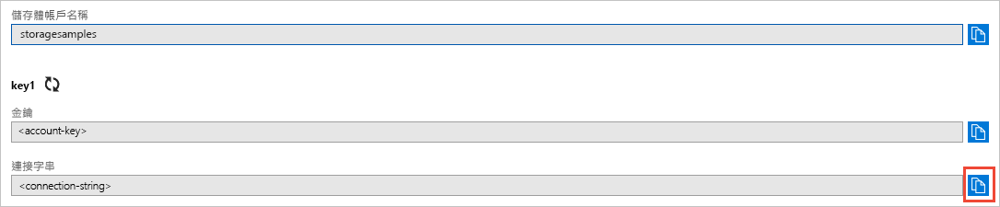
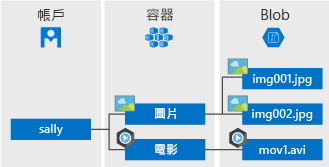

# <a name="quickstart-azure-blob-storage-client-library-for-net"></a>快速入門：適用於 .NET 的 Azure Blob 儲存體用戶端程式庫

開始使用適用於 .NET 的 Azure Blob 儲存體用戶端程式庫。 Azure Blob 儲存體是 Microsoft 針對雲端推出的物件儲存體解決方案。 請依照下列步驟來安裝套件，並試用基本工作的範例程式碼。 Blob 儲存體已針對儲存大量非結構化資料最佳化。

使用適用於 .NET 的 Azure Blob 儲存體用戶端程式庫：

* 建立容器
* 設定容器權限
* 在 Azure 儲存體中建立 Blob
* 將 Blob 下載到本機電腦
* 列出容器中的所有 Blob
* 刪除容器

[API 參考文件](https://docs.microsoft.com/dotnet/api/overview/azure/storage?view=azure-dotnet) | [程式庫來源程式碼](https://github.com/Azure/azure-storage-net/tree/master/Blob) | [套件 (NuGet)](https://www.nuget.org/packages/Microsoft.Azure.Storage.Blob/) | [範例](https://azure.microsoft.com/resources/samples/?sort=0&service=storage&platform=dotnet&term=blob)

[!INCLUDE [storage-multi-protocol-access-preview](../../../includes/storage-multi-protocol-access-preview.md)]

## <a name="required-before-you-begin"></a>開始之前需要

* Azure 訂用帳戶 - [建立免費帳戶](https://azure.microsoft.com/free/)
* Azure 儲存體帳戶 - [建立儲存體帳戶](https://docs.microsoft.com/azure/storage/common/storage-quickstart-create-account)
* 適用於您作業系統的 [NET Core SDK](https://dotnet.microsoft.com/download/dotnet-core) 或更新版本。 請務必取得 SDK，而不是執行階段。

## <a name="setting-up"></a>設定

本節會引導您準備專案以搭配使用適用於 .NET 的 Azure Blob 儲存體用戶端程式庫。

### <a name="create-the-project"></a>建立專案

首先，建立名為 *blob-quickstart* 的 .NET Core 應用程式。

1. 在主控台視窗中 (例如 cmd、PowerShell 或 Bash)，使用 `dotnet new` 命令建立名為 *blob-quickstart* 的新主控台應用程式。 此命令會建立簡單的 "Hello World" C# 專案，內含單一原始程式檔：*Program.cs*。

   ```console
   dotnet new console -n blob-quickstart
   ```

2. 切換至新建的 *blob-quickstart* 資料夾，然後建置應用程式以確認一切都正常運作。

   ```console
   cd blob-quickstart
   ```

   ```console
   dotnet build
   ```

組建的預期輸出看起來應像這樣：

```output
C:\QuickStarts\blob-quickstart> dotnet build
Microsoft (R) Build Engine version 16.0.450+ga8dc7f1d34 for .NET Core
Copyright (C) Microsoft Corporation. All rights reserved.

  Restore completed in 44.31 ms for C:\QuickStarts\blob-quickstart\blob-quickstart.csproj.
  blob-quickstart -> C:\QuickStarts\blob-quickstart\bin\Debug\netcoreapp2.1\blob-quickstart.dll

Build succeeded.
    0 Warning(s)
    0 Error(s)

Time Elapsed 00:00:03.08
```

### <a name="install-the-package"></a>安裝套件

若您仍在應用程式目錄中，請使用 `dotnet add package` 命令安裝適用於 .NET 套件的 Azure Blob 儲存體用戶端程式庫。

```console
dotnet add package Microsoft.Azure.Storage.Blob
```

### <a name="set-up-the-app-framework"></a>設定應用程式架構

從專案目錄：

1. 在編輯器中開啟 Program.cs  檔案
2. 移除 `Console.WriteLine` 陳述式
3. 新增 `using` 指示詞
4. 建立範例主要程式碼所在的 `ProcessAsync` 方法
5. 以非同步方式從 `Main` 呼叫 `ProcessAsync` 方法

此程式碼如下：

```csharp
using System;
using System.IO;
using System.Threading.Tasks;
using Microsoft.Azure.Storage;
using Microsoft.Azure.Storage.Blob;

namespace blob_quickstart
{
    class Program
    {
        public static void Main()
        {
            Console.WriteLine("Azure Blob Storage - .NET quickstart sample\n");

            // Run the examples asynchronously, wait for the results before proceeding
            ProcessAsync().GetAwaiter().GetResult();

            Console.WriteLine("Press any key to exit the sample application.");
            Console.ReadLine();
        }

        private static async Task ProcessAsync()
        {
        }
    }
}
```

### <a name="copy-your-credentials-from-the-azure-portal"></a>從 Azure 入口網站複製您的認證

範例應用程式需要驗證對您儲存體帳戶的存取。 若要進行驗證，請以連接字串的形式將儲存體帳戶認證新增至應用程式。 請依照下列步驟檢視您的儲存體帳戶認證：

1. 瀏覽至 [Azure 入口網站](https://portal.azure.com)。
2. 找出您的儲存體帳戶。
3. 在儲存體帳戶概觀的 [設定]  區段中，選取 [存取金鑰]  。 在此處，您可以檢視帳戶存取金鑰，和每個金鑰的完整連接字串。
4. 尋找 [金鑰 1]  下方的 [連接字串]  值，然後選取 [複製]  按鈕以複製連接字串。 在下一個步驟中，您會將連接字串值新增至環境變數。

    

### <a name="configure-your-storage-connection-string"></a>設定儲存體連接字串

在複製您的連接字串後，請在執行應用程式的本機電腦上，將該字串寫入至新的環境變數中。 若要設定環境變數，請開啟主控台視窗，並遵循您的作業系統所適用的指示。 將 `<yourconnectionstring>` 用實際的連接字串取代。

#### <a name="windows"></a>Windows

```cmd
setx CONNECT_STR "<yourconnectionstring>"
```

在 Windows 中新增環境變數之後，您必須啟動新的命令視窗執行個體。

#### <a name="linux"></a>Linux

```bash
export CONNECT_STR="<yourconnectionstring>"
```

#### <a name="macos"></a>MacOS

```bash
export CONNECT_STR="<yourconnectionstring>"
```

新增環境變數之後，請重新啟動任何需要讀取環境變數的執行中程式。 例如，在繼續之前，先重新啟動您的開發環境或編輯器。

## <a name="object-model"></a>物件模型

Azure Blob 儲存體已針對儲存大量非結構化資料最佳化。 非結構化資料是指不遵守特定資料模型或定義的資料，例如文字或二進位資料。 Blob 儲存體提供三種類型資源：

* 儲存體帳戶。
* 儲存體帳戶中的容器
* 容器中的 Blob

下圖顯示資源之間的關係。



使用下列 .NET 類別與這些資源互動：

* [CloudStorageAccount](/dotnet/api/microsoft.azure.storage.cloudstorageaccount)：`CloudStorageAccount` 類別代表您的 Azure 儲存體帳戶。 使用這個類別來授權使用帳戶存取金鑰存取 Blob 儲存體。
* [CloudBlobClient](/dotnet/api/microsoft.azure.storage.blob.cloudblobclient)：`CloudBlobClient` 類別提供程式碼中的 Blob 服務存取點。
* [CloudBlobContainer](/dotnet/api/microsoft.azure.storage.blob.cloudblobcontainer)：`CloudBlobContainer` 類別代表您程式碼中的 Blob 容器。
* [CloudBlockBlob](/dotnet/api/microsoft.azure.storage.blob.cloudblockblob)：`CloudBlockBlob` 物件代表您程式碼中的區塊 Blob。 區塊 Blob 是由可個別管理的資料區塊所組成。

## <a name="code-examples"></a>程式碼範例

這些範例程式碼片段會示範如何使用適用於 .NET 的 Azure Blob 儲存體用戶端程式庫執行下列動作：

   * [驗證用戶端](#authenticate-the-client)
   * [建立容器](#create-a-container)
   * [設定容器權限](#set-permissions-on-a-container)
   * [將 Blob 上傳至容器](#upload-blobs-to-a-container)
   * [列出容器中的 Blob](#list-the-blobs-in-a-container)
   * [下載 Blob](#download-blobs)
   * [刪除容器](#delete-a-container)

### <a name="authenticate-the-client"></a>驗證用戶端

下列程式碼會檢查環境變數是否包含可剖析的連接字串，以建立指向儲存體帳戶的 [CloudStorageAccount](/dotnet/api/microsoft.azure.storage.cloudstorageaccount?view=azure-dotnet) 物件。 若要檢查連接字串是否有效，請使用[TryParse](/dotnet/api/microsoft.azure.storage.cloudstorageaccount.tryparse?view=azure-dotnet) 方法。 如果 `TryParse` 成功，它會初始化 `storageAccount` 變數並傳回 `true`。

在 `ProcessAsync` 方法內新增此程式碼：

```csharp
// Retrieve the connection string for use with the application. The storage 
// connection string is stored in an environment variable on the machine 
// running the application called CONNECT_STR. If the 
// environment variable is created after the application is launched in a 
// console or with Visual Studio, the shell or application needs to be closed
// and reloaded to take the environment variable into account.
string storageConnectionString = Environment.GetEnvironmentVariable("CONNECT_STR");

// Check whether the connection string can be parsed.
CloudStorageAccount storageAccount;
if (CloudStorageAccount.TryParse(storageConnectionString, out storageAccount))
{
    // If the connection string is valid, proceed with operations against Blob
    // storage here.
    // ADD OTHER OPERATIONS HERE
}
else
{
    // Otherwise, let the user know that they need to define the environment variable.
    Console.WriteLine(
        "A connection string has not been defined in the system environment variables. " +
        "Add an environment variable named 'CONNECT_STR' with your storage " +
        "connection string as a value.");
    Console.WriteLine("Press any key to exit the application.");
    Console.ReadLine();
}
```

> [!NOTE]
> 若要執行本文中其餘作業，請使用下列各節的程式碼片段取代上方程式碼中的 `// ADD OTHER OPERATIONS HERE`。

### <a name="create-a-container"></a>建立容器

若要建立容器，請先建立 [CloudBlobClient](/dotnet/api/microsoft.azure.storage.blob.cloudblobclient) 物件的執行個體，其指向您儲存體帳戶中的 Blob 儲存體。 接下來，建立 [CloudBlobContainer](/dotnet/api/microsoft.azure.storage.blob.cloudblobcontainer) 物件的執行個體，然後建立容器。

在此情況下，程式碼會呼叫 [CreateAsync](/dotnet/api/microsoft.azure.storage.blob.cloudblobcontainer.createasync) 方法來建立容器。 容器名稱會附加 GUID 值，以確保它是唯一的。 在生產環境中，通常偏好使用 [CreateIfNotExistsAsync](/dotnet/api/microsoft.azure.storage.blob.cloudblobcontainer.createifnotexistsasync) 方法來建立容器 (僅限容器不存在時)。

> [!IMPORTANT]
> 容器名稱必須是小寫字母。 如需為容器和 Blob 命名的詳細資訊，請參閱[命名和參考容器、Blob 及中繼資料](https://docs.microsoft.com/rest/api/storageservices/naming-and-referencing-containers--blobs--and-metadata)。

```csharp
// Create the CloudBlobClient that represents the 
// Blob storage endpoint for the storage account.
CloudBlobClient cloudBlobClient = storageAccount.CreateCloudBlobClient();

// Create a container called 'quickstartblobs' and 
// append a GUID value to it to make the name unique.
CloudBlobContainer cloudBlobContainer = 
    cloudBlobClient.GetContainerReference("quickstartblobs" + 
        Guid.NewGuid().ToString());
await cloudBlobContainer.CreateAsync();
```

### <a name="set-permissions-on-a-container"></a>設定容器權限

設定容器權限，使容器中的任何 Blob 皆為公用。 如果 blob 是公用的，任何用戶端都可以匿名方式存取它。

```csharp
// Set the permissions so the blobs are public.
BlobContainerPermissions permissions = new BlobContainerPermissions
{
    PublicAccess = BlobContainerPublicAccessType.Blob
};
await cloudBlobContainer.SetPermissionsAsync(permissions);
```

### <a name="upload-blobs-to-a-container"></a>將 Blob 上傳至容器

下列程式碼片段會在前一節建立的容器上呼叫 [GetBlockBlobReference](/dotnet/api/microsoft.azure.storage.blob.cloudblobcontainer.getblockblobreference) 方法，以取得 `CloudBlockBlob` 物件的參考。 然後藉由呼叫 [UploadFromFileAsync](/dotnet/api/microsoft.azure.storage.blob.cloudblockblob.uploadfromfileasync) 方法，將所選的本機檔案上傳到 Blob。 如果 Blob 不存在，此方法會建立 Blob，若已存在，則會加以覆寫。

```csharp
// Create a file in your local MyDocuments folder to upload to a blob.
string localPath = Environment.GetFolderPath(Environment.SpecialFolder.MyDocuments);
string localFileName = "QuickStart_" + Guid.NewGuid().ToString() + ".txt";
string sourceFile = Path.Combine(localPath, localFileName);
// Write text to the file.
File.WriteAllText(sourceFile, "Hello, World!");

Console.WriteLine("Temp file = {0}", sourceFile);
Console.WriteLine("Uploading to Blob storage as blob '{0}'", localFileName);

// Get a reference to the blob address, then upload the file to the blob.
// Use the value of localFileName for the blob name.
CloudBlockBlob cloudBlockBlob = cloudBlobContainer.GetBlockBlobReference(localFileName);
await cloudBlockBlob.UploadFromFileAsync(sourceFile);
```

### <a name="list-the-blobs-in-a-container"></a>列出容器中的 Blob

使用 [ListBlobsSegmentedAsync](/dotnet/api/microsoft.azure.storage.blob.cloudblobcontainer.listblobssegmentedasync) 方法列出容器中的 Blob。 在此案例中，只有一個 Blob 新增至容器，所以清單作業只會傳回一個 Blob。

如果單一呼叫中有太多 blob 要傳回 (根據預設，超過 5000 個)，則 `ListBlobsSegmentedAsync` 方法會傳回總結果集區段和接續 Token。 若要擷取 blob 的下一個區段，您可提供前一次呼叫傳回的接續 Token 等等，直到接續 Token 是 null 為止。 Null 接續 Token 表示已擷取所有的 blob。 此程式碼會示範如何使用接續 Token 來達到最佳做法。

```csharp
// List the blobs in the container.
Console.WriteLine("List blobs in container.");
BlobContinuationToken blobContinuationToken = null;
do
{
    var results = await cloudBlobContainer.ListBlobsSegmentedAsync(null, blobContinuationToken);
    // Get the value of the continuation token returned by the listing call.
    blobContinuationToken = results.ContinuationToken;
    foreach (IListBlobItem item in results.Results)
    {
        Console.WriteLine(item.Uri);
    }
} while (blobContinuationToken != null); // Loop while the continuation token is not null.

```

### <a name="download-blobs"></a>下載 Blob

使用 [DownloadToFileAsync](/dotnet/api/microsoft.azure.storage.blob.cloudblob.downloadtofileasync) 方法，將先前建立的 Blob 下載至本機檔案系統。 此範例程式碼會將 "_DOWNLOADED" 後置字元新增至 blob 名稱，您便可在本機檔案系統中看到這兩個檔案。

```csharp
// Download the blob to a local file, using the reference created earlier.
// Append the string "_DOWNLOADED" before the .txt extension so that you 
// can see both files in MyDocuments.
string destinationFile = sourceFile.Replace(".txt", "_DOWNLOADED.txt");
Console.WriteLine("Downloading blob to {0}", destinationFile);
await cloudBlockBlob.DownloadToFileAsync(destinationFile, FileMode.Create);
```

### <a name="delete-a-container"></a>刪除容器

下列程式碼會藉由使用 [CloudBlobContainer.DeleteAsync](/dotnet/api/microsoft.azure.storage.blob.cloudblobcontainer.deleteasync) 刪除整個容器，以清除應用程式所建立的資源。 您也可以視需要刪除本機檔案。

```csharp
Console.WriteLine("Press the 'Enter' key to delete the example files, " +
    "example container, and exit the application.");
Console.ReadLine();
// Clean up resources. This includes the container and the two temp files.
Console.WriteLine("Deleting the container");
if (cloudBlobContainer != null)
{
    await cloudBlobContainer.DeleteIfExistsAsync();
}
Console.WriteLine("Deleting the source, and downloaded files");
File.Delete(sourceFile);
File.Delete(destinationFile);
```

## <a name="run-the-code"></a>執行程式碼

此應用程式會在本機 *MyDocuments* 資料夾中建立測試檔案，並將它上傳到 Blob 儲存體。 範例會接著列出容器中的 Blob，並下載具有新名稱的檔案，您便可比較舊檔案和新檔案。

瀏覽至您的應用程式目錄，並建置和執行應用程式。

```console
dotnet build
```

```console
dotnet run
```

範例應用程式的輸出類似下列範例：

```output
Azure Blob storage - .NET Quickstart example

Created container 'quickstartblobs33c90d2a-eabd-4236-958b-5cc5949e731f'

Temp file = C:\Users\myusername\Documents\QuickStart_c5e7f24f-a7f8-4926-a9da-96
97c748f4db.txt
Uploading to Blob storage as blob 'QuickStart_c5e7f24f-a7f8-4926-a9da-9697c748f
4db.txt'

Listing blobs in container.
https://storagesamples.blob.core.windows.net/quickstartblobs33c90d2a-eabd-4236-
958b-5cc5949e731f/QuickStart_c5e7f24f-a7f8-4926-a9da-9697c748f4db.txt

Downloading blob to C:\Users\myusername\Documents\QuickStart_c5e7f24f-a7f8-4926
-a9da-9697c748f4db_DOWNLOADED.txt

Press any key to delete the example files and example container.
```

當您按 **Enter** 鍵時，應用程式會刪除儲存體容器和檔案。 在刪除之前，請檢查 *MyDocuments* 資料夾，找出這兩個檔案。 您可以開啟它們，並觀察它們是否相同。 複製主控台視窗中的 Blob URL，將它貼至瀏覽器以檢視 Blob 的內容。

確認檔案之後，請按任一鍵以完成示範並刪除測試檔案。

## <a name="next-steps"></a>後續步驟

在本快速入門中，您已了解如何使用 .NET 上傳、下載及列出 Blob。

若要了解如何建立可上傳映像至 Blob 儲存體的 Web 應用程式，請繼續了解下列作業：

> [!div class="nextstepaction"]
> [上傳及處理映像](storage-upload-process-images.md)

* 若要深入了解 .NET Core，請參閱[在 10 分鐘內開始使用 .NET](https://www.microsoft.com/net/learn/get-started/)。
* 若要探索您可以從 Visual Studio for Windows 部署的範例應用程式，請參閱[使用 Azure Blob 儲存體的 .NET 相片圖庫 Web 應用程式範例](https://azure.microsoft.com/resources/samples/storage-blobs-dotnet-webapp/)。
