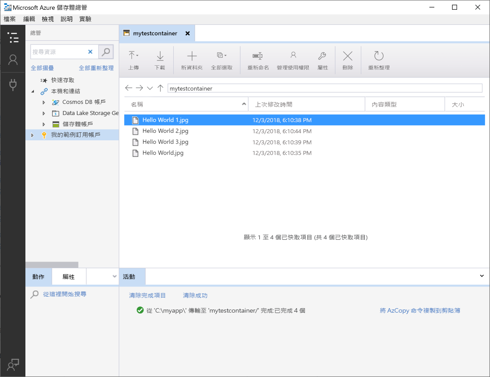
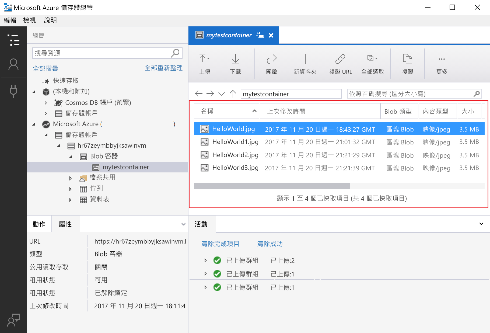
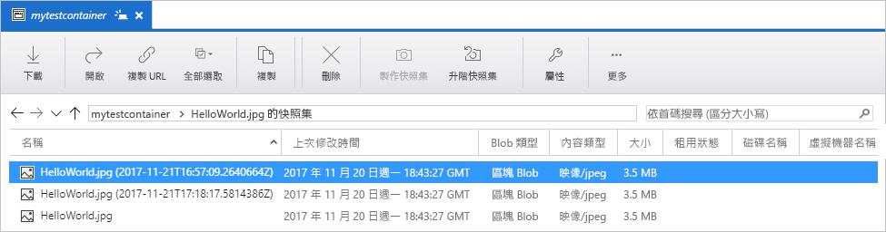
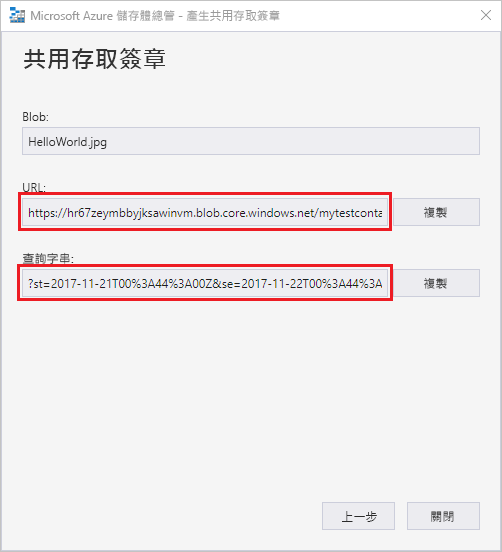

# 快速入門：使用 Azure 儲存體總管在物件儲存體中建立 Blob

在本快速入門中，您將了解如何使用 [Azure 儲存體總管](https://azure.microsoft.com/features/storage-explorer/)來建立容器和 Blob。 接下來，您要了解如何將 Blob 下載到本機電腦，以及如何檢視容器中的所有 Blob。 您也將了解如何建立 Blob 的快照集、管理容器存取原則，以及建立共用的存取簽章。

## 必要條件

如果您沒有 Azure 訂用帳戶，請在開始前建立 [免費帳戶](https://azure.microsoft.com/free/?WT.mc_id=A261C142F) 。

本快速入門會要求您安裝 Azure 儲存體總管。 若要安裝適用於 Windows、Macintosh 或 Linux 的 Azure 儲存體總管，請參閱 [Azure 儲存體總管](https://azure.microsoft.com/features/storage-explorer/)。

[!INCLUDE [storage-create-account-portal-include](../../../includes/storage-create-account-portal-include.md)]

## 登入儲存體總管

第一次啟動時，會顯示 [Microsoft Azure 儲存體總管 - 連線] 視窗。 儲存體總管提供數種方式來連線至儲存體帳戶。 下表列出您可以進行連線的不同方式：

|Task|目的|
|---|---|
|新增 Azure 帳戶 | 將您重新導向至貴組織的登入頁面，向 Azure 進行驗證。 |
|使用連接字串或共用存取簽章 URI | 可用來直接存取容器，或是使用 SAS 權杖或共用連接字串的儲存體帳戶。 |
|使用儲存體帳戶名稱和金鑰| 使用儲存體帳戶的儲存體名稱和儲存體帳戶金鑰來連線到 Azure 儲存體。|

選取 [新增 Azure 帳戶]，然後按一下 [登入]。遵循螢幕上的提示來登入 Azure 帳戶。

![[Microsoft Azure 儲存體總管 - 連線] 視窗](media/storage-quickstart-blobs-storage-explorer/connect.png)

完成連線時，會載入 Azure 儲存體總管，並顯示 [總管] 索引標籤。 這個檢視可讓您深入了解您所有的 Azure 儲存體帳戶，以及透過 [Azure 儲存體模擬器](../common/storage-use-emulator.md?toc=%2fazure%2fstorage%2fblobs%2ftoc.json)、[Cosmos DB](../../cosmos-db/storage-explorer.md?toc=%2fazure%2fstorage%2fblobs%2ftoc.json) 帳戶或 [Azure Stack](../../azure-stack/user/azure-stack-storage-connect-se.md?toc=%2fazure%2fstorage%2fblobs%2ftoc.json) 環境設定的本機儲存體。

![[Microsoft Azure 儲存體總管 - 連線] 視窗](media/storage-quickstart-blobs-storage-explorer/mainpage.png)

## 建立容器

Blob 一律會上傳到容器中。 這可讓您組織 Blob 群組，就像在電腦的資料夾中組織檔案一樣。

若要建立容器，請展開您在後續步驟中建立的儲存體帳戶。 選取 [Blob 容器]，然後以滑鼠右鍵按一下 [建立 Blob 容器]。 輸入 blob 容器的名稱。 請參閱[建立容器與設定權限](storage-quickstart-blobs-dotnet.md#create-the-container-and-set-permissions)區段，以取得命名 blob 容器的規則和限制清單。 完成時，按 **Enter** 可建立 blob 容器。 一旦成功建立 blob 容器後，它就會顯示在所選儲存體帳戶的 [Blob 容器]  資料夾底下。

## 將 Blob 上傳到容器

Blob 儲存體支援區塊 Blob、附加 Blob 和分頁 Blob。 用來備份 IaaS VM 的 VHD 檔案是分頁 Blob。 附加 Blob 用於記錄，例如當您想要寫入檔案，並繼續新增更多資訊時。 儲存在 Blob 儲存體中的大部分檔案都是區塊 Blob。

在容器功能區中，選取 [上傳]。 這項作業可讓您選擇上傳資料夾或檔案。

選擇要上傳的檔案或資料夾。 選取 [blob 類型]。 可接受的選項為 [附加]、[頁面] 或 [區塊] blob。

如果要上傳 .vhd 或 .vhdx 檔案，請選擇 [上傳 .vhd/.vhdx 檔案作為分頁 Blob (建議選項)]。

在 [上傳到資料夾 (選擇性)] 欄位中，儲存檔案的資料夾名稱，或是容器下資料夾中的資料夾。 如果未選擇任何資料夾，會直接在容器下將檔案上傳。

當您選取 [確定] 時，所選取的檔案會排入要上傳的佇列中，每個檔案都會上傳。 上傳完成時，結果會顯示在 [活動] 視窗。

## 檢視容器中的 Blob

在 [Azure 儲存體總管] 應用程式中，選取儲存體帳戶底下的容器。 主窗格會顯示選取容器中的 blob 清單。

## 下載 Blob

若要使用 **Azure 儲存體總管**下載 blob，並選取 blob，請從功能區中選取 [下載]。 檔案對話方塊隨即開啟，讓您可以輸入檔案名稱。 選取 [儲存] 可開始將 blob 下載到本機位置。

## 管理快照集

Azure 儲存體總管可讓您取得及管理 blob 的[快照集](storage-blob-snapshots.md)。 若要取得 blob 的快照集，請以滑鼠右鍵按一下 blob，然後選取 [建立快照集]。 若要檢視 blob 的快照集，請以滑鼠右鍵按一下 blob，然後選取 [管理快照集]。 Blob 的快照集清單會顯示在目前的索引標籤中。

## 管理存取原則

[儲存體總管] 可讓其使用者介面內的容器管理存取原則。 安全存取原則 (SAS) 有兩種類型，分別為服務層級和帳戶層級。 帳戶層級 SAS 的目標是儲存體帳戶，並可套用至多個服務和資源。 服務層級 SAS 是在特定服務下的資源上進行定義。 若要產生服務層級 SAS，請以滑鼠右鍵按一下任何容器，然後選取 [管理存取原則...]。若要產生帳戶層級 SAS，請以滑鼠右鍵按一下儲存體帳戶。

選取 [新增] 可新增新的存取原則，並定義原則的權限。 完成時，選取 [儲存] 可儲存存取原則。 此原則現在可於設定共用存取簽章時提供使用。

## 使用共用存取簽章

可以透過儲存體總管來擷取共用存取簽章 (SAS)。 以滑鼠右鍵按一下儲存體帳戶、容器或 blob，然後選擇 [取得共用存取簽章...]。選擇開始和到期時間，以及 SAS URL 的權限，然後選取 [建立]。 會提供包含查詢字串的完整 URL，以及其本身的查詢字串，並可從下一個畫面加以複製。

## 後續步驟

在本快速入門中，您已了解如何使用 **Azure 儲存體總管**在本機磁碟和 Azure Blob 儲存體之間傳輸檔案。 若要深入了解 Blob 儲存體的用法，請繼續閱讀 Blob 儲存體操作說明。

> [!div class="nextstepaction"]
> [Blob 儲存體作業操作說明](storage-how-to-use-blobs-powershell.md)
