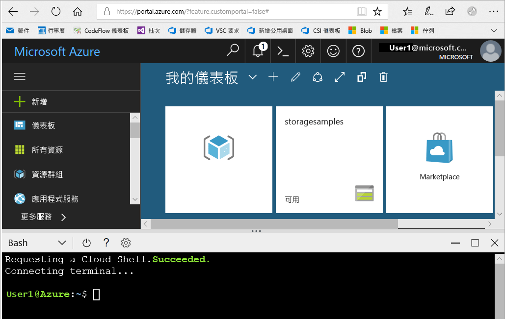

# <a name="create-a-storage-account"></a>建立儲存體帳戶

在本快速入門中，您將了解如何使用 [Azure 入口網站](https://portal.azure.com/)、[Azure PowerShell](https://docs.microsoft.com/powershell/azure/overview) 或 [Azure CLI](https://docs.microsoft.com/cli/azure?view=azure-cli-latest) 建立儲存體帳戶。  

## <a name="prerequisites"></a>必要條件

如果您沒有 Azure 訂用帳戶，請在開始前建立 [免費帳戶](https://azure.microsoft.com/free/)。

# <a name="portaltabportal"></a>[入口網站](#tab/portal)

無。

# <a name="powershelltabpowershell"></a>[PowerShell](#tab/powershell)

本快速入門需要 Azure PowerShell 模組 3.6 版或更新版本。 執行 `Get-Module -ListAvailable AzureRM` 來尋找您目前的版本。 如果您需要安裝或升級，請參閱[安裝 Azure PowerShell 模組](/powershell/azure/install-azurerm-ps)。

# <a name="azure-clitabazure-cli"></a>[Azure CLI](#tab/azure-cli)

您可以登入 Azure，並且以下列兩種方式之一執行 Azure CLI 命令：

- 您可以從 Azure 入口網站，在 Azure Cloud Shell 中執行 CLI 命令 
- 您可以安裝 CLI，並在本機執行 CLI 命令  

### <a name="use-azure-cloud-shell"></a>使用 Azure Cloud Shell

Azure Cloud Shell 是免費的 Bash Shell，您可以直接在 Azure 入口網站內執行。 它具有預先安裝和設定的 Azure CLI，可與您的帳戶搭配使用。 按一下 Azure 入口網站右上方功能表上的 [Cloud Shell] 按鈕：

[](https://portal.azure.com)

按鈕會啟動互動式殼層，可讓您用來執行本快速入門中的步驟：

[](https://portal.azure.com)

### <a name="install-the-cli-locally"></a>在本機安裝 CLI

您也可以在本機安裝及使用 Azure CLI。 本快速入門需要您執行 Azure CLI 2.0.4 版或更新版本。 執行 `az --version` 以尋找版本。 如果您需要安裝或升級，請參閱[安裝 Azure CLI](/cli/azure/install-azure-cli)。 

---

## <a name="log-in-to-azure"></a>登入 Azure

# <a name="portaltabportal"></a>[入口網站](#tab/portal)

登入 [Azure 入口網站](https://portal.azure.com)。

# <a name="powershelltabpowershell"></a>[PowerShell](#tab/powershell)

使用 `Connect-AzureRmAccount` 命令登入 Azure 訂用帳戶，並遵循畫面上的指示以進行驗證。

```powershell
Connect-AzureRmAccount
```

# <a name="azure-clitabazure-cli"></a>[Azure CLI](#tab/azure-cli)

若要啟動 Azure Cloud Shell，請登入 [Azure 入口網站](https://portal.azure.com)。

若要登入您的本機安裝 CLI，請執行登入命令：

```cli
az login
```

---

## <a name="create-a-storage-account"></a>建立儲存體帳戶

現在，您已經準備好建立儲存體帳戶。

每個儲存體帳戶都必須屬於 Azure 資源群組。 資源群組是用來群組 Azure 服務的邏輯容器。 當您建立儲存體帳戶時，可以選擇建立新的資源群組，或使用現有的資源群組。 本快速入門示範如何建立新的資源群組。 

**一般用途 v2** 儲存體帳戶提供所有 Azure 儲存體服務的存取權：Blob、檔案、佇列、資料表和磁碟。 本快速入門會建立一般用途 v2 儲存體帳戶，但建立任何類型儲存體帳戶的步驟都很類似。   

# <a name="portaltabportal"></a>[入口網站](#tab/portal)

[!INCLUDE [storage-create-account-portal-include](../../../includes/storage-create-account-portal-include.md)]

# <a name="powershelltabpowershell"></a>[PowerShell](#tab/powershell)

首先，透過 PowerShell，使用 [New-AzureRmResourceGroup](/powershell/module/azurerm.resources/new-azurermresourcegroup) 命令來建立新的資源群組： 

```powershell
# put resource group in a variable so you can use the same group name going forward,
# without hardcoding it repeatedly
$resourceGroup = "storage-quickstart-resource-group"
New-AzureRmResourceGroup -Name $resourceGroup -Location $location 
```

如果您不確定要針對 `-Location` 參數指定哪一個區域，您可以使用 [Get-AzureRmLocation](/powershell/module/azurerm.resources/get-azurermlocation) 命令擷取訂用帳戶所支援的區域清單：

```powershell
Get-AzureRmLocation | select Location 
$location = "westus"
```

接下來，建立具有本地備援儲存體 (LRS) 的一般用途 v2 儲存體帳戶。 使用 [New-AzureRmStorageAccount](/powershell/module/azurerm.storage/New-AzureRmStorageAccount) 命令： 

```powershell
New-AzureRmStorageAccount -ResourceGroupName $resourceGroup `
  -Name "storagequickstart" `
  -Location $location `
  -SkuName Standard_LRS `
  -Kind StorageV2 
```

若要建立具有區域備援儲存體 (ZRS) (預覽)、異地備援儲存體 (GRS) 或讀取權限異地備援儲存體 (RA-GRS) 的一般用途 v2 儲存體帳戶，請在下表中將 **SkuName** 參數取代為適當值。 

|複寫選項  |SkuName 參數  |
|---------|---------|
|本地備援儲存體 (LRS)     |Standard_LRS         |
|區域備援儲存體 (ZRS)     |Standard_ZRS         |
|異地備援儲存體 (GRS)     |Standard_GRS         |
|讀取權限異地備援儲存體 (GRS)     |Standard_RAGRS         |

# <a name="azure-clitabazure-cli"></a>[Azure CLI](#tab/azure-cli)

首先，透過 Azure CLI，使用 [az group create](/cli/azure/group#az_group_create) 命令來建立新的資源群組。 

```azurecli-interactive
az group create \
    --name storage-quickstart-resource-group \
    --location westus
```

如果您不確定要針對 `--location` 參數指定哪一個區域，您可以使用 [az account list-locations](/cli/azure/account#az_account_list) 命令擷取訂用帳戶所支援的區域清單。

```azurecli-interactive
az account list-locations \
    --query "[].{Region:name}" \
    --out table
```

接下來，建立具有本地備援儲存體的一般用途 v2 儲存體帳戶。 使用 [az storage account create](/cli/azure/storage/account#az_storage_account_create) 命令：

```azurecli-interactive
az storage account create \
    --name storagequickstart \
    --resource-group storage-quickstart-resource-group \
    --location westus \
    --sku Standard_LRS \
    --kind StorageV2
```

若要建立具有區域備援儲存體 (ZRS 預覽版)、異地備援儲存體 (GRS) 或讀取權限異地備援儲存體 (RA-GRS) 的一般用途 v2 儲存體帳戶，請在下表中將 **sku** 參數取代為適當值。 

|複寫選項  |sku 參數  |
|---------|---------|
|本地備援儲存體 (LRS)     |Standard_LRS         |
|區域備援儲存體 (ZRS)     |Standard_ZRS         |
|異地備援儲存體 (GRS)     |Standard_GRS         |
|讀取權限異地備援儲存體 (GRS)     |Standard_RAGRS         |

---

如需可用複寫選項的詳細資訊，請參閱[儲存體複寫選項](storage-redundancy.md)。

## <a name="clean-up-resources"></a>清除資源

如果您想要清除本快速入門所建立的資源，只要刪除資源群組即可。 刪除資源群組也會刪除相關聯的儲存體帳戶，以及與資源群組相關聯的任何其他資源。

# <a name="portaltabportal"></a>[入口網站](#tab/portal)

若要使用 Azure 入口網站刪除資源群組：

1. 在 Azure 入口網站中，展開左側功能表以開啟服務的功能表，然後選擇 [資源群組] 以顯示資源群組的清單。
2. 找出要刪除的資源群組，以滑鼠右鍵按一下清單右側的 [更多] 按鈕 (**...**)。
3. 選取 [刪除資源群組] 並且確認。

# <a name="powershelltabpowershell"></a>[PowerShell](#tab/powershell)

若要移除資源群組及其相關聯的資源，包括新的儲存體帳戶，請使用 [Remove-AzureRmResourceGroup](/powershell/module/azurerm.resources/remove-azurermresourcegroup) 命令： 

```powershell
Remove-AzureRmResourceGroup -Name $resourceGroup
```

# <a name="azure-clitabazure-cli"></a>[Azure CLI](#tab/azure-cli)

若要移除資源群組及其相關聯的資源，包括新的儲存體帳戶，請使用 [az group delete](/cli/azure/group#az_group_delete) 命令。

```azurecli-interactive
az group delete --name myResourceGroup
```

---

## <a name="next-steps"></a>後續步驟

在這個快速入門中，您已建立一般用途的標準儲存體帳戶。 若要了解如何在您的儲存體帳戶之間上傳和下載 Blob，請繼續進行 Blob 儲存體快速入門。

# <a name="portaltabportal"></a>[入口網站](#tab/portal)

> [!div class="nextstepaction"]
> [使用 Azure 入口網站處理 Blob](../blobs/storage-quickstart-blobs-portal.md)

# <a name="powershelltabpowershell"></a>[PowerShell](#tab/powershell)

> [!div class="nextstepaction"]
> [使用 PowerShell 處理 Blob](../blobs/storage-quickstart-blobs-powershell.md)

# <a name="azure-clitabazure-cli"></a>[Azure CLI](#tab/azure-cli)

> [!div class="nextstepaction"]
> [使用 Azure CLI 處理 Blob 儲存體](../blobs/storage-quickstart-blobs-cli.md)

---
