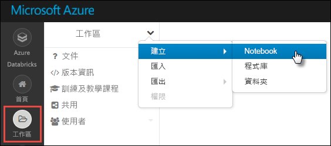
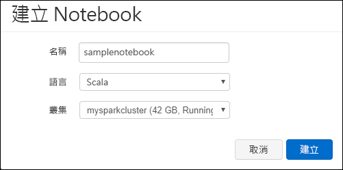

# <a name="tutorial-extract-transform-and-load-data-using-azure-databricks"></a>教學課程：使用 Azure Databrick 擷取、轉換和載入資料

在此教學課程中，您將使用 Azure Databricks 執行 ETL (擷取、轉換及載入資料) 作業，將資料從 Azure Data Lake Storage Gen2 預覽版移至 Azure SQL 資料倉儲。

下圖顯示此應用程式流程：


本教學課程涵蓋下列工作：

> [!div class="checklist"]
> * 建立 Azure Databricks 工作區
> * 在 Azure Databricks 中建立 Spark 叢集
> * 建立具有 Azure Data Lake Storage Gen2 功能的帳戶
> * 將資料上傳至 Azure Data Lake Storage Gen2
> * 在 Azure Databricks 中建立 Notebook
> * 從 Data Lake Storage Gen2 擷取資料
> * 轉換 Azure Databricks 中的資料
> * 將資料載入 Azure SQL 資料倉儲

如果您沒有 Azure 訂用帳戶，請在開始之前先[建立免費帳戶](https://azure.microsoft.com/free/)。

## <a name="prerequisites"></a>必要條件

若要完成本教學課程：

* 建立 Azure SQL 資料倉儲、建立伺服器層級的防火牆規則，並以伺服器管理員的身分連線至伺服器。請依照[快速入門：建立 Azure SQL 資料倉儲](../../sql-data-warehouse/create-data-warehouse-portal.md)中的指示操作
* 建立 Azure SQL 資料倉儲的資料庫主要金鑰。 請依照[建立資料庫主要金鑰](https://docs.microsoft.com/sql/relational-databases/security/encryption/create-a-database-master-key)中的指示操作。
* [建立 Azure Data Lake Storage Gen2 帳戶](quickstart-create-account.md)

## <a name="sign-in-to-the-azure-portal"></a>登入 Azure 入口網站

登入 [Azure 入口網站](https://portal.azure.com/)。

## <a name="create-an-azure-databricks-workspace"></a>建立 Azure Databricks 工作區

在本節中，您會使用 Azure 入口網站建立 Azure Databricks 工作區。 

1. 在 Azure 入口網站中，選取 [建立資源] > [分析] > [Azure Databricks]。

    

2. 在 [Azure Databricks 服務] 底下，提供值以建立 Databricks 工作區。

    

    提供下列值：

    |屬性  |說明  |
    |---------|---------|
    |**工作區名稱**     | 提供您 Databricks 工作區的名稱。        |
    |**訂用帳戶**     | 從下拉式清單中選取您的 Azure 訂用帳戶。        |
    |**資源群組**     | 指定您是要建立新的資源群組，還是使用現有資源群組。 資源群組是存放 Azure 方案相關資源的容器。 如需詳細資訊，請參閱 [Azure 資源群組概觀](../../azure-resource-manager/resource-group-overview.md)。 |
    |**位置**     | 選取 [美國西部 2]。 如需其他可用的區域，請參閱[依區域提供的 Azure 服務](https://azure.microsoft.com/regions/services/)。        |
    |定價層     |  選擇 [標準] 或 [進階]。 如需這些定價層的詳細資訊，請參閱 [Databricks 定價頁面](https://azure.microsoft.com/pricing/details/databricks/)。       |

    選取 [釘選到儀表板]，然後選取 [建立]。

3. 建立帳戶需要幾分鐘的時間。 建立帳戶期間，入口網站右側會顯示 [提交 Azure Databricks 部署] 圖格。 您可能需要在儀表板上向右捲動以查看此圖格。 另外在畫面頂端附近還會顯示一個進度列。 您可以查看任何進度區域。

    

## <a name="create-a-spark-cluster-in-databricks"></a>在 Databricks 中建立 Spark 叢集

1. 在 Azure 入口網站中，移至您所建立的 Databricks 工作區，然後選取 [啟動工作區]。

2. 系統會將您重新導向至 Azure Databricks 入口網站。 在入口網站中選取 [叢集]。

    

3. 在 [新增叢集] 頁面上，提供值以建立叢集。

    

    填寫下列欄位的值，然後接受其他欄位的預設值：

    * 輸入叢集的名稱。
    * 針對本文，使用 **4.2** 執行階段建立叢集。
    * 請確定您選取 **在活動 ___ 分鐘後終止** 核取方塊。 請提供用來終止叢集的叢集未使用持續時間 (以分鐘為單位)。

    選取 [建立叢集]。 叢集在執行後，您就可以將 Notebook 連結至叢集，並執行 Spark 作業。

## <a name="create-storage-account-file-system"></a>建立儲存體帳戶檔案系統

在本節中，您會在 Azure Databricks 工作區中建立 Notebook，然後執行程式碼片段以設定儲存體帳戶。

1. 在 [Azure 入口網站](https://portal.azure.com)中，移至您所建立的 Azure Databricks 工作區，然後選取 [啟動工作區]。

2. 在左側窗格中，選取 [工作區]。 從 [工作區] 下拉式清單選取 [建立] > [Notebook]。

    

3. 在 [建立 Notebook] 對話方塊中，輸入 Notebook 的名稱。 選取 [Scala] 作為語言，然後選取您先前建立的 Spark 叢集。

    

    選取 [建立] 。

4. 在第一個資料格中輸入下列程式碼，然後執行程式碼：

    ```scala
    spark.conf.set("fs.azure.account.key.<ACCOUNT_NAME>.dfs.core.windows.net", "<ACCOUNT_KEY>") 
    spark.conf.set("fs.azure.createRemoteFileSystemDuringInitialization", "true")
    dbutils.fs.ls("abfs://<FILE_SYSTEM_NAME>@<ACCOUNT_NAME>.dfs.core.windows.net/")
    spark.conf.set("fs.azure.createRemoteFileSystemDuringInitialization", "false") 
    ```

    按 **SHIFT + ENTER** 以執行程式碼單元。

    現在，會為儲存體帳戶建立檔案系統。

## <a name="upload-data-to-the-storage-account"></a>將資料上傳至儲存體帳戶

下一個步驟是將範例資料檔案上傳至儲存體帳戶中，以便稍候在 Azure Databricks 中進行轉換。 

> [!NOTE]
> 如果您還沒有具 Azure Data Lake Storage Gen2 功能的帳戶，請遵循[快速入門以建立帳戶](./quickstart-create-account.md)。

1. 從 [U-SQL 範例和問題追蹤](https://github.com/Azure/usql/blob/master/Examples/Samples/Data/json/radiowebsite/small_radio_json.json)存放庫下載 (**small_radio_json.json**)，並記下檔案的儲存路徑。

2. 接著，將資料範例上傳到儲存體帳戶。 用來將資料上傳到儲存體帳戶的方法，會因為您是否已啟用階層命名空間而有所不同。

    如果針對 Gen2 帳戶所建立的 Azure 儲存體帳戶上已啟用階層命名空間，您便可以使用 Azure Data Factory、distp 或 AzCopy (第 10 版) 來處理上傳。 AzCopy 第 10 版僅供預覽版客戶使用。 若要使用 AzCopy，請將下列程式碼傳入命令視窗：

    ```bash
    set ACCOUNT_NAME=<ACCOUNT_NAME>
    set ACCOUNT_KEY=<ACCOUNT_KEY>
    azcopy cp "<DOWNLOAD_PATH>\small_radio_json.json" https://<ACCOUNT_NAME>.dfs.core.windows.net/data --recursive 
    ```
    
## <a name="extract-data-from-azure-storage"></a>從 Azure 儲存體擷取資料

返回 DataBricks Notebook，然後在新的資料格中輸入下列程式碼：

1. 在空白程式碼資料格中新增下列程式碼片段，並以您稍早從儲存體帳戶儲存的值取代預留位置值。

    ```scala
    dbutils.widgets.text("storage_account_name", "STORAGE_ACCOUNT_NAME", "<YOUR_STORAGE_ACCOUNT_NAME>")
    dbutils.widgets.text("storage_account_access_key", "YOUR_ACCESS_KEY", "<YOUR_STORAGE_ACCOUNT_SHARED_KEY>")
    ```

    按 **SHIFT + ENTER** 以執行程式碼單元。

2. 您現在可以將 json 檔案範例以資料框架的形式載入 Azure Databricks。 在新的資料格中貼上下列程式碼，然後按 **SHIFT + ENTER** (務必要取代預留位置值)：

    ```scala
    val df = spark.read.json("abfs://<FILE_SYSTEM_NAME>@<ACCOUNT_NAME>.dfs.core.windows.net/data/small_radio_json.json")
    ```

3. 執行下列程式碼，以查看資料框架的內容。

    ```scala
    df.show()
    ```

    您會看到如下列程式碼片段的輸出：

    ```bash
    +---------------------+---------+---------+------+-------------+----------+---------+-------+--------------------+------+--------+-------------+---------+--------------------+------+-------------+------+
    |               artist|     auth|firstName|gender|itemInSession|  lastName|   length|  level|            location|method|    page| registration|sessionId|                song|status|           ts|userId|
    +---------------------+---------+---------+------+-------------+----------+---------+-------+--------------------+------+--------+-------------+---------+--------------------+------+-------------+------+
    | El Arrebato         |Logged In| Annalyse|     F|            2|Montgomery|234.57914| free  |  Killeen-Temple, TX|   PUT|NextSong|1384448062332|     1879|Quiero Quererte Q...|   200|1409318650332|   309|
    | Creedence Clearwa...|Logged In|   Dylann|     M|            9|    Thomas|340.87138| paid  |       Anchorage, AK|   PUT|NextSong|1400723739332|       10|        Born To Move|   200|1409318653332|    11|
    | Gorillaz            |Logged In|     Liam|     M|           11|     Watts|246.17751| paid  |New York-Newark-J...|   PUT|NextSong|1406279422332|     2047|                DARE|   200|1409318685332|   201|
    ...
    ...
    ```

您現在已將資料從 Azure Data Lake Storage Gen2 擷取至 Azure Databricks。

## <a name="transform-data-in-azure-databricks"></a>轉換 Azure Databricks 中的資料

未經處理的範例資料 **small_radio_json.json** 擷取了廣播電台的聽眾，並且有不同資料行。 在本節中，您會將資料轉換為僅從資料集擷取特定資料行。

1. 一開始，僅在已建立的資料框架中擷取 *firstName*、*lastName**gender**location* 和 *level* 資料行。

    ```scala
    val specificColumnsDf = df.select("firstname", "lastname", "gender", "location", "level")
    ```

    您會取得如下列程式碼片段所示的輸出：

    ```bash
    +---------+----------+------+--------------------+-----+
    |firstname|  lastname|gender|            location|level|
    +---------+----------+------+--------------------+-----+
    | Annalyse|Montgomery|     F|  Killeen-Temple, TX| free|
    |   Dylann|    Thomas|     M|       Anchorage, AK| paid|
    |     Liam|     Watts|     M|New York-Newark-J...| paid|
    |     Tess|  Townsend|     F|Nashville-Davidso...| free|
    |  Margaux|     Smith|     F|Atlanta-Sandy Spr...| free|
    |     Alan|     Morse|     M|Chicago-Napervill...| paid|
    |Gabriella|   Shelton|     F|San Jose-Sunnyval...| free|
    |   Elijah|  Williams|     M|Detroit-Warren-De...| paid|
    |  Margaux|     Smith|     F|Atlanta-Sandy Spr...| free|
    |     Tess|  Townsend|     F|Nashville-Davidso...| free|
    |     Alan|     Morse|     M|Chicago-Napervill...| paid|
    |     Liam|     Watts|     M|New York-Newark-J...| paid|
    |     Liam|     Watts|     M|New York-Newark-J...| paid|
    |   Dylann|    Thomas|     M|       Anchorage, AK| paid|
    |     Alan|     Morse|     M|Chicago-Napervill...| paid|
    |   Elijah|  Williams|     M|Detroit-Warren-De...| paid|
    |  Margaux|     Smith|     F|Atlanta-Sandy Spr...| free|
    |     Alan|     Morse|     M|Chicago-Napervill...| paid|
    |   Dylann|    Thomas|     M|       Anchorage, AK| paid|
    |  Margaux|     Smith|     F|Atlanta-Sandy Spr...| free|
    +---------+----------+------+--------------------+-----+
    ```

2.  您可以進一步轉換此資料，將 **level** 資料行重新命名為 **subscription_type**。

    ```scala
    val renamedColumnsDF = specificColumnsDf.withColumnRenamed("level", "subscription_type")
    renamedColumnsDF.show()
    ```

    您會取得如下列程式碼片段所示的輸出。

    ```bash
    +---------+----------+------+--------------------+-----------------+
    |firstname|  lastname|gender|            location|subscription_type|
    +---------+----------+------+--------------------+-----------------+
    | Annalyse|Montgomery|     F|  Killeen-Temple, TX|             free|
    |   Dylann|    Thomas|     M|       Anchorage, AK|             paid|
    |     Liam|     Watts|     M|New York-Newark-J...|             paid|
    |     Tess|  Townsend|     F|Nashville-Davidso...|             free|
    |  Margaux|     Smith|     F|Atlanta-Sandy Spr...|             free|
    |     Alan|     Morse|     M|Chicago-Napervill...|             paid|
    |Gabriella|   Shelton|     F|San Jose-Sunnyval...|             free|
    |   Elijah|  Williams|     M|Detroit-Warren-De...|             paid|
    |  Margaux|     Smith|     F|Atlanta-Sandy Spr...|             free|
    |     Tess|  Townsend|     F|Nashville-Davidso...|             free|
    |     Alan|     Morse|     M|Chicago-Napervill...|             paid|
    |     Liam|     Watts|     M|New York-Newark-J...|             paid|
    |     Liam|     Watts|     M|New York-Newark-J...|             paid|
    |   Dylann|    Thomas|     M|       Anchorage, AK|             paid|
    |     Alan|     Morse|     M|Chicago-Napervill...|             paid|
    |   Elijah|  Williams|     M|Detroit-Warren-De...|             paid|
    |  Margaux|     Smith|     F|Atlanta-Sandy Spr...|             free|
    |     Alan|     Morse|     M|Chicago-Napervill...|             paid|
    |   Dylann|    Thomas|     M|       Anchorage, AK|             paid|
    |  Margaux|     Smith|     F|Atlanta-Sandy Spr...|             free|
    +---------+----------+------+--------------------+-----------------+
    ```

## <a name="load-data-into-azure-sql-data-warehouse"></a>將資料載入 Azure SQL 資料倉儲

在本節中，您會將已轉換的資料上傳至 Azure SQL 資料倉儲。 您可以使用適用於 Azure Databricks 的 Azure SQL 資料倉儲連接器，直接將資料框架以表格形式上傳至 SQL 資料倉儲。

如先前所述，在 Azure Databricks 和 Azure SQL 資料倉儲之間上傳資料時，SQL 資料倉儲連接器會使用 Azure Blob 儲存體作為暫時儲存體。 因此，一開始您需提供要連線到儲存體帳戶的組態。 您必須已建立屬於本文必要條件的帳戶。

1. 提供可從 Azure Databricks 存取 Azure 儲存體帳戶的組態。

    ```scala
    val storageURI = "<STORAGE_ACCOUNT_NAME>.dfs.core.windows.net"
    val fileSystemName = "<FILE_SYSTEM_NAME>"
    val accessKey =  "<ACCESS_KEY>"
    ```

2. 指定在 Azure Databricks 與 Azure SQL 資料倉儲之間移動資料所用的暫存資料夾。

    ```scala
    val tempDir = "abfs://" + fileSystemName + "@" + storageURI +"/tempDirs"
    ```

3. 執行下列程式碼片段，儲存組態中的 Azure Blob 儲存體存取金鑰。 這可確保您不必在 Notebook 中以純文字保留存取金鑰。

    ```scala
    val acntInfo = "fs.azure.account.key."+ storageURI
    sc.hadoopConfiguration.set(acntInfo, accessKey)
    ```

4. 提供用來連線至 Azure SQL 資料倉儲執行個體的值。 您必須已建立屬於必要條件的 SQL 資料倉儲。

    ```scala
    //SQL Data Warehouse related settings
    val dwDatabase = "<DATABASE NAME>"
    val dwServer = "<DATABASE SERVER NAME>" 
    val dwUser = "<USER NAME>"
    val dwPass = "<PASSWORD>"
    val dwJdbcPort =  "1433"
    val dwJdbcExtraOptions = "encrypt=true;trustServerCertificate=true;hostNameInCertificate=*.database.windows.net;loginTimeout=30;"
    val sqlDwUrl = "jdbc:sqlserver://" + dwServer + ".database.windows.net:" + dwJdbcPort + ";database=" + dwDatabase + ";user=" + dwUser+";password=" + dwPass + ";$dwJdbcExtraOptions"
    val sqlDwUrlSmall = "jdbc:sqlserver://" + dwServer + ".database.windows.net:" + dwJdbcPort + ";database=" + dwDatabase + ";user=" + dwUser+";password=" + dwPass
    ```

5. 執行下列程式碼片段，將已轉換的資料框架 **renamedColumnsDF** 以表格形式載入 SQL 資料倉儲。 此程式碼片段會在 SQL 資料庫中建立名為 **SampleTable** 的資料表。

    ```scala
    spark.conf.set(
        "spark.sql.parquet.writeLegacyFormat",
        "true")
    
    renamedColumnsDF.write
        .format("com.databricks.spark.sqldw")
        .option("url", sqlDwUrlSmall) 
        .option("dbtable", "SampleTable")
        .option( "forward_spark_azure_storage_credentials","True")
        .option("tempdir", tempDir)
        .mode("overwrite")
        .save()
    ```

6. 連線至 SQL 資料庫，並確認您已看到 **SampleTable**。

    

7. 執行 SELECT 查詢，以確認資料表的內容。 這應該與 **renamedColumnsDF** 資料框架的資料相同。

    

## <a name="clean-up-resources"></a>清除資源

在本教學課程執行完後，您可以終止叢集。 若要這樣做，請從 Azure Databricks 工作區的左窗格中選取 [叢集]。 對於您想要終止的叢集，將游標移到 [動作] 資料行底下的省略符號上，然後選取 [終止] 圖示。


如果您不手動終止叢集，叢集將會自動停止，但前提是您已在建立叢集時選取 [在停止活動 __ 分鐘後終止] 核取方塊。 在這種情況下，叢集將會在停止運作達指定時間後自動停止。

## <a name="next-steps"></a>後續步驟

在本教學課程中，您已了解如何：

> [!div class="checklist"]
> * 建立 Azure Databricks 工作區
> * 在 Azure Databricks 中建立 Spark 叢集
> * 建立具有 Azure Data Lake Storage Gen2 功能的帳戶
> * 將資料上傳至 Azure Data Lake Storage Gen2
> * 在 Azure Databricks 中建立 Notebook
> * 從 Data Lake Storage Gen2 擷取資料
> * 轉換 Azure Databricks 中的資料
> * 將資料載入 Azure SQL 資料倉儲

前往下一個教學課程，了解如何使用 Azure 事件中樞將即時資料串流到 Azure Databricks。

> [!div class="nextstepaction"]
>[使用事件中樞將資料串流至 Azure Databricks](../../azure-databricks/databricks-stream-from-eventhubs.md)
