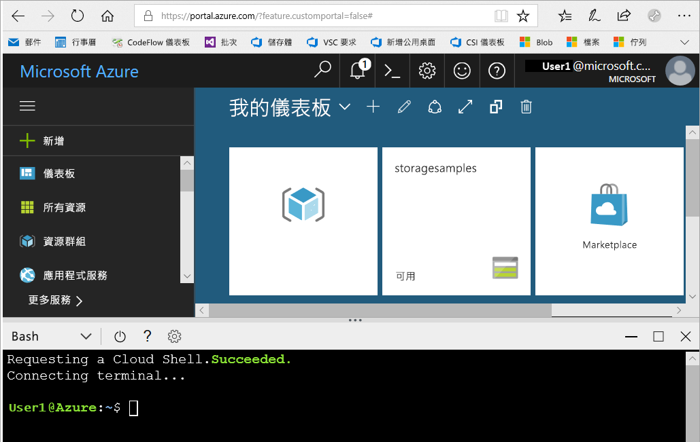
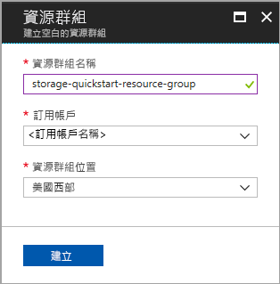
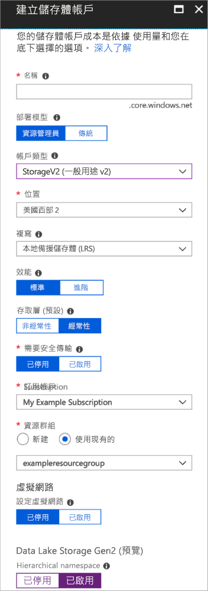

# <a name="quickstart-create-an-azure-data-lake-storage-gen2-preview-storage-account"></a>快速入門：建立 Azure Data Lake Storage Gen2 預覽版儲存體帳戶

Azure Data Lake Storage Gen2 預覽版帳戶[支援階層式命名空間服務](introduction.md)，其提供專門打造的原生目錄型檔案系統，可與 Hadoop 分散式檔案系統 (HDFS) 搭配運作。 透過 [ABFS 驅動程式](abfs-driver.md)即可從 HDFS 存取 Data Lake Storage Gen2 資料。

若要在儲存體帳戶上啟用 Data Lake Storage Gen2 功能，請[填妥預覽版問卷來要求存取權](https://aka.ms/adlsgen2signup)。 通過核准後，您就可以建立新的 Data Lake Storage Gen2 帳戶。 本快速入門會示範如何使用 [Azure 入口網站](https://portal.azure.com/)、[Azure PowerShell](https://docs.microsoft.com/powershell/azure/overview) 或透過 [Azure CLI](https://docs.microsoft.com/cli/azure?view=azure-cli-latest) 建立帳戶。

> [!NOTE]
> 您通過核准可以建立 Data Lake Storage Gen2 帳戶後，Azure 入口網站中的「建立帳戶」UI 就會更新。 同樣地，在您通過核准可以使用預覽版後，Data Lake Storage Gen2 的相關 PowerShell 和 CLI 引數才會有作用。

## <a name="prerequisites"></a>必要條件

如果您沒有 Azure 訂用帳戶，請在開始前建立 [免費帳戶](https://azure.microsoft.com/free/) 。

|           | 必要條件 |
|-----------|--------------|
|入口網站     | None         |
|PowerShell | 本快速入門需要 Azure PowerShell 模組 **5.0.4-preview** 版或更新版本。 執行 `Get-Module -ListAvailable AzureRM` 來尋找您目前的版本。 如果您需要安裝或升級，請參閱[安裝 Azure PowerShell 模組](/powershell/azure/install-azurerm-ps)。 |
|CLI        | 您可以登入 Azure，並且以下列兩種方式之一執行 Azure CLI 命令： <ul><li>您可以從 Azure 入口網站，在 Azure Cloud Shell 中執行 CLI 命令 </li><li>您可以安裝 CLI，並在本機執行 CLI 命令</li></ul>|

在命令列上工作時，您可以選擇執行 Azure Cloud Shell 或在本機安裝 CLI。

### <a name="use-azure-cloud-shell"></a>使用 Azure Cloud Shell

Azure Cloud Shell 是免費的 Bash Shell，您可以直接在 Azure 入口網站內執行。 它具有預先安裝和設定的 Azure CLI，可與您的帳戶搭配使用。 按一下 Azure 入口網站右上方功能表上的 [Cloud Shell] 按鈕：

[](https://portal.azure.com)

按鈕會啟動互動式殼層，可讓您用來執行本快速入門中的步驟：

[](https://portal.azure.com)

### <a name="install-the-cli-locally"></a>在本機安裝 CLI

您也可以在本機安裝及使用 Azure CLI。 此快速入門需要您執行 Azure CLI 2.0.38 版或更新版本。 執行 `az --version` 以尋找版本。 如果您需要安裝或升級，請參閱[安裝 Azure CLI](/cli/azure/install-azure-cli)。

## <a name="overview-of-creating-an-azure-data-lake-storage-gen2-account"></a>Azure Data Lake Storage Gen2 帳戶的建立概觀

在建立帳戶前，請先建立資源群組，以作為儲存體帳戶或其他所建立 Azure 資源的邏輯容器。 如果您想要清除本快速入門所建立的資源，只要刪除資源群組即可。 刪除資源群組也會刪除相關聯的儲存體帳戶，以及與資源群組相關聯的任何其他資源。 如需關於資源群組的詳細資訊，請參閱 [Azure Resource Manager 概觀](../../azure-resource-manager/resource-group-overview.md)。

> [!NOTE]
> 您必須建立 **StorageV2 (general-purpose V2)** 類型的新儲存體帳戶，才能利用 Data Lake Storage Gen2 功能。  

如需儲存體帳戶的詳細資訊，請參閱 [Azure 儲存體帳戶概觀](../common/storage-account-overview.md)。

為您的儲存體帳戶命名時，請記住這些規則：

- 儲存體帳戶名稱必須介於 3 到 24 個字元的長度，而且只能包含數字和小寫字母。
- 儲存體帳戶名稱必須在 Azure 中是獨一無二的。 任兩個儲存體帳戶名稱不得相同。

## <a name="create-an-account-using-the-azure-portal"></a>使用 Azure 入口網站建立帳戶

登入 [Azure 入口網站](https://portal.azure.com)。

### <a name="create-a-resource-group"></a>建立資源群組

若要在 Azure 入口網站中建立資源群組，請遵循下列步驟：

1. 在 Azure 入口網站中，展開左側功能表以開啟服務的功能表，然後選擇 [資源群組]。
2. 按一下 [新增] 按鈕，以新增新的資源群組。
3. 輸入新資源群組的名稱。
4. 選取要在其中建立新資源群組的訂用帳戶。
5. 選擇資源群組的位置。
6. 按一下 [ **建立** ] 按鈕。  



### <a name="create-a-general-purpose-v2-storage-account"></a>建立一般用途的 v2 儲存體帳戶

若要在 Azure 入口網站中建立一般用途 v2 儲存體帳戶，請遵循下列步驟：

> [!NOTE]
> 只有在美國東部、美國東部 2、美國西部、美國西部 2、美國中西部、北歐、西歐、東南亞和澳大利亞東部才會啟用階層式命名空間。 在建立儲存體帳戶時，請務必指定這兩個位置其中之一。

1. 在 Azure 入口網站中，展開左側功能表以開啟服務的功能表，然後選擇 [所有服務]。 然後，向下捲動至 [儲存體]，然後選擇 [儲存體帳戶]。 在出現的 [儲存體帳戶] 視窗上，選擇 [新增]。
2. 輸入儲存體帳戶的名稱。
3. 讓 [部署模型] 繼續設定為預設值。
4. 將 [帳戶類型] 欄位設定為 [StorageV2 (一般用途 v2)]。
5. 將 [位置] 設定為 [美國西部 2]
6. 將 [複寫] 欄位的設定保留為 [本地備援儲存體 (LRS)]。
7. 讓這些欄位設定為其預設值：[複寫]。 [效能]、[存取層]。
8. 選擇您要在其中建立儲存體帳戶的訂用帳戶。
9. 在 [資源群組] 區段中，選取 [使用現有]，然後選擇您在上一節中建立的資源群組。
10. 保留 [虛擬網路] 的預設值
11. 在 [Data Lake Storage Gen2 (預覽版)] 區段中，將 [階層式命名空間] 設定為 [啟用]。
12. 按一下 [建立]  建立儲存體帳戶。



系統現在會透過入口網站建立儲存體帳戶。

### <a name="clean-up-resources"></a>清除資源

若要使用 Azure 入口網站刪除資源群組：

1. 在 Azure 入口網站中，展開左側功能表以開啟服務的功能表，然後選擇 [資源群組] 以顯示資源群組的清單。
2. 找出要刪除的資源群組，以滑鼠右鍵按一下清單右側的 [更多] 按鈕 (**...**)。
3. 選取 [刪除資源群組] 並且確認。

## <a name="create-an-account-using-powershell"></a>使用 PowerShell 建立帳戶

使用 `Login-AzureRmAccount` 命令登入 Azure 訂用帳戶，並遵循畫面上的指示以進行驗證。

```powershell
Login-AzureRmAccount
```

### <a name="upgrade-your-powershell-module"></a>升級 PowerShell 模組

若要透過 PowerShell 與 Data Lake Storage Gen2 互動，您必須將模組升級為預覽版本。

若要這樣做，請開啟提升權限的 PowerShell 並輸入下列命令：`Install-Module AzureRM.Storage –Repository PSGallery -RequiredVersion 5.0.4-preview –AllowPrerelease –AllowClobber –Force `

然後重新啟動殼層。

### <a name="create-a-resource-group"></a>建立資源群組

若要使用 PowerShell 建立新的資源群組，請使用 [New-AzureRmResourceGroup](/powershell/module/azurerm.resources/new-azurermresourcegroup) 命令： 

> [!NOTE]
> 只有在美國東部、美國東部 2、美國西部、美國西部 2、美國中西部、北歐、西歐、東南亞和澳大利亞東部才會啟用階層式命名空間。 在建立儲存體帳戶時，請務必指定這兩個位置其中之一。

```powershell
# put resource group in a variable so you can use the same group name going forward,
# without hardcoding it repeatedly
$resourceGroup = "storage-quickstart-resource-group"
$location = "westus2"
New-AzureRmResourceGroup -Name $resourceGroup -Location $location
```

### <a name="create-a-general-purpose-v2-storage-account"></a>建立一般用途的 v2 儲存體帳戶

若要從 PowerShell 建立具有本地備援儲存體 (LRS) 的一般用途 v2 儲存體帳戶，請使用 [New-AzureRmStorageAccount](/powershell/module/azurerm.storage/New-AzureRmStorageAccount) 命令：

```powershell
Get-AzureRmLocation | select Location 
$location = "westus2"

New-AzureRmStorageAccount -ResourceGroupName $resourceGroup `
  -Name "storagequickstart" `
  -Location $location `
  -SkuName Standard_LRS `
  -Kind StorageV2 
  -EnableHierarchicalNamespace $True
```

### <a name="clean-up-resources"></a>清除資源

若要移除資源群組及其相關聯的資源，包括新的儲存體帳戶，請使用 [Remove-AzureRmResourceGroup](/powershell/module/azurerm.resources/remove-azurermresourcegroup) 命令： 

```powershell
Remove-AzureRmResourceGroup -Name $resourceGroup
```

## <a name="create-an-account-using-azure-cli"></a>使用 Azure CLI 建立帳戶

若要啟動 Azure Cloud Shell，請登入 [Azure 入口網站](https://portal.azure.com)。

若要登入您的本機安裝 CLI，請執行登入命令：

```cli
az login
```

### <a name="upgrade-your-cli-module"></a>升級 CLI 模組

若要透過 CLI 與 Data Lake Storage Gen2 互動，您必須在殼層中新增擴充功能。

若要這樣做：請使用 Cloud Shell 或本機殼層輸入下列命令：`az extension add --name storage-preview`

### <a name="create-a-resource-group"></a>建立資源群組

若要使用 Azure CLI 建立新的資源群組，請使用 [az group create](/cli/azure/group#az_group_create) 命令。

```azurecli-interactive
az group create \
    --name storage-quickstart-resource-group \
    --location westus2
```

> [!NOTE]
> 只有在美國東部、美國東部 2、美國西部、美國西部 2、美國中西部、北歐、西歐、東南亞和澳大利亞東部才會啟用階層式命名空間。 在建立儲存體帳戶時，請務必指定這兩個位置其中之一。

### <a name="create-a-general-purpose-v2-storage-account"></a>建立一般用途的 v2 儲存體帳戶

若要從 Azure CLI 建立具有本地備援儲存體的一般用途 v2 儲存體帳戶，請使用 [az storage account create](/cli/azure/storage/account#az_storage_account_create) 命令。

```azurecli-interactive
az storage account create \
    --name storagequickstart \
    --resource-group storage-quickstart-resource-group \
    --location westus2 \
    --sku Standard_LRS \
    --kind StorageV2 \
    --hierarchical-namespace true
```

### <a name="clean-up-resources"></a>清除資源

若要移除資源群組及其相關聯的資源，包括新的儲存體帳戶，請使用 [az group delete](/cli/azure/group#az_group_delete) 命令。

```azurecli-interactive
az group delete --name myResourceGroup
```

## <a name="next-steps"></a>後續步驟

在這個快速入門中，您已建立 Data Lake Storage Gen2 儲存體帳戶。 若要了解如何在您的儲存體帳戶之間上傳和下載 Blob，請繼續進行 Blob 儲存體快速入門。

* [使用 AzCopy 從 Azure Blob 儲存體來回移動資料](https://docs.microsoft.com/azure/machine-learning/team-data-science-process/move-data-to-azure-blob-using-azcopy)