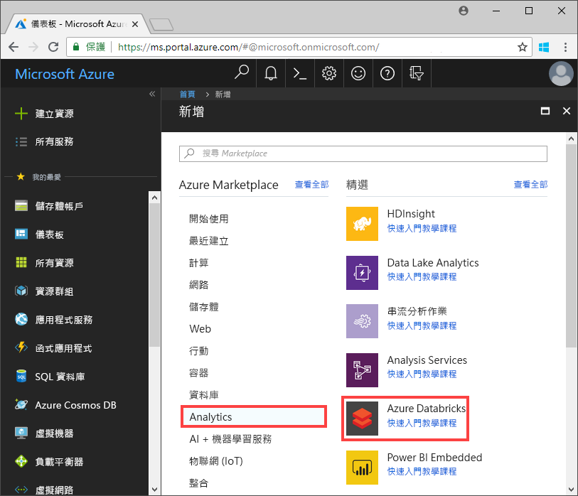
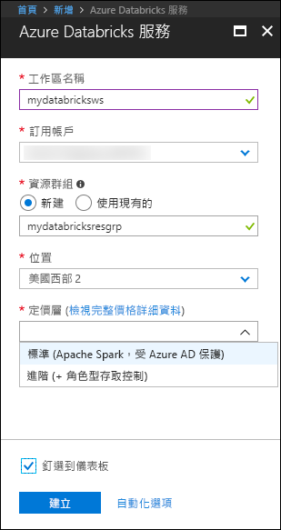
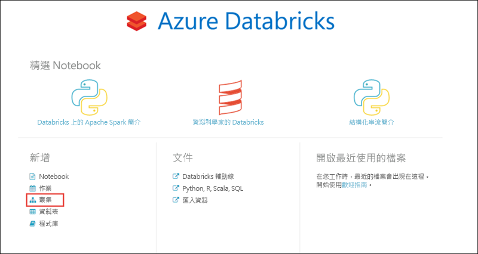
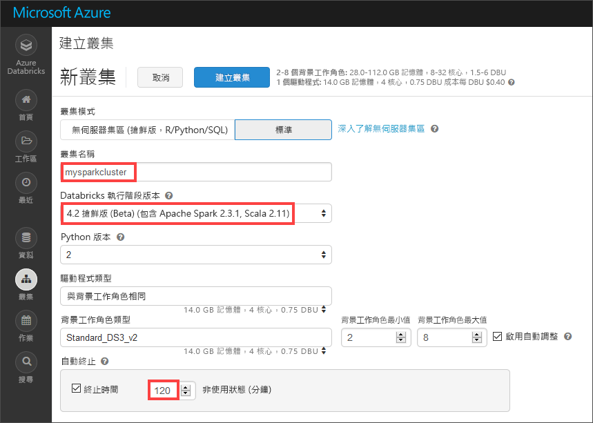
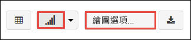
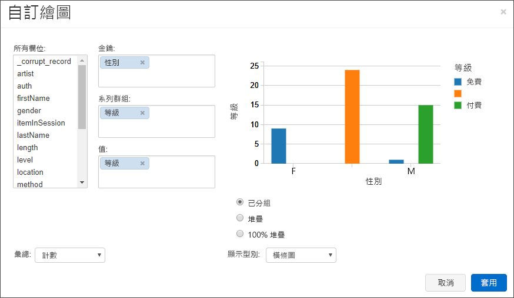
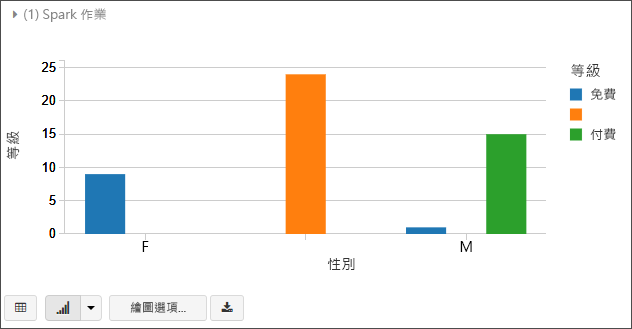
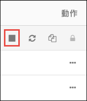

# <a name="quickstart-run-a-spark-job-on-azure-databricks-using-the-azure-portal"></a>快速入門：使用 Azure 入口網站在 Azure Databricks 上執行 Spark 作業

本快速入門說明如何使用 Azure Databricks 執行 Apache Spark 作業，以對 Azure Data Lake Storage Gen2 預覽版中所儲存的資料執行分析。

您會透過 Spark 作業分析電台頻道訂閱資料，以根據人口統計資料深入了解免費/付費的使用方式。

如果您沒有 Azure 訂用帳戶，請在開始之前先[建立免費帳戶](https://azure.microsoft.com/free/)。

## <a name="prerequisites"></a>必要條件

- [建立 Azure Data Lake Storage Gen2 帳戶](quickstart-create-account.md)

## <a name="set-aside-storage-account-configuration"></a>設定儲存體帳戶組態

> [!IMPORTANT]
> 本教學課程進行期間，您必須能夠存取儲存體帳戶名稱和存取金鑰。 在 Azure 入口網站中，選取 [所有服務]，然後篩選 [儲存體]。 選取 [儲存體帳戶]，並找出您針對本教學課程所建立的帳戶。
>
> 從 [概觀] 將儲存體帳戶的**名稱**複製到文字編輯器中。 接下來，選取 [存取金鑰]，並將 [key1] 的值複製到文字編輯器，以供後續命令使用。

## <a name="create-an-azure-databricks-workspace"></a>建立 Azure Databricks 工作區

在本節中，您會使用 Azure 入口網站建立 Azure Databricks 工作區。

1. 在 Azure 入口網站中，選取 [建立資源] > [分析] > [Azure Databricks]。 

    

2. 在 [Azure Databricks 服務] 底下，提供值以建立 Databricks 工作區。

    

    提供下列值：
     
    |屬性  |說明  |
    |---------|---------|
    |**工作區名稱**     | 提供您 Databricks 工作區的名稱        |
    |**訂用帳戶**     | 從下拉式清單中選取您的 Azure 訂用帳戶。        |
    |**資源群組**     | 指定您是要建立新的資源群組，還是使用現有資源群組。 資源群組是存放 Azure 方案相關資源的容器。 如需詳細資訊，請參閱 [Azure 資源群組概觀](../../azure-resource-manager/resource-group-overview.md)。 |
    |**位置**     | 選取 [美國西部 2]。 如需其他可用的區域，請參閱[依區域提供的 Azure 服務](https://azure.microsoft.com/regions/services/)。        |
    |定價層     |  選擇 [標準] 或 [進階]。 如需這些定價層的詳細資訊，請參閱 [Databricks 定價頁面](https://azure.microsoft.com/pricing/details/databricks/)。       |

    選取 [釘選到儀表板]，然後按一下 [建立]。

3. 工作區建立需要幾分鐘的時間。 建立工作區期間，入口網站右側會顯示 [提交 Azure Databricks 部署] 圖格。 您可能需要在儀表板上向右捲動以查看此圖格。 另外在畫面頂端附近還會顯示一個進度列。 您可以查看任何進度區域。

    

## <a name="create-a-spark-cluster-in-databricks"></a>在 Databricks 中建立 Spark 叢集

1. 在 Azure 入口網站中，移至您所建立的 Databricks 工作區，然後選取 [啟動工作區]。

2. 系統會將您重新導向至 Azure Databricks 入口網站。 在入口網站中，選取 [新增] > [叢集]。

    

3. 在 [新增叢集] 頁面上，提供值以建立叢集。

    

    接受下列值以外的所有其他預設值：

    * 輸入叢集的名稱。
    * 建立具有 **4.2 搶鮮版 (Beta)** 執行階段的叢集。
    * 務必要選取 [在停止活動 120 分鐘後終止] 核取方塊。 請提供用來終止叢集的叢集未使用持續時間 (以分鐘為單位)。

4. 選取 [建立叢集]。 叢集在執行後，您就可以將 Notebook 連結至叢集，並執行 Spark 作業。

如需如何建立叢集的詳細資訊，請參閱[在 Azure Databricks 建立 Spark 叢集](https://docs.azuredatabricks.net/user-guide/clusters/create.html)。

## <a name="create-storage-account-file-system"></a>建立儲存體帳戶檔案系統

在本節中，您會在 Azure Databricks 工作區中建立 Notebook，然後執行程式碼片段以設定儲存體帳戶。

1. 在 [Azure 入口網站](https://portal.azure.com)中，移至您所建立的 Azure Databricks 工作區，然後選取 [啟動工作區]。

2. 在左側窗格中，選取 [工作區]。 從 [工作區] 下拉式清單選取 [建立] > [Notebook]。

    

3. 在 [建立 Notebook] 對話方塊中，輸入 Notebook 的名稱。 選取 [Scala] 作為語言，然後選取您先前建立的 Spark 叢集。

    

    選取 [建立] 。

4. 在下列程式碼中，使用您在本快速入門開頭中保留的值取代 **ACCOUNT_NAME** 和 **ACCOUNT_KEY** 文字。 並以您想要的檔案系統名稱取代 **FILE_SYSTEM_NAME** 文字。 然後在第一個儲存格中，輸入程式碼。

    ```scala
    spark.conf.set("fs.azure.account.key.<ACCOUNT_NAME>.dfs.core.windows.net", "<ACCOUNT_KEY>") 
    spark.conf.set("fs.azure.createRemoteFileSystemDuringInitialization", "true")
    dbutils.fs.ls("abfss://<FILE_SYSTEM_NAME>@<ACCOUNT_NAME>.dfs.core.windows.net/")
    spark.conf.set("fs.azure.createRemoteFileSystemDuringInitialization", "false") 
    ```

    按 **SHIFT + ENTER** 以執行程式碼單元。

    現在，會為儲存體帳戶建立檔案系統。

## <a name="ingest-sample-data"></a>內嵌範例資料

開始本節之前，您必須先完成下列必要條件：

在 Notebook 資料格中輸入下列程式碼：

    %sh wget -P /tmp https://raw.githubusercontent.com/Azure/usql/master/Examples/Samples/Data/json/radiowebsite/small_radio_json.json

在資料格中，按 `Shift` + `Enter` 來執行程式碼。

現在，在以下這一個新的資料格中，輸入下列程式碼 (以您稍早使用的相同值取代 **FILE_SYSTEM** 和 **ACCOUNT_NAME**)：

    dbutils.fs.cp("file:///tmp/small_radio_json.json", "abfss://<FILE_SYSTEM>@<ACCOUNT_NAME>.dfs.core.windows.net/")

在資料格中，按 `Shift` + `Enter` 來執行程式碼。

## <a name="run-a-spark-sql-job"></a>執行 Spark SQL 作業

執行下列工作以在資料上執行 Spark SQL 作業。

1. 執行 SQL 陳述式，以使用 JSON 資料檔案範例 **small_radio_json.json** 中的資料建立暫存資料表。 在下列程式碼片段中，將預留位置值取代為檔案系統名稱和儲存體帳戶名稱。 使用您稍早建立的 Notebook，在 Notebook 的新程式碼資料格中貼上程式碼片段，然後按下 SHIFT + ENTER 鍵。

    ```sql
    %sql
    DROP TABLE IF EXISTS radio_sample_data;
    CREATE TABLE radio_sample_data
    USING json
    OPTIONS (
     path  "abfss://<FILE_SYSTEM_NAME>@<ACCOUNT_NAME>.dfs.core.windows.net/<PATH>/small_radio_json.json"
    )
    ```

    在命令順利完成後，您就會將 JSON 檔案中的所有資料變成 Databricks 叢集中的資料表。

    `%sql` 語言的 magic 命令可讓您從 Notebook 執行 SQL 程式碼，即使該 Notebook 屬於其他類型也是如此。 如需詳細資訊，請參閱[在 Notebook 中混合使用語言](https://docs.azuredatabricks.net/user-guide/notebooks/index.html#mixing-languages-in-a-notebook)。

2. 讓我們看看 JSON 資料範例的快照集，以便進一步了解您所執行的查詢。 將下列程式碼片段貼到程式碼資料格中，然後按下 **SHIFT + ENTER**。

    ```sql
    %sql 
    SELECT * from radio_sample_data
    ```

3. 您會看到如下列螢幕擷取畫面所示的表格式輸出 (僅顯示某些資料行)：

    

    至於其他細節，資料範例會擷取電台頻道的聽眾性別 (資料行名稱為**性別**)，以及其擁有的是免費或付費訂閱 (資料行名稱為**層級**)。

4. 您現在可以建立這項資料的視覺呈現，以顯示每種性別、多少使用者擁有免費帳戶，以及多少使用者是付費訂閱者。 從表格式輸出底部，按一下 [長條圖] 圖示，然後再按一下 [繪圖選項]。

    

5. 在 [自訂繪圖] 中，如螢幕擷取畫面所示的方式拖放值。

    

    - 將 [索引鍵] 設定為 [性別]。
    - 將 [數列群組] 設定為 [層級]。
    - 將 [值] 設定為 [層級]。
    - 將 [彙總] 設定為 [計數]。

6. 按一下 [套用]。

7. 輸出會顯示這些值的視覺呈現，如下列螢幕擷取畫面所示：

     

## <a name="clean-up-resources"></a>清除資源

在完成本文後，您可以終止叢集。 從 Azure Databricks 工作區，選取 [叢集]，然後找到您要終止的叢集。 將游標游標移到 [動作] 資料行底下的省略符號上，然後選取 [終止] 圖示。



如果您不手動終止叢集，叢集會自動停止，但前提是您已在建立叢集時選取 [在停止活動 __ 分鐘後終止] 核取方塊。 如果您設定此選項，叢集會在停止活動達指定時間長度後停止。

## <a name="next-steps"></a>後續步驟

在本文中，您已在 Azure Databricks 建立 Spark 叢集，並於 Data Lake Storage Gen2 中使用資料執行 Spark 作業。 您也可以查看 [Spark 資料來源](https://docs.azuredatabricks.net/spark/latest/data-sources/index.html)，以了解如何從其他資料來源將資料匯入到 Azure Databricks。 前往下一篇文章，以了解如何使用 Azure Databricks 執行 ETL 作業 (擷取、轉換及載入資料)。

> [!div class="nextstepaction"]
>[使用 Azure Databrick 擷取、轉換和載入資料](../../azure-databricks/databricks-extract-load-sql-data-warehouse.md)
