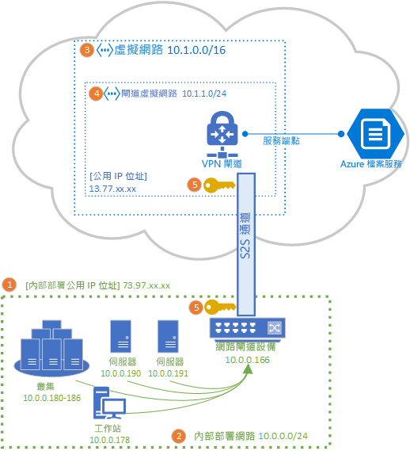
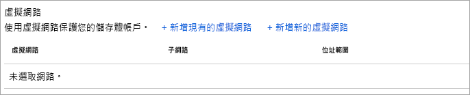

# 設定站對站 VPN 以用於 Azure 檔案儲存體
您可以使用站對站 (S2S) VPN 連線，從內部部署網路透過 SMB 掛接 Azure 檔案共用，而不需要開啟連接埠 445。 您可以使用 [Azure VPN 閘道](../../vpn-gateway/vpn-gateway-about-vpngateways.md)來設定站對站 VPN，這是一個 Azure 資源供應項目 VPN 服務，會與儲存體帳戶或其他 Azure 資源一起部署在資源群組中。

強烈建議您先閱讀 [Azure 檔案儲存體網路概觀](storage-files-networking-overview.md)，再繼續閱讀此操作說明文章，以充分了解適用於 Azure 檔案儲存體的網路選項。

本文將詳細說明設定站對站 VPN 以直接在內部部署掛接 Azure 檔案共用的步驟。 如果您想要透過站對站 VPN 來路由傳送 Azure 檔案同步的同步流量，請參閱[設定 Azure 檔案同步 Proxy 和防火牆設定](storage-sync-files-firewall-and-proxy.md)。

## 必要條件
- 您要在內部部署掛接的 Azure 檔案共用。 您可以將[標準](storage-how-to-create-file-share.md)或[進階 Azure 檔案共用](storage-how-to-create-premium-fileshare.md)與您的站對站 VPN 搭配使用。

- 您的內部部署資料中心內與 Azure VPN 閘道相容的網路設備或伺服器。 Azure 檔案儲存體與所選的內部部署網路設備無關，但 Azure VPN 閘道會維護[已測試的裝置清單](../../vpn-gateway/vpn-gateway-about-vpn-devices.md)。 不同的網路設備會提供不同的功能、效能特性和管理功能，因此在選取網路設備時，請將其納入考量。

    如果您沒有現有的網路設備，Windows Server 包含內建的伺服器角色、路由和遠端存取 (RRAS)，可供您作為內部部署網路設備。 若要深入了解如何在 Windows Server 中設定路由和遠端存取，請參閱 [RAS 閘道](https://docs.microsoft.com/windows-server/remote/remote-access/ras-gateway/ras-gateway)。

## 將儲存體帳戶新增至 VNet
在 Azure 入口網站中，瀏覽至要在內部部署掛接的 Azure 檔案共用所屬的儲存體帳戶。 在儲存體帳戶的目錄中，選取 [防火牆和虛擬網路]  項目。 除非您在建立虛擬網路時已將其新增至儲存體帳戶，否則在產生的窗格中，選取的 [所有網路]  應該會有 [允許從此存取]  選項按鈕。

若要將您的儲存體帳戶新增至所需的虛擬網路，請選取 [選取的網路]  。 在 [虛擬網路]  子標題底下，視所需的狀態按一下 [+ 新增現有的虛擬網路]  或 [新增虛擬網路]  。 建立新的虛擬網路後，將會建立新的 Azure 資源。 新的或現有的 VNet 資源不一定要與儲存體帳戶位於相同的資源群組或訂用帳戶中，但必須位於與儲存體帳戶相同的區域中，且您的 VNet 部署所在的資源群組和訂用帳戶，必須與您的 VPN 閘道所將部署到的相符。 

如果您新增現有的虛擬網路，系統會要求您從該虛擬網路中選取儲存體帳戶所應新增到的一或多個子網路。 如果您選取新的虛擬網路，您將在建立虛擬網路時建立子網路，並在稍後透過為虛擬網路產生的 Azure 資源新增更多子網路。

如果您之前並未將儲存體帳戶新增至訂用帳戶，則必須將 Microsoft.Storage 服務端點新增至虛擬網路。 這可能需要一些時間，且在此作業完成之前，您將無法存取該儲存體帳戶中的 Azure 檔案共用，包括透過 VPN 連線。 

## 部署 Azure VPN 閘道
在 Azure 入口網站的目錄中，選取 [建立新的資源]  ，並搜尋 [虛擬網路閘道]  。 您的虛擬網路閘道必須與您在先前的步驟中部署的虛擬網路位於相同的訂用帳戶、Azure 區域和資源群組中 (請注意，在挑選虛擬網路時，會自動選取資源群組)。 

為了部署 Azure VPN 閘道，您必須填入下列欄位：

- **名稱**：VPN 閘道的 Azure 資源名稱。 此名稱可以是您認為在管理方面有其效用的任何名稱。
- **區域**：將在其中部署 VPN 閘道的區域。
- **閘道類型**：為了部署站對站 VPN，您必須選取 **VPN**。
- **VPN 類型**：您可以選擇 [依路由]  * 或 [依原則]  ，視您的 VPN 裝置而定。 以路由為基礎的 VPN 支援 IKEv2，以原則為基礎的 VPN 則僅支援 IKEv1。 若要深入了解這兩種類型的 VPN 閘道，請參閱[關於以原則為基礎和以路由為基礎的 VPN 閘道](../../vpn-gateway/vpn-gateway-connect-multiple-policybased-rm-ps.md#about)
- **SKU**：SKU 會控制允許的站對站通道數目和所需的 VPN 效能。 若要為您的使用案例選取適當的 SKU，請參閱[閘道 SKU](../../vpn-gateway/vpn-gateway-about-vpngateways.md#gwsku) 清單。 如有必要，可於後續變更 VPN 閘道的 SKU。
- **虛擬網路**：您在先前的步驟中建立的虛擬網路。
- **公用 IP 位址**：將公開至網際網路之 VPN 閘道的 IP 位址。 可能的話，您必須建立新的 IP 位址，但若適當的話，您也可以使用未使用的現有 IP 位址。 如果您選取 [新建]  ，則會在與 VPN 閘道相同的資源群組中建立新的 IP 位址 Azure 資源，而**公用 IP 位址名稱**將是新建 IP 位址的名稱。 如果您選取 [使用現有的]  ，則必須選取未使用的現有 IP 位址。
- **啟用主動-主動模式**：只有在建立「主動-主動」閘道組態時，才應選取 [啟用]  ，否則請保留為 [停用]  。 若要深入了解「主動-主動」模式，請參閱[高可用性跨單位和 VNet 對 VNet 連線能力](../../vpn-gateway/vpn-gateway-highlyavailable.md)。
- **設定 BGP ASN**：只有在您的組態特別需要此設定時，才應選取 [啟用]  。 若要深入了解此設定，請參閱[關於 BGP 與 Azure VPN 閘道](../../vpn-gateway/vpn-gateway-bgp-overview.md)。

選取 [檢閱 + 建立]  以建立 VPN 閘道。 要完整建立和部署 VPN 閘道，最多可能需要 45 分鐘的時間。

### 建立區域網路閘道以作為您的內部部署閘道 
區域網路閘道是代表內部部署網路設備的 Azure 資源。 在 Azure 入口網站的目錄中，選取 [建立新的資源]  ，並搜尋 [區域網路閘道]  。 區域網路閘道是會與您的儲存體帳戶、虛擬網路和 VPN 閘道一起部署的 Azure 資源，但不需要與儲存體帳戶位於相同的資源群組或訂用帳戶中。 

為了部署區域網路閘道資源，您必須填入下列欄位：

- **名稱**：區域網路閘道的 Azure 資源名稱。 此名稱可以是您認為在管理方面有其效用的任何名稱。
- **IP 位址**：內部部署區域閘道的公用 IP 位址。
- **位址空間**：此區域網路閘道所代表之網路的位址範圍。 您可以新增多個位址空間範圍，但請確定您在此處指定的範圍不會與您要連接到的其他網路範圍重疊。 
- **設定 BGP 設定**：只有在您的組態需要此設定時，才需設定 BGP 設定。 若要深入了解此設定，請參閱[關於 BGP 與 Azure VPN 閘道](../../vpn-gateway/vpn-gateway-bgp-overview.md)。
- 訂用帳戶  ：所需的訂用帳戶。 這不需要與用於 VPN 閘道或儲存體帳戶的訂用帳戶相符。
- **資源群組**：所需的資源群組。 這不需要與用於 VPN 閘道或儲存體帳戶的資源群組相符。
- **位置**：應在其中建立區域網路閘道資源的 Azure 區域。 此區域應符合您為 VPN 閘道和儲存體帳戶選取的區域。

選取 [建立]  以建立區域網路閘道資源。  

## 設定內部部署網路設備
設定內部部署網路設備的具體步驟，取決於您的組織選取的網路設備。 根據組織所選擇的裝置，[已測試的裝置清單](../../vpn-gateway/vpn-gateway-about-vpn-devices.md)可能會連結至裝置廠商針對 Azure VPN 閘道的設定而提供的指示。

## 建立私人端點 (預覽)
為您的儲存體帳戶建立私人端點，可為您的儲存體帳戶提供虛擬網路的 IP 位址空間內的 IP 位址。 當您使用此私人 IP 位址從內部部署掛接 Azure 檔案共用時，VPN 安裝所自動定義的路由規則將會透過 VPN 將您的掛接要求路由傳送至儲存體帳戶。 

在 [儲存體帳戶] 刀鋒視窗中，選取左側目錄中的 [私人端點連線]  和 [+ 私人端點]  ，以建立新的私人端點。 產生的精靈會有多個頁面需要完成：

![此螢幕擷取畫面顯示 [建立私人端點] 區段的 [基本] 區段](media/storage-files-configure-s2s-vpn/create-private-endpoint-1.png)

在 [基本]  索引標籤上，為您的私人端點選取所需的資源群組、名稱和區域。 您可以任意選取這些項目，而不一定要與儲存體帳戶相符，但您建立私人端點的所在區域，必須與您要在其中建立私人端點的虛擬網路相同。

在 [資源]  索引標籤上，選取 [連線到我目錄中的 Azure 資源]  的選項按鈕。 在 [資源類型]  底下，選取 [Microsoft.Storage/storageAccounts]  作為 [資源類型]。 [資源]  欄位是您要連線到的 Azure 檔案共用所屬的儲存體帳戶。 目標子資源是**檔案**，因為這是用於 Azure 檔案儲存體的。

[組態]  索引標籤可讓您選取要新增私人端點的特定虛擬網路和子網路。 選取您先前建立的虛擬網路。 您必須選取與先前新增了服務端點的子網路不同的子網路。

[組態]  索引標籤也可讓您設定私人 DNS 區域。 這並非必要作業，但可讓您使用易記的 UNC 路徑 (例如 `\\mystorageaccount.privatelink.file.core.windows.net\myshare`) 來掛接 Azure 檔案共用，而不使用具有 IP 位址的 UNC 路徑。 此作業也可在您的虛擬網路內使用您自己的 DNS 伺服器來完成。

按一下 [檢閱 + 建立]  以建立私人端點。 私人端點建立後，您將會看到兩項新資源：私人端點資源和配對的虛擬網路介面。 虛擬網路介面資源將具有儲存體帳戶的專用私人 IP。 

## 建立站對站連線
若要完成 S2S VPN 的部署，您必須建立內部部署網路設備 (以區域網路閘道資源表示) 與 VPN 閘道之間的連線。 若要這麼做，請瀏覽至您先前建立的 VPN 閘道。 在 VPN 閘道的目錄中，選取 [連線]  ，然後按一下 [新增]  。 產生的 [新增連線]  窗格需要下列欄位：

- **名稱**：連線的名稱。 VPN 閘道可裝載多個連線，因此請挑選有助於您進行管理的名稱，以利區分此特定連線。
- **連線類型**：由於這是 S2S 連線，請在下拉式清單中選取 [站對站 (IPSec)]  。
- **虛擬網路閘道**：此欄位會自動選取為您要建立連線的 VPN 閘道，且無法變更。
- **區域網路閘道**：這是您要連線至 VPN 閘道的區域網路閘道。 產生的選取窗格應該會有您先前建立的區域網路閘道名稱。
- **共用金鑰 (PSK)** ：字母和數位的混合，用以建立連線的加密。 虛擬網路和區域網路閘道中必須使用相同的共用金鑰。 如果您的閘道裝置未提供此金鑰，您可以在此建立，並將其提供給您的裝置。

選取 [確定]  以建立連線。 您可以透過 [連線]  頁面確認連線已成功建立。

## 掛接 Azure 檔案共用 
設定 S2S VPN 的最後一個步驟，是確認它適用於 Azure 檔案儲存體。 您可以將內部部署 Azure 檔案共用掛接於您慣用的作業系統，以進行此確認。 如需依作業系統掛接的指示，請參閱：

- [Windows](storage-how-to-use-files-windows.md)
- [macOS](storage-how-to-use-files-mac.md)
- [Linux](storage-how-to-use-files-linux.md)

## 另請參閱
- [Azure 檔案儲存體網路概觀](storage-files-networking-overview.md)
- [在 Windows 上設定點對站 (P2S) VPN 以用於 Azure 檔案儲存體](storage-files-configure-p2s-vpn-windows.md)
- [在 Linux 上設定點對站 (P2S) VPN 以用於 Azure 檔案儲存體](storage-files-configure-p2s-vpn-linux.md)
