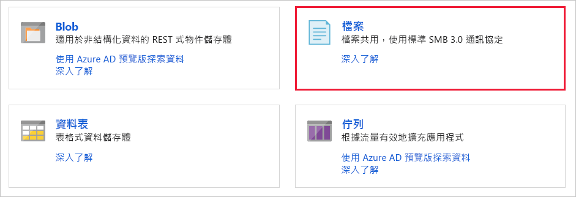
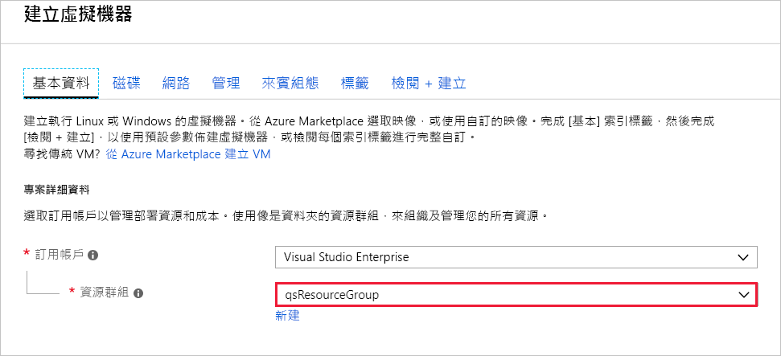
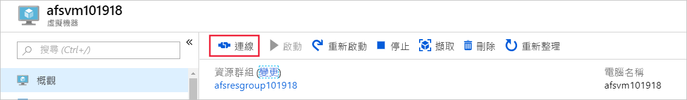
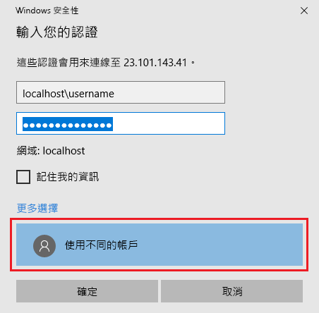
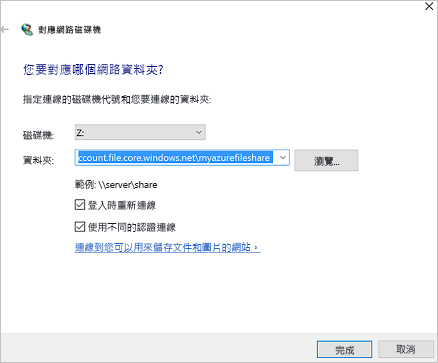
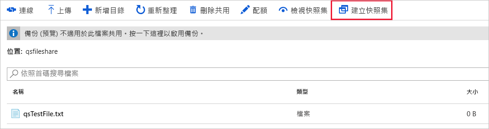
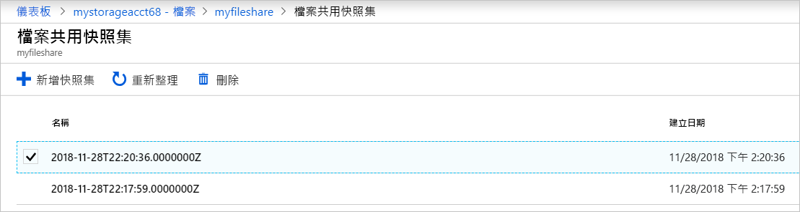
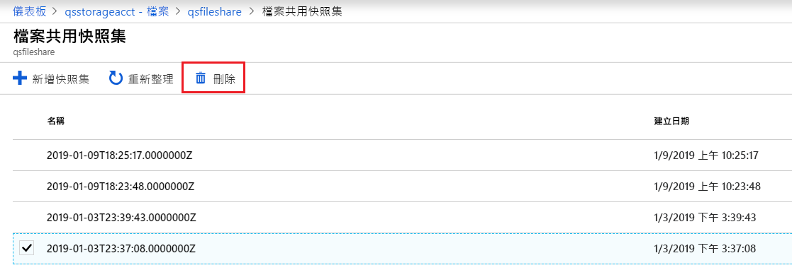
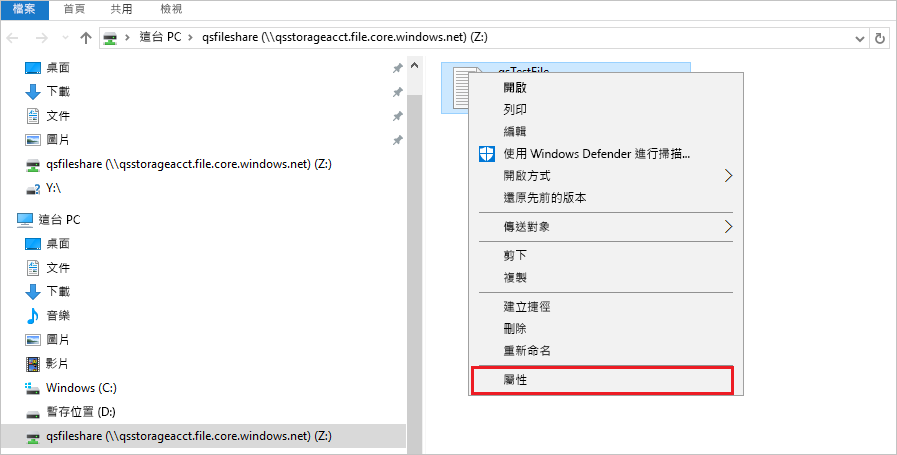

# 快速入門：使用 Windows 虛擬機器建立和管理 Azure 檔案共用

本文示範建立和使用 Azure 檔案共用的基本步驟。 本快速入門主要說明如何快速設定 Azure 檔案共用，以協助您體驗此服務的運作方式。 如需關於在您自己的環境中建立和使用 Azure 檔案共用的詳細指示，請參閱[搭配 Windows 使用 Azure 檔案共用](storage-how-to-use-files-windows.md)。

如果您沒有 Azure 訂用帳戶，請在開始前建立 [免費帳戶](https://azure.microsoft.com/free/?WT.mc_id=A261C142F) 。

## 登入 Azure

登入 [Azure 入口網站](https://portal.azure.com)。

## 準備您的環境

在本快速入門中，您會設定下列項目：

- Azure 儲存體帳戶和 Azure 檔案共用
- Windows Server 2016 Datacenter VM

### 建立儲存體帳戶

您必須先建立 Azure 儲存體帳戶，才能使用 Azure 檔案共用。 一般用途 v2 儲存體帳戶提供對所有 Azure 儲存體服務的存取：Blob、檔案、佇列和資料表。 本快速入門會建立一般用途 v2 儲存體帳戶，但建立任何類型儲存體帳戶的步驟都很類似。 儲存體帳戶可以包含無限多個共用。 共用可儲存無限制數目的檔案，最多可達儲存體帳戶的容量限制。

[!INCLUDE [storage-create-account-portal-include](../../../includes/storage-create-account-portal-include.md)]

### 建立 Azure 檔案共用

接下來，請建立檔案共用。

1. 在 Azure 儲存體帳戶部署完成後，選取 [前往資源]  。
1. 在 [儲存體帳戶] 窗格中選取 [檔案]  。

    

1. 選取 [+ 檔案共用]  。

    ![選取 [新增檔案共用] 按鈕](./media/storage-files-quick-create-use-windows/create-file-share.png)

1. 將新的檔案共用命名為 qsfileshare  > 在 [配額]  中輸入 "1" > 選取 [建立]  。 配額上限為 5 TiB，但本快速入門只需要 1 GB。
1. 在您的本機電腦上建立名為 qsTestFile  的新文字檔。
1. 選取新的檔案共用，然後在檔案共用位置上選取 [上傳]  。

    

1. 瀏覽至您的 .txt 檔案建立所在的位置 > 選取 qsTestFile.txt  > 選取 [上傳]  。

至此，您已建立 Azure 儲存體帳戶，並在 Azure 中建立了具有一個檔案的檔案共用。 接著，您將使用 Windows Server 2016 Datacenter 來建立 Azure VM，以代表本快速入門中的內部部署伺服器。

### 部署 VM

1. 接下來，展開入口網站左側的功能表，然後在 Azure 入口網站的左上角選擇 [建立資源]  。
1. 在 **Azure Marketplace** 資源清單上方的搜尋方塊中，搜尋並選取**Windows Server 2016 Datacenter**，然後選擇 [建立]  。
1. 在 [基本概念]  索引標籤的 [專案詳細資料]  下方，選取您為本快速入門建立的資源群組。

   

1. 在 [執行個體詳細資料]  下方，將 VM 命名為 qsVM  。
1. 保留 [區域]  、[可用性選項]  、[映像]  及 [大小]  的預設設定。
1. 在 [系統管理員帳戶]  下方新增 VMadmin  作為 [使用者名稱]  ，並輸入 VM 的 [密碼]  。
1. 在 [輸入連接埠規則]  底下，選擇 [允許選取的連接埠]  ，然後從下拉式清單中選取 [RDP (3389)]  和 [HTTP]  。
1. 選取 [檢閱 + 建立]  。
1. 選取 [建立]  。 建立新的 VM 需要幾分鐘的時間才能完成。

1. 在 VM 部署完成後，請選取 [前往資源]  。

此時，您已建立新的虛擬機器，並連結資料磁碟。 現在，您需要連線至 VM。

### 連接到您的 VM

1. 在虛擬機器的 [屬性] 頁面上選取 [連線]  。

   

1. 在 [連線至虛擬機器]  頁面中，保留以 [IP 位址]  透過**連接埠號碼** 3389  進行連線的預設選項，然後選取 [下載 RDP 檔案]  。
1. 開啟下載的 RDP 檔案，然後在出現提示時選取 [連線]  。
1. 在 [Windows 安全性]  視窗中，選取 [更多選擇]  ，然後選取 [使用不同的帳戶]  。 輸入 localhost\username  作為使用者名稱，其中，&lt;username&gt; 是您為虛擬機器建立的 VM 管理員使用者名稱。 輸入您為虛擬機器建立的密碼，然後選取 [確定]  。

   

1. 您可能會在登入過程中收到憑證警告。 選取 [是]  或 [繼續]  以建立連線。

## 將 Azure 檔案共用對應至 Windows 磁碟機

1. 在 Azure 入口網站中瀏覽至 qsfileshare  檔案共用，然後選取 [連線]  。
1. 將第二個方塊的內容複製並貼到**記事本**中。

   ![[Azure 檔案服務連線] 窗格中的 UNC 路徑](./media/storage-files-quick-create-use-windows/portal_netuse_connect2.png)

1. 在 VM 中開啟**檔案總管**，然後在視窗中選取 [此電腦]  。 此選項會變更功能區中的可用功能表。 在 [電腦]  功能表上，選取 [對應網路磁碟機]  。
1. 選取磁碟機代號並輸入 UNC 路徑。 如果您先前遵循本快速入門中的命名建議，請從**記事本**中複製 *\\qsstorageacct.file.core.windows.net\qsfileshare*。

   請確定這兩個核取方塊都已勾選。

   

1. 選取 [完成]  。
1. 在 [Windows 安全性]  對話方塊中：

   - 從「記事本」中複製前面加上 AZURE\ 的儲存體帳戶名稱，並將其貼到 [Windows 安全性]  對話方塊中，作為使用者名稱。 如果您先前遵循本快速入門中的命名建議，請複製 *AZURE\qsstorageacct*。
   - 從「記事本」中複製儲存體帳戶金鑰，並將其貼到 [Windows 安全性]  對話方塊中，作為密碼。

      ![[Azure 檔案服務連線] 窗格中的 UNC 路徑](./media/storage-files-quick-create-use-windows/portal_netuse_connect3.png)

## 建立共用快照集

您現在已對應磁碟機，接下來可以建立快照集。

1. 在入口網站中瀏覽至您的檔案共用，然後選取 [建立快照集]  。

   

1. 在 VM 中開啟 qstestfile.txt  ，並輸入「此檔案已修改過」> 儲存並關閉檔案。
1. 建立另一個快照集。

## 瀏覽共用快照集

1. 在您的檔案共用上，選取 [檢視快照集]  。
1. 在 [檔案共用快照集]  窗格上，選取清單中的第一個快照集。

   

1. 在該快照集的窗格上，選取 [qsTestFile.txt]  。

## 從快照集還原

1. 在 [檔案共用快照集] 刀鋒視窗中，以滑鼠右鍵按一下 *qsTestFile*，然後選取 [還原]  按鈕。
1. 選取 [覆寫原始檔案]  。

   ![[下載] 及 [還原] 按鈕](./media/storage-files-quick-create-use-windows/snapshot-download-restore-portal.png)

1. 在 VM 中開啟檔案。 未修改的版本已還原。

## 刪除共用快照集

1. 在您的檔案共用上，選取 [檢視快照集]  。
1. 在 [檔案共用快照集]  窗格上選取清單中的最後一個快照集，然後按一下 [刪除]  。

   

## 在 Windows 中使用共用快照集

就像使用內部部署 VSS 快照集一樣，您可以使用 [先前的版本] 索引標籤從已掛接的 Azure 檔案共用檢視快照集。

1. 在 [檔案總管] 中，找出已掛接的共用。

   ![在 [檔案總管] 中掛接的共用](./media/storage-files-quick-create-use-windows/snapshot-windows-mount.png)

1. 選取 [qsTestFile.txt]  並按一下滑鼠右鍵，然後從功能表中選取 [屬性]  。

   

1. 選取 [舊版]  ，以查看此目錄之共用快照集的清單。

1. 選取 [開啟]  以開啟快照集。

   ![[舊版] 索引標籤](./media/storage-files-quick-create-use-windows/snapshot-windows-list.png)

## 從舊版還原

1. 選取 [還原]  。 此動作可在共用快照集建立時，將整個目錄的內容以遞迴方式複製到原始位置。

   ![警告訊息中的 [還原] 按鈕](./media/storage-files-quick-create-use-windows/snapshot-windows-restore.png)

## 清除資源

[!INCLUDE [storage-files-clean-up-portal](../../../includes/storage-files-clean-up-portal.md)]

## 後續步驟

> [!div class="nextstepaction"]
> [搭配 Windows 使用 Azure 檔案共用](storage-how-to-use-files-windows.md)
