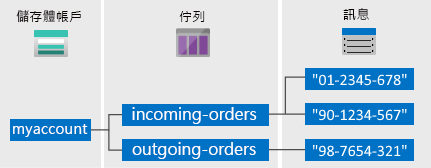

# 什麼是 Azure 佇列？

Azure 佇列儲存體是用來儲存大量訊息的服務。 使用 HTTP 或 HTTPS 透過境過驗證的呼叫，存取來自世界各地的訊息。 一則佇列訊息的大小可能高達 64 KB。 佇列可以包含數百萬則訊息，最高可達儲存體帳戶的總容量限制。

## 常見用途

佇列儲存體的一般用途包括：

* 建立積存的工作供非同步處理
* 將訊息從 Azure Web 角色傳遞至 Azure 背景工作角色

## 佇列服務概念

佇列服務包含下列元件：

* **URL 格式：** 可利用下列 URL 格式來定址佇列：

    `https://<storage account>.queue.core.windows.net/<queue>`
  
    下列 URL 可定址圖中的佇列：  
  
    `https://myaccount.queue.core.windows.net/images-to-download`

* **儲存體帳戶：** 所有對 Azure 儲存體的存取都是透過儲存體帳戶進行。 如需關於儲存體帳戶容量的詳細資訊，請參閱＜ [Azure 儲存體延展性和效能目標](../common/storage-scalability-targets.md?toc=%2fazure%2fstorage%2fqueues%2ftoc.json) ＞(英文)。

* **佇列：** 佇列包含一組訊息。 佇列名稱**必須**是小寫。 如需為佇列命名的詳細資訊，請參閱 [為佇列和中繼資料命名](https://msdn.microsoft.com/library/azure/dd179349.aspx)。

* **訊息：** 大小上限為 64 KB 的訊息 (任何格式)。 在版本 2017-07-29 之前，允許的存留時間上限是七天。 如需版本 2017-07-29 或更新版本，最大存留時間可以是任何正數，或是表示訊息未過期的 -1。 如果省略此參數，則預設存留時間為 7 天。

## 後續步驟

* [建立儲存體帳戶](../storage-create-storage-account.md?toc=%2fazure%2fstorage%2fqueues%2ftoc.json)
* [透過 .NET 開始使用佇列](storage-dotnet-how-to-use-queues.md)
