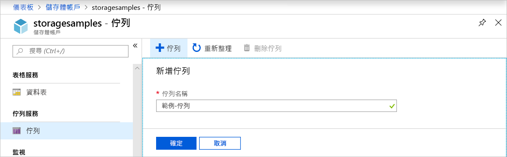
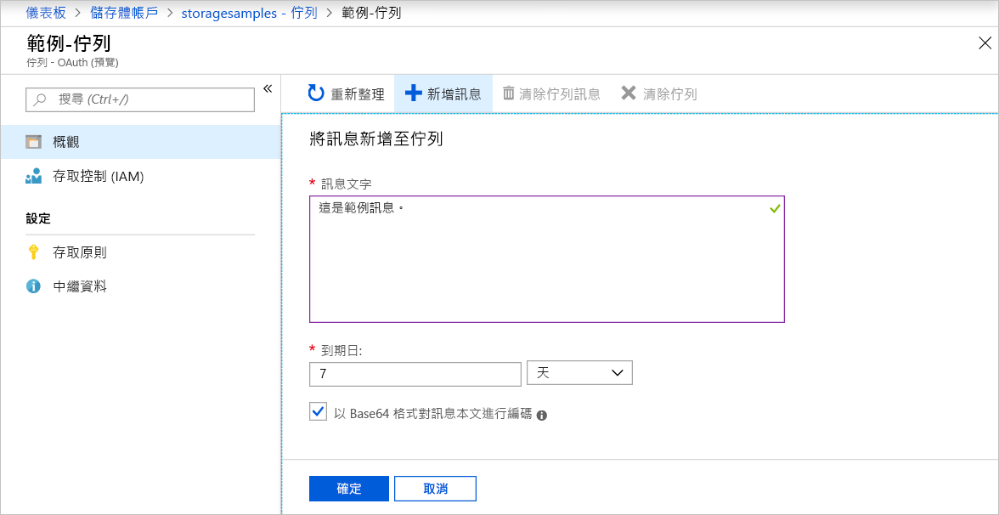
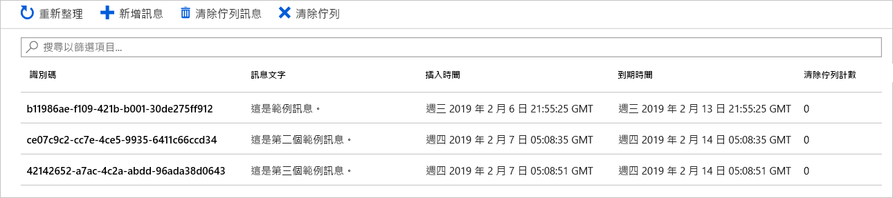

# 快速入門：透過 Azure 入口網站建立佇列並新增訊息

在本快速入門中，您會了解如何使用 [Azure 入口網站](https://portal.azure.com/)在 Azure 儲存體中建立佇列，以及新增訊息和清除佇列中的訊息。

## 必要條件

[!INCLUDE [storage-quickstart-prereq-include](../../../includes/storage-quickstart-prereq-include.md)]

## 建立佇列

若要在 Azure 入口網站中建立佇列，請遵循下列步驟：

1. 在 Azure 入口網站中瀏覽至新的儲存體帳戶。
2. 在儲存體帳戶的左窗格中，捲動到 [佇列服務] 區段，然後選取 [佇列]。
3. 選取 [+ 佇列] 按鈕。
4. 輸入新佇列的名稱。 佇列名稱必須是小寫，以字母或數字開頭，並且只能包含字母、數字和虛線 (-) 字元。
6. 選取 [確定] 以建立佇列。

    

## 新增訊息

接下來，將訊息新增至新佇列。 一則訊息的大小可能高達 64 KB。

1. 從儲存體帳戶的佇列清單中選取新的佇列。
1. 選取 [+ 新增訊息] 按鈕，將訊息新增至佇列。 在 [訊息文字] 欄位中輸入訊息。 
1. 指定訊息的到期時間。 訊息可保留在佇列中的時間上限為 7 天。
1. 指出是否要將訊息編碼為 Base64。 建議編碼二進位資料。
1. 選取 [確定] 按鈕以新增訊息。

    

## 檢視訊息屬性

新增訊息之後，Azure 入口網站會顯示佇列中所有訊息的清單。 您可以檢視訊息識別碼、訊息內容、訊息插入時間和訊息到期時間。 您也可以看到此訊息已從佇列中清除的次數。

## 清除佇列中的訊息

您可以在 Azure 入口網站中，從佇列前端清除佇列中的訊息。 當您清除佇列中的訊息時，該訊息會遭到刪除。 

清除佇列一律會移除佇列中最舊的訊息。 

## 後續步驟

在本快速入門中，您已了解如何在 Azure 入口網站中建立佇列、新增訊息、檢視訊息屬性，以及清除佇列中的訊息。

> [!div class="nextstepaction"]
> [什麼是 Azure 佇列？](storage-queues-introduction.md)
