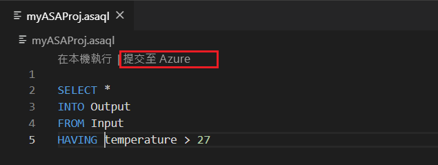

# 複製或備份 Azure 串流分析作業

您可以使用 Visual Studio Code 或 Visual Studio 來複製或備份已部署的 Azure 串流分析作業。 

## 開始之前
* 如果您沒有 Azure 訂用帳戶，請建立[免費帳戶](https://azure.microsoft.com/free/)。

* 登入 [Azure 入口網站](https://portal.azure.com/)。

* 安裝適用于[Visual Studio Code 的 azure 串流分析擴充](https://docs.microsoft.com/azure/stream-analytics/quick-create-vs-code#install-the-azure-stream-analytics-extension)功能或[適用于 Visual Studio 的 azure 串流分析工具](https://docs.microsoft.com/azure/stream-analytics/quick-create-vs-code#install-the-azure-stream-analytics-extension)。  

## Visual Studio Code

1. 按一下 [Visual Studio Code] 活動列上的 [ **Azure** ] 圖示，然後展開 [**串流分析**] 節點。 您的作業應該會出現在您的訂用帳戶底下。

   

2. 若要將作業匯出至本機專案，請在 Visual Studio Code 的**串流分析 Explorer**中找出您想要匯出的作業。 然後選取專案的資料夾。

    

    專案會匯出至您選取的資料夾，並新增到您目前的工作區。

    

3. 若要使用其他名稱將作業發佈到另一個區域或備份，請選取 [**從您**的訂用帳戶選取] 以在查詢編輯器中發佈（\*script.asaql），並遵循指示進行。

    

## Visual Studio

1. 遵循將已[部署的 Azure 串流分析作業匯出至專案指示](https://docs.microsoft.com/azure/stream-analytics/stream-analytics-vs-tools#export-jobs-to-a-project)。

2. 在 [查詢編輯器] 中開啟 \*script.asaql 檔案，在腳本編輯器中選取 [**提交至 Azure** ]，然後遵循指示，使用新的名稱將作業發佈到另一個區域或備份。

## 後續步驟

* [快速入門：使用 Visual Studio Code 建立串流分析作業](quick-create-vs-code.md)
* [快速入門：使用 Visual Studio 建立串流分析作業](stream-analytics-quick-create-vs.md)
* [使用 Azure Pipelines 部署具有 CI/CD 的 Azure 串流分析作業](stream-analytics-tools-visual-studio-cicd-vsts.md)
