# <a name="quickstart-create-an-azure-stream-analytics-cloud-job-in-visual-studio-code-preview"></a>快速入門：在 Visual Studio Code 中建立 Azure 串流分析雲端作業 (預覽)

本快速入門說明如何使用適用於 Visual Studio Code 的 Azure 串流分析擴充功能建立及執行串流分析作業。 範例作業會從 IoT 中樞裝置讀取串流資料。 您會定義一項作業，用以計算溫度超過 27° 時的平均溫度，並將產生的輸出事件寫入 Blob 儲存體中的新檔案。

## <a name="before-you-begin"></a>開始之前

* 如果您沒有 Azure 訂用帳戶，請建立[免費帳戶](https://azure.microsoft.com/free/)。

* 登入 [Azure 入口網站](https://portal.azure.com/)。

* 安裝 [Visual Studio Code](https://code.visualstudio.com/)。

## <a name="install-the-azure-stream-analytics-extension"></a>安裝 Azure 串流分析擴充功能

1. 開啟 Visual Studio Code。

2. 從左窗格中的 [擴充功能] 搜尋**串流分析**，然後選取 **Azure 串流分析**擴充功能上的 [安裝]。

3. 在安裝擴充功能後，確認 **Azure 串流分析工具**顯示於您的 [已啟用的擴充功能] 中。

   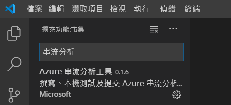

## <a name="activate-the-azure-stream-analytics-extension"></a>啟用 Azure 串流分析擴充功能

1. 選取 VS Code 活動列上的 [Azure] 圖示。 [串流分析] 會顯示在提要欄位中。 在 [串流分析] 下方，選取 [登入 Azure]。 

   

2. 在已登入的情況下，您的 Azure 帳戶名稱會出現在 VS Code 視窗左下角的狀態列上。

> [!NOTE]
> 如果您未登出，Azure 串流分析工具下次將會自動登入。如果您的帳戶使用雙因素驗證，建議您使用電話驗證而非使用 PIN 碼。
> 如果您有列出資源的問題，在登出後重新登入通常就可解決問題。 若要登出，請輸入命令 `Azure: Sign Out`。

## <a name="prepare-the-input-data"></a>準備輸入資料

定義串流分析作業前，您應先準備資料，該資料稍後會設定為作業輸入。 為了準備作業所需的輸入資料，請完成下列步驟：

1. 登入 [Azure 入口網站](https://portal.azure.com/)。

2. 選取 [建立資源] > [物聯網] > [IoT 中樞]。

3. 在 [IoT 中樞] 窗格中，輸入下列資訊︰
   
   |**設定**  |**建議的值**  |**說明**  |
   |---------|---------|---------|
   |訂用帳戶  | \<您的訂用帳戶\> |  選取您要使用的 Azure 訂用帳戶。 |
   |資源群組   |   asaquickstart-resourcegroup  |   選取 [新建]，然後為您的帳戶輸入新的資源群組名稱。 |
   |區域  |  \<選取最接近使用者的區域\> | 選取您可以在其中裝載 IoT 中樞的地理位置。 使用最靠近您的使用者的位置。 |
   |IoT 中樞名稱  | MyASAIoTHub  |   選取您的 IoT 中樞名稱。   |

   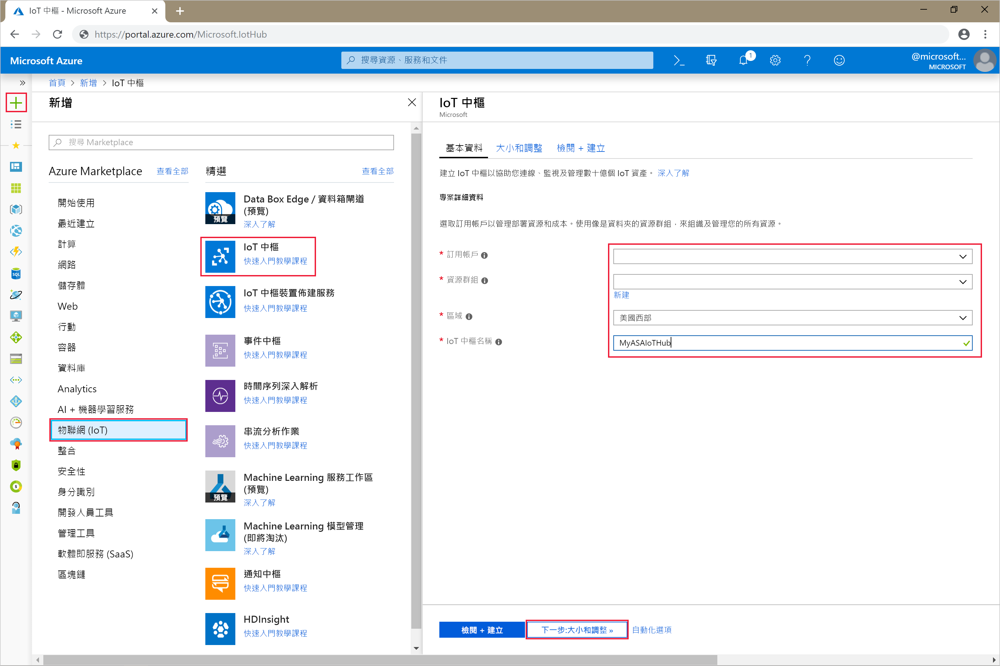

4. 完成時，選取 [下一步:設定大小與級別]。

5. 選擇您的**定價與級別層**。 在本快速入門中，選取 [F1-免費] 層 (如果仍可用於您的訂用帳戶)。 如果無法使用免費層，請選擇可用的最低層。 如需詳細資訊，請參閱 [IoT 中樞定價](https://azure.microsoft.com/pricing/details/iot-hub/)。

   

6. 選取 [檢閱 + 建立]。 檢閱您的 IoT 中樞資訊，然後按一下 [建立]。 建立 IoT 中樞可能需要數分鐘。 您可以在 [通知] 窗格中監視進度。

7. 在您的 IoT 中樞導覽功能表中，按一下 [IoT 裝置] 之下的 [新增]。 新增 [裝置識別碼]，然後按一下 [儲存]。

   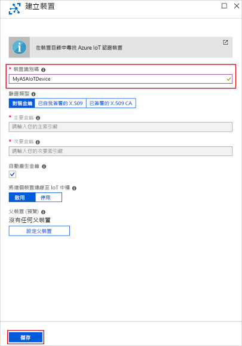

8. 建立裝置之後，請從 [IoT 裝置] 清單開啟裝置。 複製 [連接字串 -- 主索引鍵]，並將它儲存到記事本以供日後使用。

   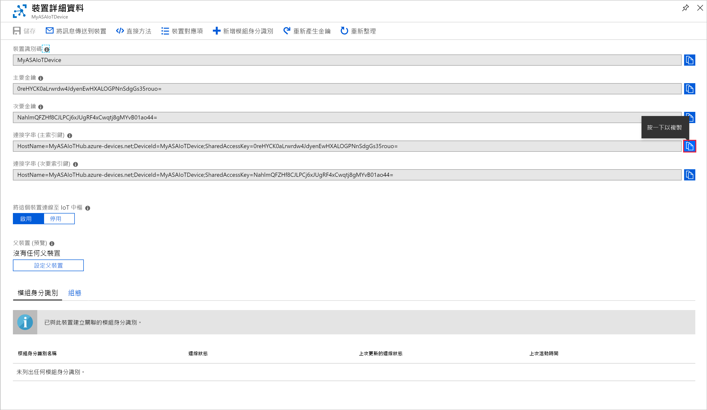

## <a name="create-blob-storage"></a>建立 Blob 儲存體

1. 從 Azure 入口網站的左上角，選取 [建立資源] > [儲存體] > [儲存體帳戶]。

2. 在 [建立儲存體帳戶] 窗格中，輸入儲存體帳戶名稱、位置和資源。 選擇相同的位置和資源群組作為您建立的 IoT 中樞。 然後按一下 [檢閱 + 建立] 以建立帳戶。

   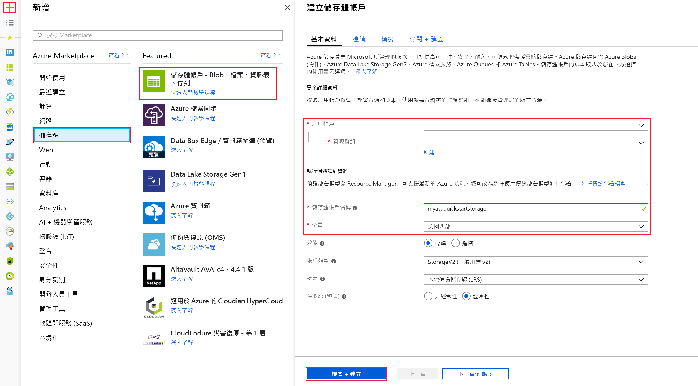

3. 建立儲存體帳戶後，選取 [概觀] 窗格上的 [Blob] 圖格。

   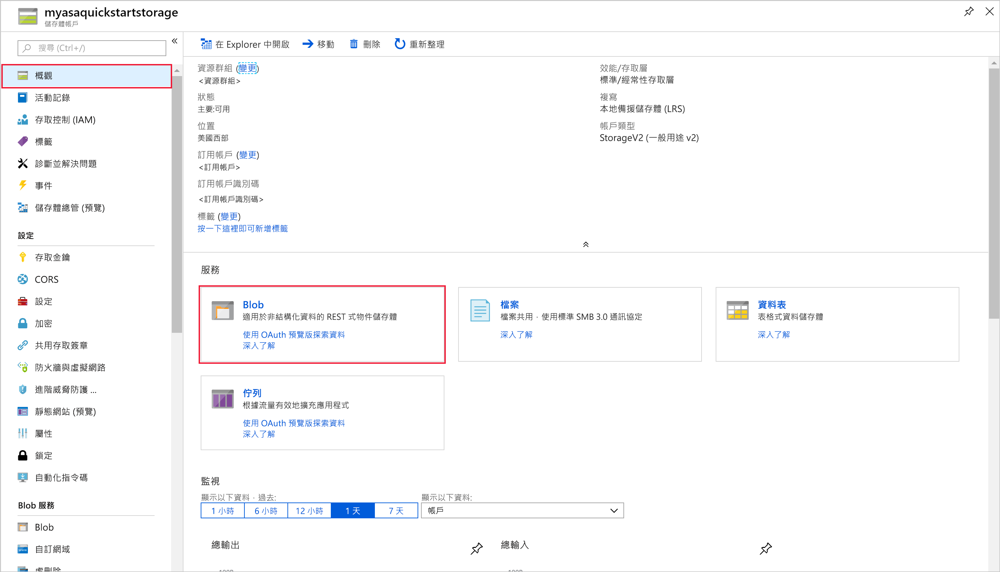

4. 在 [Blob 服務] 頁面中選取 [容器]，然後為容器提供名稱 (例如 container1)。 將 [公用存取層級] 保留為 [私人 (沒有匿名存取)]，然後選取 [確定]。

   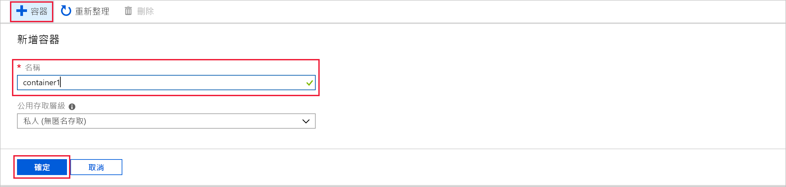

## <a name="create-a-stream-analytics-project"></a>建立串流分析專案

1. 在 Visual Studio Code 中按 **Ctrl+Shift+P**，以開啟命令選擇區。 然後輸入 **ASA**，並選取 **[ASA：建立新專案]**。

   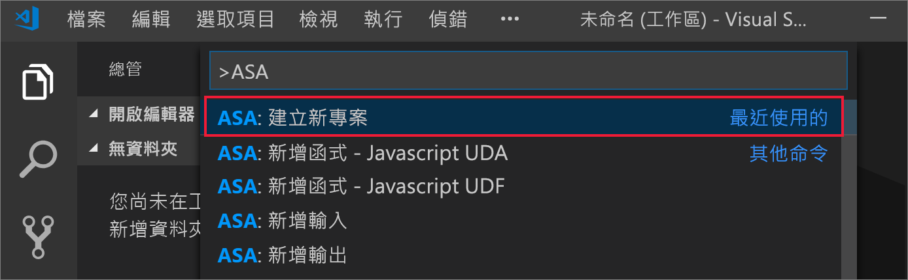

2. 輸入您的專案名稱 (例如 **myASAproj**)，然後選取專案的資料夾。

    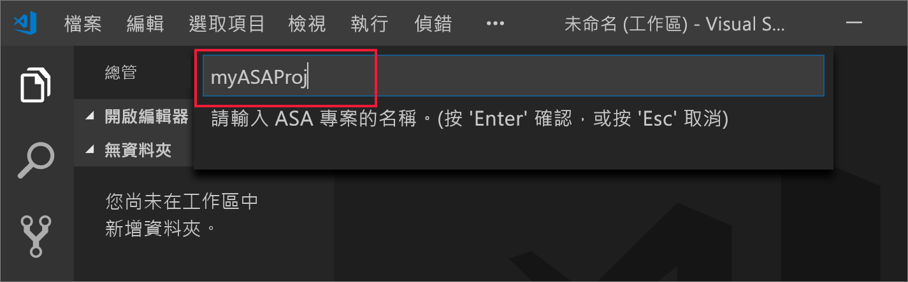

3. 新專案會新增至您的工作區。 ASA 專案中包含查詢指令碼 **(*.asaql)**、**JobConfig.json** 檔案和 **asaproj.json** 組態檔。

   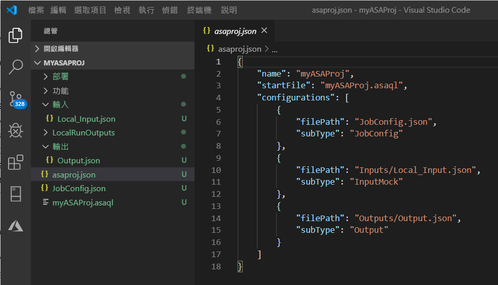

4. **asaproj.json** 組態檔包含將串流分析作業提交至 Azure 所需的輸入、輸出和作業組態檔資訊。

   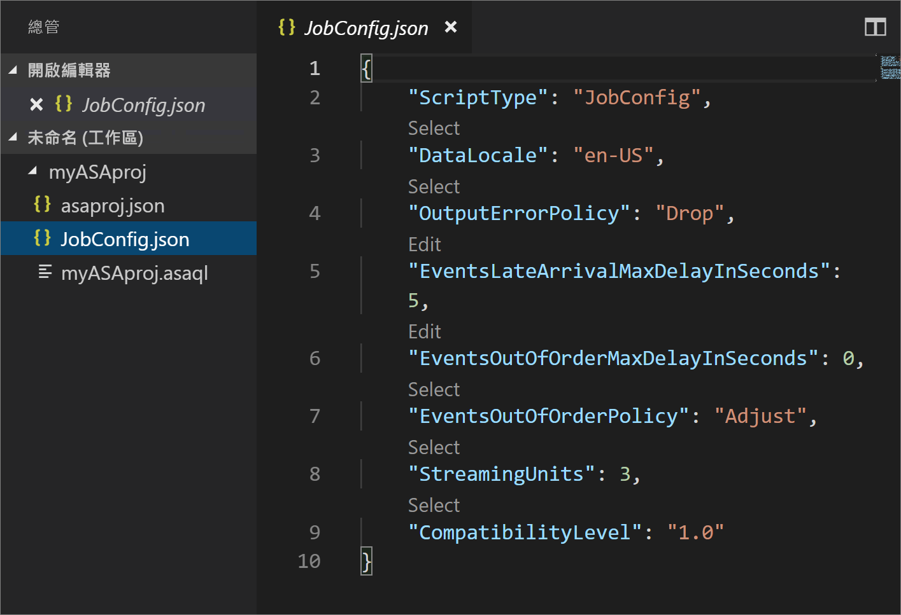

> [!Note]
> 從命令選擇區新增輸入和輸出時，對應的路徑將會自動新增至 **asaproj.json**。 如果您直接在磁碟上新增或移除輸入或輸出，您必須手動從 **asaproj.json** 加以新增或移除。 您可以選擇將輸入和輸出放在某個位置，然後在每個 **asaproj.json** 中指定路徑，以在不同的作業中參考這些輸入和輸出。

## <a name="define-an-input"></a>定義輸入

1. 選取 **Ctrl+Shift+P** 以開啟命令選擇區，並輸入 **ASA：新增輸入**。

   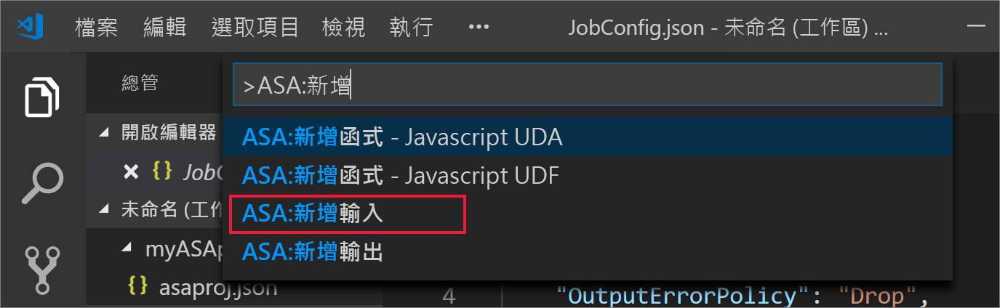

2. 選擇 [IoT 中樞] 作為輸入類型。

   ![選取 [IoT 中樞] 作為輸入選項](./media/quick-create-vs-code/iot-hub.png)

3. 選擇將使用輸入的 ASA 查詢指令碼。 它應該會自動填入檔案路徑 **myASAproj.asaql**。

   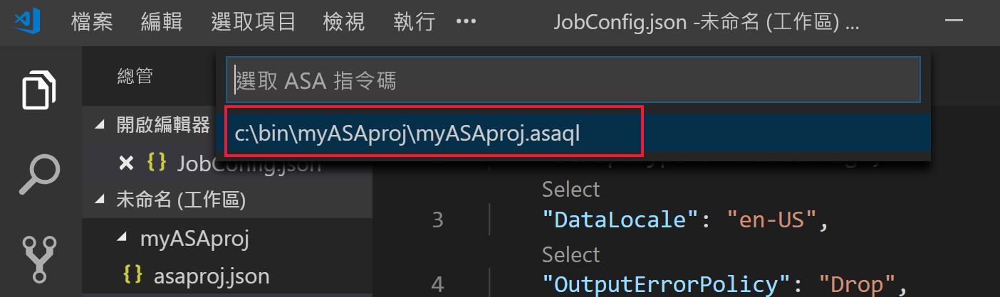

4. 輸入 **IotHub.json** 作為輸入檔案名稱。

5. 以下列值編輯 **IoTHub.json**。 將以下未提及的欄位保留為預設值。 您可以利用 CodeLens 來輸入字串、從下拉式清單中選取，或直接在檔案中變更文字。

   |設定|建議的值|說明|
   |-------|---------------|-----------|
   |Name|輸入|輸入名稱以識別作業的輸入。|
   |IotHubNamespace|MyASAIoTHub|選擇或輸入 IoT 中樞的名稱。 系統會自動偵測建立在相同訂用帳戶中的 IoT 中樞名稱。|
   |EndPoint|訊息| |
   |SharedAccessPolicyName|iothubowner| |

## <a name="define-an-output"></a>定義輸出

1. 選取 **Ctrl+Shift+P** 以開啟命令選擇區。 然後輸入 **ASA：新增輸出**。

   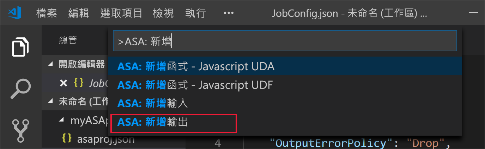

2. 選擇 [Blob 儲存體] 作為 [接收類型]。

3. 選擇將使用此輸入的 ASA 查詢指令碼。

4. 輸入 **BlobStorage.json** 作為輸出檔案名稱。

5. 以下列值編輯 **BlobStorage.json**。 將以下未提及的欄位保留為預設值。 利用 CodeLens 輸入字串，從下拉式清單中選取。

   |設定|建議的值|說明|
   |-------|---------------|-----------|
   |Name|輸出| 輸入名稱以識別作業的輸出。|
   |儲存體帳戶|asaquickstartstorage|選擇或輸入儲存體帳戶的名稱。 系統會自動偵測建立在相同訂用帳戶中的儲存體帳戶名稱。|
   |容器|container1|選取您在儲存體帳戶中建立的現有容器。|
   |路徑格式|output|輸入要在容器內建立的檔案路徑名稱。|

## <a name="define-the-transformation-query"></a>定義轉換查詢

1. 從您的專案資料夾開啟 **myASAproj.asaql**。

2. 新增下列查詢：

   ```sql
   SELECT * 
   INTO Output
   FROM Input
   HAVING Temperature > 27
   ```

## <a name="compile-the-script"></a>編譯指令碼

指令碼編譯會執行兩項工作：檢查語法和產生選自動部署的 Azure Resource Manager 範本。

有兩種方式可觸發指令碼編譯：

1. 從工作區中選取指令碼，然後從命令選擇區中觸發編譯。 

   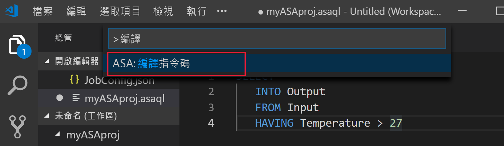

2. 以滑鼠右鍵按一下指令碼，然後選取 [ASA：編譯指令碼]。

    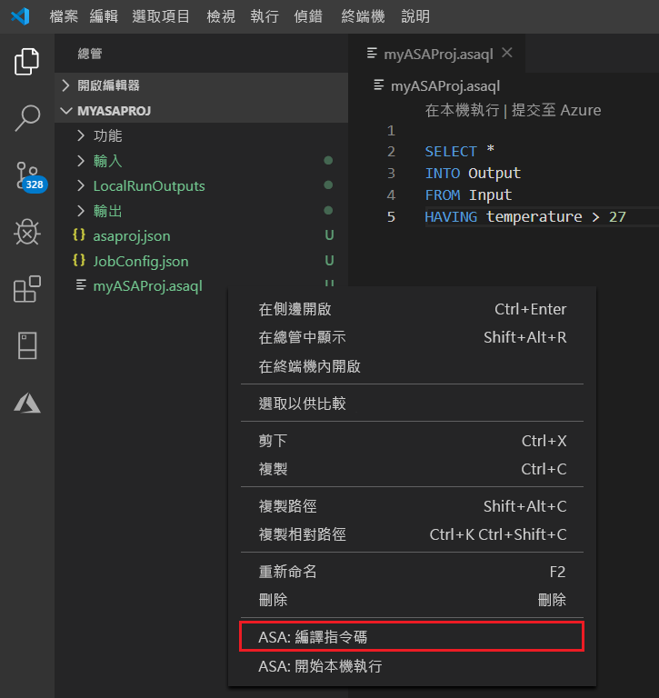

3. 編譯完成後，您會看到有兩個 Azure Resource Manager 範本產生在您專案的**部署**資料夾中。 這兩個檔案會用於自動部署。

    

## <a name="submit-a-stream-analytics-job-to-azure"></a>將串流分析作業提交至 Azure

1. 在 Visual Studio Code 的 [指令碼編輯器] 視窗中，選取 [從您的訂用帳戶選取]。

   ![指令碼編輯器中的 [從您的訂用帳戶選取] 文字](./media/quick-create-vs-code/select-subscription.png)

2. 從快顯清單中選取您的訂用帳戶。

3. 選取一個作業**。 然後，選擇 [建立新的作業]。

4. 輸入您的作業名稱 **myASAjob**，然後依照指示選擇資源群組和位置。

5. 選取 [提交至 Azure]。 您可以在 [輸出] 視窗中找到記錄。 

6. 您的作業建立後，您可以在 [串流分析總管] 中加以檢視。

## <a name="run-the-iot-simulator"></a>執行 IoT 模擬器

1. 在新的瀏覽器索引標籤或視窗中開啟 [Raspberry Pi Azure IoT 線上模擬器](https://azure-samples.github.io/raspberry-pi-web-simulator/)。

2. 以您在上一節中儲存的 Azure IoT 中樞裝置連接字串取代行 15 中的預留位置。

3. 按一下 **[執行]**。 下列輸出會顯示傳送至 IoT 中樞的感應器資料和訊息。

   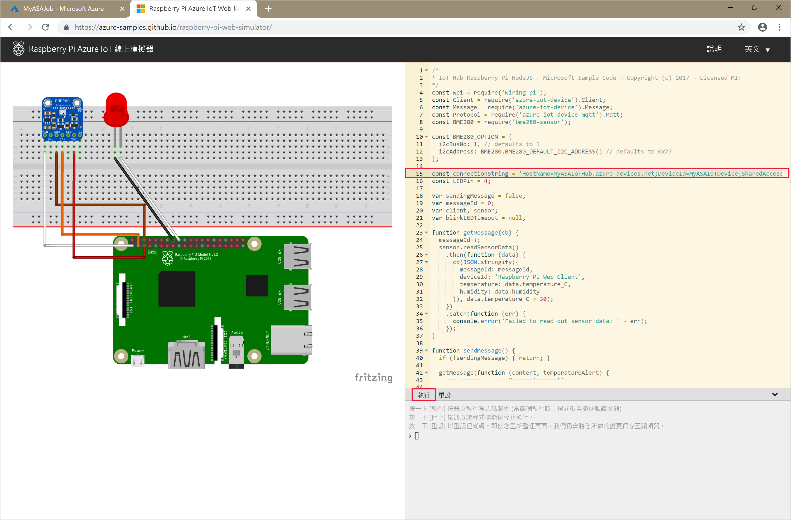

## <a name="start-the-stream-analytics-job-and-check-output"></a>啟動串流分析工作並查看輸出

1. 在 Visual Studio Code 中開啟 [串流分析總管]，並尋找您的作業 **myASAJob**。

2. 以滑鼠右鍵按一下作業名稱。 然後，從快顯功能表中選取 [啟動]。

   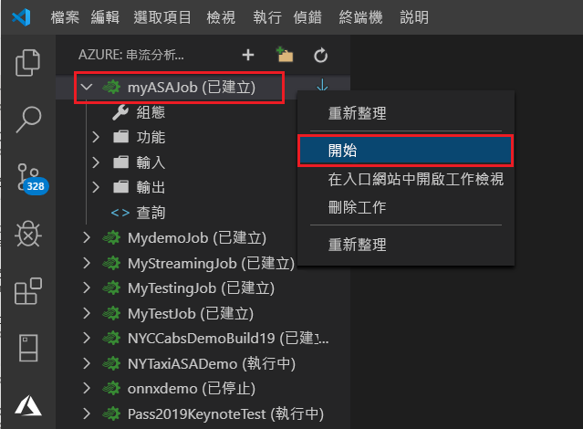

3. 在快顯視窗中選擇 [立即]，以啟動作業。

4. 請留意作業狀態已變更為 [執行中]。 以滑鼠右鍵按一下作業名稱，然後選擇 [在入口網站中開啟作業檢視]，以查看輸入和輸出事件計量。 此動作可能需要幾分鐘的時間。

5. 若要檢視結果，請在 Visual Studio Code 擴充功能中或 Azure 入口網站中開啟 Blob 儲存體。

## <a name="clean-up-resources"></a>清除資源

若不再需要，可刪除資源群組、串流作業和所有相關資源。 刪除作業可避免因為作業使用串流單位而產生費用。 如果您計劃在未來使用該作業，您可以將其停止並在之後需要時重新啟動。 如果您將不繼續使用此作業，請使用下列步驟，刪除本快速入門所建立的所有資源：

1. 從 Azure 入口網站的左側功能表中，選取 [資源群組]，然後選取您所建立資源的名稱。  

2. 在資源群組頁面上，選取 [刪除]，在文字方塊中輸入要刪除的資源名稱，然後選取 [刪除]。

## <a name="next-steps"></a>後續步驟

在本快速入門中，您已使用 Visual Studio Code 部署了簡單的串流分析作業。 您也可以使用 [Azure 入口網站](stream-analytics-quick-create-portal.md)、[PowerShell](stream-analytics-quick-create-powershell.md) 和 Visual Studio (stream-analytics-quick-create-vs.md) 部署串流分析作業。 

若要了解適用於 Visual Studio 的 Azure 串流分析工具，請繼續下列文章：

> [!div class="nextstepaction"]
> [使用 Visual Studio 檢視 Azure 串流分析工作](stream-analytics-vs-tools.md)
