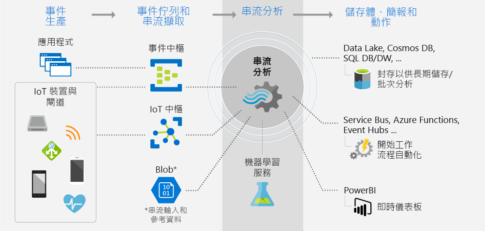
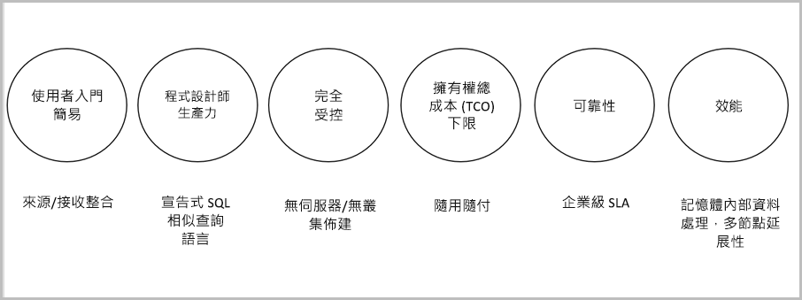

# Azure 串流分析是什麼？

Azure 串流分析是事件處理引擎，可讓您檢查來自裝置的大量資料流。 傳入的資料可能來自裝置、感應器、網站、社交媒體摘要和應用程式等。 它也支援從資料流擷取資訊，識別模式和關聯性。 然後，您可以使用這些模式來觸發其他動作下游，例如建立警示、將資訊提供給報告工具，或儲存資訊以供之後使用。

以下是一些可以使用 Azure 串流分析的範例： 

* 物聯網 (IoT) 感應器融合和即時分析裝置遙測
* Web 記錄/點選流分析
* 車隊管理和自駕車的地理空間分析
* 高價值資產的遠端監視和預測性維護
* 即時分析銷售點資料以控制庫存和偵測異常

## 串流分析如何運作？

要進行 Azure 串流分析必須先有串流資料的來源，這包括了內嵌於 Azure 事件中樞或Azure IoT 中樞的資料，以及來自 Azure Blob 儲存體等資料存放區的資料。 若要檢查資料流，您可以建立串流分析作業以指定會串流資料的輸入來源。 此作業也會指定轉換查詢，以定義如何尋找資料、模式或關聯性。 轉換查詢會使用 SQL 查詢語言，輕鬆篩選、排序、彙總和聯結一段時間內的串流資料。 在執行作業時，您可以調整事件排序選項，而在執行彙總作業時則可調整時間範圍的持續時間。

在分析傳入的資料後，您可以指定所轉換資料的輸出，並可控制所要採取的動作以回應您所分析的資訊。 例如，您可以採取下列動作：

* 將資料傳送至受監視的佇列，以觸發警示或自訂工作流程下游。
* 將資料傳送至 Power BI 儀表板以獲得即時的視覺效果。
* 將資料儲存至其他 Azure 儲存體服務，以便根據歷程記錄資料訓練機器學習服務模型，或執行批次分析。

下圖說明串流分析管線，您的串流分析作業可以使用所有輸入和輸出，也可以使用一組選定的輸入和輸出。 下圖顯示如何將資料傳送至串流分析、加以分析並傳送，以進行儲存或呈現等其他動作：

## 主要功能和優點

Azure 串流分析的設計訴求是方便使用、具靈活性、可靠，以及適用於任何作業大小。 其適用於多個 Azure 區域。 下圖說明 Azure 串流分析的重要功能：

## 輕鬆開始使用

您可以輕鬆地開始使用 Azure 串流分析。 只要按幾下就能連線到多個來源、接收並建立端對端管線。 串流分析可以連線到 [Azure 事件中樞](/azure/event-hubs/)和 [Azure IoT 中樞](/azure/iot-hub/)來擷取串流資料。 它也可以連線到 [Azure Blob 儲存體](/azure/storage/storage-introduction)服務來擷取歷史資料。 它可以結合事件中樞的資料與其他資料來源和處理引擎。 作業輸入也可以包含靜態參考資料或變更緩慢的資料，而且您可以將串流資料加入到此參考資料，以執行查閱作業。

串流分析可將作業輸出路由至許多儲存體系統，例如 [Azure Blob](/azure/storage/storage-introduction)、[Azure SQL Database](/azure/sql-database/)、[Azure Data Lake Store](/azure/data-lake-store/) 或 [Azure Cosmos DB](/azure/cosmos-db/introduction)。 儲存後，您可以使用 Azure HDInsight 執行批次分析，也可以將輸出傳送至另一個服務 (例如事件中樞) 以供取用，或傳送至 [Power BI](https://docs.microsoft.com/power-bi/) 以使用 Power BI 串流 API 來即時呈現視覺效果。

## 程式設計人員生產力

Azure 串流分析使用已擴增的簡單 SQL 架構查詢語言，搭配強大的時態性限制式即可分析移動中的資料。 若要定義作業轉換，您可以使用簡單的敘述性[串流分析查詢語言](https://msdn.microsoft.com/library/azure/dn834998.aspx)，來撰寫使用簡單 SQL 建構的複雜時態性查詢和分析。 串流分析查詢語言與 SQL 語言一致，只要熟悉 SQL 語言便可開始建立作業。 使用 Azure PowerShell、[串流分析 Visual Studio 工具](stream-analytics-tools-for-visual-studio-install.md)或 Azure Resource Manager 範本等開發人員工具，也可以建立作業。 使用開發人員工具可讓您離線開發轉換查詢，並使用 [CI/CD 管線](stream-analytics-tools-for-visual-studio-cicd.md)將作業提交至 Azure。 

串流分析查詢語言提供了各式各樣的函式，以供分析和處理串流資料。 此查詢語言支援簡單的資料操作、彙總函式到複雜的地理空間函式。 您可以在入口網站中編輯查詢，然後使用從即時資料流所擷取出的範例資料來測試查詢。

您可以透過定義和叫用其他函式來延伸查詢語言的功能。 您可以在 Azure Machine Learning 服務定義函式呼叫以利用 Azure Machine Learning 解決方案，並整合 JavaScript 使用者定義的函式 (UDF) 或使用者定義的彙總以在串流分析查詢中執行複雜的計算。

## 完全受控 

Azure 串流分析是 Azure 上完全受控的無伺服器 (PaaS) 供應項目。 這表示您不必佈建任何硬體或管理叢集即可執行您的作業。 Azure 串流分析會全權負責管理您的作業，它會負責在雲端設定複雜的計算叢集，並負責處理執行作業所需的效能微調。 與 Azure 事件中樞和 Azure IoT 中樞整合，可讓作業每秒擷取數百萬來自連線裝置、點擊資料流及記錄檔等項目的事件。 透過事件中樞的分割功能，您可以將計算分割為邏輯步驟，而每個步驟都可以再進一步地分割來增加延展性。

## 在雲端或在智慧邊緣執行

Azure 串流分析可以在雲端執行以進行大規模分析，或在智慧邊緣執行以進行超低延遲分析。
Azure 串流分析會在雲端和智慧邊緣上使用相同的查詢語言，讓開發人員能夠建置真正的混合式架構進行串流處理。

## 低擁有權總成本

作為雲端服務，串流分析已進行成本最佳化。 不會有預付費用，您只需針對[您耗用的串流單位](stream-analytics-streaming-unit-consumption.md)和處理的資料量付費。 不必做出承諾或佈建叢集。 您可以根據您的商務需求相應增加或相應減少串流作業。 

## 任務關鍵性就緒
Azure 串流分析適用於全球多個區域，其設計訴求是藉由支援可靠性、安全性和合規性需求來執行任務關鍵性工作負載。
### 可靠性
Azure 串流分析可保證僅只一次的事件處理，以及至少一次的事件傳遞，因此永遠不會遺失事件。 如[事件傳遞保證](/stream-analytics-query/event-delivery-guarantees-azure-stream-analytics)所述，保證選取的輸出恰好處理一次。
Azure 串流分析具有可在事件傳遞失敗時進行復原的內建功能。 此外，串流分析會提供內建檢查點來維護作業的狀態，並提供可重複出現的結果。

串流分析為受控服務，可保證處理事件在分鐘層級有 99.9% 的可用性。 如需詳細資訊，請參閱[串流分析 SLA](https://azure.microsoft.com/support/legal/sla/stream-analytics/v1_0/) 頁面。 

### 安全性
就安全性而言，Azure 串流分析會將所有傳入和傳出的通訊加密，並支援 TLS 1.2。 內建的檢查點也會加密。 串流分析不會儲存傳入資料，因為所有處理都在記憶體內進行。 

### 法規遵循
Azure 串流分析會遵循如 [Azure 合規性概觀](https://gallery.technet.microsoft.com/Overview-of-Azure-c1be3942)中所述的多個合規性認證。 

## 效能

串流分析每秒可以處理數百萬個事件，並可低延遲地傳遞結果。
它可讓您相應增加及向外延展，以處理大型的即時和複雜事件處理應用程式。 串流分析藉由下列方式來支援效能：進行分割，並允許在多個串流節點上平行化及執行複雜的查詢。
Azure 串流分析是以 [Trill](https://github.com/Microsoft/Trill) 為基礎，這是與 Microsoft Research 合作開發的高效能記憶體內部串流分析引擎。 

## 後續步驟

您現在已大致了解 Azure 串流分析。 接下來，您可以深入了解並建立您的第一個串流分析作業：

* [使用 Azure 入口網站建立串流分析作業](stream-analytics-quick-create-portal.md)。
* [使用 Azure PowerShell 建立串流分析作業](stream-analytics-quick-create-powershell.md)。
* [使用 Visual Studio 建立串流分析作業](stream-analytics-quick-create-vs.md)。

