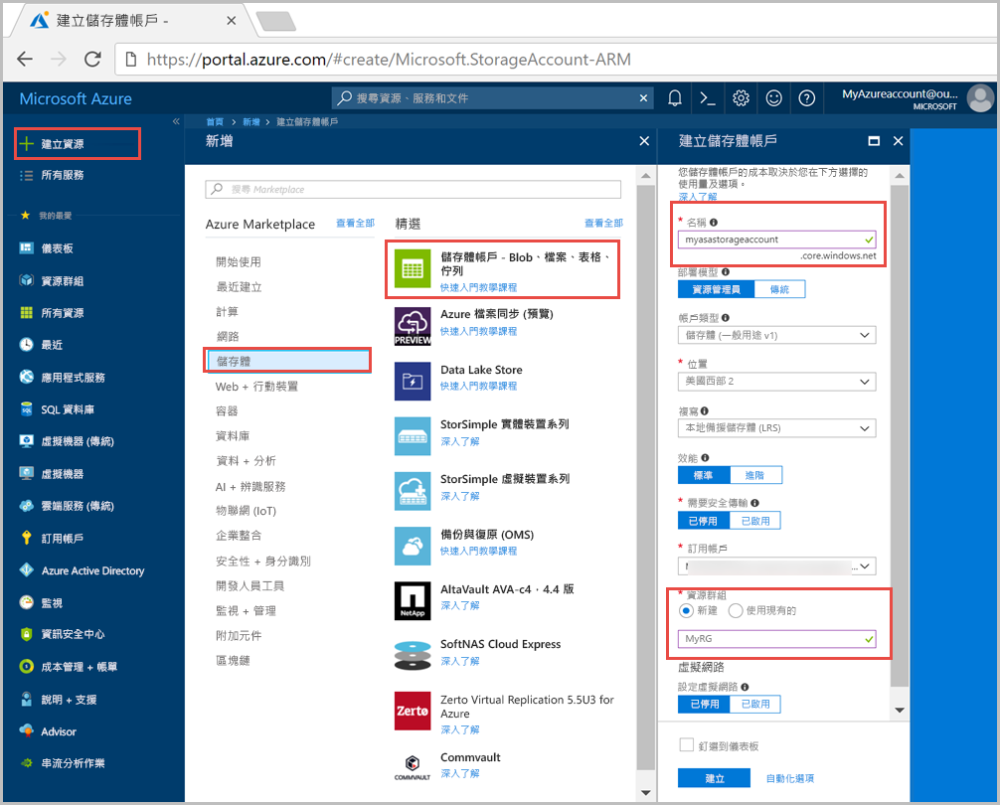
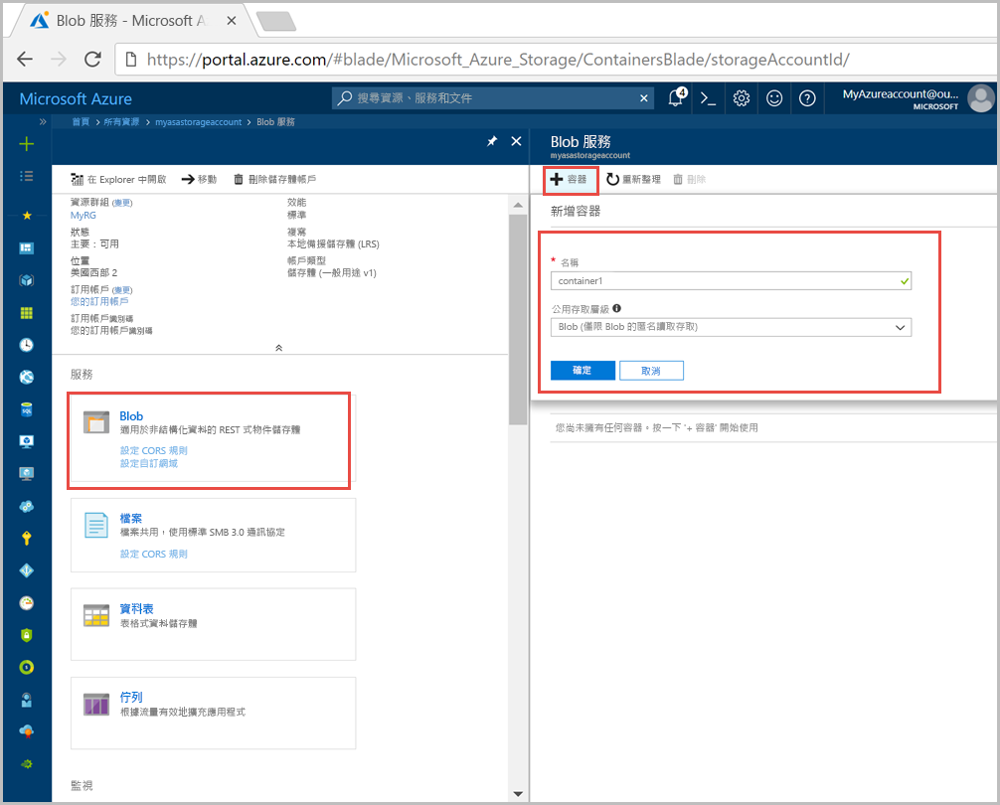
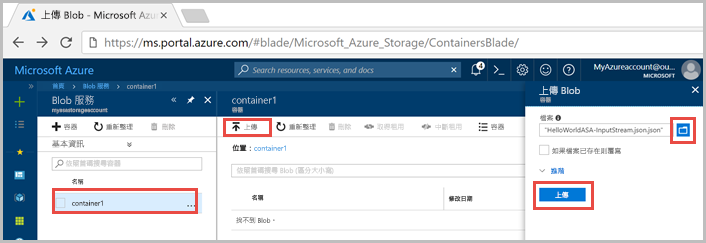
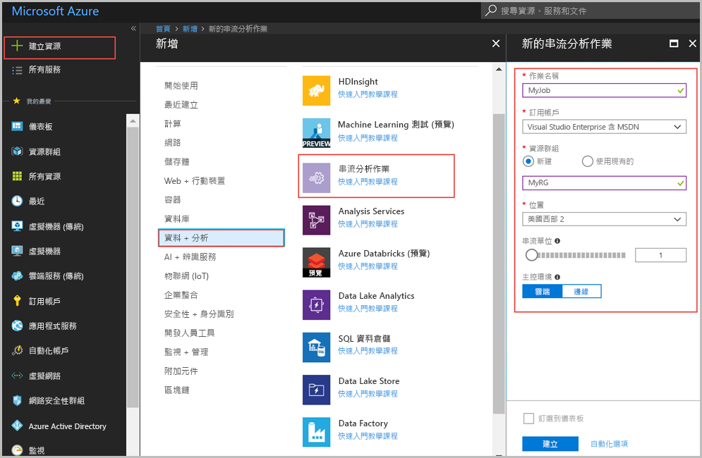
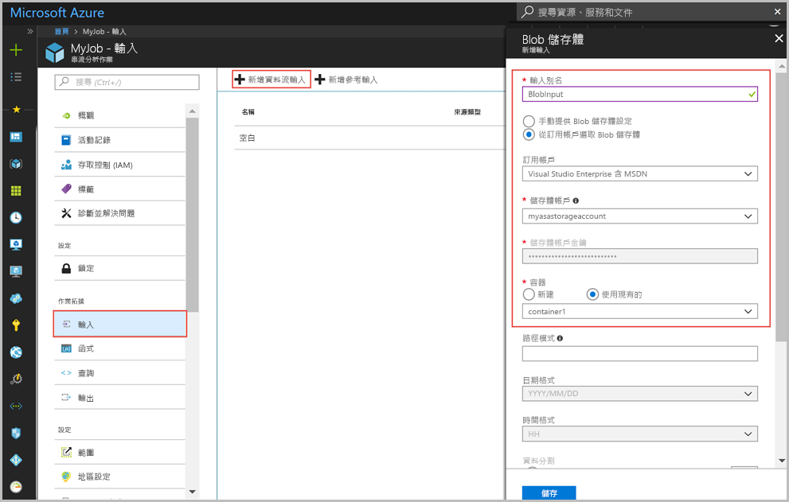
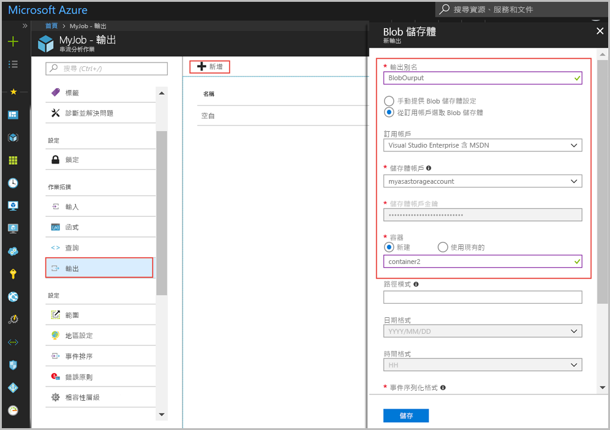
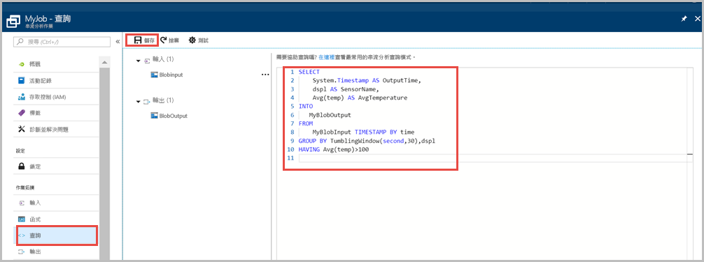
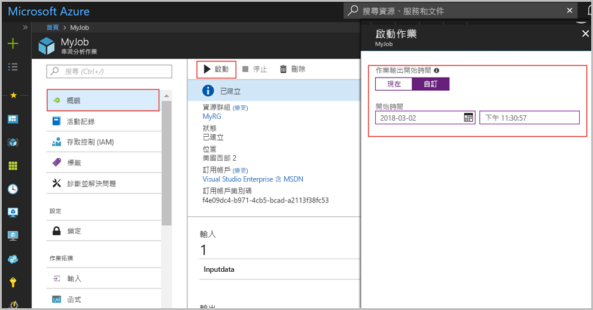
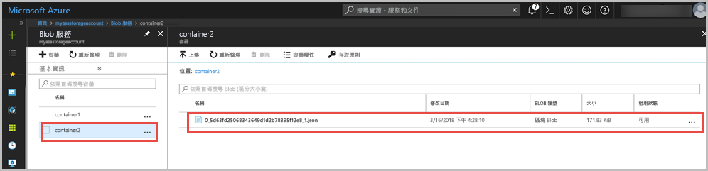

# <a name="quickstart-create-a-stream-analytics-job-by-using-the-azure-portal"></a>快速入門：使用 Azure 入口網站建立串流分析作業

本快速入門會示範如何開始建立串流分析作業。 在本快速入門中，您將定義串流分析作業來讀取感應器資料範例，並篩選出每 30 秒中平均溫度大於 100 的資料列。 在本文中，您會從 blob 儲存體讀取資料並轉換資料，然後將資料寫回相同 blob 儲存體中的不同容器。

## <a name="before-you-begin"></a>開始之前

* 如果您沒有 Azure 訂用帳戶，請建立[免費帳戶](https://azure.microsoft.com/free/)。

* 登入 [Azure 入口網站](https://portal.azure.com/)。

## <a name="prepare-the-input-data"></a>準備輸入資料

定義串流分析作業前，您應先準備設定為作業輸入的資料。 請執行下列步驟以準備作業所需的輸入資料：

1. 從 GitHub 下載[感應器資料範例](https://github.com/Azure/azure-stream-analytics/blob/master/Samples/GettingStarted/HelloWorldASA-InputStream.json)。 範例資料包含下列 JSON 格式的感應器資訊：  

   ```json
   {
     "time": "2016-01-26T21:18:52.0000000",
     "dspl": "sensorC",
     "temp": 87,
     "hmdt": 44
   }
   ```
2. 登入 Azure 入口網站  

3. 從 Azure 入口網站的左上角，選取 [建立資源] > [儲存體] > [儲存體帳戶]。 填寫儲存體帳戶作業刀鋒視窗，將 [名稱] 設為 "myasastorageaccount"、[位置] 設為「美國西部 2」、[資源群組] 設為 "MyRG" (將儲存體帳戶裝載在與串流作業相同的資源群組中可增加效能)。 其餘設定可以保留預設值。  

   

4. 從 [所有資源] 刀鋒視窗中，找出您在上一個步驟中建立的儲存體帳戶。 依序開啟 [概觀] 刀鋒視窗及 [Blob]圖格。  

5. 從 [Blob 服務] 刀鋒視窗中選取 [容器]，並為容器提供**名稱**，例如 container1，然後將 [公用存取層級] 變更為 Blob (僅限以匿名讀取存取 blob) > 選取 [確定]。  

   

6. 移至您在上一個步驟中建立的容器，選取 [上傳] 並上傳您在步驟 1 取得的感應器資料。  

   

## <a name="create-a-stream-analytics-job"></a>建立串流分析作業

1. 登入 Azure 入口網站  

2. 選取 Azure 入口網站左上角的 [建立資源]。  

3. 從結果清單中選取 [資料 + 分析] > [串流分析作業]。  

4. 填寫串流分析作業刀鋒視窗，並提供下列資訊：

   |**設定**  |**建議的值**  |**說明**  |
   |---------|---------|---------|
   |作業名稱   |  myJob   |   輸入用來識別您串流分析作業的名稱。 串流分析作業名稱只可包含英數字元、連字號與底線，且其長度必須介於 3 到 63 個字元之間。 |
   |訂用帳戶  | \<您的訂用帳戶\> |  選取您要用於此作業的 Azure 訂用帳戶。 |
   |資源群組   |   myResourceGroup  |   選取 [新建]，然後為您的帳戶輸入新的資源群組名稱。 |
   |位置  |  \<選取最接近使用者的區域\> | 選取您可以在其中裝載串流分析作業的地理位置。 使用最接近使用者的區域以提升效能並減少資料轉送成本。 |
   |串流單位  | 1  |   串流單位代表執行作業所需的計算資源。 根據預設，此值設定為 1。 若要深入了解如何調整串流單位，請參閱[了解與調整串流單位](stream-analytics-streaming-unit-consumption.md)一文。   |
   |裝載環境  |  雲端  |   串流分析作業可以部署到雲端或邊緣裝置。 雲端部分可讓您部署到 Azure 雲端，邊緣裝置部分可讓您部署到 IoT 邊緣裝置。 |

   

5. 核取 [釘選至儀表板] 方塊，以將作業放在您的儀表板上，然後選取 [建立]。  

6. 您應會看到「部署進行中...」顯示在瀏覽器視窗的右上方。 

## <a name="configure-input-to-the-job"></a>設定作業的輸入

在本節中，您會將 blob 儲存體設定為串流分析作業的輸入。 在設定輸入之前，請先建立 blob 儲存體帳戶。  

### <a name="add-the-input"></a>新增輸入 

1. 瀏覽至您的串流分析作業。  

2. 選取 [輸入] > [新增串流輸入] > [Blob 儲存體]。  

3. 使用下列值填寫 [Blob 儲存體] 刀鋒視窗：

   |**設定**  |**建議的值**  |**說明**  |
   |---------|---------|---------|
   |輸入別名  |  BlobInput   |  輸入名稱以識別作業的輸入。   |
   |訂用帳戶   |  \<您的訂用帳戶\> |  選取您在其中建立儲存體帳戶的 Azure 訂用帳戶。 儲存體帳戶可以位在相同或不同的訂用帳戶中。 此範例假設您已在相同的訂用帳戶中建立儲存體帳戶。 |
   |儲存體帳戶  |  myasastorageaccount |  選擇或輸入儲存體帳戶的名稱。 系統會自動偵測建立在相同訂用帳戶中的儲存體帳戶名稱。 |
   |容器  | container1 | 選擇具有範例資料的容器名稱。 系統會自動偵測建立在相同訂用帳戶中的容器名稱。 |

4. 其他選項保留為預設值，然後選取 [儲存] 以儲存設定。  

   
 
## <a name="configure-output-to-the-job"></a>設定作業的輸出

1. 瀏覽至您先前建立的串流分析作業。  

2. 選取 [輸出] > [新增] > [Blob 儲存體]。  

3. 使用下列值填寫 [Blob 儲存體] 刀鋒視窗：

   |**設定**  |**建議的值**  |**說明**  |
   |---------|---------|---------|
   |輸出別名 |   BlobOutput   |   輸入名稱以識別作業的輸出。 |
   |訂用帳戶  |  \<您的訂用帳戶\>  |  選取您在其中建立儲存體帳戶的 Azure 訂用帳戶。 儲存體帳戶可以位在相同或不同的訂用帳戶中。 此範例假設您已在相同的訂用帳戶中建立儲存體帳戶。 |
   |儲存體帳戶 |  myasastorageaccount |   選擇或輸入儲存體帳戶的名稱。 系統會自動偵測建立在相同訂用帳戶中的儲存體帳戶名稱。       |
   |容器 |   container2  |  在您用於輸入的相同儲存體帳戶中建立新的容器。   |

4. 其他選項保留為預設值，然後選取 [儲存] 以儲存設定。  

   
 
## <a name="define-the-transformation-query"></a>定義轉換查詢

1. 瀏覽至您先前建立的串流分析作業。  

2. 選取 [查詢]並更新查詢，如下所示：  

   ```sql
   SELECT 
   System.Timestamp AS OutputTime,
   dspl AS SensorName,
   Avg(temp) AS AvgTemperature
   INTO
     MyBlobOutput
   FROM
     MyBlobInput TIMESTAMP BY time
   GROUP BY TumblingWindow(second,30),dspl
   HAVING Avg(temp)>100
   ```

3. 在此範例中，查詢會從 blob 讀取資料，並將資料複製到 blob 中的新檔案，然後選取 [儲存]。  

   

## <a name="start-the-stream-analytics-job-and-check-the-output"></a>啟動串流分析工作並查看輸出

1. 回到作業概觀刀鋒視窗，然後選取 [啟動]  

2. 在 [啟動作業] 下，針對 [啟動時間] 欄位選取 [自訂]。 選取您將檔案上傳到 blob 儲存體那天的前一天，因為上傳檔案的時間會早於目前時間。 完成時，選取 [啟動]。  

   

3. 幾分鐘後，在入口網站中尋找您設定為作業輸出的儲存體帳戶和容器。 您現在可以在容器中看到輸出檔。 第一次啟動作業需要幾分鐘的時間，作業一旦啟動後，即會在資料送達時繼續執行。  

   

## <a name="clean-up-resources"></a>清除資源

若不再需要，可刪除資源群組、串流作業和所有相關資源。 刪除作業可避免因為作業使用串流單位而產生費用。 如果您計劃在未來使用該作業，您可以將其停止並在之後需要時重新啟動。 如果您將不繼續使用此作業，請使用下列步驟，刪除本快速入門所建立的所有資源：

1. 從 Azure 入口網站的左側功能表中，選取 [資源群組]，然後選取您所建立資源的名稱。  

2. 在資源群組頁面上，選取 [刪除]，在文字方塊中輸入要刪除的資源名稱，然後選取 [刪除]。

## <a name="next-steps"></a>後續步驟

在本快速入門中，您已部署了簡單的串流分析作業，若要了解如何設定其他輸入來源及執行即時偵測，請前往下列文章：

> [!div class="nextstepaction"]
> [使用 Azure 串流分析進行即時詐騙偵測](stream-analytics-real-time-fraud-detection.md)

