# <a name="quickstart-create-a-stream-analytics-job-by-using-the-azure-portal"></a>快速入門：使用 Azure 入口網站建立串流分析作業

本快速入門會示範如何開始建立串流分析作業。 在本快速入門中，您會定義串流分析作業，以讀取即時串流資料並篩選出溫度大於 27 的訊息。 串流分析作業會從 IoT 中樞讀取資料、轉換資料，以及將資料寫回 Blob 儲存體中的容器。 本快速入門中使用的輸入資料是由 Raspberry Pi 線上模擬器產生。 

## <a name="before-you-begin"></a>開始之前

* 如果您沒有 Azure 訂用帳戶，請建立[免費帳戶](https://azure.microsoft.com/free/)。

* 登入 [Azure 入口網站](https://portal.azure.com/)。

## <a name="prepare-the-input-data"></a>準備輸入資料

定義串流分析作業前，您應先準備輸入資料。 即時感應器資料會內嵌至 IoT 中樞，然後設定為作業輸入。 為了準備作業所需的輸入資料，請完成下列步驟：

1. 登入 [Azure 入口網站](https://portal.azure.com/)。

2. 選取 [建立資源]   > [物聯網]   > [IoT 中樞]  。

3. 在 [IoT 中樞]  窗格中，輸入下列資訊︰
   
   |**設定**  |**建議的值**  |**說明**  |
   |---------|---------|---------|
   |訂用帳戶  | \<您的訂用帳戶\> |  選取您要使用的 Azure 訂用帳戶。 |
   |資源群組   |   asaquickstart-resourcegroup  |   選取 [新建]  ，然後為您的帳戶輸入新的資源群組名稱。 |
   |區域  |  \<選取最接近使用者的區域\> | 選取您可以在其中裝載 IoT 中樞的地理位置。 使用最靠近您的使用者的位置。 |
   |IoT 中樞名稱  | MyASAIoTHub  |   選取您的 IoT 中樞名稱。   |

   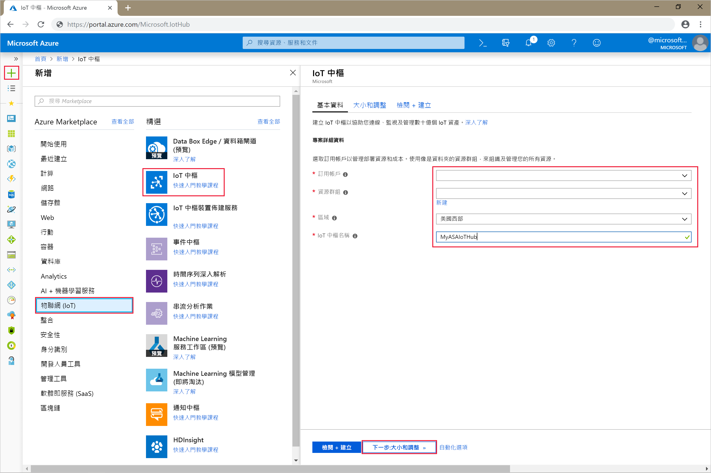

4. 完成時，選取 [下一步:  設定大小與級別]。

5. 選擇您的**定價與級別層**。 在本快速入門中，選取 [F1-免費]  層 (如果仍可用於您的訂用帳戶)。 如需詳細資訊，請參閱 [IoT 中樞定價](https://azure.microsoft.com/pricing/details/iot-hub/)。

   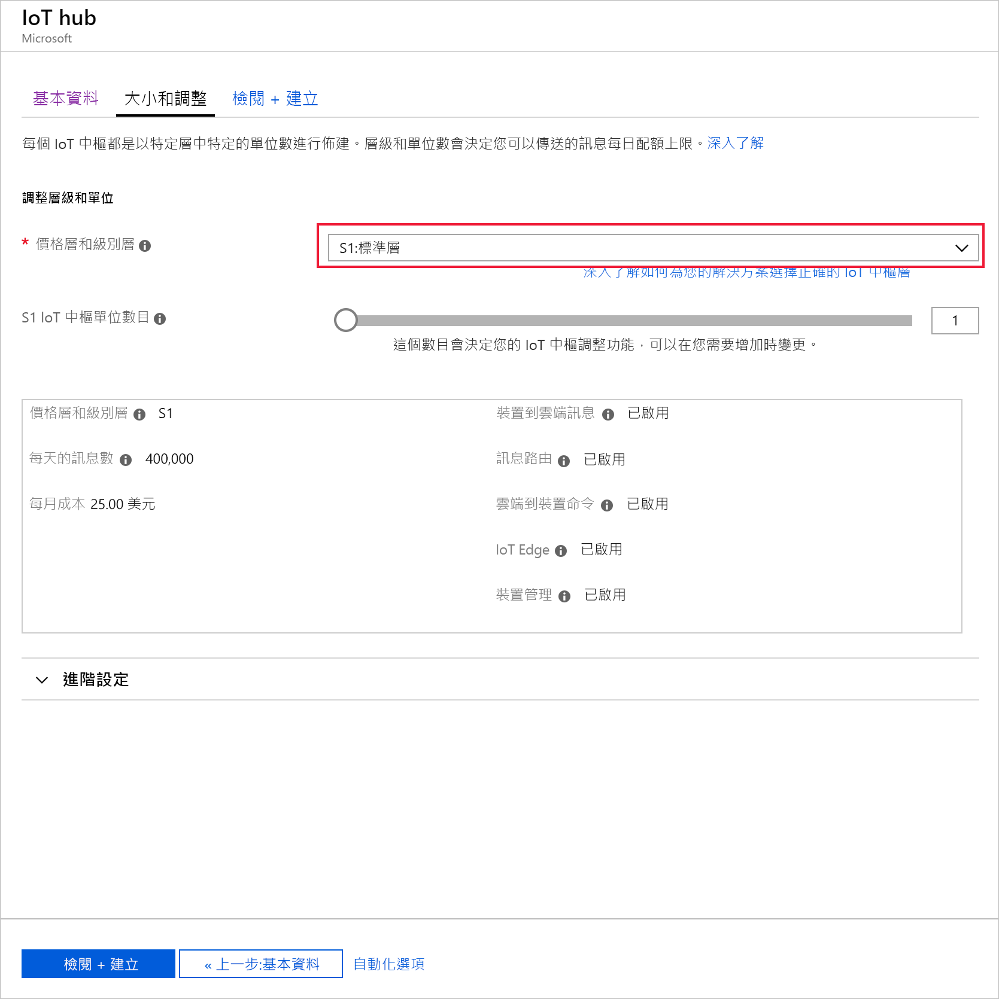

6. 選取 [檢閱 + 建立]  。 檢閱您的 IoT 中樞資訊，然後按一下 [建立]  。 建立 IoT 中樞可能需要數分鐘。 您可以在 [通知]  窗格中監視進度。

7. 在您的 IoT 中樞導覽功能表中，按一下 [IoT 裝置]  之下的 [新增]  。 新增 [裝置識別碼]  ，然後按一下 [儲存]  。

   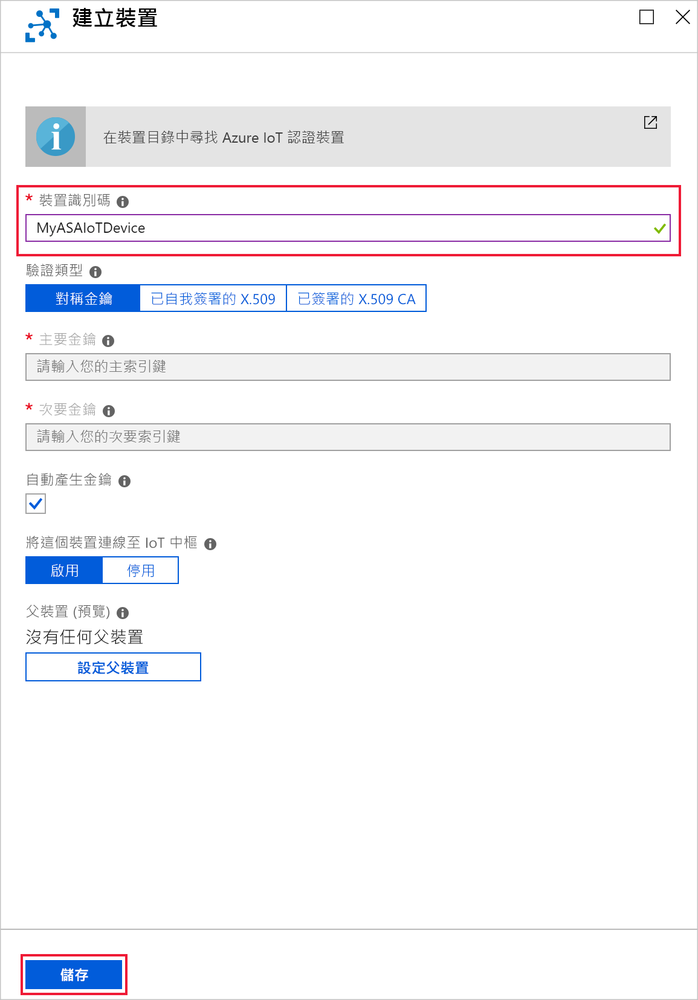

8. 建立裝置之後，請從 [IoT 裝置]  清單開啟裝置。 複製 [連接字串 -- 主索引鍵]  ，並將它儲存到記事本以供日後使用。

   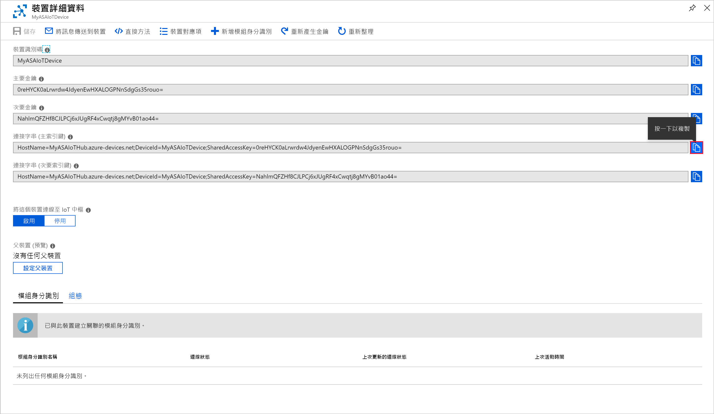

## <a name="create-blob-storage"></a>建立 Blob 儲存體

1. 從 Azure 入口網站的左上角，選取 [建立資源]   > [儲存體]   > [儲存體帳戶]  。

2. 在 [建立儲存體帳戶]  窗格中，輸入儲存體帳戶名稱、位置和資源。 選擇相同的位置和資源群組作為您建立的 IoT 中樞。 然後按一下 [檢閱 + 建立]  以建立帳戶。

   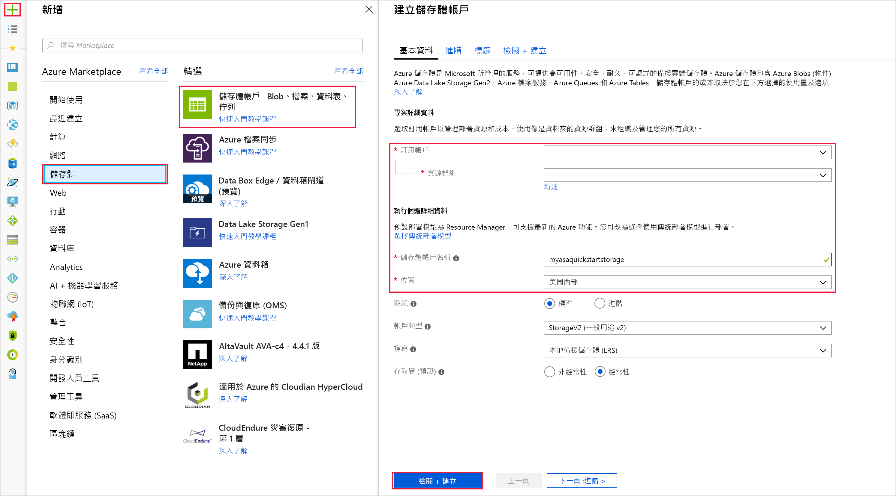

3. 建立儲存體帳戶後，選取 [概觀]  窗格上的 [Blob]  圖格。

   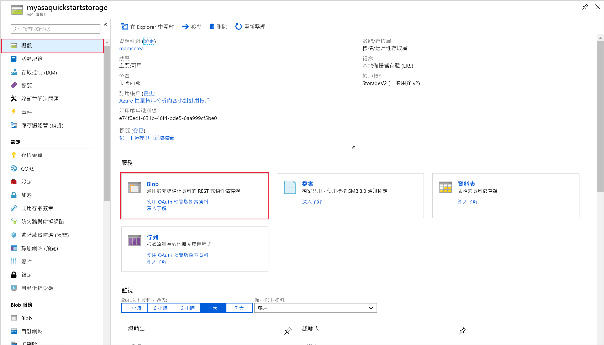

4. 在 [Blob 服務]  頁面中選取 [容器]  ，然後為容器提供名稱 (例如 container1  )。 將 [公用存取層級]  保留為 [私人 (沒有匿名存取)]  ，然後選取 [確定]  。

   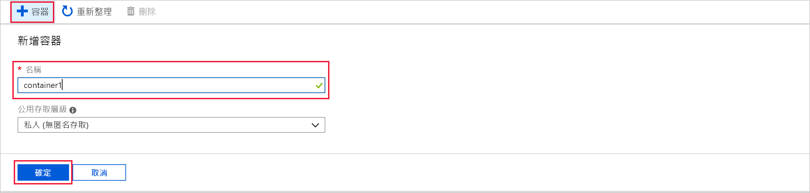

## <a name="create-a-stream-analytics-job"></a>建立串流分析作業

1. 登入 Azure 入口網站。

2. 選取 Azure 入口網站左上角的 [建立資源]  。  

3. 從結果清單中選取 [分析]   > [串流分析作業]  。  

4. 填寫串流分析作業頁面，並提供下列資訊：

   |**設定**  |**建議的值**  |**說明**  |
   |---------|---------|---------|
   |作業名稱   |  MyASAJob   |   輸入用來識別您串流分析作業的名稱。 串流分析作業名稱只可包含英數字元、連字號與底線，且其長度必須介於 3 到 63 個字元之間。 |
   |訂用帳戶  | \<您的訂用帳戶\> |  選取您要用於此作業的 Azure 訂用帳戶。 |
   |資源群組   |   asaquickstart-resourcegroup  |   選取與您的 IoT 中樞相同的資源群組。 |
   |位置  |  \<選取最接近使用者的區域\> | 選取您可以在其中裝載串流分析作業的地理位置。 使用最接近使用者的區域以提升效能並減少資料轉送成本。 |
   |串流單位  | 1  |   串流單位代表執行作業所需的計算資源。 根據預設，此值設定為 1。 若要深入了解如何調整串流單位，請參閱[了解與調整串流單位](stream-analytics-streaming-unit-consumption.md)一文。   |
   |裝載環境  |  雲端  |   串流分析作業可以部署到雲端或邊緣裝置。 雲端部分可讓您部署到 Azure 雲端，邊緣裝置部分可讓您部署到 IoT Edge 裝置。 |

   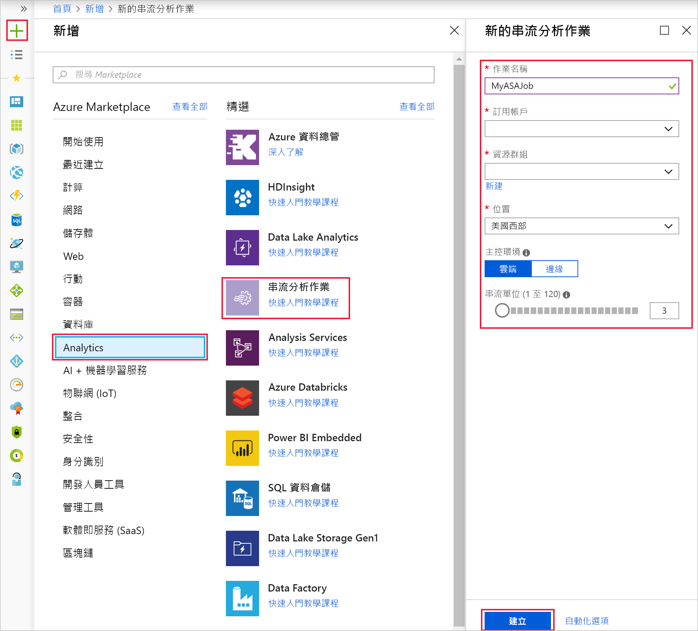

5. 核取 [釘選至儀表板]  方塊，以將作業放在您的儀表板上，然後選取 [建立]  。  

6. 您應會看到「部署進行中...」  通知顯示在瀏覽器視窗的右上方。 

## <a name="configure-job-input"></a>設定作業輸入

在本節中，您會將 IoT 中樞裝置輸入設定為串流分析作業。 使用在本快速入門的上一節中建立的 IoT 中樞。

1. 瀏覽至您的串流分析作業。  

2. 選取 [輸入]   > [新增串流輸入]   > [IoT 中樞]  。  

3. 使用下列值填寫 [IoT 中樞]  頁面：

   |**設定**  |**建議的值**  |**說明**  |
   |---------|---------|---------|
   |輸入別名  |  IoTHubInput   |  輸入名稱以識別作業的輸入。   |
   |訂用帳戶   |  \<您的訂用帳戶\> |  選取您在其中建立儲存體帳戶的 Azure 訂用帳戶。 儲存體帳戶可以位在相同或不同的訂用帳戶中。 此範例假設您已在相同的訂用帳戶中建立儲存體帳戶。 |
   |IoT 中樞  |  MyASAIoTHub |  輸入在上一節中建立的 IoT 中樞名稱。 |

4. 其他選項保留為預設值，然後選取 [儲存]  以儲存設定。  

   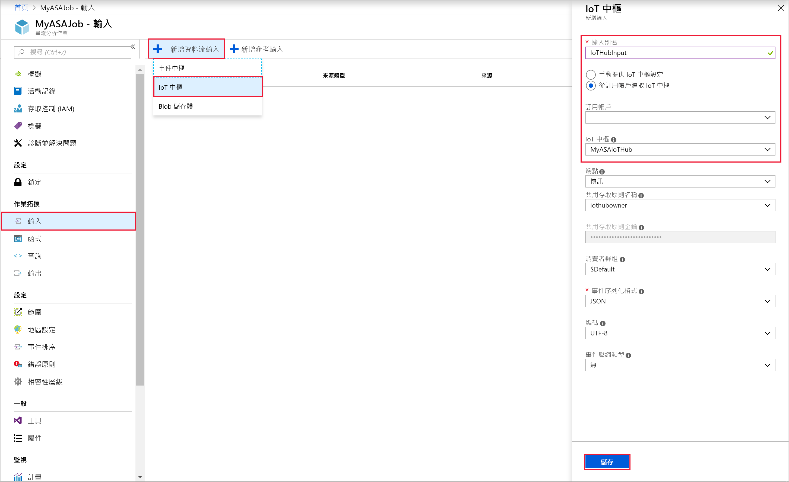
 
## <a name="configure-job-output"></a>設定作業輸出

1. 瀏覽至您先前建立的串流分析作業。  

2. 選取 [輸出]   > [新增]   > [Blob 儲存體]  。  

3. 使用下列值填寫 [Blob 儲存體]  頁面：

   |**設定**  |**建議的值**  |**說明**  |
   |---------|---------|---------|
   |輸出別名 |   BlobOutput   |   輸入名稱以識別作業的輸出。 |
   |訂用帳戶  |  \<您的訂用帳戶\>  |  選取您在其中建立儲存體帳戶的 Azure 訂用帳戶。 儲存體帳戶可以位在相同或不同的訂用帳戶中。 此範例假設您已在相同的訂用帳戶中建立儲存體帳戶。 |
   |儲存體帳戶 |  asaquickstartstorage |   選擇或輸入儲存體帳戶的名稱。 系統會自動偵測建立在相同訂用帳戶中的儲存體帳戶名稱。       |
   |容器 |   container1  |  選取您在儲存體帳戶中建立的現有容器。   |

4. 其他選項保留為預設值，然後選取 [儲存]  以儲存設定。  

   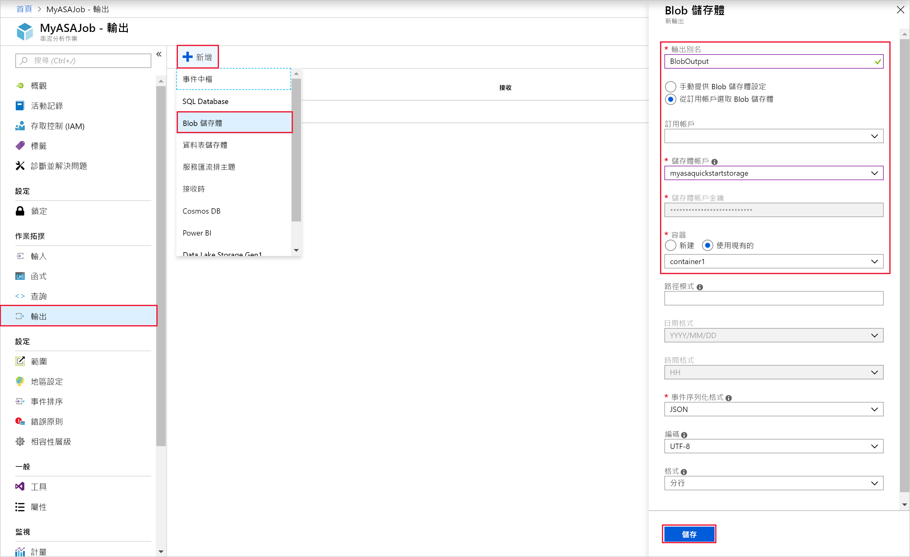
 
## <a name="define-the-transformation-query"></a>定義轉換查詢

1. 瀏覽至您先前建立的串流分析作業。  

2. 選取 [查詢]  並更新查詢，如下所示：  

   ```sql
   SELECT *
   INTO BlobOutput
   FROM IoTHubInput
   HAVING Temperature > 27
   ```

3. 在此範例中，查詢會從 IoT 中樞讀取資料，並將資料複製到 Blob 中的新檔案。 選取 [ **儲存**]。  

   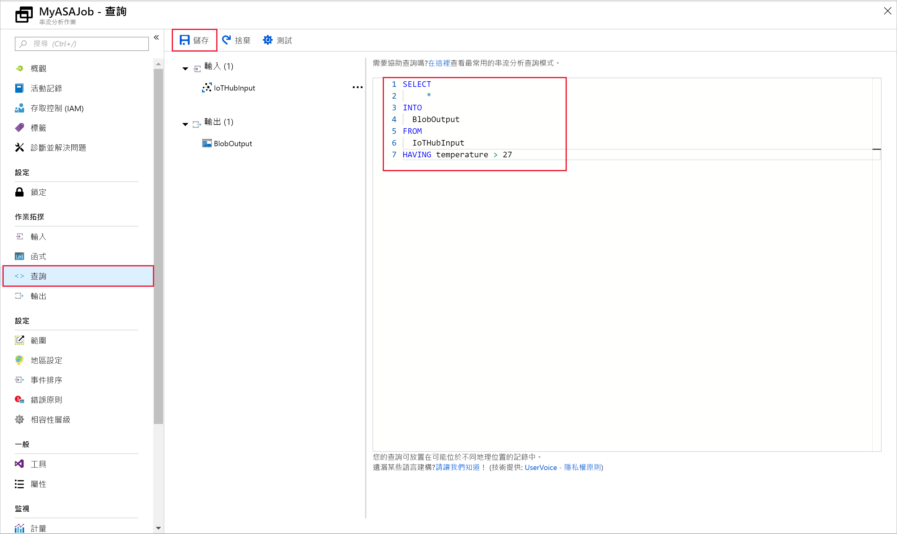

## <a name="run-the-iot-simulator"></a>執行 IoT 模擬器

1. 開啟 [Raspberry Pi Azure IoT 線上模擬器](https://azure-samples.github.io/raspberry-pi-web-simulator/)。

2. 以您在上一節中儲存的 Azure IoT 中樞裝置連接字串取代行 15 中的預留位置。

3. 按一下 **[執行]** 。 下列輸出會顯示傳送至 IoT 中樞的感應器資料和訊息。

   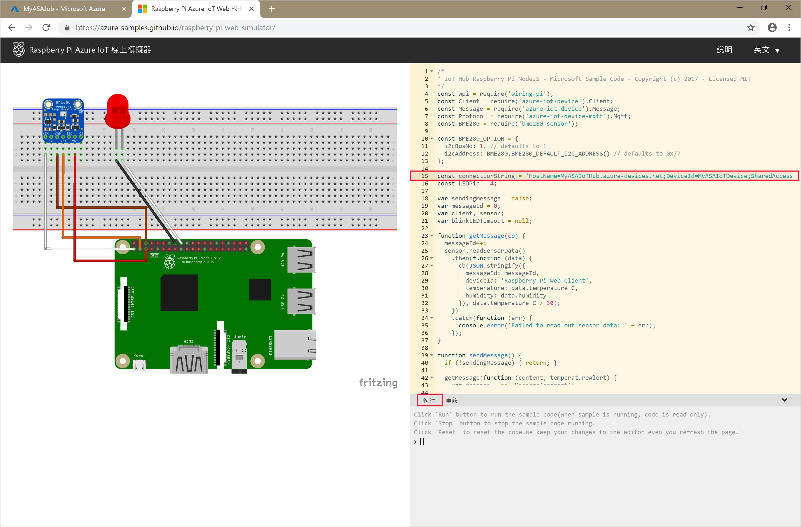

## <a name="start-the-stream-analytics-job-and-check-the-output"></a>啟動串流分析工作並查看輸出

1. 回到作業概觀頁面，然後選取 [啟動]  。

2. 在 [啟動作業]  之下，針對 [作業輸出開始時間]  欄位，選取 [現在]  。 然後，選取 [啟動]  以啟動作業。

3. 幾分鐘後，在入口網站中尋找您設定為作業輸出的儲存體帳戶和容器。 您現在可以在容器中看到輸出檔。 第一次啟動作業需要幾分鐘的時間，作業一旦啟動後，即會在資料送達時繼續執行。  

   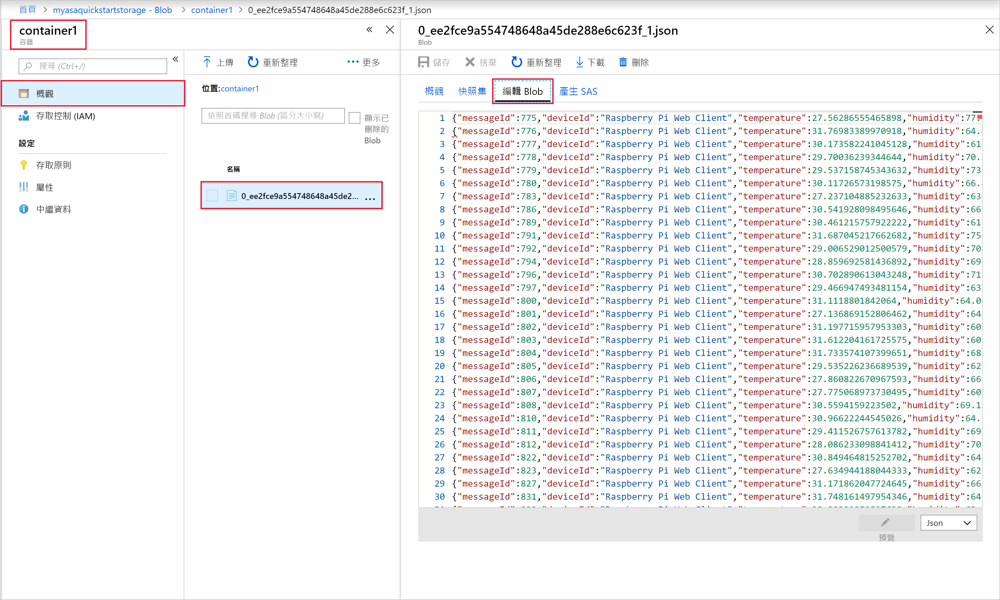

## <a name="clean-up-resources"></a>清除資源

若不再需要，請刪除資源群組、串流分析作業和所有相關資源。 刪除作業可避免因為作業使用串流單位而產生費用。 如果您計劃在未來使用該作業，您可以將其停止並在之後需要時重新啟動。 如果您將不繼續使用此作業，請使用下列步驟，刪除本快速入門所建立的所有資源：

1. 從 Azure 入口網站的左側功能表中，選取 [資源群組]  ，然後選取您所建立資源的名稱。  

2. 在資源群組頁面上，選取 [刪除]  ，在文字方塊中輸入要刪除的資源名稱，然後選取 [刪除]  。

## <a name="next-steps"></a>後續步驟

在本快速入門中，您已使用 Azure 入口網站部署了簡單的串流分析作業。 您也可以使用 [PowerShell](stream-analytics-quick-create-powershell.md)、[Visual Studio](stream-analytics-quick-create-vs.md) 和 [Visual Studio Code](quick-create-vs-code.md) 部署串流分析作業。

若要了解如何設定其他輸入來源及執行即時偵測，請前往下列文章：

> [!div class="nextstepaction"]
> [使用 Azure 串流分析進行即時詐騙偵測](stream-analytics-real-time-fraud-detection.md)

