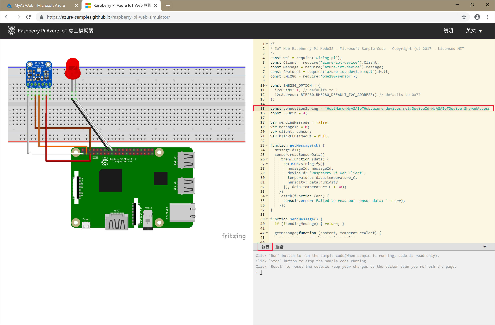

# <a name="quickstart-create-a-stream-analytics-job-using-azure-powershell"></a>快速入門：使用 Azure PowerShell 建立串流分析作業

使用 Azure PowerShell 模組，即可利用 PowerShell Cmdlet 或指令碼建立和管理 Azure 資源。 本快速入門詳細說明如何使用 Azure PowerShell 模組來部署和執行 Azure 串流分析作業。 

範例作業會從 IoT 中樞裝置讀取串流資料。 輸入資料是由 Raspberry Pi 線上模擬器產生。 接下來，串流分析作業會使用串流分析查詢語言來轉換資料，以篩選包含溫度超過 27° 的訊息。 最後，它會將產生的輸出事件寫入 Blob 儲存體中的檔案。 

## <a name="before-you-begin"></a>開始之前

* 如果您沒有 Azure 訂用帳戶，請建立[免費帳戶](https://azure.microsoft.com/free/)。  

* 本快速入門需要 Azure PowerShell 模組 3.6 版或更新版本。 執行 `Get-Module -ListAvailable AzureRM` 來尋找本機電腦上所安裝的版本。 如果您需要安裝或升級，請參閱[安裝 Azure PowerShell 模組](https://docs.microsoft.com/powershell/azure/install-azurerm-ps)。

* 某些 IoT 中樞動作不受 Azure PowerShell 支援，而且必須使用 Azure CLI 2.0.24 版或更新版本和適用於 Azure CLI 的 IoT 擴充功能完成。 [安裝 Azure CLI](https://docs.microsoft.com/cli/azure/install-azure-cli?view=azure-cli-latest)並使用 `az extension add --name azure-cli-iot-ext` 來安裝 IoT 擴充功能。


## <a name="sign-in-to-azure"></a>登入 Azure

使用 `Connect-AzureRmAccount` 命令登入 Azure 訂用帳戶，並在快顯瀏覽器中輸入您的 Azure 認證：

```powershell
# Connect to your Azure account
Connect-AzureRmAccount
```

如果您有多個訂用帳戶，請執行下列 Cmdlet 以選取您想要用於本快速入門的訂用帳戶。 務必要以您的訂用帳戶名稱取代 `<your subscription name>`：  

```powershell
# List all available subscriptions.
Get-AzureRmSubscription

# Select the Azure subscription you want to use to create the resource group and resources.
Get-AzureRmSubscription -SubscriptionName "<your subscription name>" | Select-AzureRmSubscription
```

## <a name="create-a-resource-group"></a>建立資源群組

使用 [New-AzureRmResourceGroup](https://docs.microsoft.com/powershell/module/azurerm.resources/new-azurermresourcegroup) 建立 Azure 資源群組。 資源群組是在其中部署與管理 Azure 資源的邏輯容器。

```powershell
$resourceGroup = "StreamAnalyticsRG"
$location = "WestUS2"
New-AzureRmResourceGroup `
   -Name $resourceGroup `
   -Location $location 
```

## <a name="prepare-the-input-data"></a>準備輸入資料

定義串流分析作業前，先準備設定為作業輸入的資料。

下列 Azure CLI 程式碼區塊會執行許多命令，以準備作業所需的輸入資料。 檢閱區段以了解程式碼。

1. 在 PowerShell 視窗中執行 [az login](https://docs.microsoft.com/cli/azure/authenticate-azure-cli?view=azure-cli-latest) 命令，以登入您的 Azure 帳戶。 

   當您成功登入時，Azure CLI 會傳回您的訂用帳戶清單。 複製您用於此快速入門的訂用帳戶，然後執行 [az account set](https://docs.microsoft.com/cli/azure/manage-azure-subscriptions-azure-cli?view=azure-cli-latest#change-the-active-subscription) 命令來選取該訂用帳戶。 選擇您在上一節中使用 PowerShell 選取的相同訂用帳戶。 務必要以您的訂用帳戶名稱取代 `<your subscription name>`。

   ```azurecli
   az login
   
   az account set --subscription "<your subscription>"
   ```

2. 使用 [az iot hub create](../iot-hub/iot-hub-create-using-cli.md#create-an-iot-hub) 命令建立 IoT 中樞。 此範例會建立名為 **MyASAIoTHub** 的 IoT 中樞。 因為 IoT 中樞名稱是唯一的，所以您需要提出您自己的 IoT 中樞名稱。 將 SKU 設定為 F1 可使用免費層 (如果適用於您的訂用帳戶)。 否則，請選擇下一個最低層。

   ```azurecli
   az iot hub create --name "<your IoT Hub name>" --resource-group $resourceGroup --sku S1
   ```

   建立 IoT 中樞後，使用 [az iot hub show-connection-string](https://docs.microsoft.com/cli/azure/iot/hub?view=azure-cli-latest) 命令來取得 IoT 中樞連接字串。 複製整個連接字串並加以儲存，以便在將 IoT 中樞當作輸入新增至 Stream Analytics 作業時使用。
   
   ```azurecli
   az iot hub show-connection-string --hub-name "MyASAIoTHub"
   ```

3. 使用 [az iothub device-identity create](../iot-hub/quickstart-send-telemetry-c.md#register-a-device) 命令，將裝置新增到 IoT 中樞。 此範例會建立名為 **MyASAIoTDevice** 的裝置。

   ```azurecli
   az iot hub device-identity create --hub-name "MyASAIoTHub" --device-id "MyASAIoTDevice"
   ```

4. 使用 [az iot hub device-identity show-connection-string]() 命令取得裝置連接字串。 複製整個連接字串並加以儲存，以便在建立 Raspberry Pi 模擬器時使用。

   ```azurecli
   az iot hub device-identity show-connection-string --hub-name "MyASAIoTHub" --device-id "MyASAIoTDevice" --output table
   ```

   **輸出範例：**

   ```azurecli
   HostName=MyASAIoTHub.azure-devices.net;DeviceId=MyASAIoTDevice;SharedAccessKey=a2mnUsg52+NIgYudxYYUNXI67r0JmNubmfVafojG8=
   ```

## <a name="create-blob-storage"></a>建立 Blob 儲存體

下列 Azure PowerShell 程式碼區塊會使用命令來建立用於作業輸出的 Blob 儲存體。 檢閱區段以了解程式碼。

1. 使用 [New-AzureRmStorageAccount](https://docs.microsoft.com/powershell/module/azurerm.storage/New-AzureRmStorageAccount) Cmdlet 來建立標準的一般用途儲存體帳戶。  這個範例會建立名為 **myasaquickstartstorage** 的儲存體帳戶，並含有本機備援儲存體 (LRS) 和 Blob 加密 (預設會啟用)。  
   
2. 取出儲存體帳戶內容 `$storageAccount.Context`，定義要使用的儲存體帳戶。 使用儲存體帳戶時，會參考內容而非重複提供認證。 

3. 使用 [New-AzureStorageContainer](https://docs.microsoft.com/powershell/module/azure.storage/new-azurestoragecontainer) 建立儲存體容器。

4. 複製程式碼所輸出的儲存體金鑰，並儲存該金鑰，以便稍後建立串流作業的輸出。

   ```powershell
   $storageAccountName = "myasaquickstartstorage"
   $storageAccount = New-AzureRmStorageAccount `
     -ResourceGroupName $resourceGroup `
     -Name $storageAccountName `
     -Location $location `
     -SkuName Standard_LRS `
     -Kind Storage
   
   $ctx = $storageAccount.Context
   $containerName = "container1"
   
   New-AzureStorageContainer `
     -Name $containerName `
     -Context $ctx
   
   $storageAccountKey = (Get-AzureRmStorageAccountKey `
     -ResourceGroupName $resourceGroup `
     -Name $storageAccountName).Value[0]
   
   Write-Host "The <storage account key> placeholder needs to be replaced in your output json files with this key value:" 
   Write-Host $storageAccountKey -ForegroundColor Cyan
   ```

## <a name="create-a-stream-analytics-job"></a>建立串流分析作業

使用 [New-AzureRmStreamAnalyticsJob](https://docs.microsoft.com/powershell/module/azurerm.streamanalytics/new-azurermstreamanalyticsjob?view=azurermps-5.4.0) Cmdlet 建立串流分析作業。 此 Cmdlet 會採用作業名稱、資源群組名稱和作業定義來作為參數。 作業名稱可以是任何可識別作業的易記名稱。 只能有英數字元、連字號與底線，且其長度必須介於 3 到 63 個字元之間。 作業定義是 JSON 檔案，其中包含建立作業所需的屬性。 在本機電腦上，建立名為 `JobDefinition.json` 的檔案，並於其中新增下列 JSON 資料：

```json
{    
   "location":"WestUS2",  
   "properties":{    
      "sku":{    
         "name":"standard"  
      },  
      "eventsOutOfOrderPolicy":"adjust",  
      "eventsOutOfOrderMaxDelayInSeconds":10,  
      "compatibilityLevel": 1.1
   }
}
```

接下來，執行 `New-AzureRmStreamAnalyticsJob` Cmdlet。 將 `jobDefinitionFile` 變數的值，取代為作業定義 JSON 檔案儲存所在的路徑。 

```powershell
$jobName = "MyStreamingJob"
$jobDefinitionFile = "C:\JobDefinition.json"
New-AzureRmStreamAnalyticsJob `
  -ResourceGroupName $resourceGroup `
  -File $jobDefinitionFile `
  -Name $jobName `
  -Force 
```

## <a name="configure-input-to-the-job"></a>設定作業的輸入

使用 [New-AzureRmStreamAnalyticsInput](https://docs.microsoft.com/powershell/module/azurerm.streamanalytics/new-azurermstreamanalyticsinput?view=azurermps-5.4.0) Cmdlet 新增作業的輸入。 此 Cmdlet 會採用作業名稱、作業輸入名稱、資源群組名稱和作業輸入定義來作為參數。 作業輸入定義是 JSON 檔案，其中包含設定作業輸入所需的屬性。 在此範例中，您會建立 blob 儲存體作為輸入。 

在本機電腦上，建立名為 `JobInputDefinition.json` 的檔案，並於其中新增下列 JSON 資料。 務必以您在上一節中儲存的 IoT 中樞裝置連接字串的 `SharedAccessKey` 部分，取代 `accesspolicykey` 的值。

```json
{
    "properties": {
        "type": "Stream",
        "datasource": {
            "type": "Microsoft.Devices/IotHubs",
            "properties": {
                "iotHubNamespace": "MyASAIoTHub",
                "sharedAccessPolicyName": "iothubowner",
                "sharedAccessPolicyKey": "accesspolicykey",
                "endpoint": "messages/events",
                "consumerGroupName": "$Default"
                }
        },
        "compression": {
            "type": "None"
        },
        "serialization": {
            "type": "Json",
            "properties": {
                "encoding": "UTF8"
            }
        }
    },
    "name": "IoTHubInput",
    "type": "Microsoft.StreamAnalytics/streamingjobs/inputs"
}
```

接下來，執行 `New-AzureRmStreamAnalyticsInput` Cmdlet，務必將 `jobDefinitionFile` 變數的值，取代為作業輸入定義 JSON 檔案儲存所在的路徑。 

```powershell
$jobInputName = "IoTHubInput"
$jobInputDefinitionFile = "C:\JobInputDefinition.json"
New-AzureRmStreamAnalyticsInput `
  -ResourceGroupName $resourceGroup `
  -JobName $jobName `
  -File $jobInputDefinitionFile `
  -Name $jobInputName 
```

## <a name="configure-output-to-the-job"></a>設定作業的輸出

使用 [New-AzureRmStreamAnalyticsOutput](https://docs.microsoft.com/powershell/module/azurerm.streamanalytics/new-azurermstreamanalyticsoutput?view=azurermps-5.4.0) Cmdlet 新增作業的輸出。 此 Cmdlet 會採用作業名稱、作業輸出名稱、資源群組名稱和作業輸出定義來作為參數。 作業輸出定義是 JSON 檔案，其中包含設定作業輸出所需的屬性。 這個範例會使用 blob 儲存體作為輸出。 

在本機電腦上，建立名為 `JobOutputDefinition.json` 的檔案，並於其中新增下列 JSON 資料。 務必要將 `accountKey` 的值取代為儲存體帳戶的存取金鑰 (也就是 $storageAccountKey 值內所儲存的值)。 

```json
{
    "properties": {
        "datasource": {
            "type": "Microsoft.Storage/Blob",
            "properties": {
                "storageAccounts": [
                    {
                      "accountName": "asaquickstartstorage",
                      "accountKey": "<storage account key>"
                    }],
                "container": "container1",
                "pathPattern": "output/",
                "dateFormat": "yyyy/MM/dd",
                "timeFormat": "HH"
            }
        },
        "serialization": {
            "type": "Json",
            "properties": {
                "encoding": "UTF8",
                "format": "LineSeparated"
            }
        }
    },
    "name": "BlobOutput",
    "type": "Microsoft.StreamAnalytics/streamingjobs/outputs"
}
```

接下來，執行 `New-AzureRmStreamAnalyticsOutput` Cmdlet。 務必將 `jobOutputDefinitionFile` 變數的值，取代為作業輸出定義 JSON 檔案儲存所在的路徑。 

```powershell
$jobOutputName = "BlobOutput"
$jobOutputDefinitionFile = "C:\JobOutputDefinition.json"
New-AzureRmStreamAnalyticsOutput `
  -ResourceGroupName $resourceGroup `
  -JobName $jobName `
  -File $jobOutputDefinitionFile `
  -Name $jobOutputName -Force 
```

## <a name="define-the-transformation-query"></a>定義轉換查詢

使用 [New-AzureRmStreamAnalyticsTransformation](https://docs.microsoft.com/powershell/module/azurerm.streamanalytics/new-azurermstreamanalyticstransformation?view=azurermps-5.4.0) Cmdlet 新增作業的轉換。 此 Cmdlet 會採用作業名稱、作業轉換名稱、資源群組名稱和作業轉換定義來作為參數。 在本機電腦上，建立名為 `JobTransformationDefinition.json` 的檔案，並於其中新增下列 JSON 資料。 JSON 檔案包含可定義轉換查詢的查詢參數：

```json
{     
   "name":"MyTransformation",  
   "type":"Microsoft.StreamAnalytics/streamingjobs/transformations",  
   "properties":{    
      "streamingUnits":1,  
      "script":null,  
      "query":" SELECT * INTO BlobOutput FROM IoTHubInput HAVING Temperature > 27"  
   }  
}
```

接下來，執行 `New-AzureRmStreamAnalyticsTransformation` Cmdlet。 務必將 `jobTransformationDefinitionFile` 變數的值，取代為作業轉換定義 JSON 檔案儲存所在的路徑。 

```powershell
$jobTransformationName = "MyJobTransformation"
$jobTransformationDefinitionFile = "C:\JobTransformationDefinition.json"
New-AzureRmStreamAnalyticsTransformation `
  -ResourceGroupName $resourceGroup `
  -JobName $jobName `
  -File $jobTransformationDefinitionFile `
  -Name $jobTransformationName -Force
```
## <a name="run-the-iot-simulator"></a>執行 IoT 模擬器

1. 開啟 [Raspberry Pi Azure IoT 線上模擬器](https://azure-samples.github.io/raspberry-pi-web-simulator/)。

2. 以您在上一節中儲存的整個 Azure IoT 中樞裝置連接字串取代行 15 中的預留位置。

3. 按一下 **[執行]**。 下列輸出會顯示傳送至 IoT 中樞的感應器資料和訊息。

   

## <a name="start-the-stream-analytics-job-and-check-the-output"></a>啟動串流分析工作並查看輸出

使用 [Start-AzureRmStreamAnalyticsJob](https://docs.microsoft.com/powershell/module/azurerm.streamanalytics/start-azurermstreamanalyticsjob?view=azurermps-5.4.0) Cmdlet 啟動作業。 此 Cmdlet 會採用作業名稱、資源群組名稱、輸出啟動模式和啟動時間來作為參數。 `OutputStartMode` 可接受 `JobStartTime`、`CustomTime` 或 `LastOutputEventTime`。 若要了解這些值各自代表什麼，請參閱 PowerShell 文件中的[參數](https://docs.microsoft.com/powershell/module/azurerm.streamanalytics/start-azurermstreamanalyticsjob?view=azurermps-5.4.0)一節。 

執行下列 Cmdlet 後，如果作業啟動，它會在輸出中傳回 `True`。 在儲存體容器中，建立的輸出資料夾包含已轉換的資料。 

```powershell
Start-AzureRmStreamAnalyticsJob `
  -ResourceGroupName $resourceGroup `
  -Name $jobName `
  -OutputStartMode 'JobStartTime'
```

## <a name="clean-up-resources"></a>清除資源

若不再需要，可刪除資源群組、串流作業和所有相關資源。 刪除作業可避免因為作業使用串流單位而產生費用。 如果您計劃在未來使用該作業，您可以跳過刪除動作，且目前停止作業。 如果您不要繼續使用此作業，請執行下列 Cmdlet，以刪除本快速入門所建立的所有資源：

```powershell
Remove-AzureRmResourceGroup `
  -Name $resourceGroup 
```

## <a name="next-steps"></a>後續步驟

在本快速入門中，您已使用 PowerShell 部署了簡單的串流分析作業。 您也可以使用 [Azure 入口網站](stream-analytics-quick-create-portal.md)和 [Visual Studio](stream-analytics-quick-create-vs.md) 部署串流分析作業。

若要了解如何設定其他輸入來源及執行即時偵測，請前往下列文章：

> [!div class="nextstepaction"]
> [使用 Azure 串流分析進行即時詐騙偵測](stream-analytics-real-time-fraud-detection.md)
