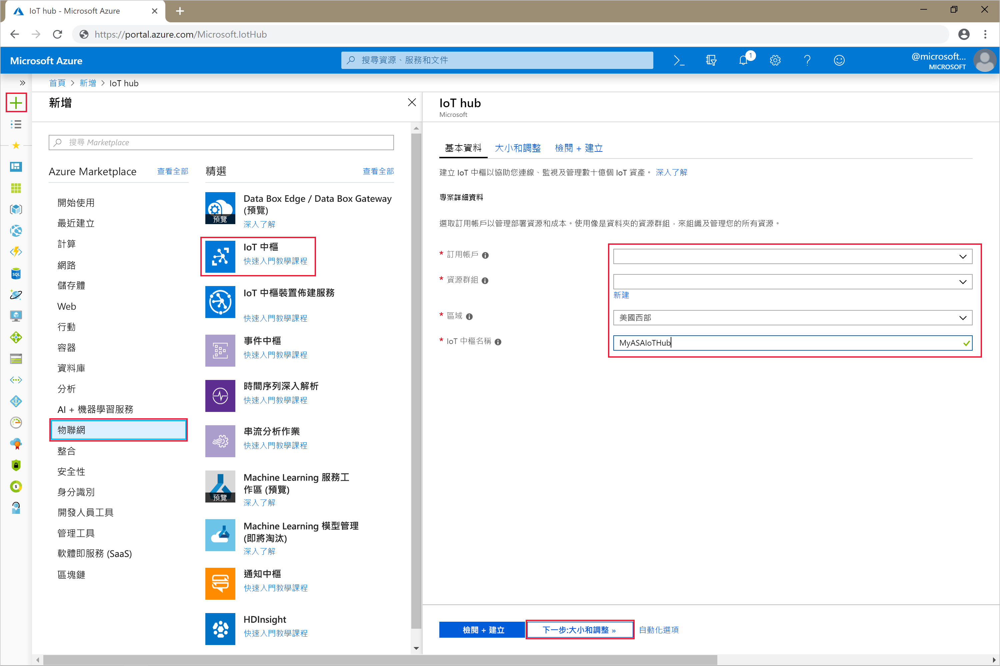
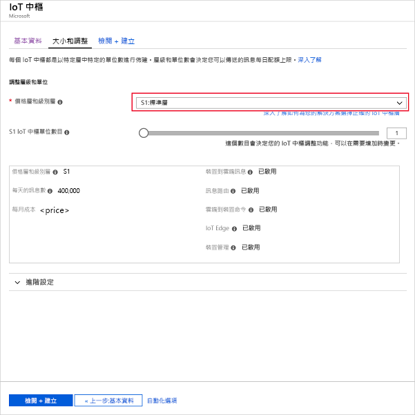
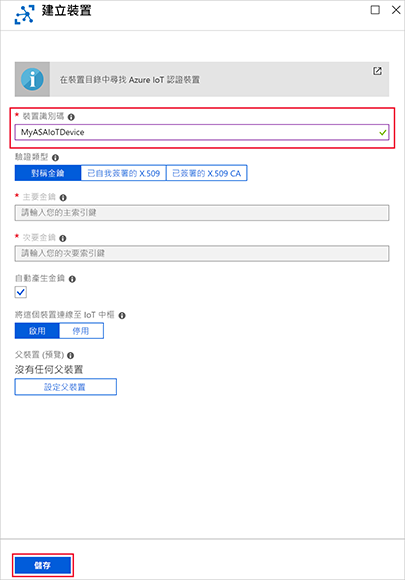
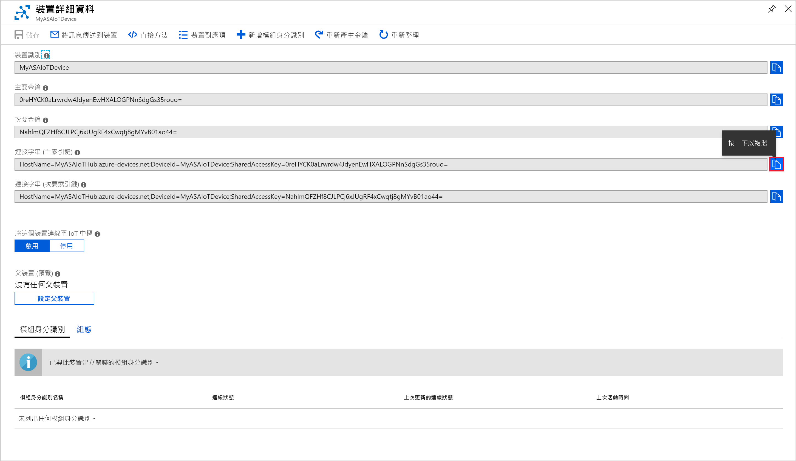

# <a name="quickstart-create-an-azure-stream-analytics-job-by-using-visual-studio"></a>快速入門：使用 Visual Studio 建立 Azure 串流分析作業

本快速入門將說明如何使用適用於 Visual Studio 的 Azure 串流分析工具建立及執行串流分析作業。 範例作業會從 IoT 中樞裝置讀取串流資料。 您會定義一項作業，用以計算溫度超過 27° 時的平均溫度，並將產生的輸出事件寫入 Blob 儲存體中的新檔案。

## <a name="before-you-begin"></a>開始之前

* 如果您沒有 Azure 訂用帳戶，請建立[免費帳戶](https://azure.microsoft.com/free/)。

* 登入 [Azure 入口網站](https://portal.azure.com/)。

* 安裝 Visual Studio 2019、Visual Studio 2015 或 Visual Studio 2013 Update 4。 支援 Enterprise (Ultimate/Premium)、Professional 和 Community 版本。 不支援 Express 版本。

* 依照[安裝指示](https://docs.microsoft.com/azure/stream-analytics/stream-analytics-tools-for-visual-studio-install)，安裝適用於 Visual Studio 的串流分析工具。

## <a name="prepare-the-input-data"></a>準備輸入資料

定義串流分析作業前，您應先準備資料，該資料稍後會設定為作業輸入。 為了準備作業所需的輸入資料，請完成下列步驟：

1. 登入 [Azure 入口網站](https://portal.azure.com/)。

2. 選取 [建立資源]   > [物聯網]   > [IoT 中樞]  。

3. 在 [IoT 中樞]  窗格中，輸入下列資訊︰
   
   |**設定**  |**建議的值**  |**說明**  |
   |---------|---------|---------|
   |Subscription  | \<您的訂用帳戶\> |  選取您要使用的 Azure 訂用帳戶。 |
   |Resource group   |   asaquickstart-resourcegroup  |   選取 [新建]  ，然後為您的帳戶輸入新的資源群組名稱。 |
   |區域  |  \<選取最接近使用者的區域\> | 選取您可以在其中裝載 IoT 中樞的地理位置。 使用最靠近您的使用者的位置。 |
   |IoT 中樞名稱  | MyASAIoTHub  |   選取您的 IoT 中樞名稱。   |

   

4. 完成時，選取 [下一步:  設定大小與級別]。

5. 選擇您的**定價與級別層**。 在本快速入門中，選取 [F1-免費]  層 (如果仍可用於您的訂用帳戶)。 如果無法使用免費層，請選擇可用的最低層。 如需詳細資訊，請參閱 [IoT 中樞定價](https://azure.microsoft.com/pricing/details/iot-hub/)。

   

6. 選取 [檢閱 + 建立]  。 檢閱您的 IoT 中樞資訊，然後按一下 [建立]  。 建立 IoT 中樞可能需要數分鐘。 您可以在 [通知]  窗格中監視進度。

7. 在您的 IoT 中樞導覽功能表中，按一下 [IoT 裝置]  之下的 [新增]  。 新增 [裝置識別碼]  ，然後按一下 [儲存]  。

   

8. 建立裝置之後，請從 [IoT 裝置]  清單開啟裝置。 複製 [連接字串 -- 主索引鍵]  ，並將它儲存到記事本以供日後使用。

   

## <a name="create-blob-storage"></a>建立 Blob 儲存體

1. 從 Azure 入口網站的左上角，選取 [建立資源]   > [儲存體]   > [儲存體帳戶]  。

2. 在 [建立儲存體帳戶]  窗格中，輸入儲存體帳戶名稱、位置和資源。 選擇相同的位置和資源群組作為您建立的 IoT 中樞。 然後按一下 [檢閱 + 建立]  以建立帳戶。

   

3. 建立儲存體帳戶後，選取 [概觀]  窗格上的 [Blob]  圖格。

   

4. 在 [Blob 服務]  頁面中選取 [容器]  ，然後為容器提供名稱 (例如 container1  )。 將 [公用存取層級]  保留為 [私人 (沒有匿名存取)]  ，然後選取 [確定]  。

   

## <a name="create-a-stream-analytics-project"></a>建立串流分析專案

1. 啟動 Visual Studio。

2. 選取 [檔案] > [新增專案]  。  

3. 在左側的範本清單中，選取 [串流分析]  ，然後選取 [Azure 串流分析應用程式]  。  

4. 輸入專案的 [名稱]  、[位置]  和 [解決方案名稱]  ，然後選取 [確定]  。

   

請留意 Azure 串流分析專案中包含的元素。

   


## <a name="choose-the-required-subscription"></a>選擇必要的訂用帳戶

1. 在 Visual Studio 的 [檢視]  功能表上，選取 [伺服器總管]  。

2. 以滑鼠右鍵按一下 [Azure]  ，選取 [連線到 Microsoft Azure 訂用帳戶]  ，然後以您的 Azure 帳戶登入。

## <a name="define-input"></a>定義輸入

1. 在 [方案總管]  中，展開 [輸入]  節點，然後按兩下 [Input.json]  。

2. 在 [串流分析輸入組態]  中填入下列值：

   |**設定**  |**建議的值**  |**說明**   |
   |---------|---------|---------|
   |輸入別名  |  輸入   |  輸入名稱以識別作業的輸入。   |
   |來源類型   |  資料流 |  選擇適當的輸入來源：資料流或參考資料。   |
   |來源  |  IoT 中樞 |  選擇適當的輸入來源。   |
   |資源  | 選擇目前帳戶中的資料來源 | 選擇以手動方式輸入資料，或選取現有的帳戶。   |
   |Subscription  |  \<您的訂用帳戶\>   | 根據您建立的事件中樞，選取 IoT 中樞所在的 Azure 訂用帳戶。   |
   |IoT 中樞  |  MyASAIoTHub   |  選擇或輸入 IoT 中樞的名稱。 系統會自動偵測建立在相同訂用帳戶中的 IoT 中樞名稱。   |
   
3. 其他選項保留為預設值，然後選取 [儲存]  以儲存設定。  

   

## <a name="define-output"></a>定義輸出

1. 在 [方案總管]  中展開 [輸出]  節點，然後按兩下 [Output.json]  。

2. 在 [串流分析輸出組態]  中填入下列值：

   |**設定**  |**建議的值**  |**說明**   |
   |---------|---------|---------|
   |輸出別名  |  輸出   |  輸入名稱以識別作業的輸出。   |
   |接收   |  Blob 儲存體 |  選擇適當的接收。    |
   |資源  |  手動提供資料來源設定 |  選擇以手動方式輸入資料，或選取現有的帳戶。   |
   |Subscription  |  \<您的訂用帳戶\>   | 選取您在其中建立儲存體帳戶的 Azure 訂用帳戶。 儲存體帳戶可以位在相同或不同的訂用帳戶中。 此範例假設您已在相同的訂用帳戶中建立儲存體帳戶。   |
   |儲存體帳戶  |  asaquickstartstorage   |  選擇或輸入儲存體帳戶的名稱。 系統會自動偵測建立在相同訂用帳戶中的儲存體帳戶名稱。   |
   |容器  |  container1   |  選取您在儲存體帳戶中建立的現有容器。   |
   |路徑格式  |  output   |  輸入要在容器內建立的檔案路徑名稱。   |
   
3. 其他選項保留為預設值，然後選取 [儲存]  以儲存設定。  

   

## <a name="define-the-transformation-query"></a>定義轉換查詢

1. 從 Visual Studio 中的**方案總管**開啟 **Script.asaql**。

2. 新增下列查詢：

   ```sql
   SELECT *
   INTO BlobOutput
   FROM IoTHubInput
   HAVING Temperature > 27
   ```

## <a name="submit-a-stream-analytics-query-to-azure"></a>將串流分析查詢提交至 Azure

1. 在 [查詢編輯器]  中，選取指令碼編輯器中的 [提交至 Azure]  。

2. 選取 [建立新的 Azure 串流分析作業]  ，然後輸入 [作業名稱]  。 選擇您在快速入門一開始時使用的 [訂用帳戶]  、[資源群組]  和 [位置]  。

   

## <a name="run-the-iot-simulator"></a>執行 IoT 模擬器

1. 在新的瀏覽器索引標籤或視窗中開啟 [Raspberry Pi Azure IoT 線上模擬器](https://azure-samples.github.io/raspberry-pi-web-simulator/)。

2. 以您在上一節中儲存的 Azure IoT 中樞裝置連接字串取代行 15 中的預留位置。

3. 按一下 **[執行]** 。 下列輸出會顯示傳送至 IoT 中樞的感應器資料和訊息。

   

## <a name="start-the-stream-analytics-job-and-check-output"></a>啟動串流分析工作並查看輸出

1. 作業建立後，作業檢視會自動開啟。 選取綠色箭頭按鈕可啟動作業。

   

2. 將 [作業輸出啟動模式]  變更為 [JobStartTime]  ，然後選取 [啟動]  。

   

3. 請留意作業狀態已變更為 [執行中]  ，並且有輸入/輸出事件。 這可能需要幾分鐘的時間。

   

4. 若要檢視結果，請在 [檢視]  功能表上選取 [Cloud Explorer]  ，並瀏覽至您資源群組中的儲存體帳戶。 在 [Blob 容器]  下方按兩下 **container1**，然後按兩下**輸出**檔案路徑。

   

## <a name="clean-up-resources"></a>清除資源

若不再需要，可刪除資源群組、串流作業和所有相關資源。 刪除作業可避免因為作業使用串流單位而產生費用。 如果您計劃在未來使用該作業，您可以將其停止並在之後需要時重新啟動。 如果您將不繼續使用此作業，請使用下列步驟，刪除本快速入門所建立的所有資源：

1. 從 Azure 入口網站的左側功能表中，選取 [資源群組]  ，然後選取您所建立資源的名稱。  

2. 在資源群組頁面上，選取 [刪除]  ，在文字方塊中輸入要刪除的資源名稱，然後選取 [刪除]  。

## <a name="next-steps"></a>後續步驟

在本快速入門中，您已使用 Visual Studio 部署了簡單的串流分析作業。 您也可以使用 [Azure 入口網站](stream-analytics-quick-create-portal.md)和 [PowerShell](stream-analytics-quick-create-powershell.md) 部署串流分析作業。 

若要了解適用於 Visual Studio 的 Azure 串流分析工具，請繼續下列文章：

> [!div class="nextstepaction"]
> [使用 Visual Studio 檢視 Azure 串流分析工作](stream-analytics-vs-tools.md)
