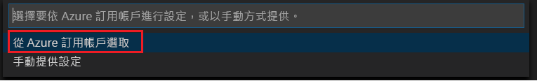
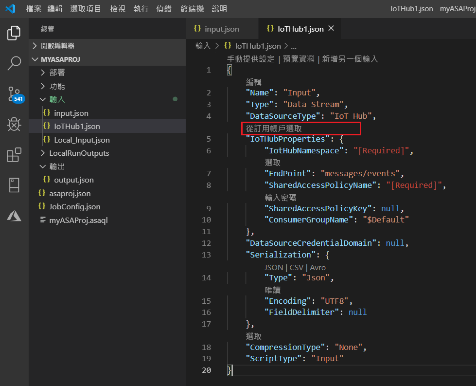
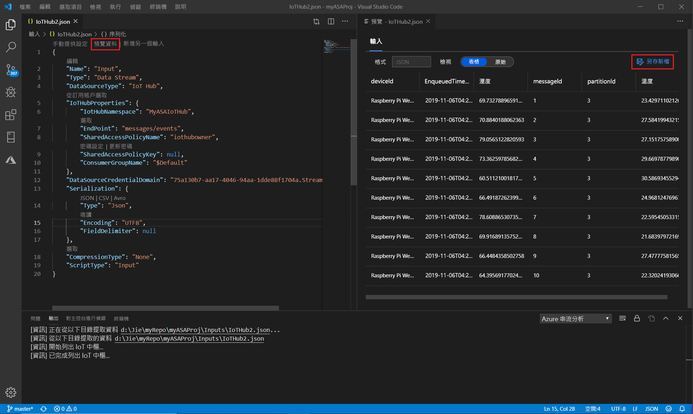

# 使用 Visual Studio Code 在本機針對即時串流輸入測試串流分析查詢

您可以使用適用于 Visual Studio Code 的 Azure 串流分析工具，在本機針對即時串流輸入測試您的串流分析作業。 輸入可以來自 Azure 事件中樞或 Azure IoT 中樞等來源。 輸出結果會以 JSON 檔案形式傳送至您專案中名為**LocalRunOutputs**的資料夾。

## 必要條件

* 安裝[.NET Core SDK](https://dotnet.microsoft.com/download)並重新啟動 Visual Studio Code。

* 使用[本快速入門](quick-create-vs-code.md)來瞭解如何使用 Visual Studio Code 建立串流分析作業。

## 定義即時資料流輸入

1. 以滑鼠右鍵按一下串流分析專案中的 [**輸入**] 資料夾。 然後從內容功能表中選取 [ **ASA：新增輸入**]。

   ![從 [輸入] 資料夾新增輸入](./media/quick-create-vs-code/add-input-from-inputs-folder.png)

   您也可以選取**Ctrl + Shift + P**來開啟命令選擇區，然後輸入**ASA： Add Input**。

   

2. 從下拉式清單中選擇輸入來源類型。

   ![選取 [IoT 中樞] 做為輸入選項](./media/quick-create-vs-code/iot-hub.png)

3. 如果您已從命令選擇區新增輸入，請選擇要使用輸入的串流分析查詢腳本。 它應該會自動填入**myasaproj.asaql. script.asaql**的檔案路徑。

   

4. 從下拉式功能表中選擇 [**從您的 Azure 訂用帳戶選取**]。

    

5. 設定新產生的 JSON 檔案。 您可以使用 CodeLens 功能，協助您輸入字串、從下拉式清單中選取，或直接變更檔案中的文字。 下列螢幕擷取畫面顯示**從您的訂用帳戶中選取**的範例。

   

## 預覽輸入

若要確定輸入資料即將存在，請從頂端行中選取即時輸入設定檔案中的 [**預覽資料**]。 某些輸入資料來自 IoT 中樞，並顯示在預覽視窗中。 預覽可能需要幾秒鐘的時間才會出現。

 

## 在本機執行查詢

返回您的查詢編輯器，然後選取 [在**本機執行**]。 然後從下拉式清單中選取 [**使用即時輸入**]。

![在 [查詢編輯器] 中選取 [本機執行]](./media/vscode-local-run/run-locally.png)

![選取 [使用即時輸入]](./media/vscode-local-run-live-input/run-locally-use-live-input.png)

結果會顯示在右側視窗中，並每3秒重新整理一次。 您可以選取 [**執行**] 來重新測試。 您也可以選取 [**在資料夾中開啟**]，在 [檔案管理器] 中查看結果檔案，然後使用 Visual Studio Code 或 Excel 之類的工具來開啟這些檔案。 請注意，結果檔案僅適用于 JSON 格式。

開始建立輸出之作業的預設時間是設定為 [**現在**]。 您可以在 [結果] 視窗中選取 [**輸出開始時間**] 按鈕來自訂時間。

## 後續步驟

* [使用 Visual Studio Code 探索 Azure 串流分析作業（預覽）](visual-studio-code-explore-jobs.md)

* [使用 npm 套件來設定 CI/CD 管線](setup-cicd-vs-code.md)
