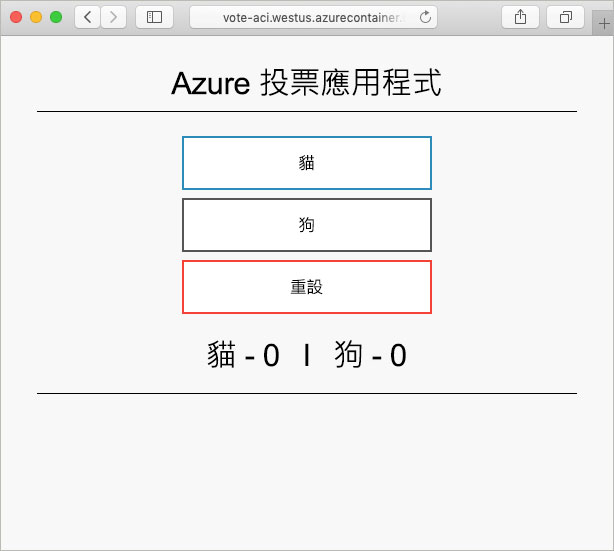

# <a name="create-a-terraform-configuration-for-azure"></a>建立 Azure 的 Terraform 組態

在此範例中，您將體驗如何建立 Terraform 組態，並將此組態部署至 Azure。 完成之後，您即已部署 Azure Cosmos DB 執行個體、Azure 容器執行個體，以及可在這兩項資源之間運作的應用程式。 本文件假設所有工作都會在已預先安裝 Terraform 工具的 Azure Cloud Shell 中完成。 如果您想要在自己的系統上完成此範例，您可以依照[這裡](../virtual-machines/linux/terraform-install-configure.md)的指示安裝 Terraform。

## <a name="create-first-configuration"></a>建立第一個組態

在本節中，您將建立 Azure Cosmos DB 執行個體的組態。

選取 [立即試用] 以開啟 Azure Cloud Shell。 開啟之後，請輸入 `code .` 以開啟 Cloud Shell 程式碼編輯器。

```azurecli-interactive
code .
```

複製並貼上下列 Terraform 組態。

此組態會建立 Azure 資源群組、隨機整數和 Azure Cosmos DB 執行個體的模型。 隨機整數會用於 Cosmos DB 執行個體名稱中。 此外也會設定數個 Cosmos DB 設定。 如需 Cosmos DB Terraform 組態的完整清單，請參閱 [Cosmos DB Terraform 參考](https://www.terraform.io/docs/providers/azurerm/r/cosmosdb_account.html)。

完成之後，請將檔案儲存為 `main.tf`。 此作業可使用程式碼編輯器右上方的省略符號來完成。

```azurecli-interactive
resource "azurerm_resource_group" "vote-resource-group" {
  name     = "vote-resource-group"
  location = "westus"
}

resource "random_integer" "ri" {
  min = 10000
  max = 99999
}

resource "azurerm_cosmosdb_account" "vote-cosmos-db" {
  name                = "tfex-cosmos-db-${random_integer.ri.result}"
  location            = "${azurerm_resource_group.vote-resource-group.location}"
  resource_group_name = "${azurerm_resource_group.vote-resource-group.name}"
  offer_type          = "Standard"
  kind                = "GlobalDocumentDB"

  consistency_policy {
    consistency_level       = "BoundedStaleness"
    max_interval_in_seconds = 10
    max_staleness_prefix    = 200
  }

  geo_location {
    location          = "westus"
    failover_priority = 0
  }
}
```

[terraform init](https://www.terraform.io/docs/commands/init.html) 命令會初始化工作目錄。 在 Cloud Shell 終端機中執行 `terraform init`，以準備部署新組態。

```azurecli-interactive
terraform init
```

[terraform plan](https://www.terraform.io/docs/commands/plan.html) 命令可用來驗證組態是否已正確格式化，並顯示將會建立、更新或終結哪些資源。 結果可以儲存在檔案中，並在稍後用來套用設定。

執行 `terraform plan` 以測試新的 Terraform 組態。

```azurecli-interactive
terraform plan --out plan.out
```

使用 [terraform apply](https://www.terraform.io/docs/commands/apply.html) 並指定計劃檔案的名稱，以套用組態。 此命令會在您的 Azure 訂用帳戶中部署資源。

```azurecli-interactive
terraform apply plan.out
```

完成之後，您會看到資源群組已建立，且有 Azure Cosmos DB 執行個體放置在資源群組中。

## <a name="update-configuration"></a>更新組態

更新組態以包含 Azure 容器執行個體。 容器會執行對 Cosmos DB 讀取和寫入資料的應用程式。

將下列組態複製到 `main.tf` 檔案底部。 完成之後，請儲存檔案。

此時會設定 `COSMOS_DB_ENDPOINT` 和 `COSMOS_DB_MASTERKEY` 兩個環境變數。 這些變數會保存用來存取資料庫的位置和金鑰。 這些變數的值取自最後一個步驟中建立的資料庫執行個體。 此程序稱為插補。 若要深入了解 Terraform 插補，請參閱[插補語法](https://www.terraform.io/docs/configuration/interpolation.html)。


該組態也包含一個輸出區塊，此區塊會傳回容器執行個體的完整網域名稱 (FQDN)。

```azurecli-interactive
resource "azurerm_container_group" "vote-aci" {
  name                = "vote-aci"
  location            = "${azurerm_resource_group.vote-resource-group.location}"
  resource_group_name = "${azurerm_resource_group.vote-resource-group.name}"
  ip_address_type     = "public"
  dns_name_label      = "vote-aci"
  os_type             = "linux"

  container {
    name   = "vote-aci"
    image  = "microsoft/azure-vote-front:cosmosdb"
    cpu    = "0.5"
    memory = "1.5"
    ports  = {
      port     = 80
      protocol = "TCP"
    }

    secure_environment_variables {
      "COSMOS_DB_ENDPOINT"  = "${azurerm_cosmosdb_account.vote-cosmos-db.endpoint}"
      "COSMOS_DB_MASTERKEY" = "${azurerm_cosmosdb_account.vote-cosmos-db.primary_master_key}"
      "TITLE"               = "Azure Voting App"
      "VOTE1VALUE"          = "Cats"
      "VOTE2VALUE"          = "Dogs"
    }
  }
}

output "dns" {
  value = "${azurerm_container_group.vote-aci.fqdn}"
}
```

執行 `terraform plan` 以建立更新的計劃，並將要進行的變更視覺化。 您應會看到一項 Azure 容器執行個體資源已新增至組態。

```azurecli-interactive
terraform plan --out plan.out
```

最後，執行 `terraform apply` 以套用組態。

```azurecli-interactive
terraform apply plan.out
```

完成之後，請記下容器執行個體 FQDN。

## <a name="test-application"></a>測試應用程式

瀏覽至容器執行個體的 FQDN。 如果一切都已正確設定，您應該會看到下列應用程式。



## <a name="clean-up-resources"></a>清除資源

完成之後，可以使用 [terraform destroy](https://www.terraform.io/docs/commands/destroy.html) 命令將 Azure 資源和資源群組移除。

```azurecli-interactive
terraform destroy -auto-approve
```

## <a name="next-steps"></a>後續步驟

在此範例中，您已建立、部署並終結 Terraform 組態。 如需在 Azure 中使用 Terraform 的詳細資訊，請參閱 Azure Terraform 提供者文件。

> [!div class="nextstepaction"]
> [Azure Terraform 提供者](https://www.terraform.io/docs/providers/azurerm/)