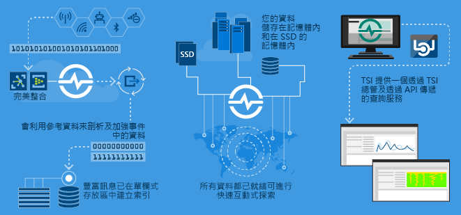
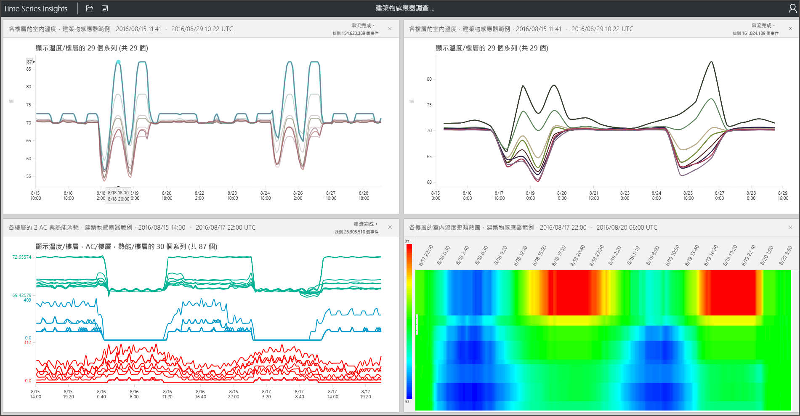

# 什麼是 Azure 時間序列深入解析？

時間序列深入解析是針對儲存、視覺化及查詢大量時間序列資料 (例如 IoT 裝置所產生的時間序列資料) 而建置。  如果您想要儲存、管理、查詢或以視覺化方式呈現雲端的時間序列資料，時間序列深入解析可能很適合您。  

時間序列深入解析有四個主要工作：

- 第一，它能和 Azure IoT 中樞和 Azure 事件中樞這類雲端閘道完全整合。 其可輕鬆地連線到這些事件來源，若訊息和結構在無錯誤的資料列和資料行中有資料，即剖析 JSON。 它會聯結中繼資料與遙測資料，而且將單欄式存放區中的資料編製索引。
- 第二，時間序列深入解析會管理資料的儲存體。 為了確保隨時能夠輕鬆存取資料，它會將資料儲存在記憶體和 SSD 中長達 400 天。 您可以視需求在幾秒內以互動方式查詢數十億個事件。
- 第三，時間序列深入解析可透過 TSI 總管提供立即可用的視覺效果。  
- 第四，時間序列深入解析可在 TSI 總管中提供查詢服務，也可以用 API 查詢，API 方便整合，可將時間序列資料嵌入到自訂應用程式中。  

如果您要建置應用程式，以供內部取用或供外部客戶使用，時間序列深入解析可作為編製索引、儲存及彙總時間序列資料的後端。 您可以在打造頂級的自訂視覺效果和使用者體驗。  時間序列深入解析會公開查詢 API 以啟用此案例。  

如果您不確定您的資料是否為時間序列，您應該知道下列資訊。  時間序列資料代表資產或處理程序如何隨著時間改變。  它的特色是具有時間戳記，而且以時間軸呈現最有意義。  時間序列資料通常會依照時間順序送達，而且通常會被視為插入資料庫，而不是更新資料庫。  因為時間序列深入解析會擷取每個新事件並儲存為一個資料列，所以會隨著時間測量變更，讓您回顧和預測未來變更。  在大型磁碟區中，儲存、編製索引、查詢、分析並以視覺化方式呈現時間序列資料可能具有挑戰性。  

## 視訊： 

### 在此影片中，我們提供時間序列深入解析這個雲端式 IoT 分析平台的概觀。 

> [!VIDEO https://www.youtube.com/embed/qNc9gQTLROs]

## 主要案例

- 以可擴充的方式儲存時間序列資料。  
  - 基本上，時間序列深入解析具有以時間序列資料為設計考量的資料庫。  因為該資料庫可擴充且完全受控，所以時間序列深入解析可處理事件的儲存和管理工作。

- 近乎即時的資料探索。  
  - 時間序列深入解析提供的總管可以視覺化方式呈現流入環境中的所有資料。  在連線事件來源之後，馬上就可以檢視、探索及查詢時間序列深入解析內的資料。  此資料適合用於驗證裝置是否如預期般發出資料，以及監視 IoT 資產的健康情況、生產力和整體效益。  

- 根本原因分析和異常偵測。
  - 時間序列深入解析具有模式和透視檢視等工具，可進行和儲存多步驟的根本原因分析。  此外，時間序列深入解析會與 Azure 串流分析等警示服務一起運作，因此可以在時間序列深入解析總管中以近乎即時的方式檢視警示和偵測到的異常情況。  

- 來自不同位置之時間序列資料的全域檢視，可供進行多個資料/網站比較。
  - 您可以將多個事件來源連線到時間序列深入解析環境。  這表示，可以近乎即時的方式一起檢視從多個不同位置流入的資料。  使用者可以利用此可見性來與商務領導者共享資料，以及與可運用專業知識來協助解決問題、套用最佳做法及分享學習的各領域專家更密切地合作。

- 在時間序列深入解析上建置客戶應用程式。 
  - 時間序列深入解析公開的 REST 查詢 API 可讓您建置使用時間序列資料的應用程式。

## 功能

- **快速上手**：Azure 時間序列深入解析不必事先準備資料。 在短短幾分鐘內連線至 Azure IoT 中樞或事件中樞內的數百萬個事件。 連線後即可與感應器資料互動並將其視覺化，進而快速驗證您的 IoT 解決方案。 您不需撰寫程式碼，即可與您的資料互動。
您不需要學習新的語言，因為時間序列深入解析會為進階使用者提供細微且可輸入任意文字的查詢介面，並提供點選探索功能。
- **近乎即時的深入解析**：時間序列深入解析每天可以擷取數百萬個感應器事件，其延遲時間只有一分鐘。 時間序列深入解析協助您深入了解感應器資料，它會協助您找出趨勢和異常狀況，進行根本原因分析，並避免耗費成本的停機時間。 藉由將即時和歷史的資料相互關聯，Time Series Insights 協助您了解其資料中隱藏的趨勢。
- **建置自訂解決方案**：將 Azure 時間序列深入解析資料內嵌到現有應用程式中，或使用時間序列深入解析 REST API 來建立新的自訂解決方案。 建立可以分享的個人化檢視，以便其他人瀏覽您的深入解析。
- **延展性**︰時間序列深入解析是為了大規模支援 IoT 而設計。 它每天可以輸入 1 百萬到 1 億個事件，預設的保留時間長度是 31 天。 您可以用近乎即時的方式，將即時資料流和歷史資料視覺化並進行分析。 往後，我們也會增加輸入和保留速率，以順應企業規模。

## 開始使用
開始使用的時間少於 5 分鐘。 

1.  若要開始使用，請在 Azure 入口網站中佈建時間序列深入解析環境。 
2.  連線 Azure IoT 中樞或事件中樞等事件來源。  
3.  上傳參考資料 (這不是一個額外的服務)。
4.  在幾分鐘內使用時間序列深入解析總管查看您的資料。

## 時間序列深入解析總管
此圖可顯示透過總管檢視的時間序列深入解析資料範例：

## 後續步驟
 - [在示範環境中探索如何使用時間序列深入解析](./time-series-quickstart.md)
 - [規劃您擁有的時間序列深入解析環境](time-series-insights-environment-planning.md)

