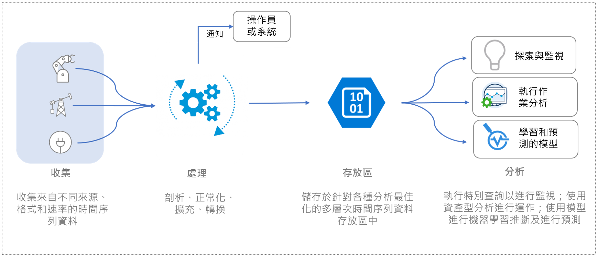
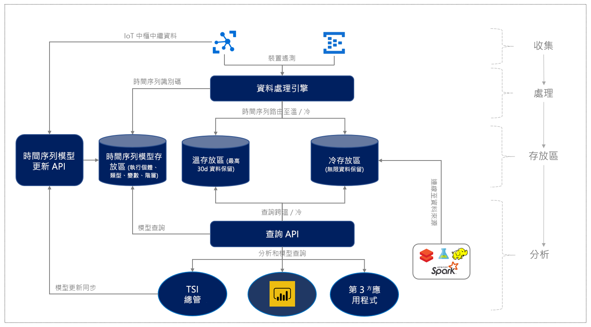

# 什麼是 Azure 時間序列深入解析預覽版？

Azure 時間序列深入解析預覽版為端對端的平台即服務 (PaaS) 供應項目。 它可用來收集、處理、儲存、分析及查詢高度內容相關且已進行時間序列最佳化的 IoT 級別資料。 時間序列深入解析十分適用於特定資料探索及營運分析。 時間序列深入解析是唯一可延伸且可自訂符合產業 IoT 部署廣泛需求的服務供應項目。

> [!TIP]
> 如需了解已正式運作 (GA) 的功能，請參閱 [Azure 時間序列深入解析 GA 概觀](time-series-insights-overview.md)。

## 影片

### 深入了解「Azure 時間序列深入解析預覽」。  

> [!VIDEO https://channel9.msdn.com/Shows/Internet-of-Things-Show/Azure-Time-Series-Insights-e2e-solution-for-industrial-IoT-analytics/player]

## 定義 IoT 資料

IoT 資料係指資產密集組織中提供的所有產業資料。 IoT 資料通常是高度非結構化的，因為它是從記錄有很多雜訊之測量結果的資產傳送。 這些測量結果會包含溫度、動態和溼度。 這些資料流通常有差距大、訊息損毀和讀數錯誤的特點。 因此，必須先整理這些資料流中的資料，才能執行任何分析。

IoT 資料通常僅在來自第一方來源 (如 CRM 或 ERP) 的其他資料輸入內容中才有意義。 輸入也來自協力廠商資料來源，例如天氣或位置。

因此，該資料中只有少部分可用於營運和商務用途。 這類資料會提供一致、完整、最新且正確的資訊，以用於商務報表和分析。 將收集的 IoT 資料轉化為可付諸行動的見解需要：

* 資料處理功能，用來清理、篩選、插入、轉換及準備資料，以進行分析。
* 組織結構功能，用來瀏覽和了解資料，亦即將資料標準化與情境化。
* 符合成本效益的儲存體，用來長期或無限期保留可用數十年的已處理 (或衍生) 資料及未經處理資料。

典型的 IoT 資料流如下圖所示。

  

## 用於產業 IoT 的 Azure 時間序列深入解析

目前的 IoT 環境十分多元。 客戶遍及製造業、汽車產業、能源產業、公共產業、智慧建築及專業諮詢類產業。 案例包括特定資料瀏覽，其中資料的圖形未知。 案例還包括對結構描述化 (或明確模型化) 資料的操作分析，以提升操作效率。 這些案例通常是並存的，而且支援不同使用案例。 平台功能是工業 IoT 企業成功及其數位革命的關鍵，包括：

- 多層式儲存體，經常性與非經常性。
- 儲存數十年份的時間序列資料的能力。
- 能夠明確建模和最佳化以資產為基礎的營運智慧能力。

時間序列深入解析是全方位的端對端 PaaS 供應項目，適用於 IoT 資料探索及營運見解。 時間序列深入解析提供完全受控雲端服務來分析 IoT 規模的時間序列資料。

您可以將原始資料儲存在無結構描述的記憶體內部存放區中。 然後，您可以透過分散式查詢引擎和 API 執行互動式的臨機操作查詢。 利用豐富的使用者體驗，在幾秒鐘內視覺化數十億個事件。 深入了解[資料探索功能](./time-series-insights-overview.md)。

時間序列深入解析也會提供目前處於預覽狀態的營運智慧功能。 結合互動式資料探索和營運智慧功能，您可以使用時間序列深入解析從 IoT 資產收集的資料衍生出更多價值。 預覽提供項目支援：

* 可調整且已完成效能和成本最佳化的時間序列資料存放區。 這種雲端式 IoT 解決方案可以在幾秒鐘內推出數年的時間序列資料。
* 支援語意模型，用於描述與衍生和非衍生訊號 (來自資產和裝置) 相關聯的網域和中繼資料。
* 結合資產型資料深入解析與豐富的特定資料分析的強化使用者體驗。 此組合可推動商務及營運智慧。
* 使用進階的機器學習服務與分析工具整合。 工具包括 Azure Databricks、Apache Spark、Azure Machine Learning、Jupyter Notebook 和 Power BI。 這些工具可協助您解決時間序列資料挑戰，並提升操作效率。

營運深入解析與資料探索會隨附在適用於資料處理、儲存和查詢的隨用隨付定價模型。 此計費模型適合您不斷變化的業務需求。

此高層級的資料流圖表會顯示更新。

  

在引入這些主要的產業 IoT 功能之後，時間序列深入解析提供下列主要優點。

| | |
| ---| ---|
| 適用於 IoT 規模時間序列資料的多層式儲存體 | 透過適用於擷取資料的常見資料處理管線，您可以將資料儲存在經常性儲存體中以進行互動式查詢。 您還可以將資料儲存在非經常性儲存體中以儲存大量資料。 利用以資產為基礎的高效能[查詢](./time-series-insights-update-tsq.md)。 |
| 用於情境化原始遙測資料和衍生資產型深入解析的時間序列模型 | 使用描述性[時間序列模型](./time-series-insights-update-tsm.md)對原始遙測資料進行背景化。 透過高效能和成本最佳化的裝置型查詢，衍生豐富的營運智慧。 |
| 與其他資料解決方案順暢地持續整合 | 時間序列深入解析中的資料[儲存](./time-series-insights-update-storage-ingress.md)在開放原始碼的 Apache Parquet 檔案中。 無論是第一方還是協力廠商，這種與其他資料解決方案的整合對於端對端案例都很容易。 這些案例包括商業智慧、進階的機器學習服務和預測性分析。 |
| 近乎即時的資料探索 | 藉由 [Azure 時間序列深入解析預覽版總管](./time-series-insights-update-explorer.md)的使用者體驗，您可以為透過擷取管線串流的所有資料提供視覺效果。 連線事件來源後不久，您可以檢視、探索及查詢事件資料。 如此一來，您可以驗證裝置是否如預期般發出資料。 您也可以監視 IoT 資產的健康情況、生產力和整體效率。 |
| 根本原因分析和異常偵測 | [Azure 時間序列深入解析預覽版總管](./time-series-insights-update-explorer.md)同時支援模式和透視檢視，可進行和儲存多步驟的根本原因分析。 透過與 Azure 串流分析結合，您可使用時間序列深入解析來近乎即時地偵測警示與異常狀況。 |
| 在時間序列深入解析平台上建置自訂應用程式 | 「時間序列深入解析」支援 [JavaScript SDK](https://github.com/microsoft/tsiclient/blob/master/docs/API.md)。 SDK 提供豐富的控制項和簡化的存取查詢。 使用 SDK 在時間序列深入解析上建置自訂 IoT 應用程式，以符合您的特定業務需求。 您也可以直接使用時間序列深入解析[查詢 API](./time-series-insights-update-tsq.md)，將資料導到自訂 IoT 應用程式中。 |

## 後續步驟

開始使用 Azure 時間序列深入解析預覽版：

> [!div class="nextstepaction"]
> [閱讀快速入門指南](./time-series-insights-update-quickstart.md)

了解使用案例：

> [!div class="nextstepaction"]
> [Azure 時間序列深入解析預覽版使用案例](./time-series-insights-update-use-cases.md)
