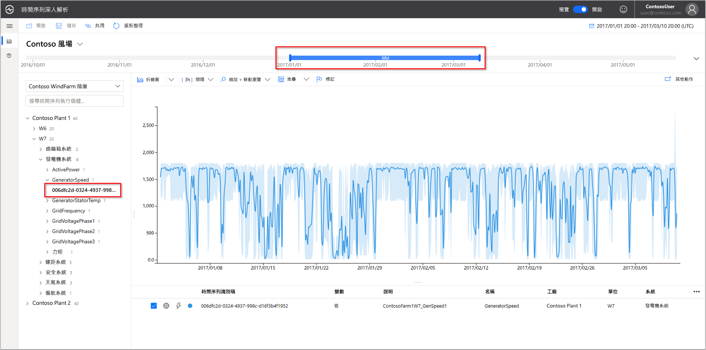
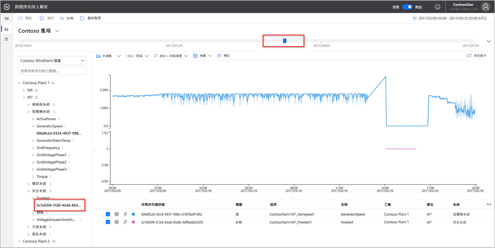
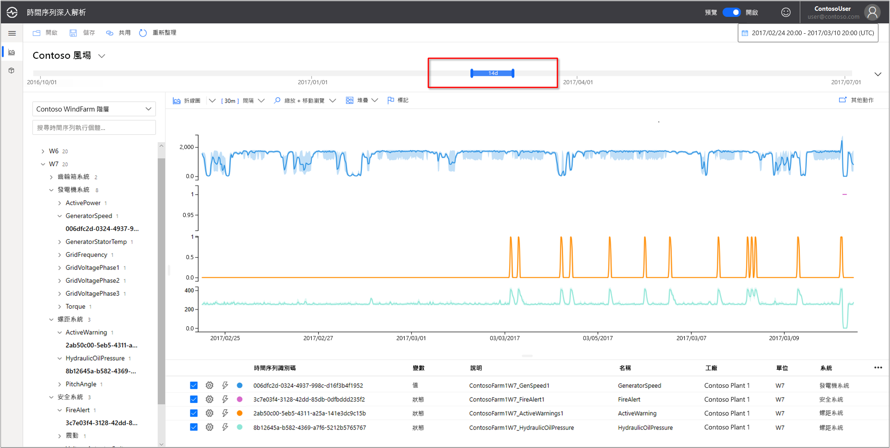
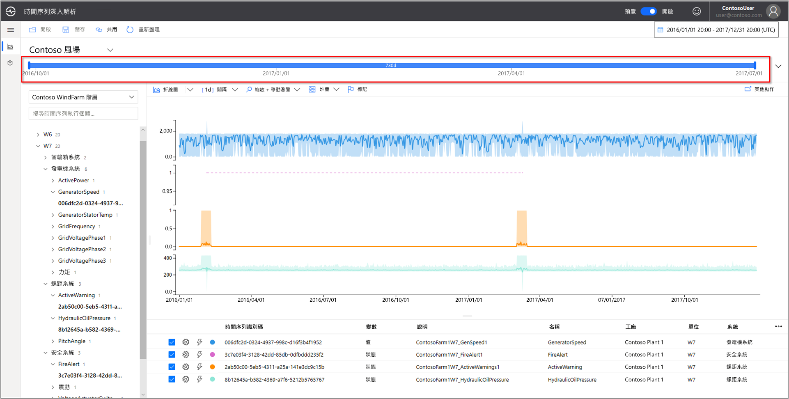
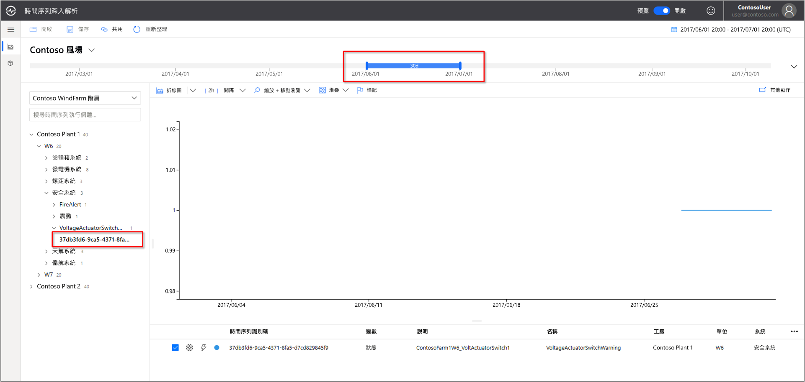
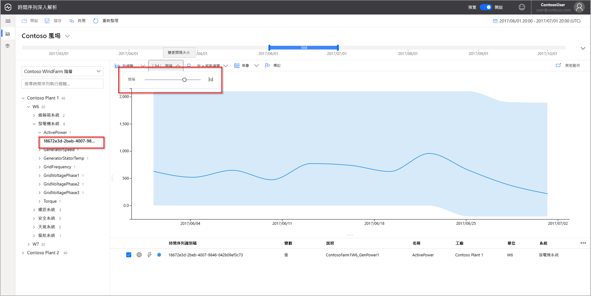
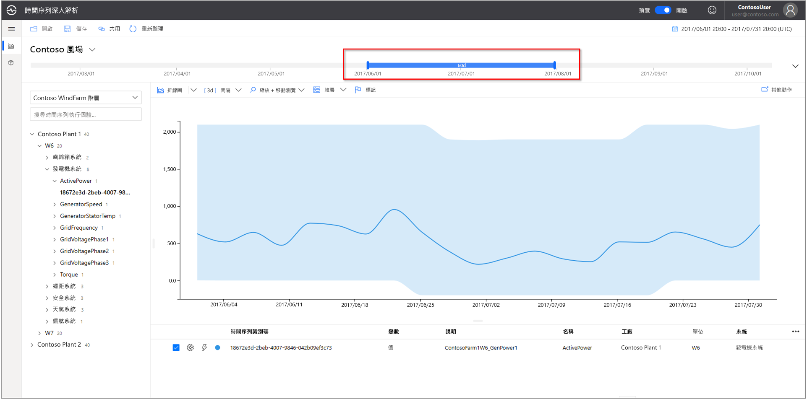
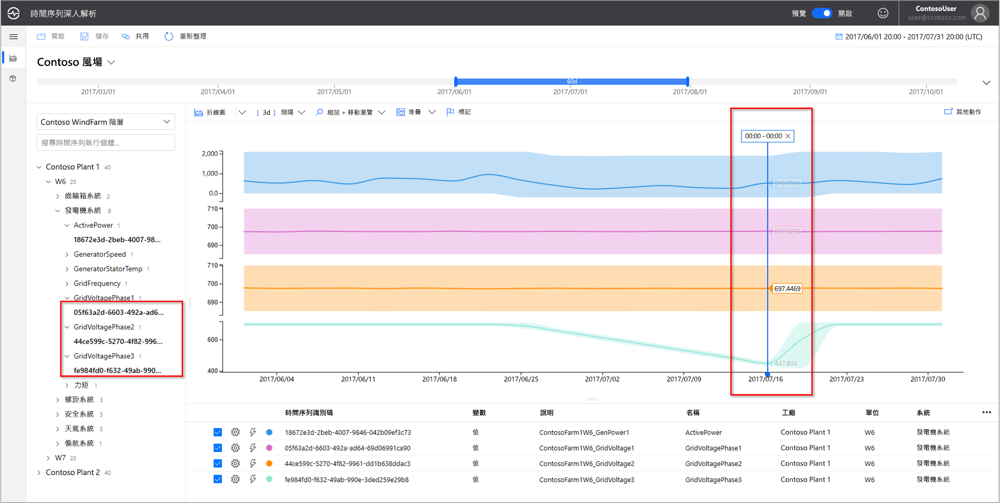

# 快速入門：探索 Azure 時間序列深入解析預覽版示範環境

本快速入門可讓您開始使用 Azure 時間序列深入解析預覽版環境。 在免費的示範中，您會導覽時間序列深入解析預覽版中已新增的主要功能。

時間序列深入解析預覽版示範環境包含虛構公司 Contoso，這家公司經營兩個風力渦輪機發電廠。 每個發電廠各有 10 個渦輪機。 每台渦輪機都有 20 個感應器，每分鐘向 Azure IoT 中樞回報資料。 感應器會收集有關天氣狀況、葉片俯仰和偏擺位置的資訊。 此外也會記錄發電機效能、變速箱行為，以及安全監視器的相關資訊。

在本快速入門中，您將了解如何使用時間序列深入解析，在 Contoso 資料中尋找可操作的見解。 此外，也將進行簡短的根本原因分析，以準確地預測重大故障並執行維護工作。

## 在示範環境中來探索時間序列深入解析

時間序列深入解析預覽版總管會顯示歷史資料和根本原因分析。 開始進行之前：

1. 如果您沒有 Azure 帳戶，請建立 [免費的 Azure 帳戶](https://azure.microsoft.com/free/?ref=microsoft.com&utm_source=microsoft.com&utm_medium=docs&utm_campaign=visualstudio) 。

1. 移至  [Contoso 風力發電廠示範](https://insights.timeseries.azure.com/preview/samples)環境。  

1. 如果出現提示，請使用您的 Azure 帳戶認證登入時間序列深入解析。

## 使用歷史資料

1. 在 **Contoso Plant 1** 中，觀察風力渦輪機 **W7**。  

   1. 將檢視範圍更新為 **1/1/17 20:00 至 3/10/17 20:00 (UTC)** 。
   1. 若要選取感應器，選取 [Contoso Plant 1]   > [W7]   > [發電機系統]   > [GeneratorSpeed]  。 接著，檢閱所顯示的值。

      

1. 近期，Contoso 發現風力發電機 **W7** 曾經起火。 導致起火的相關意見不同。 在時間序列深入解析中，我們可以看到在火災期間啟動了起火警示感應器。

   1. 將檢視範圍變更為 **3/9/17 20:00 至 3/10/17 20:00 (UTC)** 。
   1. 選取 [安全系統]   > [FireAlert]  。

      

1. 檢閱起火時間點前後的其他事件，以了解發生了哪些狀況。 油壓和作用中警告在起火之前都急遽升高。

   1. 選取 [變槳系統]   > [HydraulicOilPressure]  。
   1. 選取 [變槳系統]   > [ActiveWarning]  。

      

1. 油壓和作用中警告感應器在起火之前都急遽升高。 展開顯示的時間序列，以查看其他導致起火的徵象。 兩個感應器都會持續波動一段時間。 波動表示持續而有安全疑慮的模式。

    * 將檢視範圍變更為 **2/24/17 20:00 至 3/10/17 20:00 (UTC)** 。

      

1. 查看兩年的歷史資料時，會發現有另一個起火事件具有相同的感應器波動。

    * 將檢視範圍變更為 **1/1/16 至 12/31/17** (所有資料)。

      

使用時間序列深入解析和感應器遙測，我們發現歷史資料中隱藏了長期且有問題的趨勢。 透過這些新的深入解析，我們可以：

> [!div class="checklist"]
> * 說明實際發生的狀況。
> * 更正問題。
> * 設置妥善的警示通知系統。

## 根本原因分析

1. 在某些情況下，必須經由複雜的分析，才能在資料中找出細微的線索。 選取 **6/25** 這個日期的風車 **W6**。

    1. 將檢視範圍變更為 **6/1/17 20:00 至 7/1/17 20:00 (UTC)** 。
    1. 選取 [Contoso Plant 1]   > [W6]   > [安全系統]   > [VoltageActuatorSwitchWarning]  。

       

1. 警告指出發電機輸出的電壓有問題。 以目前的時間間隔來看，發電機的整體電力輸出均在正常參數內運作。 藉由增加時間間隔，將會形成另一種模式。 明確下降很明顯。

    1. 移除 **VoltageActuatorSwitchWarning** 感應器。
    1. 選取 [發電機系統]   > [ActivePower]  。
    1. 將間隔變更為 [3d]  。

       

1. 藉由擴充時間範圍，我們可以判斷問題是否已停止或繼續。

    * 將時間範圍延伸至 60 天。

      

1. 我們可以新增其他感應器資料點，以提供更詳盡的內容。 我們檢視的感應器愈多，就愈能充分了解問題的本質。 我們將置放標記，以查看實際的值。 

    1. 選取 [發電機系統]  ，然後選取三個感應器：**GridVoltagePhase1**、**GridVoltagePhase2** 和 **GridVoltagePhase3**。
    1. 在可見區域的最後一個資料點上置放標記。

       

    有兩個電壓感應器同等地在正常參數內運作。 看來問題出在 **GridVoltagePhase3** 感應器上。

1. 藉由新增內容相關度高的資料，就更能看出階段 3 的下降就是問題所在。 現在，我們會對於警告原因有很好的線索。 我們準備好將問題交付給我們的維護小組。  

    * 變更顯示畫面，使所有**發電機系統**感應器以相同的圖表比例重疊。

      

## 後續步驟

您已準備好建立自己的時間序列深入解析預覽版環境。 若要開始：

> [!div class="nextstepaction"]
> [規劃時間序列深入解析預覽版環境](time-series-insights-update-plan.md)

了解如何瀏覽示範及其功能：

> [!div class="nextstepaction"]
> [時間序列深入解析預覽版總管](time-series-insights-update-explorer.md)
