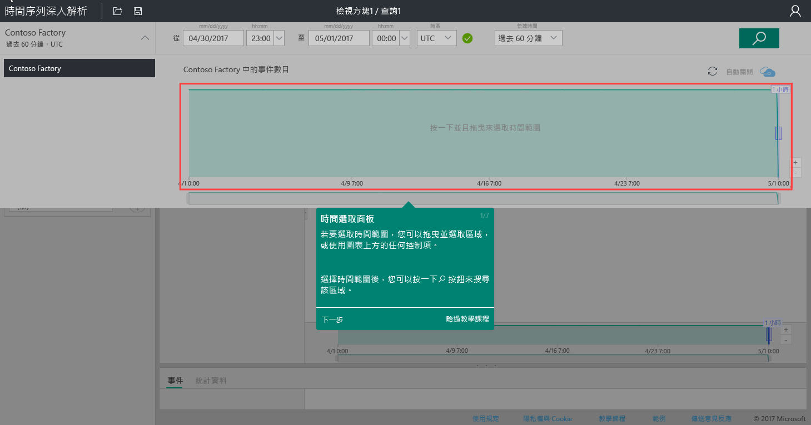
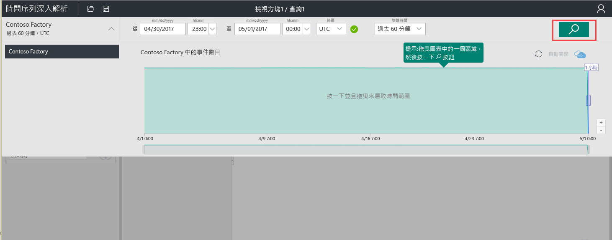
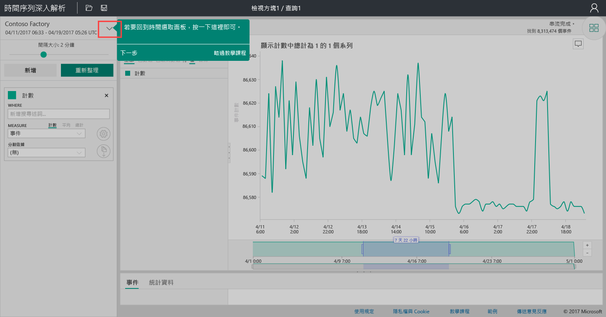
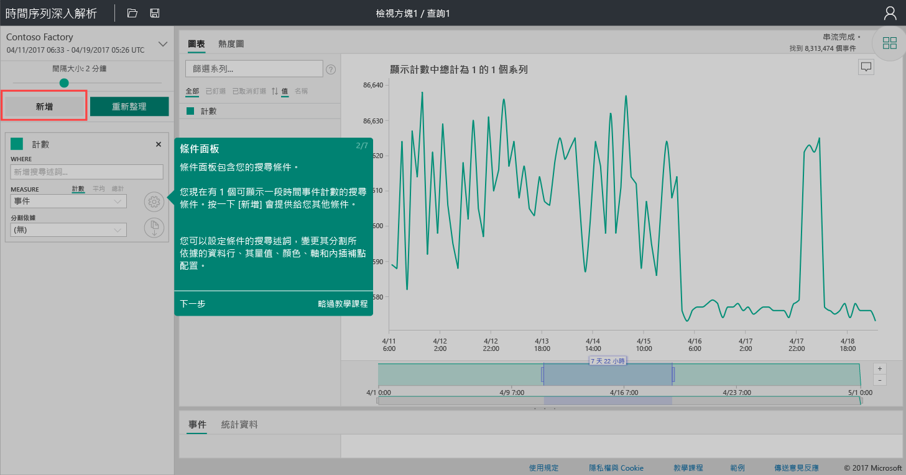
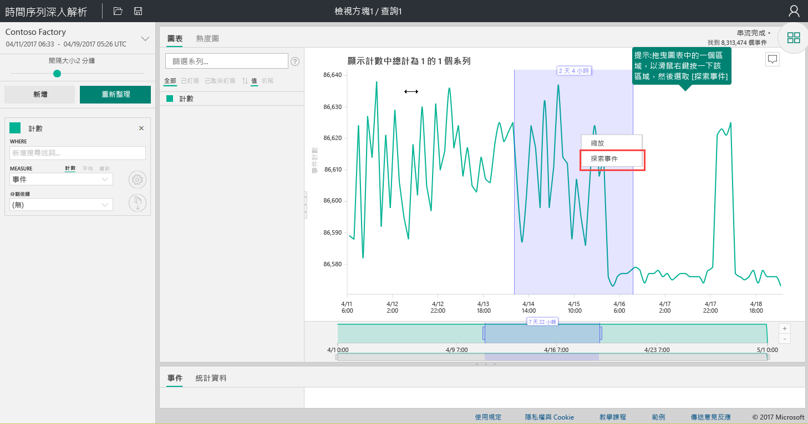
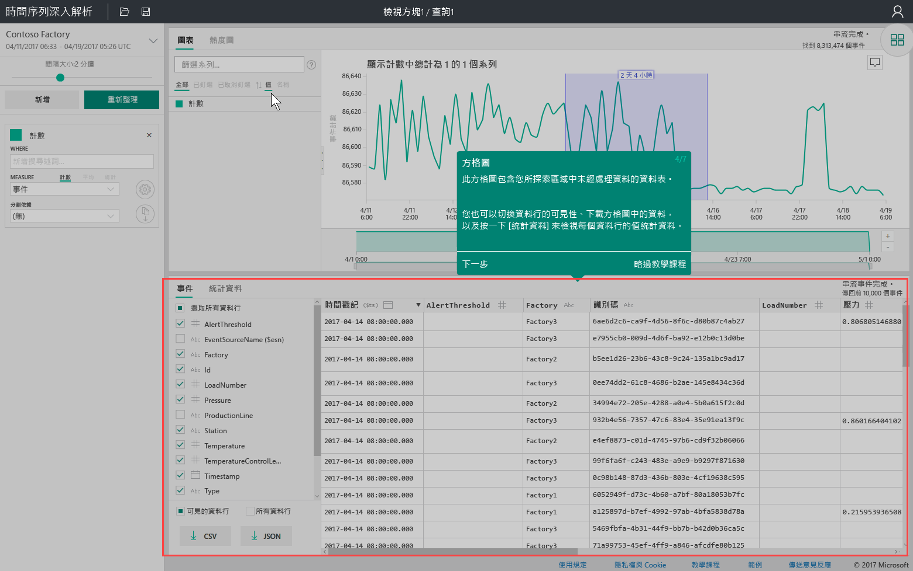
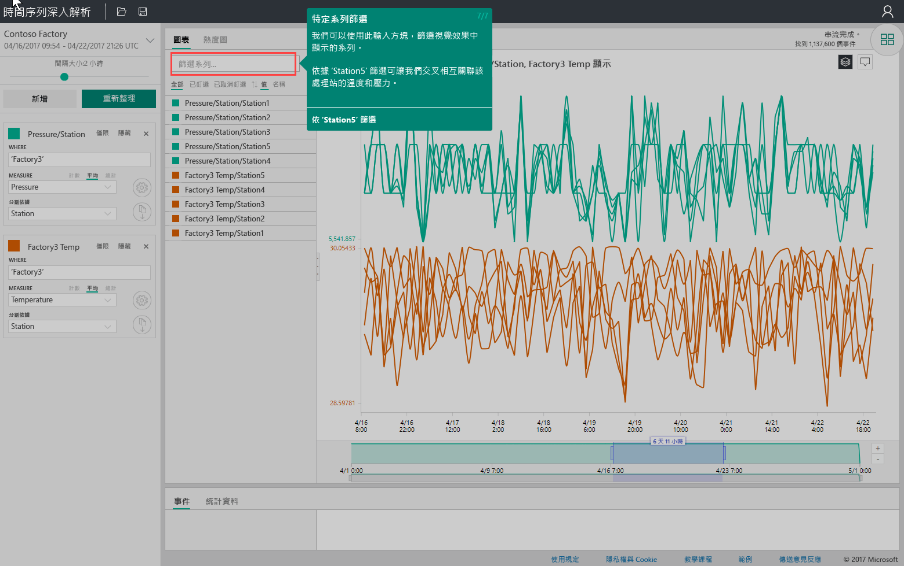

# 快速入門：探索 Azure 時間序列深入解析

這個 Azure 時間序列深入解析總管快速入門可協助您在免費的示範環境中開始使用時間序列深入解析。 在本快速入門中，您將了解如何使用網頁瀏覽器將大量的 IoT 資料視覺化，並巡覽目前已正式運作的主要功能。

「Azure 時間序列深入解析」是一項完全受控的分析、儲存體及視覺化服務，可讓您更輕鬆地同時探索及分析數十億個 IoT 事件。 它可為您提供全域資料檢視來讓您快速驗證 IoT 解決方案，並避免關鍵任務裝置發生成本高昂的停機狀況。 Azure 時間序列深入解析可讓您以近乎即時的方式探索隱藏趨勢、找出異常狀況，並進行根本原因分析。

如需額外的彈性，您還可以將「Azure 時間序列深入解析」透過其強大的 [REST API](./time-series-insights-update-tsq.md) 和[用戶端 SDK](./tutorial-create-tsi-sample-spa.md) 新增至既存的應用程式。 您可以使用 API 來儲存、查詢和取用所選用戶端應用程式中的時間序列資料。 您也可以使用用戶端 SDK 將 UI 元件新增至現有的應用程式。

此時間序列深入解析總管快速入門可提供正式運作功能的導覽。

> [!IMPORTANT]
> 若您尚未建立 Azure 帳戶，請建立[免費的 Azure 帳戶](https://azure.microsoft.com/free/?ref=microsoft.com&utm_source=microsoft.com&utm_medium=docs&utm_campaign=visualstudio)。

## 準備示範環境

1. 在瀏覽器中，移至[正式運作示範](https://insights.timeseries.azure.com/demo)。

1. 如果出現提示，請使用您的 Azure 帳戶認證來登入「時間序列深入解析」總管。

1. 時間序列深入解析快速導覽頁面隨即顯示。 選取 [下一步]  開始快速導覽。

   [![選取 [下一步]](media/quickstart/quickstart1.png)](media/quickstart/quickstart1.png#lightbox)

## 探索示範環境

1. [時間選取面板]  隨即顯示。 您可以使用這個面板來選取要視覺化的時間範圍。

   

1. 選取時間範圍，並將其拖曳至區域中。 然後選取 [搜尋]  。

   

   時間序列深入解析會顯示您所指定之時間範圍的圖表視覺效果。 您可以在折線圖內執行各種動作。 例如，您可以篩選、釘選、排序和堆疊。

   若要返回 [時間選取面板]  ，請選取向下箭號，如下所示：

   

1. 選取 [字詞面板]  中的 [新增]  以新增新的搜尋字詞。

   

1. 在圖表中，您可以選取區域、以滑鼠右鍵按一下區域，並選取 [探索事件]  。

   

   您探索的區域中會顯示未經處理資料的格線。

   

## 選取和篩選資料

1. 編輯您的字詞以變更圖表中的值。 新增另一個字詞來交叉關聯不同類型的值。

   

1. 在 [篩選序列]  方塊中輸入篩選條件字詞，以進行即興的序列篩選。 針對快速入門，請輸入 **Station5** 來交叉關聯該站台的溫度和壓力。

   

在您完成快速入門之後，可以使用範例資料集進行實驗，以建立不同的視覺效果。

## 清除資源

您現在已完成本教學課程，請清除您所建立的資源：

1. 從 [Azure 入口網站](https://portal.azure.com)的左側功能表中，選取 [所有資源]  ，找出 Azure 時間序列深入解析資源群組。
1. 選取 [刪除]  或個別移除每個資源，以刪除整個資源群組 (和其中包含的所有資源)。

## 後續步驟

您已準備好建立自己的時間序列深入解析環境：
> [!div class="nextstepaction"]
> [規劃時間序列深入解析環境](time-series-insights-environment-planning.md)
