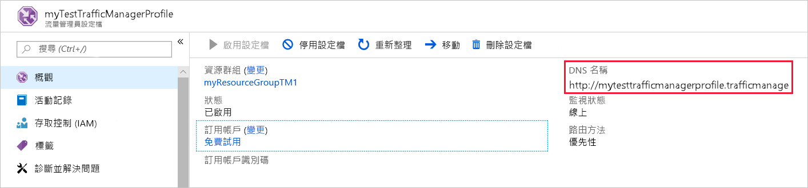
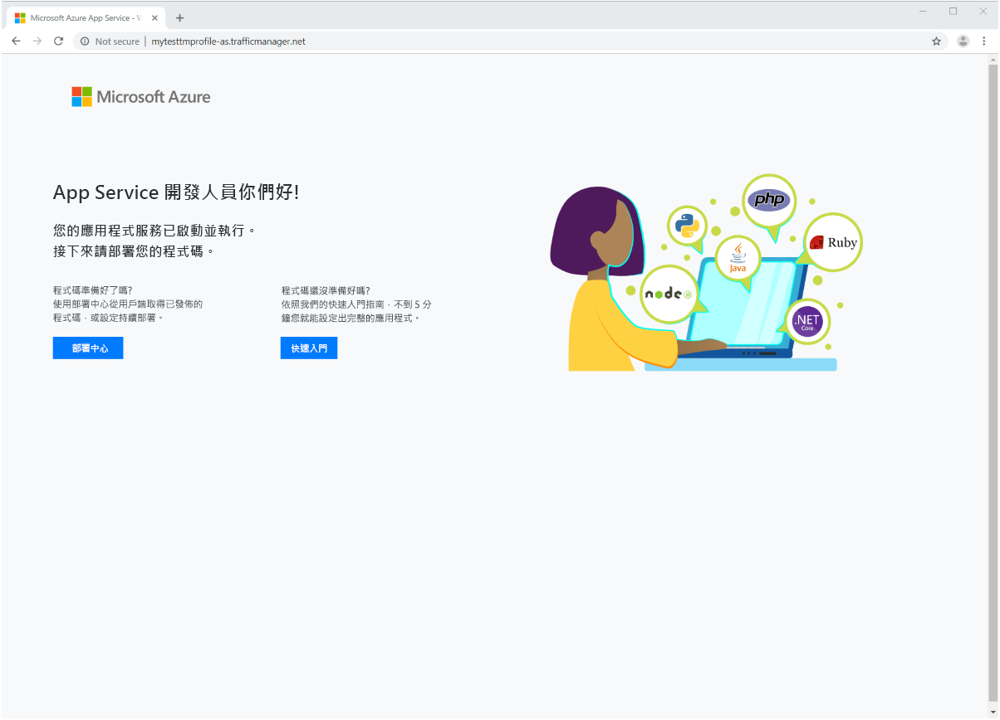

# 快速入門：建立流量管理員設定檔以獲得高可用性的 Web 應用程式

本快速入門會說明如何建立流量管理員設定檔，以便為 Web 應用程式提供高可用性。 

本快速入門所述的案例包含兩個在不同 Azure 區域中執行的 Web 應用程式執行個體。 我們會建立以[端點優先順序](traffic-manager-routing-methods.md#priority)為基礎的流量管理員設定檔，以協助將使用者流量導向執行應用程式的主要網站。 流量管理員會持續監視 Web 應用程式，並在主要網站無法使用時，自動容錯移轉至備用網站。

如果您沒有 Azure 訂用帳戶，請在開始前建立 [免費帳戶](https://azure.microsoft.com/free/?WT.mc_id=A261C142F) 。

## 登入 Azure 
在 https://portal.azure.com 登入 Azure 入口網站。

## 必要條件
要進行本快速入門，您必須部署兩個在不同 Azure 區域 (美國東部和西歐) 中執行的 Web 應用程式執行個體。 這兩個 Web 應用程式執行個體會作為流量管理員的主要和備用端點。

1. 在畫面左上方，選取 [建立資源] > [Web] > [Web 應用程式] > [建立]。
2. 在 [Web 應用程式] 中，輸入或選取下列資訊，然後在未指定任何值的地方輸入預設設定：

     | 設定         | 值     |
     | ---              | ---  |
     | 名稱           | 輸入 Web 應用程式的唯一名稱  |
     | 資源群組          | 選取 [新增]，然後輸入「myResourceGroupTM1」 |
     | App Service 方案/位置         | 選取 [ **新增**]。  在 App Service 方案中，輸入「myAppServicePlanEastUS」，然後選取 [確定]。 
     |      位置  |   美國東部        |
    |||

3. 選取 [建立] 。
4. 成功部署 Web 應用程式時，便已建立好預設網站。
5. 使用下列設定重複步驟 1 至 3，在不同 Azure 區域中建立第二個網站：

     | 設定         | 值     |
     | ---              | ---  |
     | 名稱           | 輸入 Web 應用程式的唯一名稱  |
     | 資源群組          | 選取 [新增]，然後輸入「myResourceGroupTM2」 |
     | App Service 方案/位置         | 選取 [ **新增**]。  在 App Service 方案中，輸入「myAppServicePlanWestEurope」，然後選取 [確定]。 
     |      位置  |   西歐      |
    |||

## 建立流量管理員設定檔
建立會根據端點優先順序來進行使用者流量導向的流量管理員設定檔。

1. 在畫面的左上方，選取 [建立資源] > [網路] > [流量管理員設定檔] > [建立]。
2. 在 [建立流量管理員設定檔] 中，輸入或選取下列資訊、接受其餘設定的預設值，然後選取 [建立]：
    
    | 設定                 | 值                                              |
    | ---                     | ---                                                |
    | 名稱                   | 此名稱在 trafficmanager.net 區域內必須是唯一的，而且會產生 DNS 名稱 **trafficmanager.net**，用以存取您的流量管理員設定檔。|
    | 路由方法          | 選取 [優先順序] 路由方法。|
    | 訂用帳戶            | 選取您的訂用帳戶。|
    | 資源群組          | 選取 [現有]，然後選取 [myResourceGroupTM1]。|
    |位置 |這項設定是指資源群組的位置，完全不影響將部署到全球的流量管理員設定檔。|
    |||
    
    
   

## 新增流量管理員端點

將「美國東部」中的網站新增為所有使用者流量的主要路由目標端點。 將「西歐」中的網站新增為備用端點。 當主要端點無法使用時，流量就會自動路由到次要端點。

1. 在入口網站的搜尋列中，搜尋您在上一節建立的流量管理員設定檔名稱，然後在顯示的結果中選取設定檔。
2. 在 [流量管理員設定檔] 的 [設定] 區段中，按一下 [端點]，然後按一下 [新增]。
3. 輸入或選取下列資訊、接受其餘設定的預設值，然後選取 [確定]：

    | 設定                 | 值                                              |
    | ---                     | ---                                                |
    | 類型                    | Azure 端點                                   |
    | 名稱           | myPrimaryEndpoint                                        |
    | 目標資源類型           | App Service 方案                          |
    | 目標資源          | **選擇應用程式服務**，以顯示相同訂用帳戶下的 Web Apps 清單。 在 [資源] 中，挑選您想要新增為第一個端點的應用程式服務。 |
    | 優先順序               | 選取 [1]。 這會使得所有流量傳送至此端點 (如果狀況良好)。    |
    
4. 針對下一個 Web Apps 端點，重複步驟 2 和 3。 新增它時務必將 [優先順序] 值設為 [2]。
5.  這兩個端點新增完畢後，它們會顯示在 [流量管理員設定檔] 中，而且監視狀態是 [線上]。

    

## 測試流量管理員設定檔
在本節中，您會先確定流量管理員設定檔的網域名稱，然後檢視流量管理員如何在主要端點無法使用時，容錯移轉到次要端點。
### 確定 DNS 名稱
1.  在入口網站的搜尋列中，搜尋您在上一節建立的**流量管理員設定檔**名稱。 在顯示的結果中，按一下流量管理員設定檔。
2. 按一下 [概觀] 。
3. [流量管理員設定檔] 會顯示新建立之流量管理員設定檔的 DNS 名稱。
  
   

### 檢視流量管理員的運作

1. 在網頁瀏覽器中，輸入流量管理員設定檔的 DNS 名稱，以檢視 Web 應用程式的預設網站。 在此快速入門案例中，所有要求都會路由至已設定為 [優先順序 1] 的主要端點。

2. 若要檢視流量管理員容錯移轉的運作，請停用主要網站，如下所示：
    1. 在 [流量管理員設定檔] 頁面中，選取 [設定] > [端點] > [MyPrimaryEndpoint]。
    2. 在 [MyPrimaryEndpoint] 中，選取 [停用]。 
    3. 主要端點 MyPrimaryEndpoint 的狀態現在會顯示為 [停用]。
3. 複製上一個步驟中的流量管理員設定檔 DNS 名稱，以在網頁瀏覽器中順利檢視網站。 當主要端點停用時，系統就會將使用者流量路由至次要端點。

## 清除資源
若不再需要，可刪除資源群組、Web 應用程式和所有相關資源。 若要這樣做，請選取資源群組 (myResourceGroupTM1 和 myResourceGroupTM2)，然後按一下 [刪除]。

## 後續步驟
在本快速入門中，您已建立流量管理員設定檔，以便能夠將使用者流量導向來獲得高可用性的 Web 應用程式。 若要深入了解如何路由傳送流量，請繼續進行流量管理員的教學課程。

> [!div class="nextstepaction"]
> [流量管理員教學課程](tutorial-traffic-manager-improve-website-response.md)

