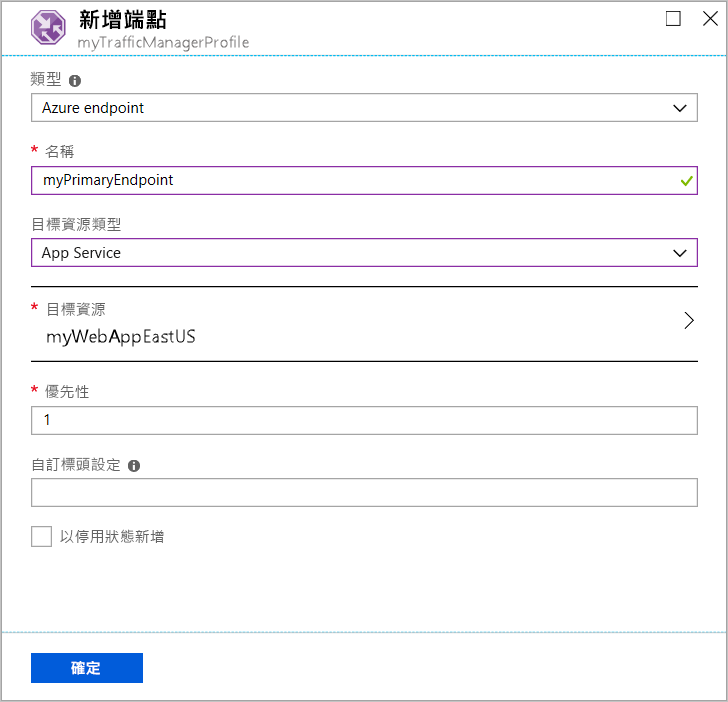

# 快速入門：建立流量管理員設定檔以獲得高可用性的 Web 應用程式

本快速入門會說明如何建立流量管理員設定檔，以便為 Web 應用程式提供高可用性。

在本快速入門中，您會了解 Web 應用程式的兩個執行個體。 每個執行個體會在不同的 Azure 區域中執行。 您會建立以[端點優先順序](traffic-manager-routing-methods.md#priority)為基礎的流量管理員設定檔。 此設定檔會將使用者流量導向執行 Web 應用程式的主要網站。 流量管理員會持續監視 Web 應用程式。 如果主要網站無法使用，它會提供自動容錯移轉至備份網站。

如果您沒有 Azure 訂用帳戶，請立即建立[免費帳戶](https://azure.microsoft.com/free/?WT.mc_id=A261C142F)。

## 登入 Azure

登入 [Azure 入口網站](https://portal.azure.com)。

## 必要條件

在本快速入門中，您必須在不同的 Azure 區域 (美國東部和西歐) 中部署 Web 應用程式的兩個執行個體。 每個執行個體都會作為流量管理員的主要和容錯移轉端點。

1. 在畫面的左上方，選取 [建立資源] > [Web] > [Web 應用程式]。
2. 在 [Web 應用程式] 中，輸入或選取下列設定：

    | 設定 | 值 |
    | ------- | ----- |
    | 應用程式名稱 | 輸入 Web 應用程式的唯一名稱。  |
    | 訂用帳戶 | 選取您要套用 Web 應用程式的訂用帳戶。 |
    | 資源群組 | 選取 [新建]，然後輸入 myResourceGroupTM1。 |
    | 作業系統 | 選取 [Windows] 作為您的作業系統。 |
    | 發佈 | 選取 [程式碼] 作為您想要發佈的格式。 |

3. 選取 [App Service 方案/位置]。
4. 在 [App Service 方案] 中，選取 [新建]。
5. 在 [新增 App Service 方案] 中，輸入或選取下列設定：

    | 設定 | 值 |
    | ------- | ----- |
    | App Service 方案 | 輸入 myAppServicePlanEastUS。 |
    | 位置 | 美國東部 |
    | 定價層 | S1 標準 |

6. 選取 [確定] 。

7. 在 [Web 應用程式] 中選取 [建立]。 成功部署 Web 應用程式時，它會建立預設網站。

8. 若要在不同的 Azure 區域中建立第二個網站，請使用下列設定重複步驟 1-7：

    | 設定 | 值 |
    | --------| ----- |
    | 名稱 | 輸入 Web 應用程式的唯一名稱。 |
    | 訂用帳戶 | 選取您要套用 Web 應用程式的訂用帳戶。 |
    | 資源群組 | 選取 [新建]，然後輸入 myResourceGroupTM2。 |
    | 作業系統 | 選取 [Windows] 作為您的作業系統。 |
    | 發佈 | 選取 [程式碼] 作為您想要發佈的格式。 |
    | App Service 方案/位置 | 輸入 myAppServicePlanWestEurope。 |
    | 位置 | 西歐 |
    | 定價層 | S1 標準 |

## 建立流量管理員設定檔

建立可根據端點優先順序導向使用者流量的流量管理員設定檔。

1. 在畫面的左上方，選取 [建立資源] > [網路] > [流量管理員設定檔]。
2. 在 [建立流量管理員設定檔] 中，輸入或選取下列設定：

    | 設定 | 值 |
    | --------| ----- |
    | 名稱 | 為流量管理員設定檔輸入唯一的名稱。|
    | 路由方法 | 選取 [優先順序]。|
    | 訂用帳戶 | 選取您要套用流量管理員設定檔的訂用帳戶。 |
    | 資源群組 | 選取 [myResourceGroupTM1]。|
    | 位置 |此設定會參考資源群組的位置。 其不會影響將全球部署的流量管理員設定檔。|

3. 選取 [建立] 。

## 新增流量管理員端點

將「美國東部」中的網站新增為所有使用者流量的主要路由目標端點。 將「西歐」中的網站新增為容錯移轉端點。 當主要端點無法使用時，流量就會自動路由傳送到容錯移轉端點。

1. 在入口網站的搜尋列中，輸入您在上一節建立的流量管理員設定檔名稱。
2. 從搜尋結果中選取設定檔。
3. 在 [流量管理員設定檔] 的 [設定] 區段中，選取 [端點]，然後選取 [新增]。
4. 輸入或選取下列設定：

    | 設定 | 值 |
    | ------- | ------|
    | 類型 | 選取 [Azure 端點]。 |
    | 名稱 | 輸入 myPrimaryEndpoint。 |
    | 目標資源類型 | 選取 [App Service]。 |
    | 目標資源 | 選取 [選擇 App Service] > [美國東部]。 |
    | 優先順序 | 選取 [1]。 狀況良好時，所有流量都會送至這個端點。 |

    

5. 選取 [確定] 。
6. 若要為第二個 Azure 區域建立容錯移轉端點，請使用下列設定重複步驟 3 和 4：

    | 設定 | 值 |
    | ------- | ------|
    | 類型 | 選取 [Azure 端點]。 |
    | 名稱 | 輸入 myFailoverEndpoint。 |
    | 目標資源類型 | 選取 [App Service]。 |
    | 目標資源 | 選取 [選擇 App Service] > [西歐]。 |
    | 優先順序 | 選取 **2**。 如果主要端點狀況不良，則所有流量都會送到此容錯移轉端點。 |

7. 選取 [確定] 。

新增好兩個端點之後，它們會顯示在 [流量管理員設定檔] 中。 請注意，其監視狀態目前為 [線上]。

## 測試流量管理員設定檔

在本節中，您會檢查流量管理員設定檔的網域名稱。 您也會將主要端點設定為無法使用。 最後，您可以看到 Web 應用程式仍可使用。 這是因為流量管理員將流量傳送至容錯移轉端點。

### 檢查 DNS 名稱

1. 在入口網站的搜尋列中，搜尋您在上一節建立的**流量管理員設定檔**名稱。
2. 選取流量管理員設定檔。 [概觀] 頁面隨即出現。
3. [流量管理員設定檔] 會顯示新建立之流量管理員設定檔的 DNS 名稱。
  
   

### 檢視流量管理員的運作

1. 在網頁瀏覽器中，輸入流量管理員設定檔的 DNS 名稱，以檢視 Web 應用程式的預設網站。

    > [!NOTE]
    > 在此快速入門案例中，所有要求都會路由傳送至主要端點。 它會設定為 [優先順序 1]。

    

2. 若要檢視流量管理員容錯移轉的運作，請停用主要網站：
    1. 在 [流量管理員設定檔] 頁面中，從 [概觀] 區段選取 [myPrimaryEndpoint]。
    2. 在 [myPrimaryEndpoint] 中，選取 [已停用] > [儲存]。
    3. 關閉 myPrimaryEndpoint。 請注意，狀態目前為 [已停用]。
3. 複製上一個步驟中的流量管理員設定檔 DNS 名稱，以在新的網頁瀏覽器工作階段中檢視網站。
4. 確認 Web 應用程式仍可使用。

主要端點無法使用，因此您會路由傳送至容錯移轉端點。

## 清除資源

完成時，請刪除資源群組、Web 應用程式和所有相關資源。 若要這麼做，從儀表板中選取每個個別項目，然後選取每個頁面頂端的 [刪除]。

## 後續步驟

在本快速入門中，您建立了流量管理員設定檔。 它可讓您引導高可用性 Web 應用程式的使用者流量。 若要深入了解如何路由傳送流量，請繼續進行流量管理員的教學課程。

> [!div class="nextstepaction"]
> [流量管理員教學課程](tutorial-traffic-manager-improve-website-response.md)