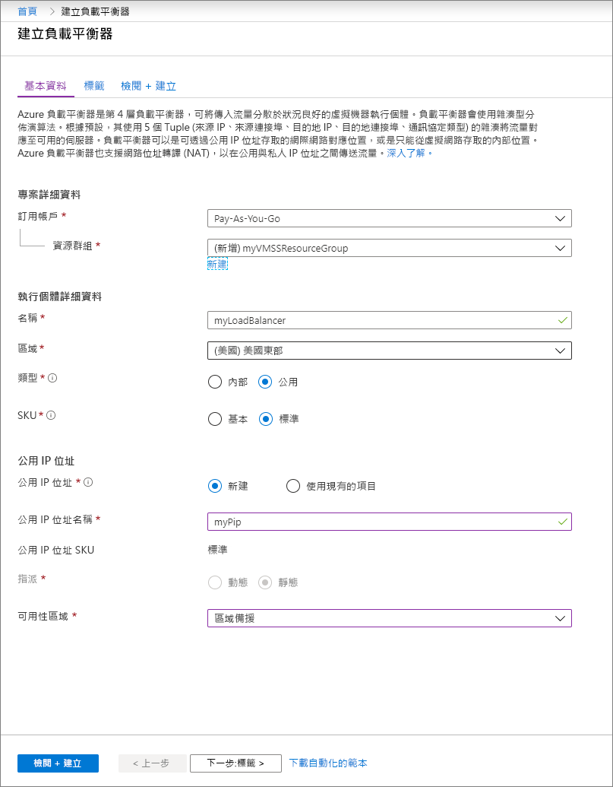
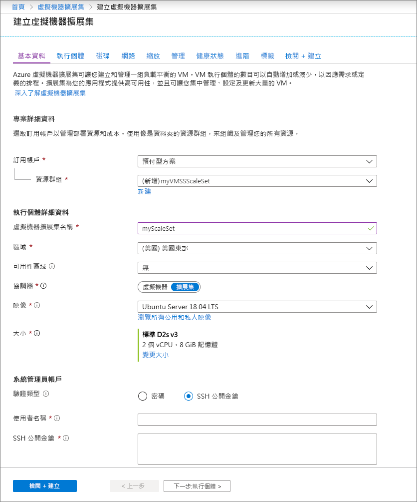

# 快速入門：在 Azure 入口網站建立虛擬機器擴展集

虛擬機器擴展集可讓您部署和管理一組相同、自動調整的虛擬機器。 您可以手動調整擴展集中的 VM 數目，或定義規則以根據 CPU、記憶體需求或網路流量等資源使用量進行自動調整。 其後，Azure 負載平衡器會將流量分配到擴展集中的多個 VM 執行個體。 在此快速入門中，您會在 Azure 入口網站中建立虛擬機器擴展集。

如果您沒有 Azure 訂用帳戶，請在開始前建立[免費帳戶](https://azure.microsoft.com/free/?WT.mc_id=A261C142F)。

## 登入 Azure
在 https://portal.azure.com 上登入 Azure 入口網站。

## 建立負載平衡器

Azure [負載平衡器](../load-balancer/load-balancer-overview.md)會在良好的虛擬機器執行個體之間散發傳入流量。 

首先，使用入口網站建立公用基本負載平衡器。 您所建立的名稱和公用 IP 位址會自動設定為負載平衡器的前端。

1. 在搜尋方塊中，輸入 **load balancer**。 在搜尋結果中的 [Marketplace]  下，選取 [負載平衡器]  。
1. 在 [建立負載平衡器]  頁面的 [基本]  索引標籤中，輸入或選取下列資訊：

    | 設定                 | 值   |
    | ---| ---|
    | 訂用帳戶  | 選取您的訂用帳戶。    |    
    | 資源群組 | 選取 [新建]  ，並在文字方塊中輸入 *myVMSSResourceGroup*。|
    | 名稱           | *myLoadBalancer*         |
    | 區域         | 選取 [美國東部]  。       |
    | 類型          | 選取 [公用]  。       |
    | SKU           | 選取 [標準]  。       |
    | 公用 IP 位址 | 選取 [建立新的]  。 |
    | 公用 IP 位址名稱  | *MyPip*   |
    | 指派| 靜態 |

1. 當您完成時，選取 [檢閱 + 建立]  
1. 通過驗證之後，選取 [建立]  。 

## 建立虛擬機器擴展集
您可以使用 Windows Server 映像或 Linux 映像 (例如 RHEL、CentOS、Ubuntu 或 SLES) 部署擴展集。

1. 在搜尋方塊中，輸入 **Scale set**。 在結果的 [Marketplace]  下，選取 [虛擬機器擴展集]  。 [建立虛擬機器擴展集]  頁面隨即開啟。 
1. 在 [基本資料]  索引標籤中的 [專案詳細資料]  底下，確認已選取正確的訂用帳戶，然後選擇 [新建]  資源群組。 為名稱輸入 *myVMSSResourceGroup*，然後選取 [確定]  。 
1. 為您的擴展集名稱輸入 *myScaleSet*。
1. 在 [區域]  中，選取您附近的區域。
1. 為 [協調器]  保留 [擴展集虛擬機器]  的預設值。
1. 為 [映像]  選取 Marketplace 映像。 在此範例中，我們已選擇 [Ubuntu Server 18.04 LTS]  。
1. 輸入所需的使用者名稱，然後選取偏好的驗證類型。
   - **密碼**長度必須至少有 12 個字元，且符合下列四個複雜性需求的其中三項：1 個小寫字元、1 個大寫字元、1 個數字和 1 個特殊字元。 如需詳細資訊，請參閱[使用者名稱和密碼需求](../virtual-machines/windows/faq.md#what-are-the-username-requirements-when-creating-a-vm)。
   - 如果您選取 Linux OS 磁碟映像，可以改為選擇 [SSH 公開金鑰]  。 在此只需提供您的公開金鑰，例如 *~/.ssh/id_rsa.pub*。 您可以從入口網站使用 Azure Cloud Shell [建立及使用 SSH 金鑰](../virtual-machines/linux/mac-create-ssh-keys.md)。
   
    

1. 選取 [下一步]  以移動其他頁面。 
1. 為 [執行個體]  和 [磁碟]  頁面保留預設值。
1. 在 [網路]  頁面中的 [負載平衡器]  下方，選取 [是]  ，將擴展集執行個體放在負載平衡器後方。 
1. 在 [負載平衡選項]  中，選取 [Azure Load Balancer]  。
1. 在 [選取負載平衡器]  中，選取您之前建立的 [myLoadBalancer]  。
1. 對於 [選取後端集區]  ，選取 [新建]  ，然後輸入 *MyBackendPool*，並選取 [建立]  。
1. 當您完成時，選取 [檢閱 + 建立]  。 
1. 通過驗證之後，選取 [建立]  以部署擴展集。

## 清除資源
如果不再需要，請刪除資源群組、擴展集和所有相關資源。 若要這麼做，請選取擴展集的資源群組，然後選取 [刪除]  。

## 後續步驟
在此快速入門中，您已在 Azure 入口網站中建立基本的擴展集。 若要深入了解，請繼續執行有關於如何建立和管理 Azure 虛擬機器擴展集的教學課程。

> [!div class="nextstepaction"]
> [建立和管理 Azure 虛擬機器擴展集](tutorial-create-and-manage-powershell.md)
