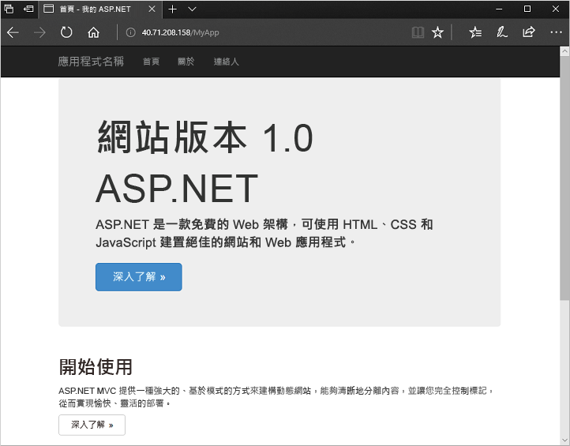

# <a name="quickstart-create-a-windows-virtual-machine-scale-set-with-an-azure-template"></a>快速入門：使用 Azure 範本建立 Windows 虛擬機器擴展集
虛擬機器擴展集可讓您部署和管理一組相同、自動調整的虛擬機器。 您可以手動調整擴展集中的 VM 數目，或定義規則以根據 CPU、記憶體需求或網路流量等資源使用量進行自動調整。 其後，Azure 負載平衡器會將流量分配到擴展集中的多個 VM 執行個體。 在此快速入門中，您會使用 Resource Manager 範本建立虛擬機器擴展集，並部署範例應用程式。

如果您沒有 Azure 訂用帳戶，請在開始前建立 [免費帳戶](https://azure.microsoft.com/free/?WT.mc_id=A261C142F) 。

[!INCLUDE [cloud-shell-powershell.md](../../includes/cloud-shell-powershell.md)]

如果您選擇在本機安裝和使用 PowerShell，則在執行本教學課程時，您必須使用 Azure PowerShell 模組 5.5.0 版或更新版本。 執行 `Get-Module -ListAvailable AzureRM` 以尋找版本。 如果您需要升級，請參閱[安裝 Azure PowerShell 模組](/powershell/azure/install-azurerm-ps)。 如果您在本機執行 PowerShell，則也需要執行 `Connect-AzureRmAccount` 以建立與 Azure 的連線。


## <a name="define-a-scale-set-in-a-template"></a>在範本中定義擴展集
Azure Resource Manager 範本可讓您部署相關資源的群組。 範本是以 JavaScript Object Notation (JSON) 所撰寫，且會定義您應用程式的整個 Azure 基礎結構環境。 在單一範本中，您可以建立虛擬機器擴展集、安裝應用程式，並設定自動縮放規則。 使用變數和參數，就可以重複使用此範本來更新現有的、或建立其他的擴展集。 您可以透過 Azure 入口網站、Azure CLI 或 Azure PowerShell，或從持續整合 / 持續傳遞 (CI/CD) 管線部署範本。

如需範本的詳細資訊，請參閱 [Azure Resource Manager 概觀](https://docs.microsoft.com/azure/azure-resource-manager/resource-group-overview#template-deployment)

範本可定義每個資源類型的設定。 虛擬機器擴展集資源類型與個別 VM 相似。 虛擬機器擴展集資源類型的核心部分是：

| 屬性                     | 屬性描述                                  | 範例範本值                    |
|------------------------------|----------------------------------------------------------|-------------------------------------------|
| type                         | 要建立的 Azure 資源類型                            | Microsoft.Compute/virtualMachineScaleSets |
| name                         | 擴展集名稱                                       | myScaleSet                                |
| location                     | 要建立擴展集的位置                     | 美國東部                                   |
| sku.name                     | 每個擴展集執行個體的 VM 大小                  | Standard_A1                               |
| sku.capacity                 | 最初要建立的 VM 執行個體數目           | 2                                         |
| upgradePolicy.mode           | 發生變更時的 VM 執行個體升級模式              | 自動                                 |
| imageReference               | 要用於 VM 執行個體的平台或自訂映像 | Microsoft Windows Server 2016 資料中心  |
| osProfile.computerNamePrefix | 每個 VM 執行個體的名稱前置詞                     | myvmss                                    |
| osProfile.adminUsername      | 每個 VM 執行個體的使用者名稱                        | azureuser                                 |
| osProfile.adminPassword      | 每個 VM 執行個體的密碼                        | P@ssw0rd!                                 |

 下列範例示範核心擴展集資源定義。 若要自訂擴展集範本，您可以變更 VM 大小或初始容量，或使用不同的平台或自訂映像。

```json
{
  "type": "Microsoft.Compute/virtualMachineScaleSets",
  "name": "myScaleSet",
  "location": "East US",
  "apiVersion": "2017-12-01",
  "sku": {
    "name": "Standard_A1",
    "capacity": "2"
  },
  "properties": {
    "upgradePolicy": {
      "mode": "Automatic"
    },
    "virtualMachineProfile": {
      "storageProfile": {
        "osDisk": {
          "caching": "ReadWrite",
          "createOption": "FromImage"
        },
        "imageReference":  {
          "publisher": "MicrosoftWindowsServer",
          "offer": "WindowsServer",
          "sku": "2016-Datacenter",
          "version": "latest"
        }
      },
      "osProfile": {
        "computerNamePrefix": "myvmss",
        "adminUsername": "azureuser",
        "adminPassword": "P@ssw0rd!"
      }
    }
  }
}
```

 為保持範例簡短，並不會顯示虛擬網路介面卡 (NIC) 設定。 諸如負載平衡器等其他元件也不會顯示。 完整的擴展集範本會顯示在[本文結尾處](#deploy-the-template)。


## <a name="add-a-sample-application"></a>新增範例應用程式
若要測試您的擴展集，請安裝基本的 Web 應用程式。 當您部署擴展集時，VM 延伸模組可以提供後置部署設定和自動化工作，例如安裝應用程式。 您可以從 Azure 儲存體或 GitHub 下載指令碼，或是在擴充功能執行階段將指令碼提供給 Azure 入口網站。 若要將延伸模組套用至擴展集，請將 extensionProfile 區段新增至上述資源範例。 延伸模組設定檔通常會定義下列屬性：

- 延伸模組類型
- 延伸模組發行者
- 延伸模組版本
- 設定或安裝指令碼的位置
- 在 VM 執行個體上執行的命令

[Windows 上的 ASP.NET 應用程式](https://github.com/Azure/azure-quickstart-templates/tree/master/201-vmss-windows-webapp-dsc-autoscale)範例範本會使用 PowerShell DSC 延伸模組來安裝 IIS 中執行的 ASP.NET MVC 應用程式。 

會從 GitHub 下載安裝指令碼，如 url 中所定義。 然後，延伸模組會從 IISInstall.ps1 指令碼執行 InstallIIS，如函式和指令碼中所定義。 ASP.NET 應用程式本身會依 Web Deploy 套件提供，也是從 GitHub 下載，如 WebDeployPackagePath 中所定義：

```json
"extensionProfile": {
  "extensions": [
    {
      "name": "Microsoft.Powershell.DSC",
      "properties": {
        "publisher": "Microsoft.Powershell",
        "type": "DSC",
        "typeHandlerVersion": "2.9",
        "autoUpgradeMinorVersion": true,
        "forceUpdateTag": "1.0",
        "settings": {
          "configuration": {
            "url": "https://raw.githubusercontent.com/Azure/azure-quickstart-templates/master/201-vmss-windows-webapp-dsc-autoscale/DSC/IISInstall.ps1.zip",
            "script": "IISInstall.ps1",
            "function": "InstallIIS"
          },
          "configurationArguments": {
            "nodeName": "localhost",
            "WebDeployPackagePath": "https://raw.githubusercontent.com/Azure/azure-quickstart-templates/master/201-vmss-windows-webapp-dsc-autoscale/WebDeploy/DefaultASPWebApp.v1.0.zip"
          }
        }
      }
    }
  ]
}
```

## <a name="deploy-the-template"></a>部署範本
您可以使用下列 [部署至 Azure] 按鈕來部署 [Windows 上的 ASP.NET MVC 應用程式](https://github.com/Azure/azure-quickstart-templates/tree/master/201-vmss-windows-webapp-dsc-autoscale)範本。 這個按鈕會開啟 Azure 入口網站、載入完整的範本，並提示輸入幾個參數，例如擴展集名稱、執行個體計數和管理員認證。

[](https://portal.azure.com/#create/Microsoft.Template/uri/https%3A%2F%2Fraw.githubusercontent.com%2FAzure%2Fazure-quickstart-templates%2Fmaster%2F201-vmss-windows-webapp-dsc-autoscale%2Fazuredeploy.json)

您也可以使用 Azure PowerShell，在 Windows 上安裝 ASP.NET 應用程式與 [New-AzureRmResourceGroupDeployment](/powershell/module/azurerm.resources/new-azurermresourcegroupdeployment)，如下所示：

```azurepowershell-interactive
# Create a resource group
New-AzureRmResourceGroup -Name myResourceGroup -Location EastUS

# Deploy template into resource group
New-AzureRmResourceGroupDeployment `
    -ResourceGroupName myResourceGroup `
    -TemplateFile https://raw.githubusercontent.com/Azure/azure-quickstart-templates/master/201-vmss-windows-webapp-dsc-autoscale/azuredeploy.json

# Update the scale set and apply the extension
Update-AzureRmVmss `
    -ResourceGroupName myResourceGroup `
    -VmScaleSetName myVMSS `
    -VirtualMachineScaleSet $vmssConfig
```

回答提示以提供擴展集名稱和 VM 執行個體的管理員認證。 可能需要 10-15 分鐘才能建立擴展集，並套用延伸模組來設定應用程式。


## <a name="test-your-scale-set"></a>測試您的擴展集
若要查看有效的擴展集，請在網頁瀏覽器中存取範例 Web 應用程式。 使用 [Get-AzureRmPublicIpAddress](/powershell/module/azurerm.network/get-azurermpublicipaddress) 取得負載平衡器的公用 IP 位址，如下所示：

```azurepowershell-interactive
Get-AzureRmPublicIpAddress -ResourceGroupName myResourceGroup | Select IpAddress
```

以 *http://publicIpAddress/MyApp* 的格式，在網頁瀏覽器中輸入負載平衡器的公用 IP 位址。 負載平衡器會將流量散發至您的其中一個 VM 執行個體，如下列範例所示：




## <a name="clean-up-resources"></a>清除資源
若不再需要，您可以使用 [Remove-AzureRmResourceGroup](/powershell/module/azurerm.resources/remove-azurermresourcegroup) 移除資源群組和擴展集。 `-Force` 參數會確認您想要刪除資源，而不另外對您提示將要進行此作業。 `-AsJob` 參數不會等待作業完成，就會將控制項傳回給提示字元。

```azurepowershell-interactive
Remove-AzureRmResourceGroup -Name "myResourceGroup" -Force -AsJob
```


## <a name="next-steps"></a>後續步驟
在此快速入門中，您使用 Azure 範本建立了 Windows 擴展集，並使用 PowerShell DSC 延伸模組，在 VM 執行個體上安裝基本的 ASP.NET 應用程式。 若要深入了解，請繼續執行有關於如何建立和管理 Azure 虛擬機器擴展集的教學課程。

> [!div class="nextstepaction"]
> [建立和管理 Azure 虛擬機器擴展集](tutorial-create-and-manage-powershell.md)
