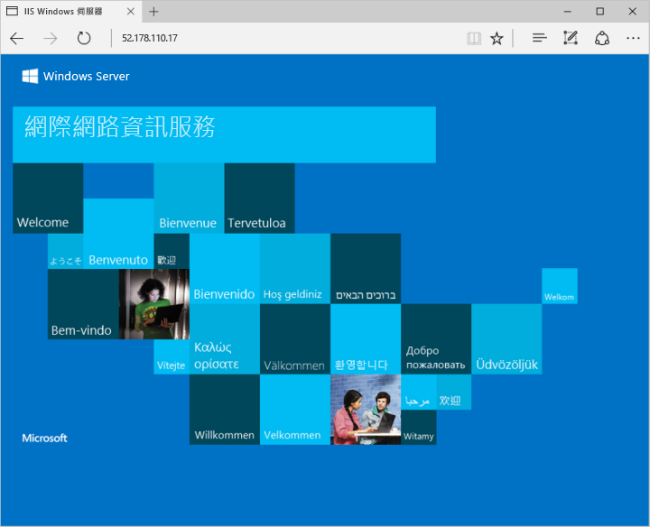

# <a name="tutorial-create-and-use-a-custom-image-for-virtual-machine-scale-sets-with-azure-powershell"></a>教學課程：使用 Azure PowerShell 建立及使用虛擬機器擴展集的自訂映像
當您建立擴展集時，您會指定部署 VM 執行個體時所要使用的映像。 若要減少部署 VM 執行個體後的工作數量，您可以使用自訂的 VM 映像。 此自訂 VM 映像包括任何必要的應用程式安裝或組態。 在擴展集中建立的任何 VM 執行個體都會使用自訂 VM 映像，並已可以處理您的應用程式流量。 在本教學課程中，您將了解如何：

> [!div class="checklist"]
> * 建立及自訂 VM
> * 取消佈建及一般化 VM
> * 從來源 VM 建立自訂 VM 映像
> * 部署使用自訂 VM 映像的擴展集

如果您沒有 Azure 訂用帳戶，請在開始前建立[免費帳戶](https://azure.microsoft.com/free/?WT.mc_id=A261C142F) 。

[!INCLUDE [cloud-shell-powershell.md](../../includes/cloud-shell-powershell.md)]

如果您選擇在本機安裝和使用 PowerShell，則在執行本教學課程時，必須使用 Azure PowerShell 模組 6.0.0 版或更新版本。 執行 `Get-Module -ListAvailable AzureRM` 以尋找版本。 如果您需要升級，請參閱[安裝 Azure PowerShell 模組](/powershell/azure/install-azurerm-ps)。 如果您在本機執行 PowerShell，則也需要執行 `Connect-AzureRmAccount` 以建立與 Azure 的連線。 


## <a name="create-and-configure-a-source-vm"></a>建立並設定來源 VM

>[!NOTE]
> 本教學課程將逐步說明建立及使用一般化 VM 映像的程序。 不支援從特製化 VM 建立擴展集。

首先，使用 [New-AzureRmResourceGroup](/powershell/module/azurerm.resources/new-azurermresourcegroup) 建立資源群組，然後使用 [New-AzureRmVM](/powershell/module/azurerm.compute/new-azurermvm) 建立 VM。 接著，此 VM 會用來當作自訂 VM 映像的來源。 下列範例會在名為 myResourceGroup 的資源群組中建立名為 myCustomVM 的 VM。 出現提示時，請輸入使用者名稱和密碼以作為 VM 的登入認證：

```azurepowershell-interactive
# Create a resource a group
New-AzureRmResourceGroup -Name "myResourceGroup" -Location "EastUS"

# Create a Windows Server 2016 Datacenter VM
New-AzureRmVm `
  -ResourceGroupName "myResourceGroup" `
  -Name "myCustomVM" `
  -ImageName "Win2016Datacenter" `
  -OpenPorts 3389
```

若要連線至您的 VM，使用 [Get-AzureRmPublicIpAddress](/powershell/module/azurerm.network/get-azurermpublicipaddress) 列出公用 IP 位址，如下所示：

```azurepowershell-interactive
Get-AzureRmPublicIpAddress -ResourceGroupName myResourceGroup | Select IpAddress
```

與 VM 建立遠端連線。 如果您使用 Azure Cloud Shell，請從本機 PowerShell 提示字元或遠端桌面用戶端執行此步驟。 提供上一個命令中您自己的 IP 位址。 出現提示時，請輸入您在第一個步驟中建立 VM 時所使用的認證：

```powershell
mstsc /v:<IpAddress>
```

若要自訂您的 VM，請安裝基本 Web 伺服器。 部署擴展集中的 VM 執行個體時，其中就會有執行 Web 應用程式所需的所有必要套件。 開啟 VM 上的本機 PowerShell 提示字元，並使用 [Install-windowsfeature](/powershell/module/servermanager/install-windowsfeature) 安裝 IIS Web 伺服器，如下所示：

```powershell
Install-WindowsFeature -name Web-Server -IncludeManagementTools
```

準備您的 VM 以作為自訂映像使用的最後一個步驟是一般化 VM。 Sysprep 會移除所有您個人帳戶的資訊和組態，並將 VM 重設為初始狀態，以便在未來進行部署。 如需詳細資訊，請參閱[如何使用 Sysprep：簡介](http://technet.microsoft.com/library/bb457073.aspx)。

若要一般化 VM，執行 Sysprep 並設定 VM 即可享有現成可用的體驗。 完成時，指示 Sysprep 關閉 VM：

```powershell
C:\Windows\system32\sysprep\sysprep.exe /oobe /generalize /shutdown
```

當 Sysprep 完成程序時，VM 遠端連線會自動關閉，而 VM 也會關閉。


## <a name="create-a-custom-vm-image-from-the-source-vm"></a>從來源 VM 建立自訂 VM 映像
您現在可使用安裝的 IIS Web 伺服器來自訂來源 VM。 讓我們來建立自訂 VM 映像，以搭配使用擴展集。

若要建立映像，必須解除配置 VM。 使用 [Stop-AzureRmVm](/powershell/module/azurerm.compute/stop-azurermvm) 來解除配置 VM。 然後，使用 [Set-AzureRmVm](/powershell/module/azurerm.compute/set-azurermvm) 將 VM 的狀態設定為一般化，讓 Azure 平台知道 VM 已準備好要使用自訂映像。 您只能從一般化的 VM 建立映像：

```azurepowershell-interactive
Stop-AzureRmVM -ResourceGroupName "myResourceGroup" -Name "myCustomVM" -Force
Set-AzureRmVM -ResourceGroupName "myResourceGroup" -Name "myCustomVM" -Generalized
```

解除配置及一般化 VM 可能需要幾分鐘的時間。

現在，使用 [New-AzureRmImageConfig](/powershell/module/azurerm.compute/new-azurermimageconfig) 和 [New-AzureRmImage](/powershell/module/azurerm.compute/new-azurermimage) 建立 VM 的映象。 下列範例會從您的 VM 建立名為 myImage 的映像：

```azurepowershell-interactive
# Get VM object
$vm = Get-AzureRmVM -Name "myCustomVM" -ResourceGroupName "myResourceGroup"

# Create the VM image configuration based on the source VM
$image = New-AzureRmImageConfig -Location "EastUS" -SourceVirtualMachineId $vm.ID 

# Create the custom VM image
New-AzureRmImage -Image $image -ImageName "myImage" -ResourceGroupName "myResourceGroup"
```


## <a name="create-a-scale-set-from-the-custom-vm-image"></a>從自訂 VM 映像建立擴展集
現在，使用 [New-AzureRmVmss](/powershell/module/azurerm.compute/new-azurermvmss) 建立擴展集，以使用 `-ImageName` 參數來定義前一個步驟中建立的自訂 VM 映像。 為了將流量散發到個別的虛擬機器執行個體，也會建立負載平衡器。 負載平衡器包含在 TCP 連接埠 80 上分配流量的規則，同時允許 TCP 連接埠 3389 上的遠端桌面流量以及 TCP 連接埠 5985 上的 PowerShell 遠端處理。 出現提示時，請為擴展集中的 VM 執行個體提供適當的系統管理認證：

```azurepowershell-interactive
New-AzureRmVmss `
  -ResourceGroupName "myResourceGroup" `
  -Location "EastUS" `
  -VMScaleSetName "myScaleSet" `
  -VirtualNetworkName "myVnet" `
  -SubnetName "mySubnet" `
  -PublicIpAddressName "myPublicIPAddress" `
  -LoadBalancerName "myLoadBalancer" `
  -UpgradePolicyMode "Automatic" `
  -ImageName "myImage"
```

建立及設定所有擴展集資源和 VM 需要幾分鐘的時間。


## <a name="test-your-scale-set"></a>測試您的擴展集
若要查看作用中的擴展集，可使用 [Get-AzureRmPublicIpAddress](/powershell/module/AzureRM.Network/Get-AzureRmPublicIpAddress) 取得負載平衡器的公用 IP 位址，如下所示：

```azurepowershell-interactive
Get-AzureRmPublicIpAddress `
  -ResourceGroupName "myResourceGroup" `
  -Name "myPublicIPAddress" | Select IpAddress
```

在您的 Web 瀏覽器中輸入公用 IP 位址。 預設 IIS 網頁即會顯示，如下列範例所示：




## <a name="clean-up-resources"></a>清除資源
若要移除您的擴展集與其他資源，請使用 [Remove-AzureRmResourceGroup](/powershell/module/azurerm.resources/remove-azurermresourcegroup) 刪除資源群組及其所有資源。 `-Force` 參數會確認您想要刪除資源，而不另外對您提示將要進行此作業。 `-AsJob` 參數不會等待作業完成，就會將控制項傳回給提示字元。

```azurepowershell-interactive
Remove-AzureRmResourceGroup -Name "myResourceGroup" -Force -AsJob
```


## <a name="next-steps"></a>後續步驟
在本教學課程中，您已了解如何使用 Azure PowerShell 來建立及使用擴展集的自訂 VM 映像：

> [!div class="checklist"]
> * 建立及自訂 VM
> * 取消佈建及一般化 VM
> * 建立自訂的 VM 映像
> * 部署使用自訂 VM 映像的擴展集

前往下一個教學課程，以了解如何將應用程式部署至擴展集。

> [!div class="nextstepaction"]
> [將應用程式部署至擴展集](tutorial-install-apps-powershell.md)
