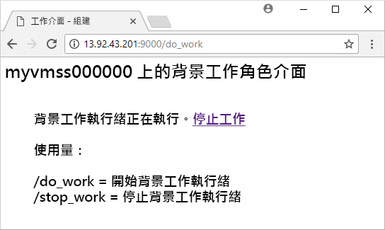

# <a name="create-a-linux-virtual-machine-scale-set-with-an-azure-template"></a>使用 Azure 範本建立 Linux 虛擬機器擴展集
虛擬機器擴展集可讓您部署和管理一組相同、自動調整的虛擬機器。 您可以手動調整擴展集中的 VM 數目，或定義規則以根據如 CPU、記憶體需求或網路流量的資源使用量來自動調整。 在本使用者入門文章中，您要使用 Azure Resource Manager 範本來建立 Linux 虛擬機器擴展集。 您還可以使用 [Azure CLI 2.0](virtual-machine-scale-sets-create-cli.md)、[Azure PowerShell](virtual-machine-scale-sets-create-powershell.md) 或 [Azure 入口網站](virtual-machine-scale-sets-create-portal.md)來建立擴展集。

如果您沒有 Azure 訂用帳戶，請在開始前建立 [免費帳戶](https://azure.microsoft.com/free/?WT.mc_id=A261C142F) 。

[!INCLUDE [cloud-shell-try-it.md](../../includes/cloud-shell-try-it.md)]

如果您選擇在本機安裝和使用 CLI，本教學課程會要求您執行 Azure CLI 2.0.20 版或更新版本。 執行 `az --version` 以尋找版本。 如果您需要安裝或升級，請參閱[安裝 Azure CLI 2.0]( /cli/azure/install-azure-cli)。 


## <a name="define-a-scale-set-in-a-template"></a>在範本中定義擴展集
Azure Resource Manager 範本可讓您部署相關資源的群組。 範本是以 JavaScript Object Notation (JSON) 所撰寫，且會定義您應用程式的整個 Azure 基礎結構環境。 在單一範本中，您可以建立虛擬機器擴展集、安裝應用程式，並設定自動縮放規則。 使用變數和參數，就可以重複使用此範本來更新現有的、或建立其他的擴展集。 您可以透過 Azure 入口網站、Azure CLI 2.0 或 Azure PowerShell ，或從持續整合 / 持續傳遞 (CI/CD) 管線部署範本。

如需範本的詳細資訊，請參閱 [Azure Resource Manager 概觀](https://docs.microsoft.com/azure/azure-resource-manager/resource-group-overview#template-deployment)

若要使用範本建立縮放，您可以定義適當的資源。 虛擬機器擴展集資源類型的核心部分是：

| 屬性                     | 屬性描述                                  | 範例範本值                    |
|------------------------------|----------------------------------------------------------|-------------------------------------------|
| type                         | 要建立的 Azure 資源類型                            | Microsoft.Compute/virtualMachineScaleSets |
| name                         | 擴展集名稱                                       | myScaleSet                                |
| location                     | 要建立擴展集的位置                     | 美國東部                                   |
| sku.name                     | 每個擴展集執行個體的 VM 大小                  | Standard_A1                               |
| sku.capacity                 | 最初要建立的 VM 執行個體數目           | 2                                         |
| upgradePolicy.mode           | 發生變更時的 VM 執行個體升級模式              | 自動                                 |
| imageReference               | 要用於 VM 執行個體的平台或自訂映像 | Canonical Ubuntu Server 16.04-LTS         |
| osProfile.computerNamePrefix | 每個 VM 執行個體的名稱前置詞                     | myvmss                                    |
| osProfile.adminUsername      | 每個 VM 執行個體的使用者名稱                        | azureuser                                 |
| osProfile.adminPassword      | 每個 VM 執行個體的密碼                        | P@ssw0rd!                                 |

 下列範例示範核心擴展集資源定義。 若要自訂擴展集範本，您可以變更 VM 大小或初始容量，或使用不同的平台或自訂映像。

```json
{
  "type": "Microsoft.Compute/virtualMachineScaleSets",
  "name": "myScaleSet",
  "location": "East US",
  "apiVersion": "2017-12-01",
  "sku": {
    "name": "Standard_A1",
    "capacity": "2"
  },
  "properties": {
    "upgradePolicy": {
      "mode": "Automatic"
    },
    "virtualMachineProfile": {
      "storageProfile": {
        "osDisk": {
          "caching": "ReadWrite",
          "createOption": "FromImage"
        },
        "imageReference":  {
          "publisher": "Canonical",
          "offer": "UbuntuServer",
          "sku": "16.04-LTS",
          "version": "latest"
        }
      },
      "osProfile": {
        "computerNamePrefix": "myvmss",
        "adminUsername": "azureuser",
        "adminPassword": "P@ssw0rd!"
      }
    }
  }
}
```

 為保持範例簡短，並不會顯示虛擬網路介面卡 (NIC) 設定。 諸如負載平衡器等其他元件也不會顯示。 完整的擴展集範本會顯示在[本文結尾處](#deploy-the-template)。


## <a name="install-an-application"></a>升級應用程式
當您部署擴展集時，VM 延伸模組可以提供後置部署設定和自動化工作，例如安裝應用程式。 您可以從 Azure 儲存體或 GitHub 下載指令碼，或是在擴充功能執行階段將指令碼提供給 Azure 入口網站。 若要將延伸模組套用至擴展集，請將 extensionProfile 區段新增至上述資源範例。 延伸模組設定檔通常會定義下列屬性：

- 延伸模組類型
- 延伸模組發行者
- 延伸模組版本
- 設定或安裝指令碼的位置
- 在 VM 執行個體上執行的命令

[Linux 上的 Python HTTP 伺服器](https://github.com/Azure/azure-quickstart-templates/tree/master/201-vmss-bottle-autoscale)範本會使用自訂指令碼延伸模組來安裝 [Bottle](http://bottlepy.org/docs/dev/)、Python web 架構，以及簡單的 HTTP 伺服器。 

fileUris 中定義的兩個指令碼  -  installserver.sh 和 workserver.py。 會從 GitHub 下載這些檔案，然後 commandToExecute 會執行 `bash installserver.sh`來安裝和設定應用程式：

```json
"extensionProfile": {
  "extensions": [
    {
      "name": "AppInstall",
      "properties": {
        "publisher": "Microsoft.Azure.Extensions",
        "type": "CustomScript",
        "typeHandlerVersion": "2.0",
        "autoUpgradeMinorVersion": true,
        "settings": {
          "fileUris": [
            "https://raw.githubusercontent.com/Azure/azure-quickstart-templates/master/201-vmss-bottle-autoscale/installserver.sh",
            "https://raw.githubusercontent.com/Azure/azure-quickstart-templates/master/201-vmss-bottle-autoscale/workserver.py"
          ],
          "commandToExecute": "bash installserver.sh"
        }
      }
    }
  ]
}
```


## <a name="deploy-the-template"></a>部署範本
您可以使用下列 [部署至 Azure] 按鈕來部署 [Linux 上的 Python HTTP 伺服器](https://github.com/Azure/azure-quickstart-templates/tree/master/201-vmss-bottle-autoscale)範本。 這個按鈕會開啟 Azure 入口網站、載入完整的範本，並提示輸入幾個參數，例如擴展集名稱、執行個體計數和管理員認證。

[](https://portal.azure.com/#create/Microsoft.Template/uri/https%3A%2F%2Fraw.githubusercontent.com%2FAzure%2Fazure-quickstart-templates%2Fmaster%2F201-vmss-bottle-autoscale%2Fazuredeploy.json)

您也可以使用 Azure CLI 2.0，利用 [az group deployment create](/cli/azure/group/deployment#az_group_deployment_create) 在 Linux 上安裝 Python HTTP 伺服器，如下所示：

```azurecli-interactive
# Create a resource group
az group create --name myResourceGroup --location EastUS

# Deploy template into resource group
az group deployment create \
    --resource-group myResourceGroup \
    --template-uri https://raw.githubusercontent.com/Azure/azure-quickstart-templates/master/201-vmss-bottle-autoscale/azuredeploy.json
```

回答提示以提供擴展集名稱、執行個體計數和 VM 執行個體的管理員認證。 需要幾分鐘的時間才能建立擴展集和支援資源。


## <a name="test-your-sample-application"></a>測試範例應用程式
若要查看作用中的應用程式，可使用 [az network public-ip list](/cli/azure/network/public-ip#az_network_public_ip_show) 取得負載平衡器的公用 IP 位址，如下所示：

```azurecli-interactive
az network public-ip list \
    --resource-group myResourceGroup \
    --query [*].ipAddress -o tsv
```

以 http://publicIpAddress:9000/do_work 格式，將負載平衡器的公用 IP 位址輸入網頁瀏覽器中。 負載平衡器會將流量散發至您的其中一個 VM 執行個體，如下列範例所示：




## <a name="clean-up-resources"></a>清除資源
若不再需要，您可以使用 [az group delete](/cli/azure/group#az_group_delete) 來移除資源群組、擴展集和所有相關資源，如下所示：

```azurecli-interactive 
az group delete --name myResourceGroup
```


## <a name="next-steps"></a>後續步驟
在本使用者入門文章中，您使用 Azure 範本建立了 Linux 擴展集，並使用自訂指令碼延伸模組，在 VM 執行個體上安裝基本的 Python web 伺服器。 如需更佳的延展性和自動化，請使用下列使用說明文章展開您的擴展集：

- [在虛擬機器擴展集上部署您的應用程式](virtual-machine-scale-sets-deploy-app.md)
- 利用 [Azure CLI](virtual-machine-scale-sets-autoscale-cli.md)、[Azure PowerShell](virtual-machine-scale-sets-autoscale-powershell.md) 或 [Azure 入口網站](virtual-machine-scale-sets-autoscale-portal.md)自動縮放
- [將自動作業系統升級用於擴展集 VM 執行個體](virtual-machine-scale-sets-automatic-upgrade.md)
