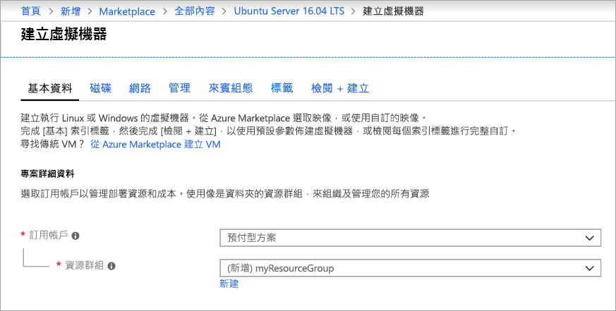
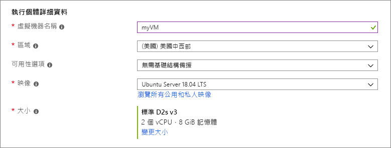
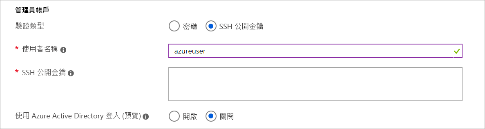
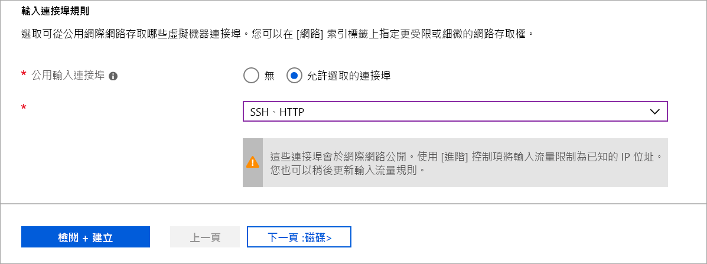
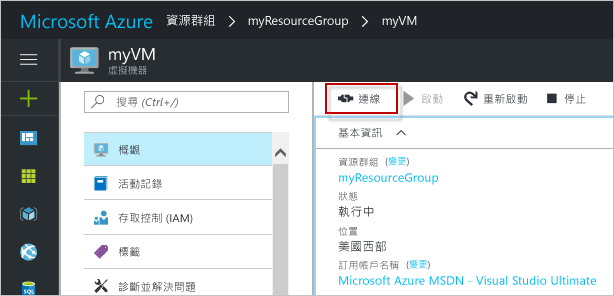

# <a name="quickstart-create-a-linux-virtual-machine-in-the-azure-portal"></a>快速入門：在 Azure 入口網站中建立 Linux 虛擬機器

您可以透過 Azure 入口網站建立 Azure 虛擬機器 (VM)。 Azure 入口網站是以瀏覽器為基礎的使用者介面，可用來建立 VM 及其相關聯的資源。 本快速入門說明如何使用 Azure 入口網站，來部署執行 Ubuntu 16.04 LTS 的 Linux 虛擬機器 (VM)。 為了查看作用中的 VM，您還會以 SSH 連線至 VM，並安裝 NGINX 網頁伺服器。

如果您沒有 Azure 訂用帳戶，請在開始前建立 [免費帳戶](https://azure.microsoft.com/free/?WT.mc_id=A261C142F) 。

## <a name="create-ssh-key-pair"></a>建立 SSH 金鑰組

您必須要有 SSH 金鑰組，才能完成本快速入門的操作。 如果您已經擁有 SSH 金鑰組，則可略過此步驟。

開啟 Bash 殼層，然後使用 [ssh-keygen](https://www.ssh.com/ssh/keygen/) 來建立 SSH 金鑰組。 如果本機電腦上沒有 Bash 殼層，則可以使用 [Azure Cloud Shell](https://shell.azure.com/bash)。  

```bash
ssh-keygen -t rsa -b 2048
```

上述命令會在 `~/.ssh directory` 中產生具有預設名稱 `id_rsa` 的公開和私密金鑰。 此命令會傳回公開金鑰的完整路徑。 請使用公開金鑰的路徑，透過 `cat` 來顯示其內容。

```bash 
cat ~/.ssh/id_rsa.pub
```

儲存此命令的輸出。 在設定用來登入 VM 的系統管理員帳戶時會用到它。

如需如何建立 SSH 金鑰的詳細資訊 (包括 PuTTy 的用法)，請參閱[對 Windows 使用 SSH 金鑰](ssh-from-windows.md)。

如果您使用 Cloud Shell 建立 SSH 金鑰組，該金鑰組會儲存在 [Cloud Shell 所自動掛接](https://docs.microsoft.com/azure/cloud-shell/persisting-shell-storage)的 Azure 檔案共用內。 在擷取到金鑰前請勿刪除此檔案共用或儲存體帳戶，否則會無法存取 VM。 

## <a name="sign-in-to-azure"></a>登入 Azure

登入 [Azure 入口網站](https://portal.azure.com)。

## <a name="create-virtual-machine"></a>建立虛擬機器

1. 選擇 Azure 入口網站左上角的 [建立資源]。

1. 在 Azure Marketplace 資源清單上方的搜尋方塊中，依 Canonical 搜尋並選取**Ubuntu Server 16.04 LTS**，然後選擇 [建立]。

1. 在 [基本資料] 索引標籤中的 [專案詳細資料] 底下，確認已選取正確的訂用帳戶，然後在 [資源群組] 下方選擇 [新建]。 在快顯視窗中輸入 *myResourceGroup* 作為資源群組的名稱，然後選擇 [*確定]。 

    

1. 在 [執行個體詳細資料] 底下，輸入 myVM 作為 [虛擬機器名稱]，然後選擇 [美國東部] 作為您的 [區域]。 其他部分保留預設值。

    

1. 在 [系統管理員帳戶] 下方選取 [SSH 公開金鑰]，輸入您的使用者名稱，然後將您的公開金鑰貼到文字方塊中。 請移除公開金鑰中的任何前置或尾端的空白字元。

    

1. 在 [輸入連接埠規則] > [公用輸入連接埠] 下方，選擇 [允許選取的連接埠]，然後從下拉式清單中選取 [SSH (22)] 和 [HTTP (80)]。 

    

1. 保留其餘預設值，然後在頁面底部選取 [檢閱 + 建立] 按鈕。

1. 在 [建立虛擬機器] 頁面上，您可以看到即將建立的 VM 詳細資料。 準備完成後，請選取 [建立]。

可能需要幾分鐘的時間才能部署好 VM。 部署完成時，請前往下一節。

    
## <a name="connect-to-virtual-machine"></a>連線至虛擬機器

建立與 VM 的 SSH 連線。

1. 在 VM 的 [概觀] 頁面上選取 [連線] 按鈕。 

    

2. 在 [連線至虛擬機器] 頁面中，維持預設選項，以便使用 IP 位址透過連接埠 22 進行連線。 在**使用 VM 本機帳戶登入**中，會顯示連線命令。 按一下按鈕以複製該命令。 下列範例說明 SSH 連線命令的內容：

    ```bash
    ssh azureuser@10.111.12.123
    ```

3. 使用和您建立 SSH 金鑰組時所用的同一個 Bash 殼層 (例如 [Azure Cloud Shell](https://shell.azure.com/bash) 或本機 Bash 殼層)，將 SSH 連線命令貼到殼層中，以建立 SSH 工作階段。 

## <a name="install-web-server"></a>安裝 Web 伺服器

若要查看作用中的 VM，請安裝 NGINX 網頁伺服器。 從 SSH 工作階段更新套件來源，然後安裝最新的 NGINX 套件。

```bash
sudo apt-get -y update
sudo apt-get -y install nginx
```

完成時，輸入 `exit` 來離開 SSH 工作階段。


## <a name="view-the-web-server-in-action"></a>檢視作用中的網頁伺服器

使用所選的網頁瀏覽器來查看預設 NGINX 歡迎使用頁面。 輸入 VM 的公用 IP 位址作為網址。 您可以在 VM 的 [概觀] 頁面找到公用 IP 位址，也可以在您稍早使用的 SSH 連接字串中找到。


## <a name="clean-up-resources"></a>清除資源

若不再需要，您可以刪除資源群組、虛擬機器和所有相關資源。 若要這樣做，請選取虛擬機器的資源群組，選取 [刪除]，然後確認要刪除的資源群組名稱。

## <a name="next-steps"></a>後續步驟

在此快速入門中，您已部署簡單的虛擬機器、建立網路安全性群組和規則，並已安裝基本的 Web 伺服器。 若要深入了解 Azure 虛擬機器，請繼續 Linux VM 的教學課程。

> [!div class="nextstepaction"]
> [Azure Linux 虛擬機器教學課程](./tutorial-manage-vm.md)
