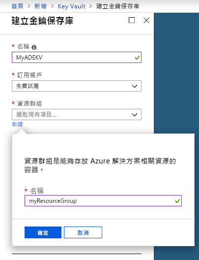
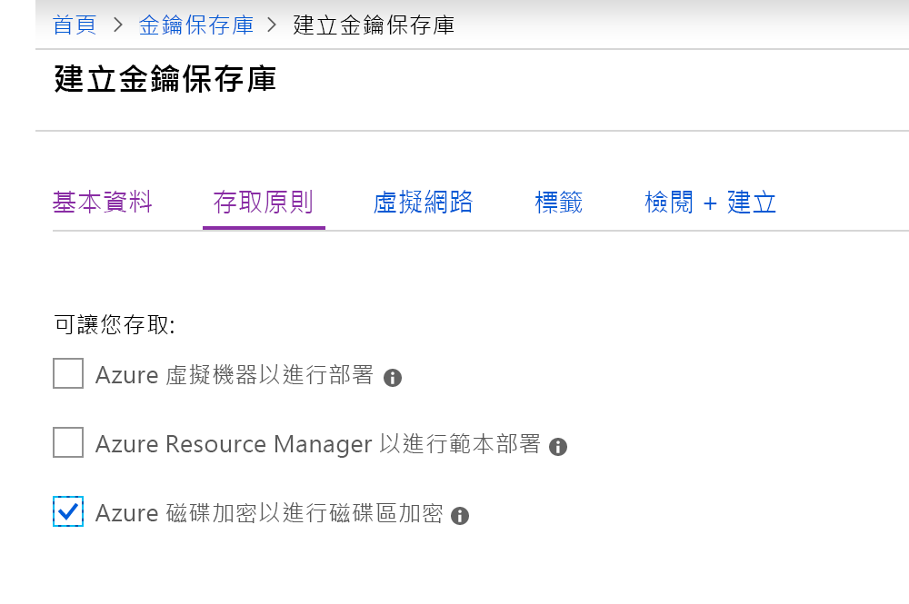
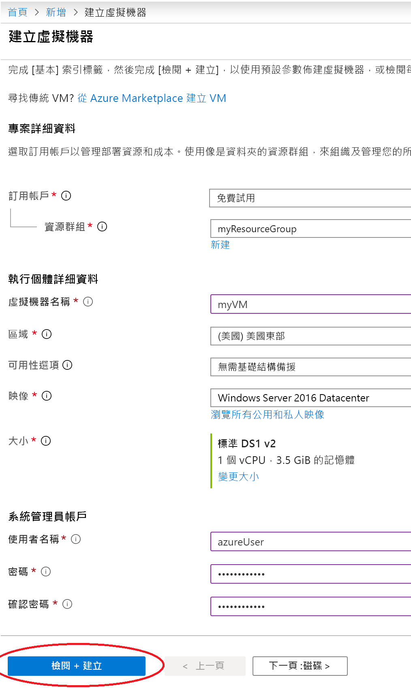
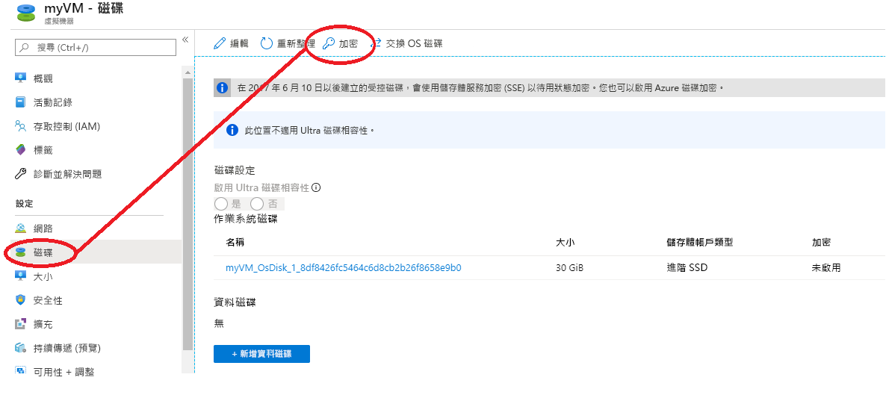
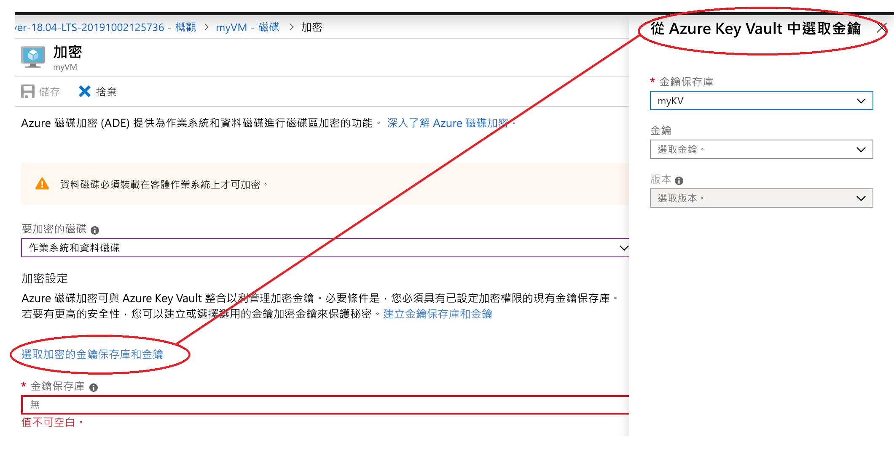

# 快速入門：使用 Azure 入口網站建立和加密 Windows 虛擬機器

您可以透過 Azure 入口網站建立 Azure 虛擬機器 (VM)。 Azure 入口網站是以瀏覽器為基礎的使用者介面，可用來建立 VM 及其相關聯的資源。 本快速入門會示範如何使用 Azure 入口網站部署執行 Ubuntu 18.04 LTS 的 Windows 虛擬機器 (VM)、建立用來儲存加密金鑰的金鑰保存庫以及加密 VM。

如果您沒有 Azure 訂用帳戶，請在開始前建立[免費帳戶](https://azure.microsoft.com/free/?WT.mc_id=A261C142F)。

## 登入 Azure

登入 [Azure 入口網站](https://portal.azure.com)。

## 建立金鑰保存庫

1. 選取 Azure 入口網站左上角的 [建立資源]  選項。
1. 在 [搜尋] 方塊中輸入 **Key Vault**。
1. 從結果清單中，選取 [Key Vault]  。
1. 在 [Key Vault] 區段上，選取 [建立]  。
1. 在 [建立金鑰保存庫]  畫面上，選擇新金鑰保存庫的唯一名稱。

    > [!Important]
    > 每個金鑰保存庫必須有唯一的名稱。 下列範例會建立名為 *myADEKV* 的 Key Vault，但您必須為自己的 Key Vault 命名不同名稱。

1. 選取一個**訂用帳戶**。
1.  在 [資源群組]  下方，選取 [新建]  。 在快顯視窗中輸入 *myResourceGroup* 作為資源群組的名稱，然後選擇 [確定]  。 

    

1. 在 [位置]  下拉式功能表中選擇 [美國東部]  。
1. 將其他的選項保留預設值。
1. 選取 [存取原則]，這會將您帶到新畫面。
1. 選取 [為磁碟區加密啟用對 Azure 磁碟加密的存取] 旁邊的核取方塊。

    

1. 在 [存取原則] 畫面底部，按一下 [檢閱 + 建立]。
1. 檢閱之後，按一下 [建立]。

## 建立虛擬機器

1. 選擇 Azure 入口網站左上角的 [建立資源]  。

1. 在 [新增] 頁面的 [熱門] 之下，選取 [Windows Server 2016 Datacenter]  。
1. 在 [基本]  索引標籤中的 [專案詳細資料]  底下，確認已選取正確的訂用帳戶。
1. 針對 [資源群組]  ，選取您先前製作金鑰保存庫時所建立的資源群組 (例如，**myResourceGroup**)
1. 針對 [虛擬機器名稱]  ，輸入 *MyVM*，然後選擇 
1. 針對 [區域]  ，選取您先前製作金鑰保存庫所使用的相同區域 (例如，**美國東部**)。
1. 確認 [大小]  為「標準 D2s v3」  。
1. 在 [Administrator 帳戶]  底下，選取 [密碼]  。 輸入使用者名稱和密碼。
    
1. 選取 [管理] 索引標籤，並確認您有診斷儲存體帳戶。 如果您沒有儲存體帳戶，請選取 [新建]，為您的新帳戶指定名稱，然後選取 [確定] 
1. 按一下 [檢閱 + 建立]。
1. 在 [建立虛擬機器]  頁面上，您可以看到即將建立的 VM 詳細資料。 準備完成後，請選取 [建立]  。

可能需要幾分鐘的時間才能部署好 VM。 部署完成時，請前往下一節。

## 將虛擬機器加密

1. VM 部署完成後，請選取 [移至資源]  。
1. 在左側邊欄中，選取 [磁碟]  。
1. 在 [磁碟] 畫面上，選取 [加密]  。 

    

1. 在加密畫面的 [要加密的磁碟]  底下，選擇 [OS 和資料磁碟]  。
1. 在 [加密設定]  底下，按一下 [選取金鑰保存庫與金鑰以進行加密]。
1. 在右側邊欄中，選取您稍早建立的金鑰保存庫名稱作為 [金鑰保存庫] 的值，然後按一下 [選取]  。

    
1. 在加密畫面的頂端，按一下 [儲存]。 快顯視窗會警告您 VM 將會重新開機。 按一下 [是]  。

## 清除資源

若不再需要，您可以刪除資源群組、虛擬機器和所有相關資源。 若要這樣做，請選取虛擬機器的資源群組，選取 [刪除]，然後確認要刪除的資源群組名稱。

## 後續步驟

在本快速入門中，您會建立為加密金鑰啟用的 Key Vault、建立虛擬機器，並為虛擬機器啟用加密。  

> [!div class="nextstepaction"]
> [Azure 磁碟加密概觀](disk-encryption-overview.md)