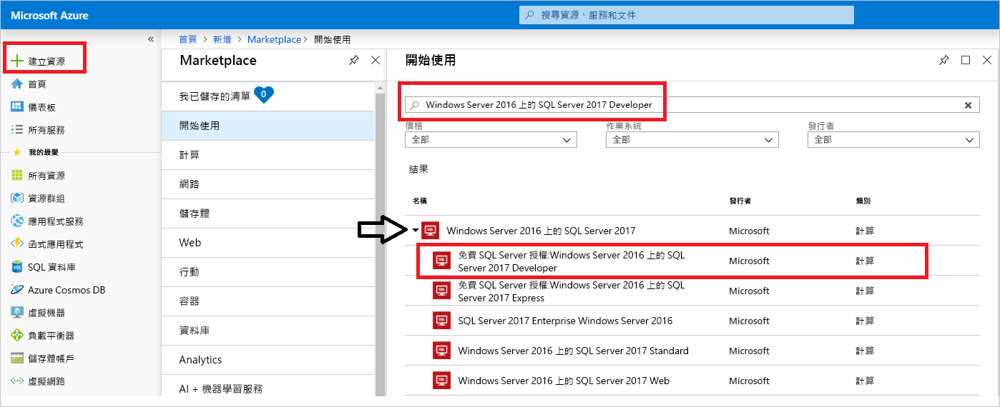
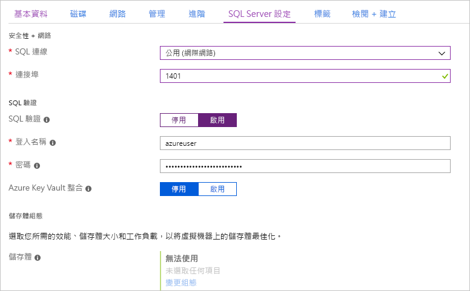
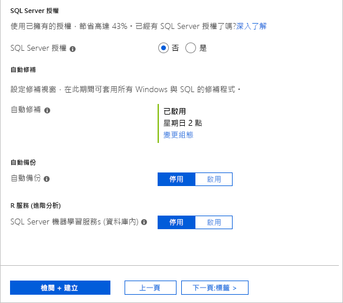
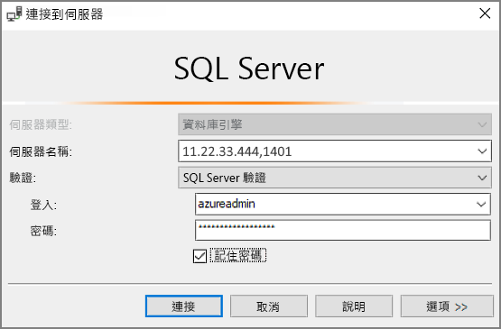

# 快速入門：在 Azure 入口網站中建立 SQL Server 2017 Windows 虛擬機器

> [!div class="op_single_selector"]
> * [Windows](quickstart-sql-vm-create-portal.md)
> * [Linux](../../linux/sql/provision-sql-server-linux-virtual-machine.md)

本快速入門會逐步說明如何在 Azure 入口網站中建立 SQL Server 虛擬機器。

  > [!TIP]
  > - 本快速入門提供快速佈建及連線到 SQL VM 的途徑。 如需其他 SQL VM 佈建選項的詳細資訊，請參閱[在 Azure 入口網站中佈建 Windows SQL Server VM 的指南](virtual-machines-windows-portal-sql-server-provision.md)。
  > - 如果您有 SQL Server 虛擬機器的相關問題，請參閱[常見問題集](virtual-machines-windows-sql-server-iaas-faq.md)。

##  取得 Azure 訂用帳戶

如果您沒有 Azure 訂用帳戶，請在開始前建立 [免費帳戶](https://azure.microsoft.com/free/?WT.mc_id=A261C142F) 。

##  選取 SQL Server VM 映像

1. 使用您的帳戶登入 [Azure 入口網站](https://portal.azure.com)。

1. 在 Azure 入口網站中，選取 [建立資源]  。 

1. 在搜尋欄位中輸入 `SQL Server 2017 Developer on Windows Server 2016`，然後按 ENTER 鍵。 展開 Windows Server 2016 上的 SQL Server 2017 選項。 

1. 選取**免費的 SQL Server 授權：Windows Server 2016 上的 SQL Server 2017 Developer** 影像。 本教學課程中使用 Developer 版本，因為它是免費供開發測試使用的 SQL Server 完整功能版。 您只需支付執行 VM 的費用。 如需完整的定價考量，請參閱 [SQL Server Azure VM 的定價指導方針](virtual-machines-windows-sql-server-pricing-guidance.md)。

   

1. 選取 [建立]  。

##  提供基本詳細資料

在 [基本概念]  索引標籤中提供下列資訊：

1. 在 [專案詳細資料]  區段中選取您的 Azure 訂用帳戶，然後選取 [新建]  以建立新的資源群組。 輸入 _SQLVM-RG_ 作為名稱。

   

1. 在 [執行個體詳細資料]  下方：
    1. 輸入 _SQLVM_ 作為 [虛擬機器名稱]  。 
    1. 選擇 [區域]  的位置。 
    1. 基於此快速入門的目的，請將 [可用性選項]  設定保留為 [不需要基礎結構備援]  。 如需關於可用性選項的詳細資訊，請參閱 [Azure 區域和可用性](../../windows/regions-and-availability.md)。 
    1. 在 **映像** 清單中，選取免費的 _SQL Server 授權：_ Windows Server 2016 上的 SQL Server 2017 Developer 的映像。 
    1. 選擇為虛擬機器的**大小** [變更大小]  ，然後選取 **A2 Basic** 供應項目。 在資源使用完畢後請務必加以清除，以防止產生任何非預期的費用。 

   

1. 在 [系統管理員帳戶]  下方提供使用者名稱 (例如 azureuser  ) 和密碼。 密碼長度至少必須有 12 個字元，而且符合[定義的複雜度需求](../../windows/faq.md#what-are-the-password-requirements-when-creating-a-vm)。

   

1. 在 [輸入連接埠規則]  下方選擇 [允許選取的連接埠]  ，然後從下拉式清單中選取 [RDP (3389)]  。 

   

## SQL Server 設定

在 [SQL Server 設定]  索引標籤上，設定下列選項：

1. 在 [安全性與網路]  下方，針對 [SQL 連線]  選取 [公用 (網際網路)]  ，並將連接埠變更為 `1401`，以避免在公用案例中使用已知的連接埠號碼。 
1. 在 [SQL 驗證]  下方，選取 [啟用]  。 SQL 登入設定為您對 VM 設定的相同使用者名稱和密碼。 使用 [Azure Key Vault 整合]  和 [儲存體組態]  的預設設定。  

   

1. 視需要變更任何其他設定，然後選取 [檢閱 + 建立]  。 

   

## 建立 SQL Server VM

在 [檢閱 + 建立]  索引標籤上檢閱摘要，然後選取 [建立]  以建立為此 VM 指定的 SQL Server、資源群組及資源。

您可以從 Azure 入口網站監視部署。 畫面頂端的 [通知]  按鈕會顯示基本的部署狀態。 部署可能需要數分鐘的時間。 

## 連接到 SQL Server

1. 在入口網站中，在虛擬機器屬性的 [概觀]  區段中尋找 SQL Server VM 的 [公用 IP 位址]  。

1. 在已連線到網際網路的其他電腦上開啟 [SQL Server Management Studio (SSMS)](/sql/ssms/download-sql-server-management-studio-ssms)。

1. 在 [連接到伺服器]  或 [連接到 Database Engine]  對話方塊中，編輯 [伺服器名稱]  值。 輸入您 VM 的公用 IP 位址。 然後加入一個逗號，並加入我們在您設定新的 VM 時所指定的自訂連接埠 **1401**。 例如： `11.22.33.444,1401`。

1. 在 [驗證]  方塊中，選取 [SQL Server 驗證]  。

1. 在 [登入]  方塊中，輸入有效的 SQL 登入名稱。

1. 在 [密碼]  方塊中，輸入登入的密碼。

1. 選取 [ **連接**]。

    

##  從遠端登入 VM

使用下列步驟，透過遠端桌面連線到 SQL Server 虛擬機器︰

[!INCLUDE [Connect to SQL Server VM with remote desktop](../../../../includes/virtual-machines-sql-server-remote-desktop-connect.md)]

連線到 SQL Server 虛擬機器之後，您可以啟動 SQL Server Management Studio，然後使用您的本機系統管理員認證透過「Windows 驗證」進行連線。 如果您已啟用 SQL Server 驗證，您也可以使用您在佈建期間所設定的 SQL 登入和密碼以 SQL 驗證連線。

存取電腦可讓您根據您的需求直接變更電腦和 SQL Server 設定。 例如，您可以設定防火牆設定或變更 SQL Server 組態設定。

## 清除資源

如果您不需要持續執行 SQL VM，您可以在不使用時將其停止，以避免不必要的費用。 您也可以藉由在入口網站中刪除與虛擬機器相關聯的資源群組，永久刪除與其相關聯的所有資源。 這也會永久刪除虛擬機器，因此請小心使用此命令。 如需詳細資訊，請參閱[透過入口網站管理 Azure 資源](../../../azure-resource-manager/manage-resource-groups-portal.md)。

## 後續步驟

在本快速入門中，您已在 Azure 入口網站中建立 SQL Server 2017 虛擬機器。 若要深入了解如何將您的資料移轉至新的 SQL Server，請參閱下列文章。

> [!div class="nextstepaction"]
> [將資料庫移轉至 SQL VM](virtual-machines-windows-migrate-sql.md)
