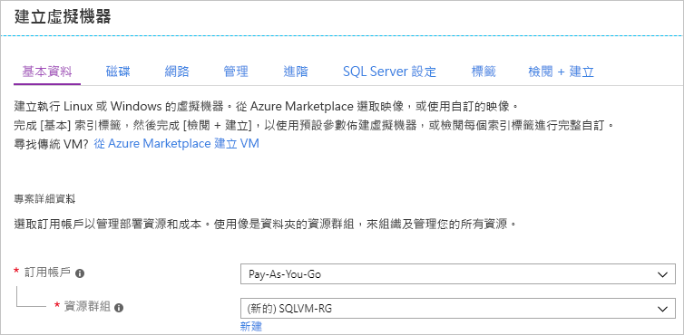
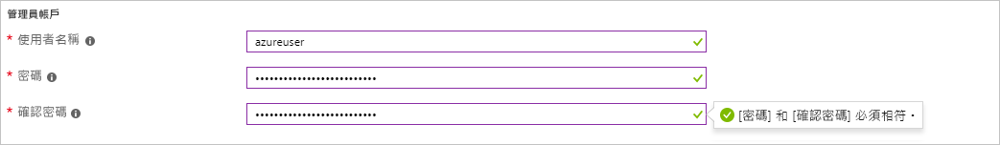
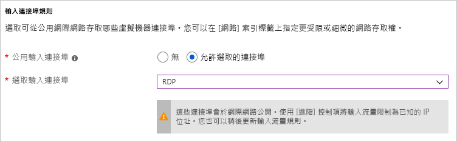

# 如何在 Azure 入口網站中佈建 Windows SQL Server 虛擬機器

當您在 Azure 入口網站中建立 Windows SQL Server 虛擬機器時，本指南可為您提供不同可用選項的詳細資料。 本文章比起逐步說明如何一個佈建工作的 [SQL Server VM 快速入門](quickstart-sql-vm-create-portal.md)，涵蓋了更多的設定選項。 

使用本指南建立您自己的 SQL Server VM。 或者，將本指南當做 Azure 入口網站中可用選項的參考資料。

> [!TIP]
> 如果您有 SQL Server 虛擬機器的相關問題，請參閱[常見問題集](virtual-machines-windows-sql-server-iaas-faq.md)。

如果您沒有 Azure 訂用帳戶，請在開始前建立 [免費帳戶](https://azure.microsoft.com/free/?WT.mc_id=A261C142F) 。

##  SQL Server 虛擬機器資源庫映像

當您建立 SQL Server 虛擬機器時，您可以從虛擬機器資源庫選取其中一個預先設定的映像。 下列步驟示範如何選取其中一個 SQL Server 2017 映像。

1. 使用您的帳戶登入 [Azure 入口網站](https://portal.azure.com) 。

1. 在 Azure 入口網站中，按一下 [建立資源]。 入口網站會開啟 [新增] 視窗。

1. 在 [新增] 視窗中，按一下 [計算]，然後按一下 [檢視全部]。

1. 在搜尋方塊中輸入 **SQL Server 2017**，然後按 ENTER。

1. 在篩選器下拉式清單中，選取_Windows Server 2016_如**作業系統**，然後選取_Microsoft_為**發行者**。 

     

1. 檢閱可用的 SQL Server 映像。 每個映像皆識別一個 SQL Server 版本和一個作業系統。

1. 選取名為 [免費的 SQL Server 授權：Windows Server 2016 上的 SQL Server 2017 Developer] 的映像。

   > [!TIP]
   > 本逐步介紹中使用 Developer 版本，因為這是供開發測試使用的免費 SQL Server 完整功能版。 您只需支付執行 VM 的費用。 不過，您在本逐步介紹中可以自由選擇您要使用的任何映像。 如需可用映像的說明，請參閱 [SQL Server Windows 虛擬機器概觀](virtual-machines-windows-sql-server-iaas-overview.md#payasyougo)。

   > [!TIP]
   > SQL Server 的授權成本已併入您建立之 VM 的每秒鐘價格中，並且根據版本和核心而有所不同。 不過，SQL Server Developer 版本可免費提供開發/測試 (非生產環境) 使用，SQL Express 可免費提供輕量型工作負載 (少於 1GB 記憶體、小於 10 GB 儲存體) 使用。 您也可以自備授權 (BYOL)，僅支付 VM 費用。 這些映像的名稱前面會有 {BYOL}。 
   >
   > 如需這些選項的詳細資訊，請參閱 [SQL Server Azure VM 的定價指導方針](virtual-machines-windows-sql-server-pricing-guidance.md)。

1. 在 [選取部署模型] 底下，確認已選取 [Resource Manager]。 Resource Manager 是新的虛擬機器建議採用的部署模型。 

1. 選取 [建立] 。

##  設定選項

有多個索引標籤來設定 SQL Server 虛擬機器。 為了本指南中，我們將著重於下列： 

| 步驟 | 描述 |
| --- | --- |
| **基础知识** |[設定基本設定](#1-configure-basic-settings) |
| **選用功能** |[設定選用功能](#2-configure-optional-features) |
| **SQL Server 設定** |[進行 SQL Server 設定](#3-configure-sql-server-settings) |
| **檢閱 + 建立** | [檢閱摘要](#4-review--create) |

## 1.設定基本設定

在 [基本概念] 索引標籤中提供下列資訊：

* 底下**專案的詳細資料**，請確定已選取正確的訂用帳戶。 
*  在 **資源群組**一節，請選取現有的資源群組清單中，或選擇**建立新**來建立新的資源群組。 資源群組是 Azure (虛擬機器、儲存體帳戶、虛擬網路等) 中相關資源的集合。 

    

  > [!NOTE]
  > 如果您只是測試或了解 Azure 中的 SQL Server 部署，使用新的資源群組很有幫助。 完成測試之後，請刪除資源群組以自動刪除此 VM 以及與該資源群組相關聯的所有資源。 如需有關資源群組的詳細資訊，請參閱 [Azure Resource Manager 概觀](../../../azure-resource-manager/resource-group-overview.md)。

* 在 [執行個體詳細資料] 下方：
    1. 輸入唯一**虛擬機器名稱**。  
    1. 選擇 [區域] 的位置。 
    1. 本指南中，為了保留**可用性選項**設為_沒有所需的基礎結構備援性_。 如需關於可用性選項的詳細資訊，請參閱 [Azure 區域和可用性](../../windows/regions-and-availability.md)。 
    1. 在 [映像]** _清單中，選取 **[免費的 SQL Server 授權：_ Windows Server 2016 上的 SQL Server 2017 Developer] 的映像。  
    1. 選擇為虛擬機器的**大小** [變更大小]，然後選取 **A2 Basic** 供應項目。 在資源使用完畢後請務必加以清除，以防止產生任何非預期的費用。 對於生產工作負載，請參閱 [Azure 虛擬機器中的 SQL Server 效能最佳做法](virtual-machines-windows-sql-performance.md)中建議的機器大小和組態。

    

> [!IMPORTANT]
> [選擇大小] 視窗上顯示的估計每月成本不包含 SQL Server 授權成本。 這估計只是 VM 單獨的成本。 若為 SQL Server 的 Express 和 Developer 版本，此為預估的總成本。 若為其他版本，請參閱 [Windows 虛擬機器價格頁面](https://azure.microsoft.com/pricing/details/virtual-machines/windows/)，然後選取您的目標 SQL Server 版本。 另請參閱[的定價指導方針 SQL Server Azure Vm](virtual-machines-windows-sql-server-pricing-guidance.md)並[虛擬機器的大小](../sizes.md?toc=%2fazure%2fvirtual-machines%2fwindows%2ftoc.json)。

* 底下**系統管理員帳戶**，提供使用者名稱和密碼。 密碼長度至少必須有 12 個字元，而且符合[定義的複雜度需求](../../windows/faq.md#what-are-the-password-requirements-when-creating-a-vm)。

   

* 在 [輸入連接埠規則] 下方選擇 [允許選取的連接埠]，然後從下拉式清單中選取 [RDP (3389)]。 

   

## 2.設定選用功能

### 磁碟

在 **磁碟**索引標籤上，設定您的磁碟選項。 

* 底下**OS 磁碟類型**，選取您想為您從下拉式清單的 OS 磁碟的類型。 Premium 建議用於生產系統，但不適用於基本的 VM。 若要利用進階 SSD，變更虛擬機器大小。 
* 底下**進階**，選取**Yes**使用下方**受控磁碟**。

   > [!NOTE]
   > Microsoft 建議使用 SQL Server 適用的受控磁碟。 受控磁碟會在背景中處理儲存體。 此外，當具有受控磁碟的虛擬機器在相同的可用性設定組時，Azure 會分散儲存資源以提供適當的備援。 如需詳細資訊，請參閱 [Azure 受控磁碟概觀][../managed-disks-overview.md)。 如需有關受控磁碟位於可用性設定組中的詳細資訊，請參閱 [使用受控磁碟的 Vm 在可用性設定組] (../manage-availability.md。

  
  
### 網路功能

在 **網路**索引標籤上，設定您的網路功能選項。 

* 建立新**虛擬網路**，或使用現有的 vNet 為您的 SQL Server VM。 指定**子網路**以及。 

* 底下**NIC 安全性群組**，選取 基本安全性群組 或 進階的安全性的群組。 選擇 基本 選項可讓您選取 SQL Server vm 的輸入連接埠 (相同的值上設定的**基本** 索引標籤)。 選取 [進階] 選項，可讓您選擇現有的網路安全性群組，或建立新的。 

* 您可以對網路設定進行其他變更，或保留預設值。

#### 監視

在 **監視**索引標籤上，設定監視和自動關機。 

* Azure 可讓**開機監視**相同的儲存體帳戶預設為 VM 的指定。 您可以變更這些設定，在這裡，以及啟用**OS 客體診斷**。 
* 您可以讓**系統指派的受管理的身分識別**並**自動關機**此索引標籤上。 

## 3.進行 SQL Server 設定

在  **SQL Server 設定**索引標籤上，設定 SQL Server 的特定設定和最佳化。 您可以設定適用於 SQL Server 的設定包括下列各項：

| 設定 |
| --- |
| [連線能力](#connectivity) |
| [驗證](#authentication) |
| [Azure 金鑰保存庫整合](#azure-key-vault-integration) |
| [儲存體組態](#storage-configuration) |
| [自動修補](#automated-patching) |
| [自動備份](#automated-backup) |
| [R 服務 （進階分析）](#r-services-advanced-analytics) |

### 連線能力

在 [SQL 連線] 底下，指定您要對此 VM 上的 SQL Server 執行個體進行的存取類型。 基於本逐步介紹的目的，選取 [公用 (網際網路)] 以允許從網際網路上的機器或服務連線至 SQL Server。 選取此選項，Azure 會自動設定防火牆和網路安全性群組以允許選取的通訊埠上的流量。

> [!TIP]
> 根據預設，SQL Server 會在已知通訊埠 **1433** 上接聽。 為了提高安全性，變更前一個對話方塊中的連接埠，以在非預設連接埠 (例如 1401) 上接聽。 如果您變更連接埠，則您必須使用該連接埠從任何用戶端工具 (例如 SSMS) 進行連線。

若要透過網際網路連接到 SQL Server，您也必須啟用下一節所述的「SQL Server 驗證」。

如果您偏好不要啟用透過網際網路連線到 Database Engine 的功能，請選擇下列其中一個選項：

*  只允許從 VM 內連接到 SQL Server。
*  允許從相同虛擬網路中的電腦或服務連接到 SQL Server。

一般情況下，選擇您的案例允許的最嚴格連線能力，即可改善安全性。 但所有透過網路安全性群組規則和 SQL/Windows 驗證的選項都是安全的。 建立 VM 後，您可以編輯網路安全性群組。 如需詳細資訊，請參閱 [Azure 虛擬機器中的 SQL Server 安全性考量](virtual-machines-windows-sql-security.md)。

### Authentication

如果您需要「SQL Server 驗證」，請按一下 [SQL 驗證]  under 。

> [!NOTE]
> 如果您打算透過網際網路 ([公用] 連線選項) 存取 SQL Server，則您必須在這裡啟用 SQL 驗證。 對 SQL Server 進行公用存取需要使用「SQL 驗證」。

如果您啟用 [SQL Server 驗證]，請指定 [登入名稱] 和 [密碼]。 此登入名稱設定為 SQL Server 驗證登入和成員**sysadmin**固定的伺服器角色。 如需驗證模式的詳細資訊，請參閱[選擇驗證模式](https://docs.microsoft.com/sql/relational-databases/security/choose-an-authentication-mode)。

如果您未啟用 SQL Server 驗證，您可以在 VM 上使用本機系統管理員帳戶連接到 SQL Server 執行個體。

### Azure 金鑰保存庫整合

若要在 Azure 中儲存用於加密的安全性密碼，請按一下 [Azure 金鑰保存庫整合]，然後按一下 [啟用]。

下表列出設定「Azure 金鑰保存庫整合」時所需的參數。

| 參數 | 描述 | 範例 |
| --- | --- | --- |
| **金鑰保存庫 URL** |金鑰保存庫的位置。 |https:\//contosokeyvault.vault.azure.net/ |
| **主體名稱** |Azure Active Directory 服务主体名称。 此名稱也稱為「用戶端識別碼」。 |fde2b411-33d5-4e11-af04eb07b669ccf2 |
| **主體密碼** |Azure Active Directory 服務主體密碼。 此密碼也稱為「用戶端密碼」。 |9VTJSQwzlFepD8XODnzy8n2V01Jd8dAjwm/azF1XDKM= |
| **認證名稱** |**認證名稱**：AKV 集成在 SQL Server 内创建一个凭据，使 VM 具有对密钥保管库的访问权限。 選擇此認證的名稱。 |mycred1 |

如需詳細資訊，請參閱 [在 Azure VM 上設定 SQL Server 的 Azure 金鑰保存庫整合](virtual-machines-windows-ps-sql-keyvault.md)。

### 儲存體組態

底下**儲存體組態**，選取**變更設定**指定儲存體需求。

> [!NOTE]
> 如果將以手動方式將 VM 設定為使用標準儲存體，則無法使用此選項。 自動儲存體最佳化只適用於進階儲存體。

> [!TIP]
> 每個滑桿的停駐點數目和上限取決於您選取的 VM 大小。 較大型且更強大的 VM 能夠進一步相應增加。

您可以用每秒輸入/輸出作業數 (IOPs)、輸送量 (單位為 MB/s) 及總儲存體大小來指定需求。 請使用滑動標尺來設定這些值。 您可以根據工作負載變更這些儲存體設定。 入口網站會自動根據這些需求計算要連結和設定的磁碟數目。

在 [儲存體最佳化] 底下，選取下列其中一個選項：

*  是預設設定，支援大多數工作負載。
*  可將儲存體最佳化來處理傳統資料庫 OLTP 工作負載。
*  可將儲存體最佳化來處理分析和報告工作負載。

### SQL Server 授權
如果您是軟體保證客戶，您可以利用[Azure Hybrid Benefit](https://azure.microsoft.com/pricing/hybrid-benefit/)攜帶您自己的 SQL Server 授權，並儲存在資源上。 

### 自動修補

**Automated patching** 。 自動修補可讓 Azure 自動修補 SQL Server 和作業系統。 請為維護期間指定一週當中的某一天、時間及持續時間。 Azure 會在此維護期間執行修補。 維護期間排程會使用 VM 地區設定做為時間。 如果您不想要讓 Azure 自動修補 SQL Server 和作業系統，請按一下 [停用] 。  

如需詳細資訊，請參閱 [Azure 虛擬機器中的 SQL Server 自動修補](virtual-machines-windows-sql-automated-patching.md)。

### 自動備份

在 [自動備份] 底下，可以為所有資料庫啟用自動資料庫備份。 預設會停用自動備份。

當您啟用 SQL 自動備份時，您可以進行下列設定：

* 備份的保留期限 (天數)
* 要用於備份的儲存體帳戶
* 備份的加密選項和密碼
* 備份系統資料庫
* 設定備份排程

若要加密备份，请单击“ **启用**”。 然後指定 [密碼] 。 Azure 會建立憑證來加密備份，並使用指定的密碼來保護該憑證。

如需詳細資訊，請參閱 [Azure 虛擬機器中 SQL Server 的自動化備份](virtual-machines-windows-sql-automated-backup.md)。

### R 服務 （進階分析）

您可以選擇啟用[SQL Server R Services （進階分析）](/sql/advanced-analytics/r/sql-server-r-services/)。 此選項可讓您搭配使用進階分析與 SQL Server 2017。 按一下 [SQL Server 設定] 視窗上的 [啟用]。

## 4.檢閱 + 建立

在 [檢閱 + 建立] 索引標籤上檢閱摘要，然後選取 [建立] 以建立為此 VM 指定的 SQL Server、資源群組及資源。

您可以從 Azure 入口網站監視部署。 畫面頂端的 [通知]  按鈕會顯示基本的部署狀態。

> [!NOTE]
> 為了讓您了解部署時間，我已使用預設設定將 SQL VM 部署到美國東部區域。 此測試部署大約花費 12 分鐘才完成。 但是根據您的區域和選取的設定，您可能會經歷較快或較慢的部署時間。

## 透過遠端桌面開啟 VM

使用下列步驟，透過遠端桌面連線到 SQL Server 虛擬機器︰

[!INCLUDE [Connect to SQL Server VM with remote desktop](../../../../includes/virtual-machines-sql-server-remote-desktop-connect.md)]

連線到 SQL Server 虛擬機器之後，您可以啟動 SQL Server Management Studio，然後使用您的本機系統管理員認證透過「Windows 驗證」進行連線。 如果您已啟用 SQL Server 驗證，您也可以使用您在佈建期間所設定的 SQL 登入和密碼以 SQL 驗證連線。

存取電腦可讓您根據您的需求直接變更電腦和 SQL Server 設定。 例如，可以配置防火墙设置或更改 SQL Server 配置设置。

## 遠端連線到 SQL Server

在本逐步介紹中，您選取了虛擬機器的 [公用] 存取權和 [SQL Server 驗證]。 這些設定會自動設定虛擬機器，以允許透過網際網路來自任何用戶端的 SQL Server 連線 (假設它們有正確的 SQL 登入)。

> [!NOTE]
> 如果您未在佈建期間選取 [公用]，您可以在佈建之後，透過入口網站變更 SQL 連線設定。 如需詳細資訊，請參閱[變更 SQL 連線設定](virtual-machines-windows-sql-connect.md#change)。

下列各節說明如何透過網際網路連線到您的 SQL Server VM 執行個體。

[!INCLUDE [Connect to SQL Server in a VM Resource Manager](../../../../includes/virtual-machines-sql-server-connection-steps-resource-manager.md)]

  > [!NOTE]
  > 此範例會使用常用的連接埠 1433年。 不過，這個值會需要修改 SQL Server VM 在部署期間指定不同的連接埠 （例如 1401)。 

## 後續步驟

如需在 Azure 中使用 SQL Server 的其他資訊，請參閱 [Azure 虛擬機器上的 SQL Server](virtual-machines-windows-sql-server-iaas-overview.md) 和[常見問題集](virtual-machines-windows-sql-server-iaas-faq.md)。