# 移轉移至 Azure 虛擬 WAN
Azure 虛擬 WAN 讓公司能夠簡化全球連線能力，並因 Microsoft 全球網路的規模而受益。 如果公司想要從現有客戶管理的中樞與輪輻拓撲移轉至利用 Microsoft 管理之虛擬 WAN 中樞的設計，則適用這份白皮書所提供的技術詳細資料。

[全球傳輸網路架構和虛擬 WAN](virtual-wan-global-transit-network-architecture.md) 一文強調說明 Azure 虛擬 WAN 能夠為採用以雲端為中心的新式企業全球網路的企業提供的優點。

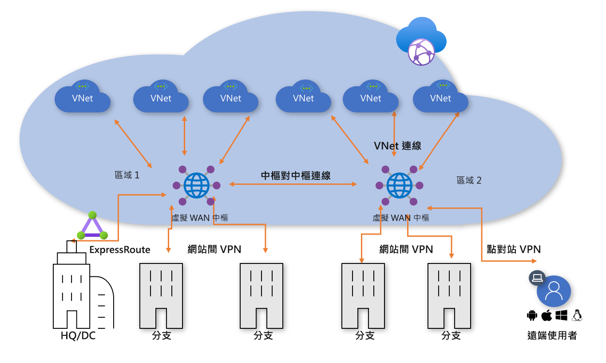
**圖 1：Azure 虛擬 WAN**

目前已有成千上萬位客戶採用 Azure 虛擬資料中心 (VDC) 中樞與輪輻連線模型，可利用 Azure 網路的預設轉移路由行為，來建置簡單且可調整規模的雲端網路。 Azure 虛擬 WAN 建置於這些概念之上並引進新功能，這些功能不僅會在內部部署位置和 Azure 之間提供全球連線拓撲，還能讓客戶利用 Microsoft 網路的規模來加強其現有的全球網路。

此文章說明如何將現有的混合式環境移轉至虛擬 WAN。

## 案例

Contoso 是一家全球金融組織，在歐洲和亞洲均設有分公司。 他們打算將現有的應用程式從內部部署網域控制站移至 Azure，並根據 VDC 架構建置基礎設計，包括區域客戶管理的中樞虛擬網路，以提供混合式連線能力。 在移至雲端式技術的過程中，分派給網路小組的任務是確保會將其連線能力最佳化，好讓業務能夠持續進展。

圖 2 顯示現有全球網路的高階檢視，包括對多個 Azure 區域的連線能力。

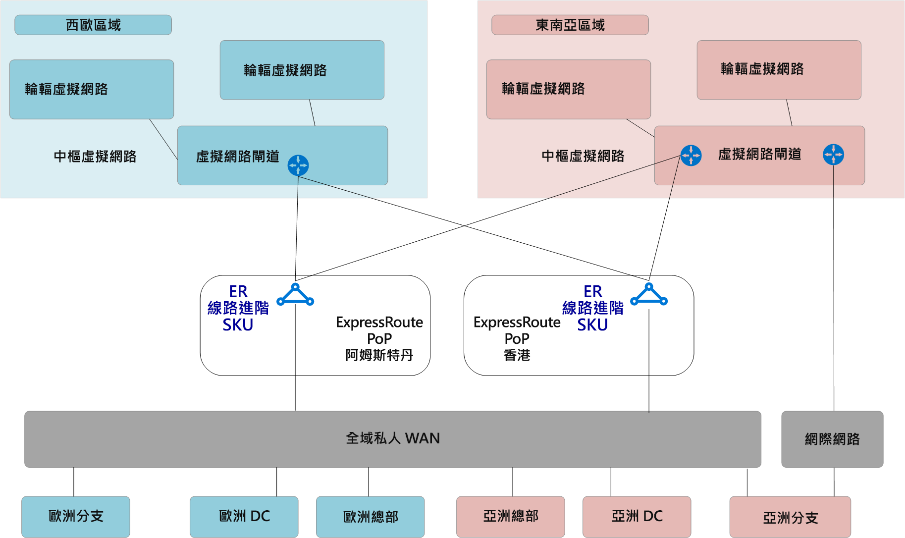
**圖 2：Contoso 現有的網路拓撲**

您可以從現有的網路拓撲了解下列幾點：
 
- 在多個區域中使用中樞與輪輻模型。 利用 ExpressRoute 進階線路連線回到一般私人 WAN。
- 這其中一些網站也具有直接通往 Azure 的 VPN 通道，以觸達裝載於 Microsoft 雲端的應用程式。

## 需求
分派給網路小組的任務是提供可支援 Contoso 移轉至雲端的全球網路模型，而且必須在成本、規模和效能方面進行最佳化。 總而言之，必須符合下列需求：
- 為總公司 (HQ) 和分公司提供已最佳化的雲端裝載應用程式路徑。 
- 移除對現有內部部署網域控制站 (DC) 的依賴以終止 VPN，同時保留下列連線路徑：
    - **分支對 VNet**：VPN 連線的分公司必須能夠存取已在本地 Azure 區域中移轉至雲端的應用程式。
    - **分支對中樞到中樞對 VNet**：VPN 連線的分公司必須能夠存取已在遠端 Azure 區域中移轉至雲端的應用程式。 
    - **分支對分支**：區域 VPN 連線的分公司必須能夠彼此通訊，以及與 ExpressRoute 連線的 HQ/DC 網站通訊。 
    - **分支對中樞到中樞對分支**：遍布全球之 VPN 連線的分公司必須能夠彼此通訊，以及與任何 ExpressRoute 連線的 HQ/DC 網站通訊。
    - **分支對網際網路**：連線的網站必須能夠與網際網路通訊，而且必須篩選並記錄此流量。
    - **VNet 對 VNet**：相同區域中的輪輻虛擬網路必須能夠彼此通訊。
    - **VNet 對中樞到中樞對 VNet**：不同區域中的輪輻虛擬網路必須能夠彼此通訊。
- 讓 Contoso 漫遊使用者 (膝上型電腦和電話) 不需位於公司網路，就能夠存取公司資源。

## Azure 虛擬 WAN 架構

圖 3 顯示已更新目標拓撲的高階檢視，此拓撲使用 Azure 虛擬 WAN 來符合上一節詳述的需求。

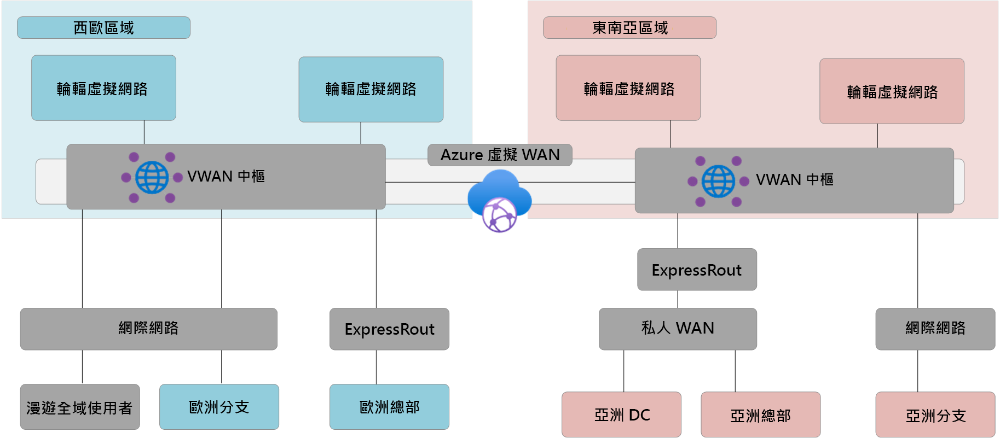
**圖 3：Azure 虛擬 WAN 架構**

摘要說明： 
- 歐洲的 HQ 會維持與 ExpressRoute 連線，而歐洲的內部部署 DC 則會完全移轉至 Azure 並立即解除委任。
- 亞洲的 DC 和 HQ 仍會連線到私人 WAN。 Azure 虛擬 WAN 現在用來加強本地電訊廠商網路，並提供全球連線能力 
- Azure 虛擬 WAN 中樞部署於歐洲西部和東南亞 Azure 區域，以便為 ExpressRoute 和 VPN 連線的裝置提供連線中樞。 
- 中樞也會為使用全球網狀網路的 OpenVPN 連線能力，針對跨多個用戶端類型的漫遊使用者提供 VPN，讓您不僅可以存取移轉至 Azure 的應用程式，也能存取內部部署中剩餘的任何資源。 
- Azure 虛擬 WAN 會提供虛擬網路內資源的網際網路連線能力。 Azure 虛擬 WAN 會提供遠端網站的網際網路連線能力。 透過合作夥伴整合支援本地網際網路分組，以將存取 SaaS 服務 (例如 Office 365) 最佳化。

## 移轉移至 Azure 虛擬 WAN

此節說明移轉至 Azure 虛擬 WAN 的各種步驟。
 
### VDC 中樞與輪輻單一區域

下圖顯示在推出 Azure 虛擬 WAN 之前，適用於 Contoso 的單一區域拓撲。

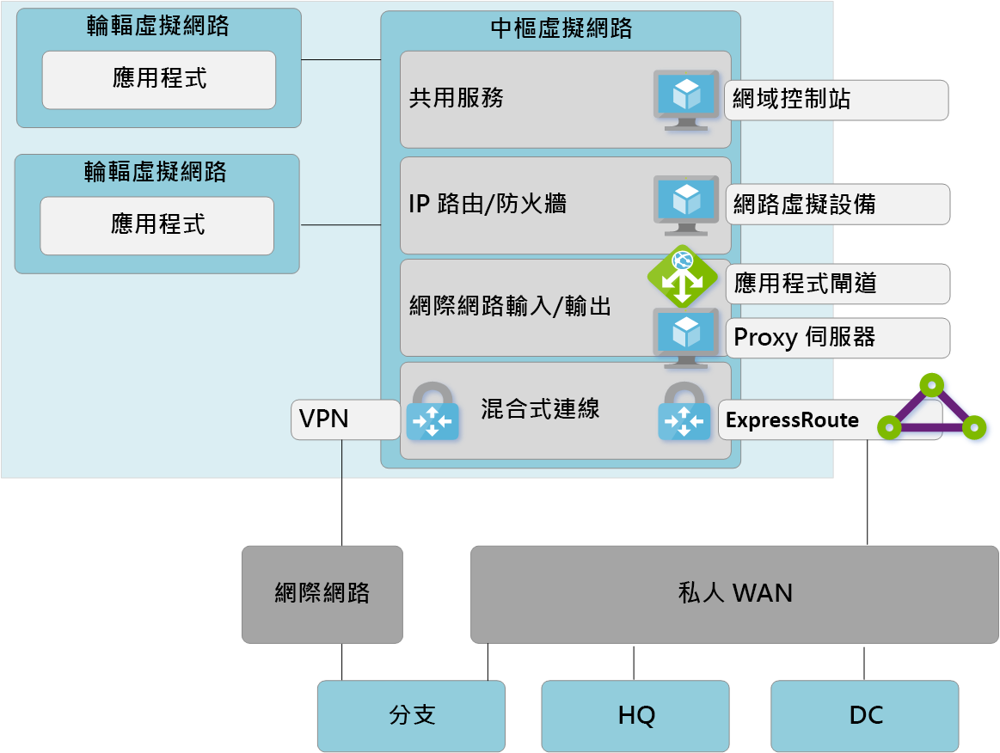

 **圖 4：VDC 中樞與輪輻單一區域 - 步驟 1**

與虛擬資料中心 (VDC) 方法一致，客戶管理的中樞虛擬網路包含數個功能區塊：
- Contoso 所使用的共用服務 (多個輪輻所需的任何一般功能) 範例之一就是基礎結構即服務 (IaaS) 虛擬機器上的 IaaS Windows Server 網域控制站。
- IP/路由防火牆服務會透過協力廠商網路虛擬設備提供，可啟用輪輻對輪輻第 3 層 IP 路由。 
- 網際網路輸入/輸出服務 (包括適用於輸入 HTTPS 要求的 Azure 應用程式閘道)，以及在虛擬機器上執行的協力廠商 Proxy 服務 (用以篩選對網際網路資源的輸出存取)。
- ExpressRoute 和 VPN 虛擬網路閘道，可連線到內部部署網路。

### 部署虛擬 WAN 中樞

第一個步驟牽涉到在每個區域中部署虛擬 WAN 中樞。 使用 VPN 閘道和 ExpressRoute 閘道來部署虛擬 WAN 中樞，如下列文章所述： 
- [教學課程：使用 Azure 虛擬 WAN 建立站對站連線](virtual-wan-site-to-site-portal.md)
- [教學課程：使用 Azure 虛擬 WAN 來建立 ExpressRoute 關聯](virtual-wan-expressroute-portal.md) 

> [!NOTE]
> Azure 虛擬 WAN 必須使用標準 SKU 來啟用此文章所述的部分流量路徑。

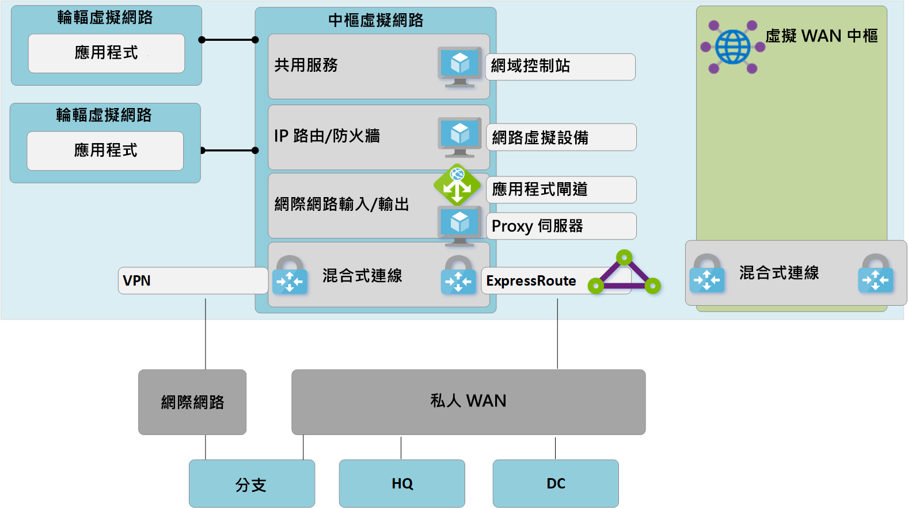
**圖 5：VDC 中樞與輪輻移轉至虛擬 WAN - 步驟 2**

### 將遠端網站 (ExpressRoute 和 VPN) 連線到虛擬 WAN

現在我們要將虛擬 WAN 中樞連線到公司 ExpressRoute 線路，並透過網際網路來將站對站 VPN 設定為任何遠端分支。

> [!NOTE]
> ExpressRoute 線路必須升級為進階 SKU 類型，才能連線到虛擬 WAN 中樞。

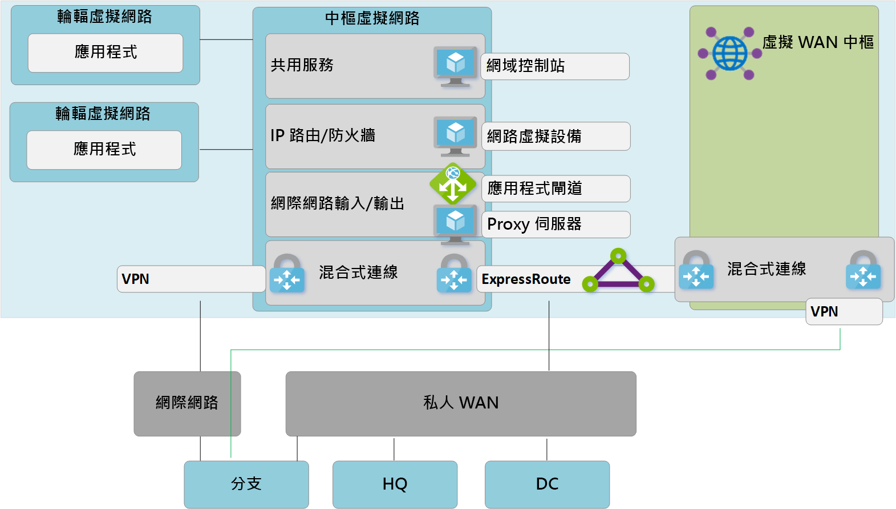
**圖 6：VDC 中樞與輪輻移轉至虛擬 WAN - 步驟 3**

此時，內部部署網路設備將開始接收路由，以反映指派給虛擬 WAN 管理之中樞 VNet 的 IP 位址空間。 在此階段中，遠端 VPN 連線的分支將會看到兩個連至輪輻虛擬網路中任何現有應用程式的路徑。 這些裝置應設定為繼續使用通往 VDC 中樞的通道，以確保會在轉換階段進行對稱式路由傳送。

### 透過虛擬 WAN 測試混合式連線能力

利用受控虛擬 WAN 中樞來連線實際執行環境之前，建議您先設定測試輪輻虛擬網路和虛擬 WAN VNet 連線。 驗證此測試環境的連線會透過 ExpressRoute 和站對站 VPN 來運作，然後繼續進行後續步驟。

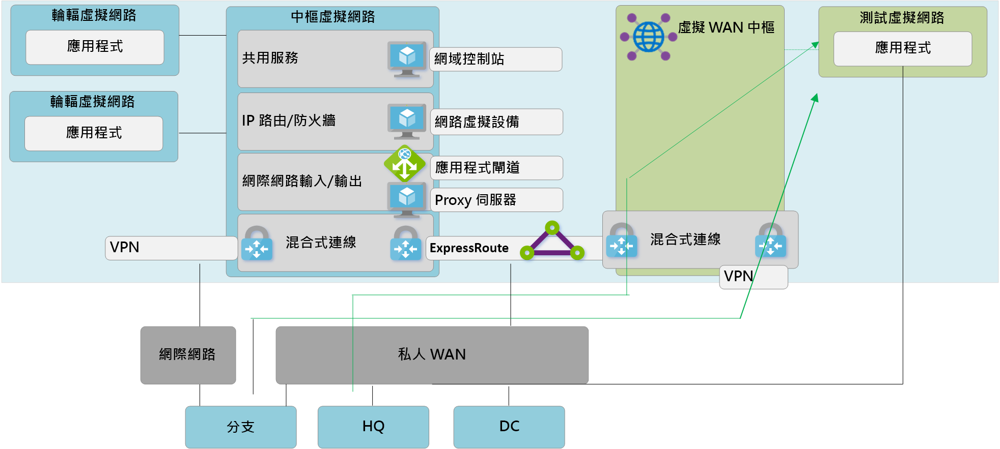
**圖 7：VDC 中樞與輪輻移轉至虛擬 WAN - 步驟 4**

### 轉換虛擬 WAN 中樞的連線能力

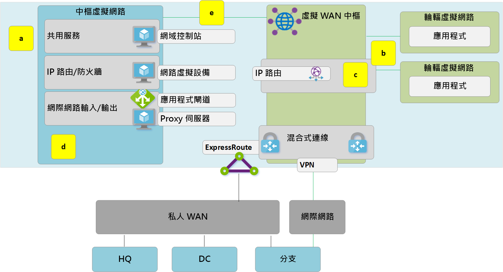
**圖 8：VDC 中樞與輪輻移轉移至虛擬 WAN - 步驟 5**

**a**。 刪除從輪輻虛擬網路到舊有 VDC 中樞的現有對等互連連線。 完成步驟 a-c 之前，無法存取輪輻虛擬網路中的應用程式。

**b**. 透過 VNet 連線，將輪輻虛擬網路連線到虛擬 WAN 中樞。

**c**. 移除任何先前在輪輻虛擬網路內用來進行輪輻對輪輻通訊的使用者定義路由 (UDR)。 這個路徑現在會透過虛擬 WAN 中樞內可用的動態路由來啟用。

**d**. VDC 中樞目前的 ExpressRoute 和 VPN 閘道現已解除委任，以允許步驟 5。

**e**. 透過新的 VNet 連線，將舊有 VDC 中樞 (中樞虛擬網路) 連線到虛擬 WAN 中樞。

### 舊有中樞會成為共用服務輪輻

我們現在已重新設計 Azure 網路，讓虛擬 WAN 中樞成為新拓撲的中心點。

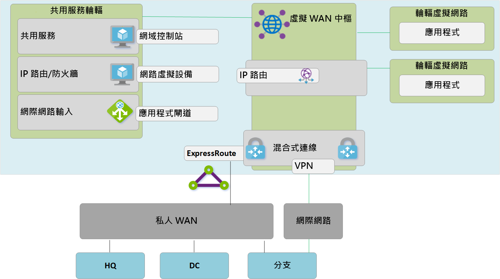
**圖 9：VDC 中樞與輪輻移轉至虛擬 WAN - 步驟 6**

由於虛擬 WAN 中樞是受控實體且不允許部署自訂資源 (例如虛擬機器)，因此，共用服務區塊現在會以輪輻虛擬網路的形式存在，透過 Azure 應用程式閘道或網路虛擬化設備來裝載網際網路輸入之類的功能。 共用服務環境與後端虛擬機器之間的流量現在會通過虛擬 WAN 管理的中樞。

### 將內部部署連線能力最佳化以充分利用虛擬 WAN

在此階段中，Contoso 幾乎已完成將商務應用程式移轉至 Microsoft Cloud 的過程，而內部部署 DC 中只剩下一些舊版應用程式。

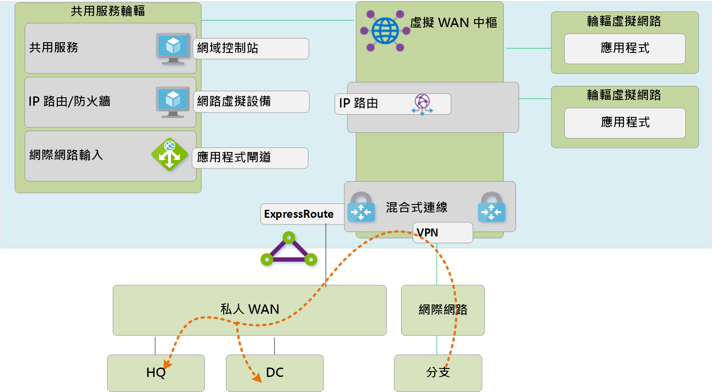
**圖 10：VDC 中樞與輪輻移轉至虛擬 WAN - 步驟 7**

 為了利用 Azure 虛擬 WAN 的完整功能，Contoso 決定解除委任其舊版內部部署 VPN 連線。 任何繼續存取 HQ 或 DC 網路的分支，均能使用 Azure 虛擬 WAN 內建的傳輸路由來傳輸 Microsoft 全球網路。 若客戶想要利用 Microsoft 骨幹來補充其現有的私人 WAN，則 ExpressRoute Global Reach 是另一種選擇。

## 結束狀態架構和流量路徑

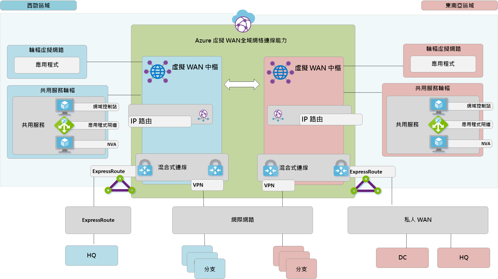
**圖 11：雙重區域虛擬 WAN**

此節透過查看一些範例流量流程，來提供此拓撲如何符合原始需求的摘要。

### 路徑 1

路徑 1 說明從亞洲 S2S VPN 分支到東南亞區域中 Azure VNet 的流量流程。

流量的路由如下所示：
- 亞洲分支透過可復原且啟用 S2S BGP 的通道來連線到東南亞虛擬 WAN 中樞。
- 亞洲虛擬 WAN 中樞會在本地將流量路由傳送到連線的 VNet。

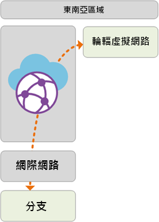

### 路徑 2
路徑 2 說明從 ExpressRoute 連線的歐洲 HQ 到東南亞區域中 Azure VNet 的流量流程。

流量的路由如下所示：
- 歐洲 HQ 會透過標準 ExpressRoute 線路連線到歐洲西部虛擬 WAN 中樞。
- 虛擬 WAN 中樞對中樞全球連線能力，可讓您順暢地將流量傳輸到遠端區域中連線的 VNet。

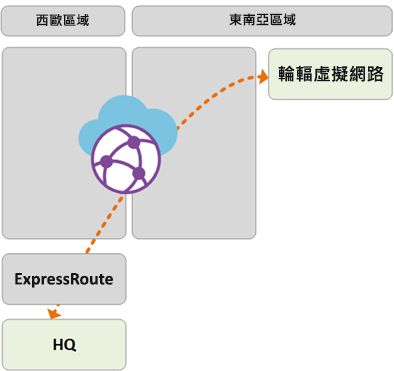

### 路徑 3
路徑 3 說明從連線到私人 WAN 的亞洲內部部署 DC 到歐洲 S2S 連線分支的流量流程。

流量的路由如下所示：
- 亞洲 DC 會連線到本地私人 WAN 電訊廠商。
- ExpressRoute 線路會在連線到東南亞虛擬 WAN 中樞的私人 WAN 中在本地終止。
- 虛擬 WAN 中樞對中樞全球連線能力，可讓您順暢地傳輸連線到歐洲遠端中樞的流量分支。

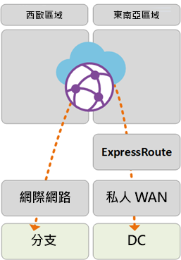

### 路徑 4
路徑 4 說明從東南亞區域中的 Azure VNet 到歐洲西部區域中 Azure VNet 的流量流程。

流量的路由如下所示：
- 虛擬 WAN 中樞對中樞全域連線能力讓您能夠在沒有進階使用者設定的情況下，原生傳輸所有連線的 Azure VNet。

### 路徑 5
路徑 5 說明從漫遊 VPN (P2S) 使用者到歐洲西部區域中 Azure VNet 的流量流程。

流量的路由如下所示：
- 膝上型電腦和電話使用者均會利用 OpenVPN 用戶端，在歐洲西部的 P2S VPN 閘道中進行透明連線。
- 歐洲西部虛擬 WAN 中樞會在本地將流量路由傳送到連線的 VNet。

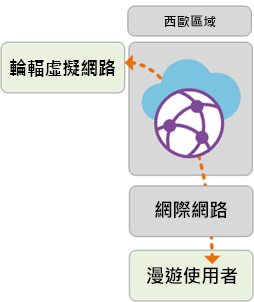

## 透過 Azure 防火牆的安全性與原則控制

Contoso 現已驗證所有分支和 VNet 之間的連線能力符合此文件稍早所討論的需求。 為了符合其對安全性控制和網路隔離的需求，他們需要繼續透過中樞網路來分隔和記錄流量 (此功能先前是由 NVA 所執行)。 Contoso 也想要解除委任現有的 Proxy 服務，並利用原生 Azure 服務進行輸出網際網路篩選。 

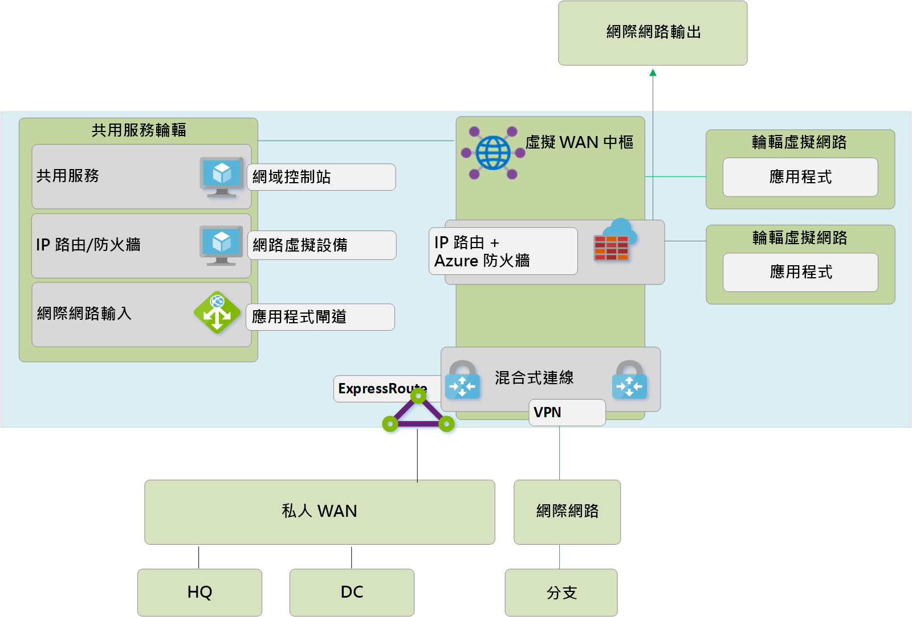
**圖 12：虛擬 WAN 中的 Azure 防火牆 (安全虛擬中樞)**

以下是將 Azure 防火牆引進虛擬 WAN 中樞，以啟用統一原則控制點所需的概略步驟。 此程序和安全虛擬中樞的概念將在[這裡](https://go.microsoft.com/fwlink/?linkid=2107683) \(英文\) 詳細說明。
- 建立 Azure 防火牆原則。
- 將防火牆原則連結到 Azure 虛擬 WAN 中樞。
上述步驟可讓現有的虛擬 WAN 中樞作為安全虛擬中樞來運作，並部署所需的 Azure 防火牆資源。

> [!NOTE]
> 如果 Azure 防火牆部署於標準虛擬 WAN 中樞 (SKU：標準)：V2V、B2V、V2I 和 B2I FW 原則只會針對源自 VNet 的流量強制執行，而分支會連線到 Azure FW 部署所在的特定中樞 (安全中樞)。 即使這些遠端分支和 VNet 均透過虛擬 WAN 中樞互連到中樞連結，也不會針對源自連結到相同虛擬 WAN 中其他虛擬 WAN 中樞之遠端 VNet 和分支的流量「設定防火牆」。 Azure 虛擬 WAN 和防火牆管理員藍圖均支援跨中樞設定防火牆。

下列路徑說明利用 Azure 安全虛擬中樞所啟用的連線路徑。

### 路徑 6
路徑 6 說明來自相同區域內 VNet 對 VNet 安全傳輸的流量流程。

流量的路由如下所示：
- 連線到相同安全虛擬中樞的虛擬網路，現在會透過 Azure 防火牆路由傳送流量。
- Azure 防火牆可以將原則套用到這些流程。

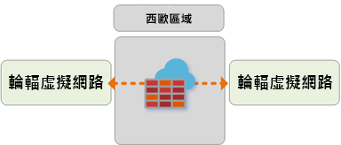

### 路徑 7
路徑 7 說明來自 VNet 對網際網路或協力廠商安全性服務的流量流程。

流量的路由如下所示：
- 連線到安全虛擬中樞的虛擬網路可以使用安全中樞作為網際網路存取的中心點，將流量傳送到網際網路上的公用目的地。
- 此流量可以使用 Azure 防火牆 FQDN 規則在本地進行篩選，或傳送給協力廠商安全性服務進行檢查。

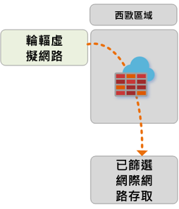

### 路徑 8
路徑 8 說明來自分支對網際網路或協力廠商安全性服務的流量流程。

流量的路由如下所示：
- 連線到安全虛擬中樞的分支可以使用安全中樞作為網際網路存取的中心點，將流量傳送到網際網路上的公用目的地。
- 此流量可以使用 Azure 防火牆 FQDN 規則在本地進行篩選，或傳送給協力廠商安全性服務進行檢查。

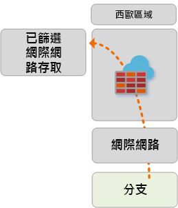 

## 後續步驟
深入了解 [Azure 虛擬 WAN](virtual-wan-about.md)
