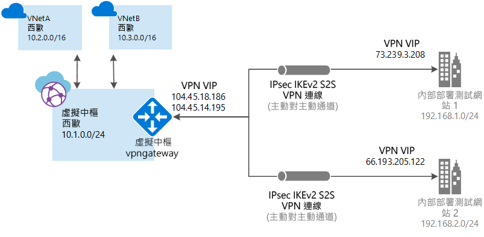

# 什麼是 Azure 虛擬 WAN？

Azure 虛擬 WAN 是一種網路服務，透過 Azure 提供最佳且自動化的分支對分支連線。 虛擬 WAN 可讓您連線，並設定與 Azure 通訊的分支裝置。 做法是以手動方式，或透過虛擬 WAN 夥伴使用偏好的夥伴裝置。 如需詳細資訊，請參閱[慣用的夥伴](https://go.microsoft.com/fwlink/p/?linkid=2019615) \(英文\) 一文。 使用偏好的夥伴裝置可讓您易於使用、簡化連線和組態管理。 Azure WAN 內建儀表板提供即時的疑難排解見解，可協助您節省時間，並可讓您輕鬆地檢視大規模的連線。

本文可讓您快速檢視 Azure 與非 Azure 工作負載的網路連線。 虛擬 WAN 提供下列優點：

* **中樞和輪幅中的整合式連線解決方案：** 自動化站對站設定，以及內部部署網站與 Azure 中樞之間的連線。
* **自動化輪輻設定和組態：** 將您的虛擬網路和工作負載順暢地連線至 Azure 中樞。
* **直覺式疑難排解：** 您會看到 Azure 內的端對端流程，並使用此資訊來採取必要的動作。

## 站對站連線

若要使用虛擬 WAN 建立站對站連線，您可以前往[虛擬 WAN 夥伴](https://go.microsoft.com/fwlink/p/?linkid=2019615)，或以手動方式建立連線。

### 與虛擬 WAN 合作夥伴合作

當您使用 WAN 夥伴時，程序是：

1. 分支裝置 (VPN/SDWAN) 控制器會進行驗證，使用 [Azure 服務主體](../azure-resource-manager/resource-group-create-service-principal-portal.md)，將以網站為中心的資訊匯出至 Azure。
2. 分支裝置 (VPN/SDWAN) 控制器會取得 Azure 連線設定，並更新本機裝置。 這會將設定下載、編輯和更新內部部署 VPN 裝置等動作自動化。
3. 一旦裝置有正確的 Azure 設定後，隨即建立與 Azure WAN 的站對站連線 (兩個使用中的通道)。 Azure 同時支援 IKEv1 與 IKEv2。 BGP 為選擇性。

如果您不想要使用偏好的夥伴，您可以手動設定連線，請參閱[使用虛擬 WAN 建立站對站連線](virtual-wan-site-to-site-portal.md)。

## 點對站連線 (預覽)

點對站 (P2S) 連線可讓您建立從個別用戶端電腦到虛擬中樞的安全連線。 P2S 連線的建立方式是從用戶端電腦開始。 此解決方案適用於想要從遠端位置 (例如從住家或會議) 連線的遠距工作者。 當您只有少數用戶端必須連線時，P2S VPN 也是很實用的解決方案 (而不是 S2S VPN)。

若手動建立連線，請參閱[使用 Azure 虛擬 WAN 來建立點對站連線 (預覽)](https://go.microsoft.com/fwlink/p/?linkid=2020051&clcid)。

## ExpressRoute 連線 (預覽)

若要手動建立連線，請參閱[使用虛擬 WAN 來建立 ExpressRoute 連線](https://go.microsoft.com/fwlink/p/?linkid=2020148&clcid)。

## 虛擬 WAN 資源

若要設定端對端虛擬 WAN，您可以建立下列資源：

* **virtualWAN：** virtualWAN 資源代表 Azure 網路的虛擬重疊，而且是多個資源的集合。 它包含所有您想要包含在虛擬 WAN 內虛擬中樞的連結。 虛擬 WAN 資源會互相隔離，且不能包含一般的中樞。 跨虛擬 WAN 的虛擬中樞不會互相通訊。 「允許分支到分支的流量」屬性會啟用 VPN 網站之間的流量，以及 VPN 對已啟用 ExpressRoute 之網站的流量。 請注意，ExpressRoute 在 Azure 虛擬 WAN 中目前是預覽狀態。

* **站台：** 稱為 vpnsite 的站台資源代表您的內部部署 VPN 裝置和其設定。 使用虛擬 WAN 合作夥伴，您將擁有內建的解決方案，會將這項資訊自動匯出至 Azure。

* **中樞：** 虛擬中樞是受 Microsoft 管理的虛擬網路。 中樞包含不同的服務端點，可啟用您內部部署網路 (vpnsite) 中的連線。 中樞是您在區域中的網路核心。 每個 Azure 區域只能有一個中樞。 當您使用 Azure 入口網站建立中樞時，它會建立虛擬中樞 VNet 與虛擬中樞 vpngateway。

  中樞閘道與您用於 ExpressRoute 與 VPN 閘道的虛擬網路閘道不同。 例如，當您使用虛擬 WAN 時，不用從您的內部部署網站直接建立與您 VNet 的站對站連線。 相反地，您要建立與中樞的站對站連線。 流量一律會傳送到中樞閘道。 這表示您的 VNet 不需要自己的虛擬網路閘道。 虛擬 WAN 可透過虛擬中樞和虛擬中樞閘道，讓您的 VNet 輕鬆地利用調整功能。 

* **中樞虛擬網路連線：** 您可以使用中樞虛擬網路連線資源，順暢地將中樞連線到您的虛擬網路。 在目前，您只能連線到相同中樞區域內的虛擬網路。

* **中樞路由表：** 您可以建立虛擬中樞路由並將路由套用到虛擬中樞路由表。 您可以將多個路由套用到虛擬中樞路由表。

## 常見問題集

[!INCLUDE [Virtual WAN FAQ](../../includes/virtual-wan-faq-include.md)]

## 後續步驟

* 檢視[虛擬 WAN 夥伴與位置](https://aka.ms/virtualwan)