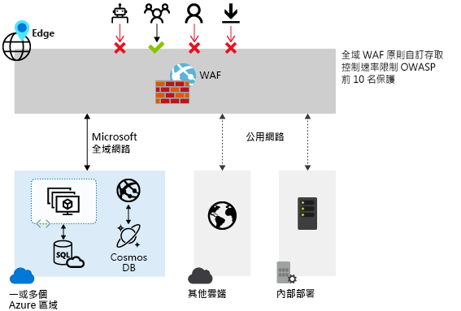
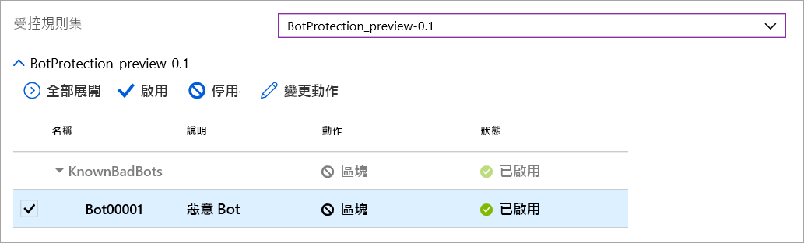

# Azure Front Door 上的 Azure Web 應用程式防火牆

Azure Front Door 上的 Azure Web 應用程式防火牆 (WAF) 會以集中保護的方式，保護透過使用 Azure Front Door 向全球提供的 Web 應用程式。 其作用是協助 Web 服務抵禦常見的惡意攻擊和弱點，並為您的使用者維持服務的高可用性，以及協助您符合法規需求。

Front Door 上的 WAF 是一個全域性的集中式解決方案。 其部署在全球的 Azure 網路邊緣位置，並在網路邊緣上為已啟用 WAF 且由 Front Door 提供的 Web 應用程式檢查每個傳入要求。 這可讓 WAF 防止惡意攻擊接近攻擊來源，使惡意攻擊無法進入您的虛擬網路，並在無須犧牲效能的情況下，提供大規模的全域保護。 WAF 原則可以輕鬆地連結至您訂用帳戶中的任何Front Door 設定檔，而且可以在幾分鐘內部署新規則，讓您快速回應不斷變更的威脅模式。

## WAF 原則和規則

您可以設定 WAF 原則，並將其與一或多個 Front Door 前端建立關聯以進行保護。 WAF 原則包含兩種類型的安全性規則：

- 客戶所撰寫的自訂規則。

- 受控規則集，一組由 Azure 管理且預先設定的規則集合。

當兩者都存在時，會先處理自訂規則，然後再處理受控規則集內的規則。 規則是由比對條件、優先順序和動作所組成。 支援的動作類型為：允許、封鎖、記錄和重新導向。 您可以結合受控和自訂規則，建立符合特定應用程式保護需求的完全自訂原則。

原則中的規則會依照優先順序來處理，而優先順序是定義規則處理順序的唯一整數。 較小的整數值表示較高的優先順序，並且會在整數值較高的規則之前進行評估。 一旦符合規則，規則中所定義的對應動作就會套用至要求。 完成此對比處理之後，優先順序較低的規則就不會再進行處理。

Front Door 所提供的 Web 應用程式一次只能有一個相關聯的 WAF 原則。 不過，您也可以在不與任何 WAF 原則建立關聯的情況下，擁有 Front Door 設定。 如果有 WAF 原則，其會複寫到我們所有的邊緣位置，以確保全球的安全性原則皆一致。

## WAF 模式

WAF 原則可以設定為在下列兩種模式中執行︰

- **偵測模式：** 在偵測模式中執行時，WAF 不會執行監視以外的其他任何動作，並且會將要求和其相符的 WAF 規則記錄到 WAF 記錄。 您可以開啟 Front Door 的記錄診斷功能 (使用入口網站時，您可以前往 Azure 入口網站中 [診斷]  區段來達成此目的)。

- **預防模式：** 當設定為在預防模式中執行時，如果要求符合規則，WAF 會執行指定動作，並在找到相符項目後，不再繼續評估其他優先順序較低的規則。 所有相符的要求也會記錄在 WAF 記錄中。

## WAF 動作

當要求符合規則的條件時，WAF 客戶可以選擇執行其中一個動作：

- **允許：** 要求可通過 WAF，並轉送至後端。 任何優先順序較低的規則都無法封鎖此要求。
- **封鎖：** 要求會遭到封鎖，而 WAF 會將回應傳送至用戶端，但不會將要求轉送至後端。
- **記錄：** 要求會記錄在 WAF 記錄中，而 WAF 會繼續評估優先順序較低的規則。
- **重新導向：** WAF 會將要求重新導向至指定的 URI。 指定 URI 是原則層級的設定。 一旦設定之後，所有符合**重新導向**動作的要求都會傳送至該 URI。

## WAF 規則

WAF 原則可包含兩種類型的安全性規則 - 自訂規則 (由客戶撰寫) 和受控規則集 (由 Azure 管理的預先設定規則集)。

### 自訂撰寫的規則

您可以設定自訂的 WAF 規則，如下所示：

- **IP 允許清單和封鎖清單：** 您可以根據用戶端 IP 位址清單或 IP 位址範圍來設定自訂規則，進而控制您 Web 應用程式的存取權。 支援 IPv4 和 IPv6 位址類型。 此清單可設定為封鎖或允許其來源 IP 符合清單中 IP 的要求。

- **地理型存取控制**您可以根據用戶端 IP 位置的相關聯國家/地區代碼來設定自訂規則，進而控制您 Web 應用程式的存取權。

- **HTTP 參數型存取控制：** 您可以根據符合 HTTP/HTTPS 要求參數的字串 (例如查詢字串、POST 引數、要求 URI、要求標頭和要求本文) 來設定自訂規則。

- **要求方法型存取控制：** 您可以根據要求的 HTTP 要求方法 (例如 GET、PUT 或 HEAD) 來設定自訂規則。

- **大小限制：** 您可以根據要求某特定部分的長度 (例如查詢字串、URI 或要求本文) 來設定自訂規則。

- **速率限制規則：** 速率控制規則是要限制來自任何用戶端 IP 的異常高流量。 您可以設定用戶端 IP 在一分鐘內允許的 Web 要求數目閾值。 這與 IP 清單型的允許/封鎖自訂規則不同，該規則可允許或封鎖所有來自用戶端 IP 的要求。 速率限制可以與其他比對條件結合，例如用於進行細微速率控制的 HTTP(S) 參數比對。

### Azure 管理的規則集

Azure 管理的規則集可讓您以簡單的方式部署防護，以抵禦一組常見的安全性威脅。 由於這類規則集是由 Azure 所管理，因此會視需要更新規則，以防止新的攻擊簽章。 在公開預覽版本中，Azure 管理的預設規則集包含可抵禦下列威脅類別的規則：

- 跨網站指令碼處理
- Java 攻擊
- 本機檔案包含
- PHP 插入式攻擊
- 遠端命令執行
- 遠端檔案包含
- 工作階段 Fixation
- SQL 插入式攻擊保護
- 通訊協定攻擊

當新的攻擊簽章新增至規則集時，預設規則集的版本號碼將會遞增。
在 WAF 原則的偵測模式中，預設規則集會預設為啟用。 您可以停用或啟用預設規則集內的個別規則，以符合您的應用程式需求。 您也可以設定每個規則的特定動作 (允許/封鎖/重新導向/記錄)。 預設動作是「封鎖」。 此外，如果您想要略過預設規則集中的任何預設規則，也可以在相同的 WAF 原則中設定自訂規則。
在評估預設規則集中的規則之前，一律會套用自訂規則。 如果要求符合自訂規則，則會套用對應的規則動作來將要求封鎖或傳遞至後端，而不會進一步叫用任何自訂規則或預設規則集中的規則。 此外，您可以選擇從 WAF 原則中移除預設規則集。

### Bot 保護規則集 (預覽)

您可以為 WAF 啟用受控的 Bot 保護規則集，以針對已知 Bot 類別所發出的要求採取自訂動作。 支援的 Bot 類別有三種：惡意 Bot、善意 Bot 和未知 Bot。 WAF 平台會管理 Bot 簽章，並執行動態更新。 惡意 Bot 的惡意 IP 位址皆來自 Microsoft 威脅情報摘要。 包括 Azure 資訊安全中心在內的多項服務皆使用 [Intelligent Security Graph](https://www.microsoft.com/security/operations/intelligence)，其同時也支援 Microsoft 威脅情報的運作。 善意 Bot 包含已驗證的搜尋引擎。 未知類別包含額外的 Bot 群組。 您可以設定自訂動作，以針對不同類型的 Bot 進行封鎖、允許、記錄或重新導向作業。

> [!IMPORTANT]
> Bot 保護規則集目前處於公開預覽狀態，並且提供預覽服務等級的協定。 可能不支援特定功能，或可能已經限制功能。  如需詳細資訊，請參閱 [Microsoft Azure 預覽專用的補充使用條款](https://azure.microsoft.com/support/legal/preview-supplemental-terms/)。

如果啟用 Bot 保護，符合 Bot 規則的傳入要求會記錄在 FrontdoorWebApplicationFirewallLog 記錄中。 您可以從儲存體帳戶、事件中樞或記錄分析中存取 WAF 記錄。

## 組態

可完全支援使用 Azure 入口網站、REST API、Azure Resource Manager 範本和 Azure PowerShell 來設定和部署所有 WAF 規則類型。

## 監視

Front Door 上的 WAF 監視會與 Azure 監視器整合，以追蹤警示並輕鬆監視流量趨勢。

## 後續步驟

- 深入了解 [Azure 應用程式閘道上的 Web 應用程式防火牆](../ag/ag-overview.md)
