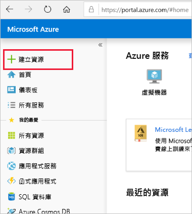
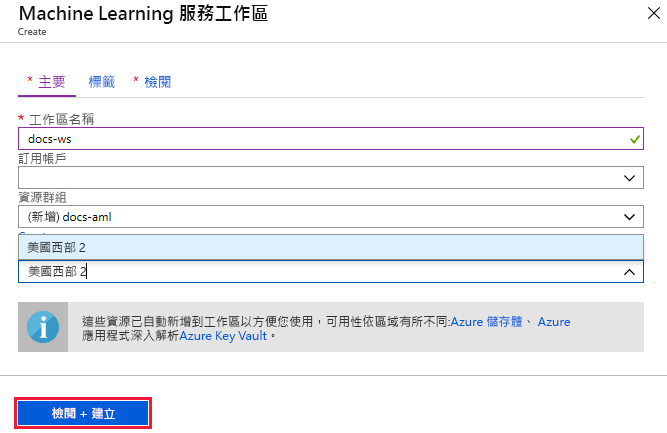

1. 使用您所使用之 Azure 訂用帳戶的認證來登入 [Azure 入口網站](https://portal.azure.com/)。 

1. 在入口網站的左上角，選取 [建立資源]  。

   

1. 使用搜尋列尋找 [Machine Learning 服務工作區]  。

1. 選取 [Machine Learning 服務工作區]  。

1. 在 [ML 服務工作區]  窗格中選取 [建立]  來開始操作。

1. 藉由提供工作區名稱、訂用帳戶、資源群組和位置來設定新的工作區。

    

   欄位|說明
   ---|---
   工作區名稱 |輸入可識別您工作區的唯一名稱。 在此範例中，我們使用 **docs-ws**。 名稱必須是整個資源群組中唯一的。 請使用可輕鬆回想並且與其他人建立的工作區有所區別的名稱。  
   Subscription |選取您要使用的 Azure 訂用帳戶。
   Resource group | 在您的訂用帳戶中使用現有的資源群組，或輸入名稱來建立新的資源群組。 資源群組會保留 Azure 方案的相關資源。 在此範例中，我們使用 **docs-aml**。 
   Location | 選取最接近您的使用者與資料資源的位置，以建立工作區。

1. 在完成工作區的設定後，選取 [建立]  。 

   建立工作區可能需要一些時間。

   程序完成後，會出現部署成功訊息。 它也會出現在通知區段中。 若要檢視新的工作區，選取 [前往資源]  。

   
